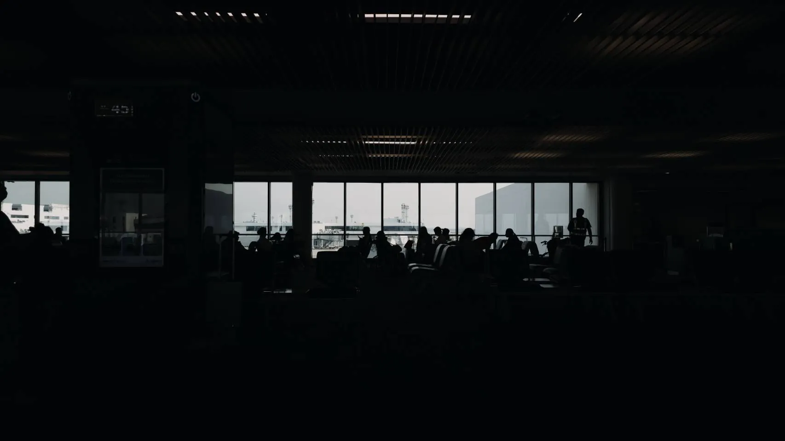
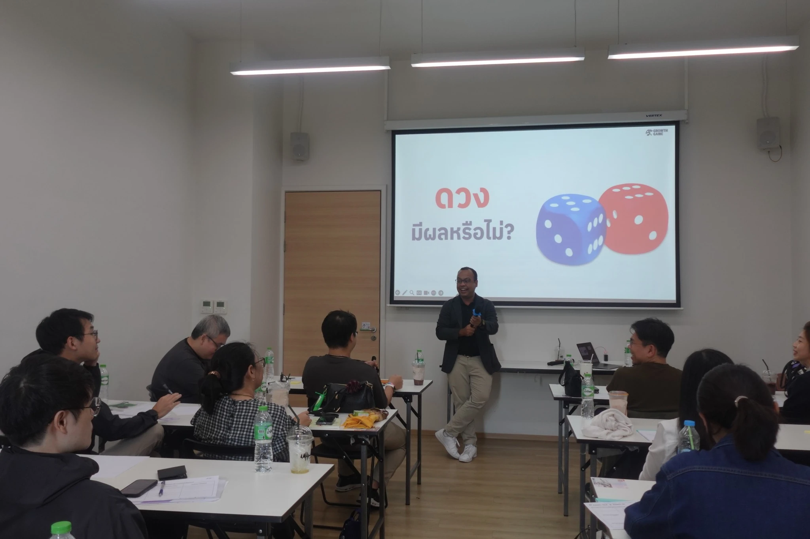
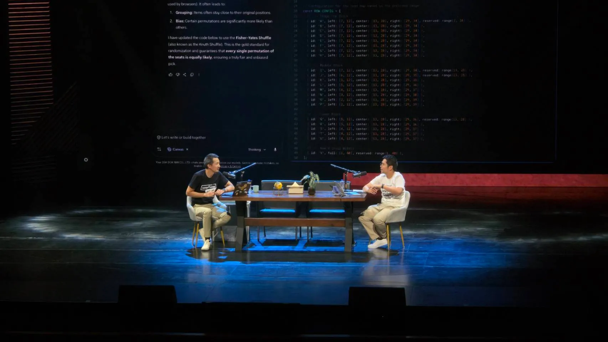
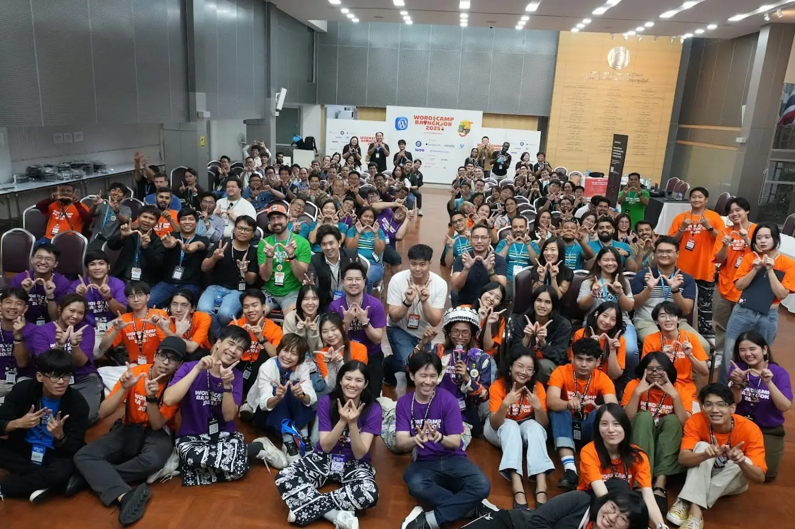

สวัสดีครับทุกคนที่ยังอ่าน blog ของนิลอยู่นะครับ 🥹 ปีนี้เป็นยังไงกันบ้างครับ หวังว่าทุกคนคงจะสบายดีนะครับ สำหรับนิลแล้ว ปีนี้เป็นปีที่เหนื่อยเอาตายเลยครับ มีเรื่องราวเกิดขึ้นมากมาย (ซึ่งส่วนใหญ่จะเป็นงาน 5555555) และก็ตามธรรมเนียมของทุกปีครับ ที่นิลจะมี Year In Review ที่จะมาสรุป Highlight/Lowlight ของนิลปีนี้ จะเป็นยังไง ไปดูกันเลยครับ

## บินไปดู Fan Meet ครั้งแรก

สิ่งนี้เกิดขึ้นจากการที่พี่ Senior ที่เคยดูแลนิลช่วงแรก ๆ ที่ออฟฟิศมาโชว์ [post นึงของเพจเชียงใหม่ว้าวมาก](https://www.facebook.com/share/p/1CoWrqYDQV/) ซึ่งเป็นการจัด Fan Meet พี่เอิ๊ต ภัทรวีกับวง SERIOUS BACON และจัดฟรี ✨ แต่จัดที่เชียงใหม่นะ 55555 ซึ่งนิล FC พี่เอิ๊ตละอยากไปมากกก ซึ่งชวนกันลงทะเบียนวันพุธ รู้ผลวันศุกร์ว่าได้ไป วันเสาร์กดตั๋วเครื่องบินวันเสาร์ ละงานจัดวันอังคารถัดไป บอกเลยว่าสุดจัด 5555555555

สุดท้ายวันอังคารนิลก็บินจากกรุงเทพไปเชียงใหม่ช่วงเช้าแล้วก็ได้ไปฟังพี่เอิ๊ตเล่นเหมือน Mini Concert ที่เชียงใหม่ด้วยแหละ นับว่าเป็นประสบการณ์ที่แปลกใหม่และหาทำมาก 5555555 ละวันต่อมานิลก็ได้ไปนั่งดื่มกาแฟและชมบรรยากาศแถว ๆ นิมมานยามเช้าด้วย เป็นสิ่งที่ทำให้นิลอยากมาเชียงใหม่อีกครั้งเลยครับ ปีหน้าไปซ้ำอีกแน่นอน 😁

## กล้ารับงานนอก WordPress แล้ว

ก่อนหน้านี้นิลทำงานประจำในบริษัทด้วย WordPress อยู่ Project นึงซึ่งนิลก็ได้ทำ[คอร์สสอน Basic WordPress ง่าย ๆ ไว้ในนี้](https://learn.ninprd.com/)ครับ แต่นิลก็ยังไม่มีโอกาสที่จะรับงานนอกที่เป็น WordPress เลยครับ จนกระทั่งมีโอกาสมาจากน้องที่เคยเจอกันตามงาน Conference น้องก็ได้ชวนไปทำเว็บไซต์โดยใช้ WordPress เป็น Solution ครับ

ซึ่งนิลก็แอบ Struggle กับการทำ Styling นิดนึงครับ เพราะเป็น Tailwind Bro แบบเต็มตัว เริ่มจำ CSS จริง ๆ ไม่ได้แล้ว ซึ่งแทนที่นิลจะแก้ปัญหาให้ตรงจุดคือการไปนั่งจำ syntax CSS นิลกลับซื้อ Plugin automatic.css มาครับ ซึ่งทำให้นิลสามารถใช้ styling แบบคล้าย ๆ Tailwind ใน WordPress ได้ครับ บอกเลยว่าฟินมาก 55555555

ซึ่งการรับงานครั้งนี้ก็แอบปลดล๊อคนิลว่าจริง ๆ นิลก็รับงานแนว ๆ นี้ได้นี่นา ปีหน้าถ้ามีโอกาสก็น่าลองทำอีกนะ เป็นอะไรที่ดีและสนุกมากเลย
## ได้ Lead Team ใหญ่ครั้งแรก

ปีที่แล้วนิลเล่าใน [2024 Year In Review](2024-year-in-review.md) ว่านิลได้ลอง Lead Team ครั้งแรก ซึ่งในตอนนั้นก็เป็น Lead Dev ทีมนึงในทีมใหญ่ แต่ปีนี้บอกเลยว่าไปกันต่ออออ เพราะนิลได้ Lead Dev Team นึงซึ่งดูแลการส่งมอบโปรเจคแบบเต็มตัว ออกแบบ Architecture ของ Project ดูแลเพื่อน/น้องในทีมด้วย บอกเลยว่า ว้าว ว้าว ว้าววว เหนื่อยมาก 555555555 รู้สึกว่าใหญ่เกินตัวนิลไปมากกก 

ซึ่งผ่านหน้าที่ Team Lead มาปีกว่านิลก็รู้สึกว่านิลยังมีจุดที่ต้อง Improve ไปเรื่อย ๆ จากที่ปีที่แล้วบอกว่าจะศึกษาเรื่อง People เพิ่มก็ยังไม่ได้ทำ มัวแต่ปั่นงานให้เสร็จ ยังคงเป็นนักดับเพลิงอยู่ววว TT ได้แต่บอกตัวเองว่า ฮึบๆ ปีหน้าว่ากันใหม่ 
## กล้าจ่ายตังเรียนคอร์สสด

เมื่อก่อนนิลจะรู้สึกว่าการจ่ายตังเรียนอะไรซักอย่างนึงเป็นเรื่องที่แพง (เพราะสวัสดิการของพนักงาน Skooldio คือเรียนคอร์ส + Workshop ของ Skooldio ฟรียังไงล่ะ 😎) ยิ่งถ้าคอร์สสดแล้ว นิลจะมีอีกปัจจัยที่จะไม่ไปคือไม่กล้าเจอคน 555555 ไม่ชอบการเจอคนประมาณนึง แต่พอปีที่ผ่านมานิลได้ไป Meetup/Conference เยอะ ๆ เรื่องความกลัวคนก็ลดลงประมาณนึงครับ 

ซึ่งในจังหวะที่นิลกำลังคิดเรื่องนี้ นิลก็ไถเฟซไปเจอ[โพสต์ที่พี่ตรังจากเพจ Growth Game มาเปิดสอนคอร์ส Personal Strategy](https://www.facebook.com/share/p/17Wc5xr4v2/) พอดีครับ ทำให้นิลเลือกตัดสินใจไปลง ซึ่งก็ถือว่านิลตัดสินใจไม่ผิดเลย ได้อะไรกลับมาเยอะมาก เข้าใจภาพของการออกแบบชีวิตตัวเองมากขึ้น เรียกได้ว่าสุดยอดมาก แนะนำให้มาเรียนกันครับ 

ซึ่งพี่ตรังก็พูดเล่น ๆ ว่าจะเปิดคอร์สนี้ปีละครั้งแหละ 555555555 ใครสนใจติดต่อทาง[เพจ Growth Game](https://www.facebook.com/GrowthGameIdea) กันไปก่อนเลย เผื่อพี่ตรังจะยอมเปิดมากกว่าปีละครั้งครับ 🤣

## กล้าซื้อตั๋ว Fan Meet

ปีนี้นอกจากซื้อคอร์สแล้ว นิลยังกดตั๋วไปดู Fan Meet ของ Spin9arm ซึ่งวันที่กดก็งัวเงียมากเพราะกดตั๋ว 9 โมง 9 นาที นิลตื่นมา 9 โมง แต่ก็ได้ไปดูแหละ ถือว่าเปิดประสบการณ์ดีครับ เพราะนิลก็ไม่กล้าไปงานอะไรแบบนี้เท่าไหร่ แต่พอไป Conference กับ Meetup บ่อย ๆ ก็พอจะรู้สึกว่าตัวเองไม่ Awkward ตรงนั้นแหละ

## ได้ Organize Event ด้วย

อันนี้เป็นสิ่งที่เกิดขึ้นงง ๆ เพราะอยู่ดี ๆ วันนึงพี่อั้ม WordPress Bangkok ก็ทักมาชวนนิลไปช่วยกันจัด WordCamp Bangkok 2025 แหละ ซึ่งนิลก็กล้า ๆ กลัว ๆ เพราะว่าไม่มีประสบการณ์การจัดงาน Conference เลย แต่พี่อั้มก็บอกว่าให้นิลมาลองแหละ ซึ่งตอนแรกนิลก็ได้ทำทีม Contributor กับ Speaker แต่ด้วย Load งานประจำของนิล นิลเลยเหลือรับแค่ทีม Speaker แหละ

การทำทีม Speaker ทำให้นิลได้รู้ขั้นตอนการตามหา Speaker ขั้นตอนการรีวิวสไลด์ รวมถึงรู้ว่าตัวเองควรปรับปรุงเรื่องวิธี Approach Speaker และวิธีการเตรียมข้อมูลเพื่อให้ทีมอื่น ๆ ทำงานง่ายขึ้นด้วย รู้สึกว่าได้ Learning เยอะมาก Honorable Mention ขอบคุณพี่อั้ม พี่ยูกิ และก็นิวมาก รวมถึงพี่ ๆ ทีม Organizer คนอื่น ๆ รวมถึงน้อง ๆ Volunteer ด้วยครับ เหนื่อยและสนุกมาก หวังว่าจะได้ร่วมงานกันอีก

---

รีวิว Action Item ที่ทิ้งไว้ใน Year In Review ปีที่แล้วกันดีกว่า
- เขียน blog ที่ Content Technical มากขึ้น ❌ เขียนได้ตอนเดียว เรียกว่าทำได้ไหมนะ 555555
- เปลี่ยนชื่อเพจ ❌ สรุปคิดว่าไม่เปลี่ยนละ ตอนนี้ชื่อเพจยาว แต่มีแต่คนจำได้ 555555
- อ่านหนังสือมากขึ้น ❌ จบ 1 เล่มเท่าเดิม 🤣

เป็นปีที่ไม่ได้ทำ resolution อะไรได้สำเร็จเลย แต่ก็สนุกดีนะปีนี้ ปีนี้เหมือนนิลใช้ชีวิตแบบ กุมภา มีนา และก็กระโดดมาต้นตุลา รู้สึกตัวอีกทีก็ปลายธันวาเลยครับ เป็นปีที่เร็วมากสำหรับนิล แล้วสำหรับทุกคนล่ะครับ เป็นไงกันบ้าง ทักมาแชร์กันได้นะครับ หวังว่าปีหน้าทุกคนจะได้ทำในสิ่งที่อยากทำกันนะครับ และก็ขอบคุณทุกคนที่อ่านมาถึงตรงนี้ด้วย