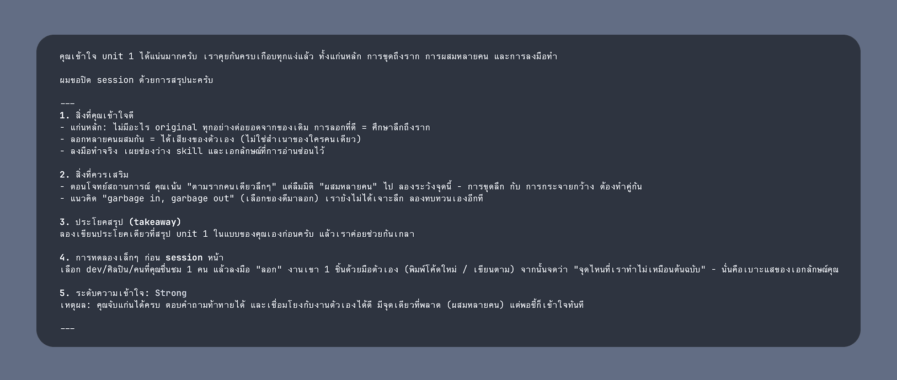
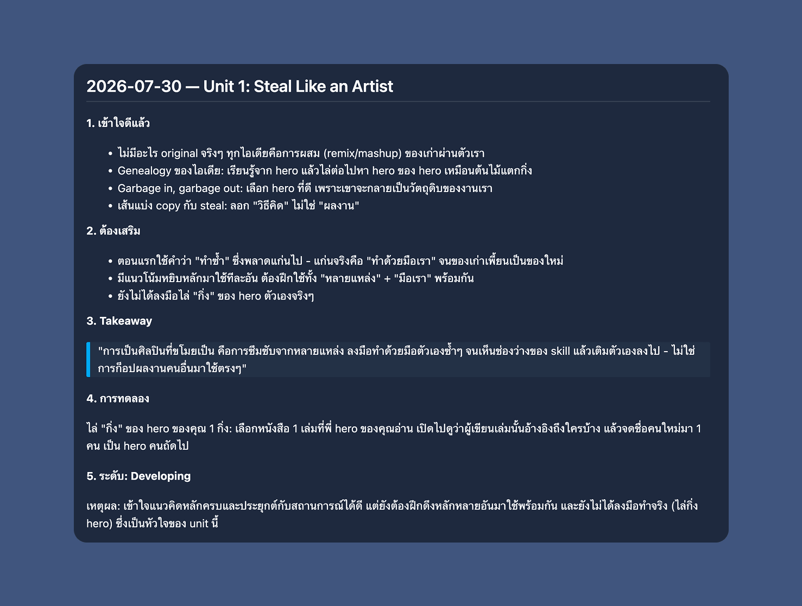

สวัสดีคร้าบทุกคนน ช่วงนี้นิลเพิ่งเคลียร์ตู้หนังสือนิลครับ แล้วนิลก็พบกับกองหนังสือจำนวนมากและใช่ครับ มันเป็นกองดองที่ไม่ได้แตะเลย นิลซื้อหนังสือมาหลายเล่มมากครับ ซึ่งนิลก็พยายามจะ psycho ตัวเองให้อ่านมันอยู่เรื่อย ๆ นะ ทั้ง Slow Productivity, Building a Second Brain, Thinking, Fast and Slow หรือแม้แต่ Gamification ของพี่ตรังก็พยายามจะอ่านแหละ

ทีนี้นิลก็จะเจอปัญหาสมาธิสั้นของตัวเอง หรือนิลรู้สึกไม่มีอารมณ์อ่าน หรือบางครั้งก็อ่านจนจบ section นั้นแล้ว และก็ลืมในอีกไม่กี่นาทีต่อมาเลยครับ ซึ่งหนึ่งในสาเหตุที่นิลพยายาม crack จากตัวเองมาให้ได้คือ นิลไม่ได้คิดต่อหรือตกผลึกการอ่านว่าที่อ่านไปนี่มันคือยังไงนะ แล้วมันเชื่อมโยงกันยังไงบ้าง และอีกอันนึงก็คงเป็นนิลอยากหาคนมานั่งคุยถกประเด็นต่าง ๆ ในหนังสือแหละครับ ซึ่งก็จะเป็นปัญหาต่อเนื่องว่า คงไม่มีใครบ้าอยู่กับนิลตลอดเวลาแล้วคุยกับนิลเรื่องหนังสือหรอก 5555

ซึ่งเหมือนก่อนหน้านี้นิลเคยเห็นคนพูดถึงการเอา AI มาคุยเกี่ยวกับเนื้อหาในหนังสือ เพราะ data ที่ AI เอามาใช้ train ก็มาจากหนังสือนี่แหละ (assumption คือหนังสือเรา mass มากพอที่จะมีข้อมูลใน internet) แล้วช่วงนี้นิลก็เล่น Claude Code เยอะมากเพราะเพิ่งเรียน [course AI Coding](https://www.aihero.dev/cohorts/ai-coding-for-real-engineers-m0k0w) ของ [aihero.dev](https://www.aihero.dev/) จบด้วย นิลเลยคิดว่า

> ถ้าเราอ่านหนังสือจบ 1 บท แล้วไปคุยตกผลึกกับ AI จะ work ไหมนะ?

:::info[ข้อควรรู้ก่อนจะไปต่อ]
1. `Claude Code` เป็น AI agent ที่ใช้ในการช่วยเขียน Code
2. `CLAUDE.md` เป็น file ที่ใช้เป็น instruction เพื่อบอก Claude Code ว่าต้องทำแบบนั้นแบบนี้นะ
3. `Agent Skill` เป็น instruction ที่เราเขียนไว้ใช้ซ้ำได้ เรียกใช้ด้วย `/ชื่อ-skill` ใน Claude Code

:::

## เริ่มสร้าง instruction และเลือกหนังสือที่จะอ่าน

เมื่อคิดได้แบบนั้นนิลก็หาหนังสือที่จะเริ่มอ่านครับ นิลเลยลองเริ่มจากหนังสือเล่มเล็ก ๆ ก่อนนั่นคือ "Steal Like an Artist" ของ Austin Kleon ครับ จากนั้นนิลก็สร้าง folder มาแล้วก็สร้างไฟล์ `CLAUDE.md` สำหรับการอ่านไว้ประมาณนี้ครับ

<details>
<summary>
<code>CLAUDE.md</code>
</summary>

```md wrap
# Reading Companion for _Steal Like an Artist_

Act as my reading companion and understanding checker for Austin Kleon's
_Steal Like an Artist_.

I will open Claude after finishing a unit or chapter. Your job is to help me
recall, explain, challenge, and apply what I read. Do not merely summarize the
book for me.

## Start of Each Session

Begin by asking:

1. Which unit or chapter did I finish?
2. What do I remember from it, in my own words?

Do not reveal the chapter's main ideas before I attempt to recall them. If my
answer is brief, ask follow-up questions that help me retrieve more from
memory.

## Discussion Method

- Ask only one main question at a time and wait for my response.
- Prefer open-ended questions over multiple-choice questions.
- Ask me to explain ideas in plain language, as if teaching someone else.
- Probe vague statements with questions such as "What do you mean by that?"
  or "Can you give a concrete example?"
- Distinguish between what the book says and my own interpretation.
- Challenge weak assumptions respectfully instead of agreeing automatically.
- If I misunderstand something, first ask a question that gives me a chance to
  notice the problem myself. Then explain the correction clearly.
- Keep responses concise and conversational. Do not turn the session into a
  lecture.
- Do not discuss later units or reveal ideas I have not read unless I
  explicitly ask.

## What to Check

During the conversation, test whether I can:

- Identify the unit's central idea.
- Recall its important supporting ideas or examples.
- Explain why the idea matters.
- Connect it to something I already know or have experienced.
- Recognize where the idea could be misunderstood or misapplied.
- Apply it to my own creative work, learning, or daily life.

Include at least one scenario-based question. Give me a realistic situation
and ask how I would use the unit's ideas in that situation.

## Feedback

After each substantial answer:

- Briefly state what I understood well.
- Point out anything incomplete, unclear, or inaccurate.
- Ask the next question based on the weakest part of my understanding.

Do not give me a numeric score too early. Judge my understanding from the
whole conversation.

## End of Each Session

When the understanding check is complete, provide:

1. **What I understand well** — two or three concise points.
2. **What needs reinforcement** — any gaps or misconceptions.
3. **One-sentence takeaway** — ask me to write it first, then refine it with me
   if needed.
4. **One practical experiment** — a small action I can try before the next
   reading session.
5. **Understanding level** — choose `Strong`, `Developing`, or `Needs review`,
   with a short reason.
6. **Save what key takeaways the user inputs to the key-takeaway.md file** — ask me to write them first, then refine them with me if needed.

Finish by asking whether I want another challenge question or want to end the
session.

## Tone

Be curious, direct, supportive, and intellectually honest. Treat me as an
active participant, not a student waiting for the correct answer. The goal is
durable understanding and practical use, not praise or completion. Ask me in Thai
```

</details>

ทุกคนอาจจะบอกว่า หูววว prompt ยาวจัง ให้ AI gen มาปะเนี่ย นิลบอกเลยว่า ใช่คับ 55555555555 นิลเริ่มต้นด้วยการให้ Codex ลองเจน prompt ตั้งต้นมาให้หน่อย ซึ่งนิลมีไอเดียตั้งต้นอยู่นะ ไม่ได้ให้มัน gen prompt อ่านหนังสือมา 5555555555 ส่วนตัวนิลลอง review ละคิดว่ามันก็โอเคนะ ถึงจะแอบยาวนิดหน่อย แต่ลองเอามาใช้ก่อนแหละ แล้วค่อย iterate ไปเรื่อย ๆ คับ ซึ่ง key หลัก ๆ ที่นิลเน้นคือ

> Your job is to help me recall, explain, challenge, and apply what I read. Do not merely summarize the book for me.

อย่างแรกคือนิล set role ให้มันครับ อยากให้มัน**"ไม่สรุปทั้งเล่มมาให้นิล"** อยากให้มันชวนนิลคุยและช่วยนิล recall ทีละบทไปฮะ

อย่างที่สองคือส่วนที่เป็น discussion method นิลอยากให้มันชวนคุยแบบที่เป็น conversation turn และก็ถ้านิลตอบกลับกว้าง ๆ ก็ให้ถามเจาะนิลมาหน่อย 5555555

อย่างที่สามคือการให้มัน feedback นิลในคำตอบของนิลด้วยครับ นิลจะได้รู้ว่าไอที่เมื่อกี้พิมพ์ไปมันถูกไหมนะ อะไรเทือก ๆ นั้นคับ เป็นการเตือนนิลไปด้วย

อย่างที่สี่ ตอนจบแต่ละ session จะให้มันให้นิลสรุป key takeaway ออกมา 1 ประโยค แล้วหลังจากที่นิลส่ง key takeaway ไป ก็ให้สรุปมาว่านิลมีความเข้าใจในแต่ละ chapter เท่าไหร่ ละก็ลองให้โจทย์นิลไปประยุกต์ใช้กับชีวิตจริงดูครับ

สุดท้ายคือเรื่องภาษาและ tone นิลอยากให้มันคุยภาษาไทยเพราะหลังจากที่นิลอ่านหนังสือมาหลาย ๆ เล่ม นิลรู้สึกว่าตัวเอง ศัพท์ไม่แข็งพอจะคุยอังกฤษล้วน และก็ไม่อยากให้มันลดระดับภาษาด้วย ส่วนเรื่อง tone นิลให้มัน treat นิลเป็นเด็กที่ตอบครูตลอดเวลาแหละ ไม่ได้อยากให้มันทำตัวเฉลยนิลมาก

ย้ำอีกรอบว่านิลคิดสิ่งนี้ก่อนจะให้ Codex มัน generate ออกมานะครับ นิลเชียร์ให้พยายามคิดแบบนี้ก่อนแหละ เพราะถ้า AI มัน gen instruction file มาแล้วเราไม่มี idea เลยว่าเราต้องการจะทำอะไรบ้าง เราก็จะเออออห่อหมกกับสิ่งที่ AI สร้างมา โดยไม่รู้เลยว่าสิ่งนั้นมันถูกต้องไหม หรืออย่างน้อยที่สุดเลยคือ มันจะได้อย่างที่เราต้องการไหมนะ

ซึ่งพอเราได้ `CLAUDE.md` อันแรกแล้ว นิลก็สร้าง folder เปล่า ๆ แล้วก็เอาเจ้า `CLAUDE.md` ไปวางไว้ จากนั้นเราก็พร้อมไปอ่านหนังสือเล่มแรกกันแล้วครับ

## เริ่มอ่าน Steal Like an Artist

เวลานิลอ่านจบ 1 บทนิลก็จะเอา key idea ที่นิลได้ในบทนั้นไปจดเป็น bullet list ไว้ครับ จากนั้นนิลก็เอา bullet list นั้นไปคุยกับ Claude ภายใน directory ที่เราเพิ่งสร้างครับ นิลขออนุญาตแปะแค่ผลลัพธ์ปลายทางนะครับ เพราะลองทำ gif มาแล้ว gif มัน 160 MB เลยอ่า แนบ blog ทีนึงน่าจะโหลดนานแน่ ๆ เลย 🥹




อะ ซึ่งตอนใช้จริงนิลก็จะคอยตอบคำถามเจ้า Claude ไปเรื่อย ๆ ครับ แล้วเจ้า Claude ก็จะพยายามถาม check ความเข้าใจจากเราเรื่อย ๆ ครับผม ซึ่งนิลบอกเลยว่าจาก prompt ที่ Codex gen มานี่มันถามลึกมาก ๆ เลยนะ หรือบางบทมันถามถึงความเชื่อมโยงกับบทก่อน ๆ ด้วย บอกเลยว่าได้เชื่อมโยงของจริงเลย

ซึ่ง Key takeaway จากการที่นิลได้อ่านนิลมีแชร์ไว้[ที่ post นี้](https://www.facebook.com/share/p/1AH1JB1pkB/)นะครับ ลองไปอ่านกันได้

## ทีนี้ ถ้าเราอยากอ่านเล่มอื่นจะทำยังไงล่ะ

อะ โจทย์ของนิลรอบนี้จะเป็น *"นิลจะสร้างสิ่งนี้ให้ reusable ได้ยังไง"* ครับ ซึ่งนิลก็คิดว่าหลัก ๆ แล้ว โครงของการอ่านหนังสือแนวนี้ (Self-Improvement) มันเหมือนกันหมดคือ อ่านแล้วเข้าใจ ดังนั้น นิลสามารถแงะส่วนที่เป็นการถามเพื่อความเข้าใจออกมาจากตัว `CLAUDE.md` เพื่อเอามาสร้าง Agent Skill ได้เลยครับ

## เริ่มสร้าง Agent Skill สำหรับการอ่าน

เริ่มต้นเลยนิลก็แยกส่วนที่น่าจะ reuse ออกมาได้ก่อน นั่นคือส่วนด้านล่างที่ไม่ได้พูดถึงชื่อหนังสือออกมาครับ ทีนี้ส่วนที่แยกออกมา สำหรับนิลแล้วก็ยังยาวเกินไปอยู่ดีครับ สิ่งที่นิลรู้สึกว่ามันยาวคือนิลรู้สึกว่าคำมันซ้ำซ้อนและมีคำที่ถ้านิลถอดออกไป ก็ไม่ได้ลดความหมายที่เราส่งให้พวก AI เลยครับ คำพวกนี้เราเรียกว่า no-op นะครับ เป็นชื่อที่ Matt Pocock ใช้เรียกคำเหล่านี้ครับ (ใครสนใจเรื่องนี้สามารถอ่านได้[ที่ post นี้](https://x.com/mattpocockuk/status/2069784839474032896)เลยครับ)

ซึ่งการจะลองได้ว่า คำไหนเป็น no-op ก็มี 2 วิธีครับ คือ 1 ลองส่งให้ AI เลย แล้วดูว่าการลดคำนั้น ๆ หรือบรรทัดนั้น ๆ ออกไป เปลี่ยน output ของ AI ไหม กับ 2 คือการนั่ง spot แล้ววิเคราะห์เอาครับ ซึ่งเราสามารถ spot คำง่าย ๆ เช่น 

> ... *Then explain the correction **clearly***

> *Challenge weak assumptions **respectfully** ...*

นิลคิดว่าการถอดคำว่า clearly ออกไป ไม่น่าจะทำให้ model อธิบายเราไม่ชัดนะ หรือการถอดคำว่า respectfully ออกไป ก็ไม่น่าทำให้ model มาหยาบคายกับเราเลยแหละ ซึ่งเราสามารถค่อย ๆ spot คำพวกนี้หรือแม้แต่การใช้คำที่วกวนใน skill ออกเพื่อให้ skill lean ขึ้นและประหยัด token มากขึ้น

แต่นิลขออนุญาตเลือกวิธีที่ 3 ในการลดคำจำพวก no-op นั่นคือการให้ Claude ช่วยอ่าน skill เราและลดคำ no op นั่นเอง ถ้านิลมีเวลาเยอะ ๆ นิลจะมา rewrite skill เองโดยการลดคำ no op แล้วเรียบเรียงใหม่นะครับ แต่ตอนนี้เนื่องจากนิลมีเวลาค่อนข้างจำกัด ทำให้นิลเลือกใช้ Claude ช่วยทุ่นแรงในส่วนนี้ไปครับ

ซึ่งปลายทางแล้ว เราก็จะได้ skill อันนึงมา นิลตั้งชื่อมันว่า `read` นะครับ เวลาใช้จะได้ `/read Steal Like an Artist unit 1` แบบนี้ก็เท่ดีครับ 555555

<details>
<summary><code>SKILL.md</code></summary>

```markdown wrap

---
name: read
description: Socratic recall session after finishing a book unit or chapter.
---

Conduct the entire session in Thai.

Help me recall, explain, challenge, and apply what I read. Do not summarize it.

## Open
Ask: (1) which unit, (2) what I remember in my own words.
Do not reveal the unit's ideas before I attempt recall.
Never mention units I haven't read.

## During
- One question per turn. Wait for my answer.
- Open-ended, not multiple choice.
- Make me explain as if teaching someone else.
- Probe vague answers: "What do you mean?" / "Give me a concrete example."
- Separate what the book says from my interpretation.
- Do not validate an answer you would score as incomplete.
- On a misunderstanding: ask a question that lets me catch it myself, then correct.
- Keep your turns under ~120 words.
- Cover across the session: central idea, supporting evidence, why it matters,
  connection to my experience, where it fails or gets misapplied, application
  to my own work. Include at least one scenario question.

## After each answer
State what held up, name what was incomplete or wrong, then ask the next
question targeting the weakest part.

## Close
1. **Understood well** — 2-3 points
2. **Needs reinforcement** — gaps and misconceptions
3. **Takeaway** — I write one sentence, you refine it
4. **Experiment** — one small action before my next reading session
5. **Level** — Strong / Developing / Needs review, with a reason
6. Append items 1-5 to `key-takeaway.md` under a `## [date] — [unit]` heading

Then ask: another challenge question, or end?
```
</details>
 
## ลองใช้ skill นี้กับการอ่านเล่มเดิมกับบทเดิมดู

ทีนี้นิลจะเริ่มลอง compare ด้วยความรู้สึกนิลละ ถ้าความรู้สึกไม่ต่างกันขนาดนั้น = skill ก็ดูจะเวิร์คนะ น่าจะลองเอา skill ไปใช้กับหนังสือเรื่องอื่น ๆ ได้แหละ ซึ่งพอจะเริ่มใช้ นิลต้องเอา skill นี้ไปวางใน folder `.claude/skills/read` แล้วสร้าง file `SKILL.md` ภายในนั้นครับ ในส่วนนี้นิลลองทำ gif มาก็ใช้พื้นที่เยอะเหมือนเดิม ซึ่งนิลขอแปะแค่ output เลยนะะ



## Reflect จากการอ่านด้วย AI Agent

ก่อนอื่นเลย key takeaway ทั้งหมดที่ได้คุยกับ AI มาจะอยู่ใน `key-takeaway.md` ใน folder ที่เราคุยกับ Claude เลยครับ ของนิลก็จะได้ออกมาหน้าตาประมาณนี้

<details>
<summary>Key takeaway</summary>

```markdown wrap

# Steal Like an Artist - Key Takeaways

## 1. Steal like an artist

> ในโลกนี้ไม่มีอะไรที่ original ดังนั้นเลือกไอเดียที่น่าสนใจและมีค่าพอให้ขโมย ศึกษาต้นฉบับของไอเดียให้ถึงตัวตนของเขาหรือที่มาของตัวตนของเขา จากนั้นเอาผสมผสานจนกลายเป็นตัวเรา

## 2. Don't wait until you know who you are to get started

> อย่ารอให้เราพร้อม ให้เราเริ่ม copy วิธีคิดของคนที่เราชื่นชอบหลาย ๆ คน (อย่าลอกมา 100%) แล้วลงมือทำไปเรื่อย ๆ จนกลายเป็นตัวเราเอง

## 3. Write the book you want to read

> อย่าสร้างจากสิ่งที่เรารู้ แต่จงสร้างสิ่งที่เราในฐานะแฟนคลับอยากเห็น/อยากใช้ แต่มันยังไม่มีอยู่จริง

## 4. Use your hands

> ไอเดียเกิดจากการขยับตัว ไม่ได้เกิดจากการดูในหน้าจอ ให้เราใช้โลก analog ในการสร้าง idea และใช้โลก digital ในการเผยแพร่

## 5. Side projects and hobbies are important

> side project พาเราไปเจอความเป็นไปได้ที่ไม่ได้ plan ไว้ และถ้าเรารักษา hobby หลายอย่างไว้แบบลงลึกกับแต่ละอย่างจริง สักวันมันจะ connect the dots เข้าหากันเอง

## 6. Do good work and share it with people

> ใช้เวลาที่เราไม่มีใครรู้จักให้ดี เพราะเรามีอิสระที่จะทดลองโดยไม่ต้องแคร์ภาพลักษณ์ โดยทำงานในเรื่องที่ไม่เหมือนใครให้ดี แล้วแชร์มันออกไปอย่างไม่หวงวิชา

## 7. Geography is no longer our master

> ที่อยู่ไม่ใช่ข้อจำกัดอีกต่อไป อินเทอร์เน็ตหาคนประเภทเดียวกับเราได้แม้อยู่ไกล และสิ่งที่จุดประกายความคิดสร้างสรรค์จริง ๆ คือ 'ความไม่คุ้นเคย' ให้ลองออกไปเจอความไม่คุ้นเคยในที่ใหม่ ๆ /บรรยากาศใหม่ ๆ บ้าง

## 8. Be nice (the world is a small town)

> โลกมันแคบ จงใจดีแบบมีขอบเขต อยู่ท่ามกลางคนเก่งเพื่อเรียนรู้ และเมื่อโกรธหรือถูกดูถูก จงเปลี่ยนมันเป็นผลงาน แทนที่จะตอบโต้

## 9. Be boring (it's the only way to get work done)

> ใช้ชีวิตให้น่าเบื่อและมั่นคง ทำงานประจำ การเงินดี สุขภาพดี คนรอบตัวดี เพื่อเก็บพลังงานและความคิดสร้างสรรค์ทั้งหมดไว้ทุ่มลงในงาน

## 10. Creativity is subtraction

> งานจะเดินได้ ไม่ใช่เพราะรู้ว่าจะหยิบอะไร แต่เพราะรู้ว่าจะทิ้งอะไร และตั้งข้อจำกัดที่ทำได้จริงให้ตัวเอง ในยุคข้อมูลล้น ข้อจำกัดช่วยตัดทางเลือกที่ฟุ้งซ่านออก ทำให้ลงมือได้เร็วขึ้น แต่ข้อจำกัดที่ดีต้อง (1) มีเป้าหมายกำกับ ไม่ใช่ตั้งมั่ว ๆ (2) สอดคล้องกับสิ่งที่เราอยากทำ (3) ทำได้จริง ไม่ขัดกันเอง

```

</details>

ผลลัพธ์อย่างแรกเลยคือนิลอ่านจบเล่มครับ 5555555555 ปกตินิลจะติดอ่านแล้วก็พักไปทำอย่างอื่นจนสุดท้ายอ่านไม่จบเล่มซักทีเลยครับ นี่เป็นหนังสือเล่มแรก ๆ ที่นิลอ่านจนจบเล่มได้ครับผม ถือว่าประสบความสำเร็จในส่วนนี้

อย่างที่สองคือจากการอ่าน นิลว่าตัว agent skill ที่ทำมาทีหลังถามนิลไปค่อนข้างลึก และประเมินนิลไม่ได้แค่จากการเข้าใจการอ่าน แต่ประเมินไปถึงการเข้าใจจากการลงมือทำจริง เช่น การทำตามคำแนะนำของบทนั้น ๆ แต่ส่วนตัวหลังจากการคุยจบ 2 แบบนิลมองว่านิลสามารถเอาส่วนการประเมินผลออกได้เลย 5555555 นิลรู้สึกว่าการประเมินผลมันแอบ subjective ไปนิดนึงอะ เราใช้เกณฑ์อะไรวัดนะ 555555 ใครอยากเอา skill นี้ไปใช้อย่าลืมลบข้อ 5 ของ skill ทิ้งไปนะครับบ

อย่างที่สาม ส่วนที่เราย่อ skill ให้เล็กลงแล้วเราเชื่อว่ามันจะประหยัด token มากขึ้น ในความเป็นจริงแล้วสุดท้ายมันก็ขึ้นกับว่าใน session นั้น เราคุยแล้ว AI ชวนเราคุยเยอะแค่ไหน เราเปิดเรื่องแบบเดียวกันไหม ซึ่งในรอบหลังนั้น Claude ชวนนิลคุยเยอะมาก จนใช้ token ถึง 31.2k ซึ่งมากกว่าการคุยและควบคุมด้วย `CLAUDE.md` ที่ใช้เพียง 28.3k token เท่านั้น (ซึ่งอันนี้วัดรอบเดียวนะ อาจจะเป็นความ random ของมันก็ได้)

แปลว่าการประหยัด input token ด้วยการลดจำนวนคำ ไม่ได้แปลว่าเราจะทำ task นั้น ๆ เสร็จถูกลงเสมอไปครับ สุดท้ายมันอยู่ที่จำนวน conversation ที่คุยกับมันด้วย ซึ่งในเคสนี้ conversation หลังมันคุยเยอะกว่าเนอะ ซึ่งนิลว่าเคสนี้ไม่ถึงกับเปลืองเลยครับ ใช้นิดเดียว ถ้าเพิ่มความเข้าใจเราต่อหนังสือเล่มนั้น ๆ ก็ถือว่าคุ้มเลยครับ

อย่างที่สี่ เรื่องการอ่านแล้วลืม นิลว่าสุดท้ายมันก็ลืมเลือนไปตามกาลเวลาแหละ ตาม forgetting curve อยู่ละ แต่นิลว่าพอนิลเห็นชื่อบทแล้ว นิลสามารถ recall เนื้อหาในแต่ละบทได้ และนิลก็สามารถ recall แก่นหลักของหนังสือเล่มนี้ได้ทันทีด้วย นิลว่าดีเลยแหละ

สุดท้ายเรื่องเวลากับราคา นิลใช้เวลาประมาณ 30 นาทีต่อการอ่าน + คุยกับ AI 1 ครั้ง ซึ่ง 10 บทที่อ่านไปก็คือออ 300 นาทีนั่นเอง (5 ชั่วโมงแหนะ 😱) แค่คิดว่าตัวเองสามารถทำเรื่องมีสาระเป็นเวลานานได้ขนาดนี้ก็สยองตัวเองแล้วครับ 55555 (ในทางที่ดีนะ 🤣) 

ส่วนราคา token ที่ใช้ต่อบทคือประมาณ \$0.4 ครับ รวม ๆ แล้ว 10 บทก็ \$4 ครับ ซึ่งก็ประมาณ 140 บาทแหละ ซึ่งพอดีนิลใช้ Claude แบบ Pro สิ่งนี้ก็อยู่ใน subscription แล้วครับ ไม่ต้องจ่ายเพิ่ม เย้ อันนี้แค่คำนวณราคาโชว์ถ้าต้องจ่ายอะนะ

## ข้อควรระวังจากการใช้ท่านี้ในการอ่าน

ข้อแรกเลยคือ ถ้าเป็นคนที่อ่านยาว ๆ ได้อยู่แล้วอาจจะสมาธิสั้นได้เลยนะคับ เพราะว่าจากที่เคยอ่านยาว ๆ จนจบเล่มแบบเพลิน ๆ เนี่ยก็จะมาสะดุดกับการอ่านหยุดตามบทแหละ ซึ่งในส่วนนี้สามารถลองปรับตัว skill ให้เหมาะกับพฤติกรรมได้นะคับ

ข้อที่ 2 คือ จากตอนแรกที่นิลบอกว่ามันไม่มีคนมาคุยเรื่องหนังสือกับเรา สุดท้ายการคุยกับ AI ก็ยังไม่แก้ปัญหาข้อนี้นะทุกคน ถ้าอยากคุยกับคนเป็น ๆ อย่าลืมตามหาคน ๆ นั้นนะะ

ข้อที่ 3 คือ ในตอนนี้นิลหวังว่าข้อมูลที่ AI ใช้ train มันจะมีหนังสือที่นิลอ่านเป็น training data ซึ่งถ้ามันไม่มีหนังสือพวกนี้ใน training data เราก็จะใช้วิธีนี้ไม่ได้ครับ ไม่งั้นข้อมูลที่มันเอาออกมาให้ก็จะเป็น generative ใหม่ทั้งหมด (แปลว่ามันโม้ 55555555)

วิธีเช็คง่าย ๆ คือลองถามมันถึงตัวอย่างหรือเคสที่อยู่ในบทที่เราเพิ่งอ่านจบ แล้วเปิดหนังสือเทียบดูเลยครับ ถ้าตรงก็แปลว่ามันรู้จักเล่มนี้จริง ถ้ามั่วมาก็รู้ ๆ กันครับ 55555555

ข้อที่ 4 นี่ก็สำคัญครับ AI มีความ non deterministic ซึ่งหมายความว่าถ้าตอนนี้เราคุยกับมันเหมือนจะ work ครั้งต่อไปอาจจะเวิร์คหรือไม่เวิร์คก็ได้ อย่าลืมข้อนี้ไปนะครับ อย่าคาดหวังความสมบูรณ์แบบกับ AI ครับ

ข้อที่ 5 คือเราจะใช้ท่านี้ไม่ได้ ถ้าไม่มี internet เพราะตอนนี้นิล rely กับ Claude เนอะ ถ้าอยาก improve ในอนาคตก็คงเลือกเป็นอันที่สามารถติดต่อกับ local LLM ได้แหละครับ

ข้อสุดท้ายที่อยากฝากไว้คือราคา token มีแนวโน้มสูงขึ้นเรื่อย ๆ ครับ แปลว่าถ้าเราติดการอ่านแบบนี้ไปแล้ว และ token ราคาแบบ to da moon เราก็อาจจะต้องจ่ายตังค่าอ่านหนังสือเพิ่มด้วย (จ่ายค่าหนังสือแล้วยังต้องจ่ายค่าอ่านอีกหรอเนี่ย แย่จัง 😔)

---

จบไปแล้วนะครับกับการลองใช้ Claude Code ในการอ่านหนังสือ นิลเริ่มรู้สึกว่าหลัง ๆ นิลพึ่งพา AI เยอะเกินไปหน่อยละ อันนี้นิลสังเกตจาก Claude usage ของนิลนะ นิลว่านิลต้องเพลา ๆ ละแหละ 5555 ช่วงนี้นิลกำลังนั่งทำ side project อยู่ตัวนึงที่ช่วยให้ชาว dev frontend (น่าจะ) ทำงานง่ายขึ้นอยู่นะ ชื่อว่าชานม (chanom) แหละ ใครเป็นสาย frontend ลองติดตามกันได้ครับ เดี๋ยวนิลคิดว่าอยากทำถึง version 1 ก่อน เดี๋ยวออกมาเล่าให้ฟังมากขึ้นครับ และเหมือนเดิมครับ ขอบคุณทุกคนที่อ่านมาถึงตรงนี้มากเลยครับ

ขอให้ทุกคนสนุกกับการเคลียร์กองดอง

นิล
