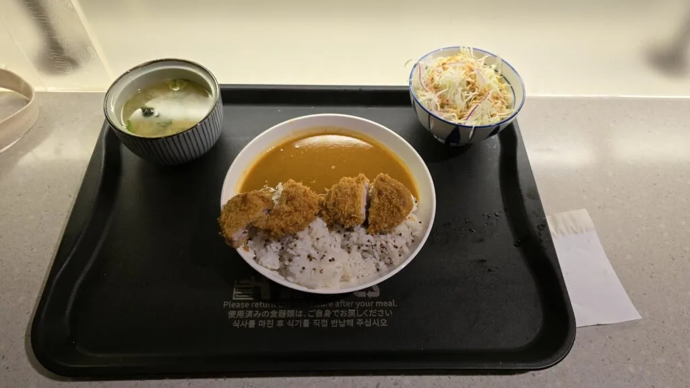
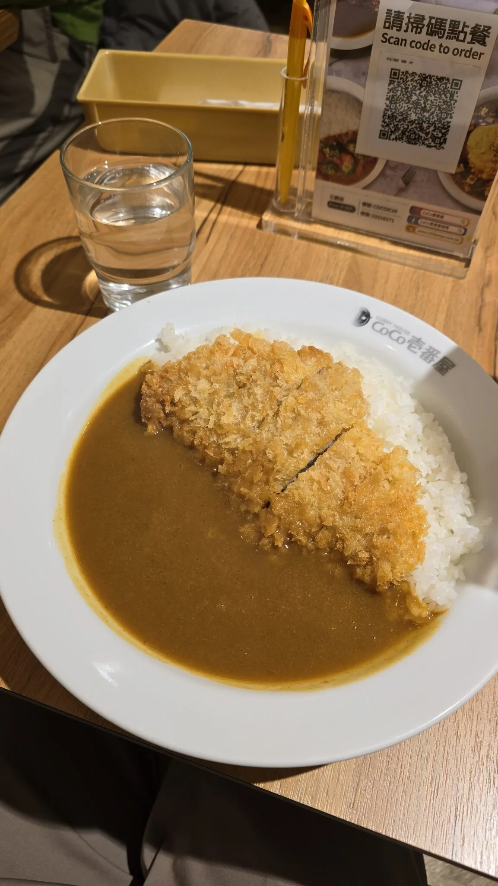
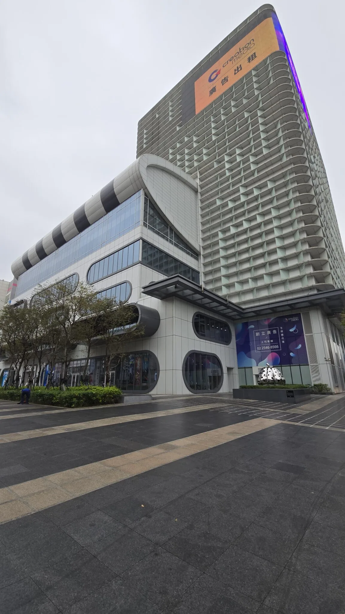
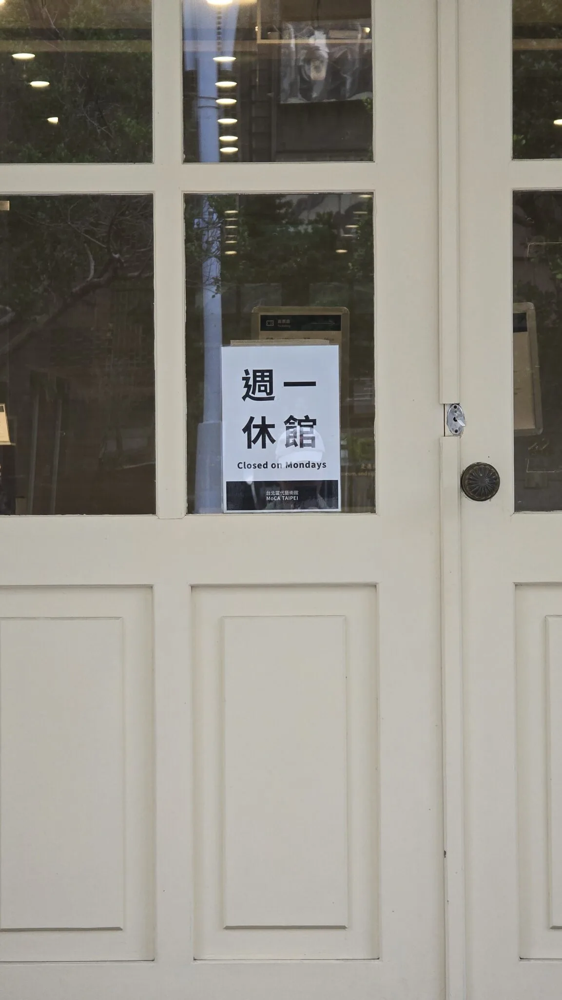

สวัสดีครับ ปีนี้เป็นครั้งแรกที่นิลเดินทางออกนอกประเทศคนเดียวและประเทศที่นิลไปคือไต้หวันครับ โดยเป้าหมายหลักของการไปในครั้งนี้ของนิลคือการไป WordCamp Asia 2024 และไปคลายเครียดครับ ซึ่งช่วงก่อนหน้าที่นิลจะไปนั้น งานทับตัวมากครับ นิลไม่ได้มีเวลาทำแผนยาว ๆ เลย นิลเลยเลือกการใช้ผู้ช่วยส่วนตัวของนิลในการวางแผนนั่นคือ “ChatGPT” นั่นเอง ทริปนี้จะชิบหายแค่ไหน ไปดูกันครับ
## การตัดสินใจไปไต้หวัน

ต้องเท้าความกลับไปตอนที่นิลตัดสินใจจะไปนะครับ จริง ๆ มันเริ่มจากงาน WordCamp ก่อน คือนิลตัดสินใจไปงาน WordCamp Asia แล้วก็กดซื้อตั๋วเข้างานไปเลยแบบงง ๆ อยู่ดี ๆ ตังก็ปลิวไปเลย ทีนี้พอกดตั๋วเข้างานแล้ว นิลก็เลยคิดแบบ ชิบหายแล้ว ทำอะไรลงไปวะ แต่มันก็ทำให้นิลเลือกที่จะเริ่มจองโรงแรมและตั๋วเครื่องบินครับ ในส่วนของตั๋วเครื่องบินนิลก็หาจาก Google Flight เลย ส่วนโรงแรมนิลให้เพื่อนที่เคยไปไต้หวันช่วยเลือกครับ ซึ่งนิลก็จองผ่านเพื่อนนิลคนนึงครับที่ทำงานอยู่ที่ Agoda ซึ่งก็จะได้ส่วนลดมาประมาณนึงเลยครับ พอจองอะไรเสร็จ นิลก็ Download เอกสารทุกอันไว้ ส่วนโรงแรมที่เพื่อนจองนิลก็ให้ส่งมาใน LINE (แต่ไม่ได้โหลด) ตัวเอกสารที่ได้มานั้น นิลไม่ได้อ่านเลย ด้วยความที่งานทับตัวอยู่ในช่วงนั้น

## วางแผนการเดินทางแบบโคตรเท่…(ล่ะมั้ง)

อย่างที่นิลได้เขียนไปข้างบนครับ ตอนแรกนิลเลือกคุยกับ ChatGPT เพื่อที่จะวางแผนเที่ยวให้โดยนิลใช้เวลาคุยเกือบ ๆ จะชั่วโมงครับ เอาไอนู่นเข้า เอาไอนี่ออก ไม่กินข้าวร้านนี้ ไม่แวะที่ร้านนู่น ไปมา ๆ กับ ChatGPT นานมาก จนสุดท้ายนิลก็ได้ Final Plan By ChatGPT มาครับ นิลก็เอาลง Story IG แบบ โคตรเท่ แผนเที่ยว By ChatGPT ว่ะเพื่อน ๆ แต่ว่านิลก็ต้องมาสะดุดครั้งที่ 1 คือ “Chat แม่งมั่ว” Chat ให้สถานที่ที่ไม่มีอยู่จริงเยอะมาก แบบเกือบ ๆ 50% ของแผนได้ ซึ่งนิลก็ได้เพื่อนนิลอีกคนครับ ที่เห็นนิลลงแผนแบบที่มั่ว ๆ ไปใน Story มาช่วยนิลวางแผนให้ ซึ่งสุดท้ายนิลก็เอาแผนเพื่อนมาผสมกับแผนจาก ChatGPT ที่ตรวจสอบแล้วว่ามีอยู่จริงเอาไปลงเว็บแอปที่มีชื่อว่า Wanderlog ครับ เป็นเว็บแอปที่ใช้วางแผนการเที่ยว สามารถสร้าง Trip และใส่พวกรายละเอียดการเที่ยว เช่น Flight ที่นอน Budget รวมถึงว่าวันต่าง ๆ จะไปที่ไหนด้วยครับ นอกจากนี้ถ้ามีคนไปด้วยก็สามารถ Invite เพื่อนมาใน Trip และเอามาหารค่าใช้จ่ายได้ด้วย จนสุดท้ายนิลก็ได้แผน Version 1 มาได้อย่างยากลำบาก

## ไปถึงไต้หวัน

ตอนนิลถึงไต้หวันเนี่ย นิลก็ไม่รู้อะไรเลยครับ นิลมีแค่ Easy Card ที่เพื่อนที่ออฟฟิศให้มา แต่นิลไม่ได้ศึกษาเลยว่ามันทำอะไรได้บ้าง นิลก็ไปงึก ๆ งัก ๆ หน้าตู้จ่ายตั๋วรถไฟฟ้าครับ ก็มีคนไต้หวันคนนึงเดินมาสอนวิธีการใช้งานเจ้าบัตรตัวนี้และสอนการดูเส้นทางการนั่งรถไฟครับ พอนิลเติมเงินได้ เขาก็ยิ้มและพูดกับนิลว่า “Happy Traveling in Taiwan” รู้สึกใจฟูมาก จากนั้นนิลก็นั่งรถไฟไปเรื่อย ๆ เพื่อจะไปที่พัก จนผ่านมาซักพักนิลก็อยากจะเปิดรายละเอียดเกี่ยวกับโรงแรมที่จองไป ไฟล์ใน LINE มันหมดอายุ นิลเลยโทรไปให้เพื่อนส่งมาให้อีกรอบ พอนิลเปิดดูปุ๊ป ร้อง “เxี้ย” อย่างดังครับ เพื่อนจองโรงแรมเป็น Female Only ไป นิลแบบชิบหายละ และก็โทรไปให้เพื่อนยกเลิกและจองโรงแรมใหม่ให้ สุดท้ายนิลก็ได้ที่พักอีกที่นึง (แล้วต้องจ่ายตังเพิ่มด้วยนะ ที่พักแพงขึ้น) เป็น Hostel ชื่อว่า Cavemen Hostel ครับ ก็พอใช้ได้ แต่บรรยากาศทึบไปนิดนึงครับ + บรรยากาศให้ความรู้สึกไม่ Secure เลย ฮืออ แบบนิลเอาคอมไปด้วยไง เลยแอบกลัวนิด ๆ นอกจากนี้โรงแรมก็ไม่มีผ้าขนหนูให้อีก นิลก็ออกไปซื้อตามห้างซึ่งด้วยความไม่รู้เนี่ย นิลก็ไปซื้อที่ MUJI ครับ โคตรแพงเลย คอมโบต่อมาที่ข้าวเย็น ด้วยความที่ไม่ได้ศึกษาอะไรก่อนมาเลย แน่นอนครับ โดน Food Court ห้างไปตามระเบียบ ไม่ตามระเบียบอย่างเดียวคือราคา ทำไม Food Court มันจานละเกือบ ๆ 200 ได้วะ 555555 แต่โดยรวมวันนี้ก็ไม่ได้ทำอะไรมากครับ แค่นี้ก็หมดวันแล้ว

## Day 2-4: WordCamp Asia 2024

เนื้อคอนเทนต์มันไปอยู่ใน Blog อีกอันแล้วอ่า ไปตามอ่านได้ที่  [wordcamp-asia-2024-with-nin](wordcamp-asia-2024-with-nin.md)

## ก่อนกลับวันนึง

ตอนแรกนิลว่าจะไปแช่น้ำพุร้อนที่ Beitou Hotspring กับแก๊งค์ชาวไทยที่นิลเจอที่งาน WordCamp Asia แต่ว่าไม่สะดวกกัน นิลเลยเปลี่ยนแผนนิดหน่อย เลยย้าย Hotspring ไปพรุ่งนี้และเปิดวันด้วยการไปกินร้านชานม 50 Lan มา ส่วนตัวนิลชอบมากก แนะนำเลย เสร็จแล้วนิลก็ไปหากินข้าวเที่ยงแล้วก็ไปที่ตึก Taipei 101 เพราะตอนแรกจะไปลองร้านกาแฟ Simple Kaffa (เพื่อนแนะนำมา) แต่แบบไปถึงแล้วมันต้อง Reserve + ค่ากาแฟแพงมาก นิลเลยเปลี่ยนไปกินอีกร้านนึงชื่อว่า Cafe Acme ครับ ได้ไปซิบกาแฟชมวิวจากตึก Taipei 101 ชั้น 35 แล้วก็นั่งเขียน Blog ไปด้วย โคตรดีเลยครับ จากนั้นนิลก็จะไปกินข้าวเย็นที่ร้าน Din Tai Fung แต่ดูจากปริมาณคิวแล้ว นิลน่าจะได้กินอีกทีชาติหน้า นิลเลยลงไปหากินที่ Food Court (อีกแล้ว) และตามระเบียบที่นี่ครับ Food Court ก็เกือบ 200 อีกแล้ว (คิดถึง Food Court ไทยก็ทีนี้แหละ TT) พอกินเสร็จ นิลก็จะกลับที่พักแล้วครับ แต่ท้องไส้ปั่นป่วนหนักมากเลย ไม่รู้ว่าโดนอะไรมา แต่มันก็ทำให้นิลพลาดที่จะลองร้าน Chun Shui Tang ที่อยู่ใน Bucket List นิลได้แหละ 5555 พอกลับถึงที่พักก็ดีขึ้นฮะและก็กลายเป็นมานั่งปั่นงานต่อถึงเที่ยงคืนเลย 55555

## วันสุดท้ายแล้ว

วันนี้นิลตั้งเป้าเอาไว้ว่าอยากเก็บชานมให้ครบตาม Bucket List ของตัวเองครับ และก็มีนัดกับแก๊งค์ชาวไทยไป Beitou Hotspring กันตอนบ่ายด้วย แต่เปิดวันด้วย Checkout + ฝากกระเป๋าไว้ที่โรงแรมและไปที่ MOCA Taipei ครับ ซึ่งนิลก็ช็อคมากเพราะว่า MOCA ปิดวันจันทร์ และวันที่นิลไปก็คือวันจันทร์ ฮืออออ ฮืออออ ฮืออออ เศร้ามากก นิลก็เลยเปลี่ยนแผนด้วยการไปที่ตึก Syntrends ครับ เป็นตึกที่รวมพวก Technology หรือ Gadget ต่าง ๆ อยู่ในนี้ซึ่งบอกเลยว่าตอนแรกไม่อยู่ในแพลนเลย แต่นึกขึ้นได้ว่ามีคนเรียน Bootcamp แนะนำมา นิลเลยไปครับ ไปเจอพวก Gadget ต่าง ๆ ก็สนุกดีครับ เดินเพลินมาก เดินไปชั่วโมงกว่า เสร็จแล้วนิลก็ลงมาหาข้าวกินครับ

พอกินข้าวเสร็จนิลก็ไปรวมตัวกับแก๊งค์ที่จะไป Beitou Hotspring ด้วยกันแล้วก็นั่งรถไฟไปกันครับ พอไปถึงก็มีคอนเทนต์อีกก็คือที่ Hotspring ที่จะไปแช่เนี่ย พอเราจะเข้าไปกัน เขาก็แนะนำว่าไปอีกที่ดีกว่าไหม อะไรแบบนี้ พวกนิลก็แบบ ห้ะ อะไรวะนั่น แต่จริง ๆ คือถ้าจะแช่ที่นี่มันต้องมีกางเกงว่ายน้ำครับและก็ตัวบ่อน้ำพุมันปิด 4 โมง ซึ่งกว่าเราจะไปถึงกันก็บ่าย 3 แล้ว เขาเลยบอกว่าถ้าซื้อกางเกงว่ายน้ำ + ตั๋วค่าเข้าแล้ว พวกเราจะไม่คุ้มเพราะใช้เวลาแช่กันได้ไม่นาน แต่ตกลงไปตกลงมา สุดท้ายก็แช่กันที่นี่แหละครับ บ่อที่นี่จะเป็น บ่อ 3 ระดับความร้อน บ่อ Easy (ประมาณ 39 องศา) บ่อ Medium (ประมาณ 42 องศา) แล้วก็บ่อ Hard (ประมาณ 45 องศา) แน่นอนครับว่าด้วยความที่นิลไม่เคยแช่เลยเนี่ย นิลก็วิ่งไปบ่อ Easy ก่อน 555555 แต่แค่บ่อ Easy ก็ร้อนมากแล้วอ่า แช่ไปซักพักพอย้ายไป Medium ก็แบบลงทั้งตัวไม่ไหวเลย 55555 ประสบการณ์แช่น้ำร้อนครั้งแรก รู้สึกร้อนมาก ไม่เคยรู้สึกเหมือนโดนลวกแบบนี้ 55555 แต่ก็ดีครับ เหมือนได้ไปเปิดโลกเลย กลับไทยก็อยากจะลองพวกออนเซนอยู่ฮะะ

พอแช่น้ำพุร้อนเสร็จก็นั่งรถไฟกลับกัน คนอื่น ๆ ก็กลับที่พัก ส่วนนิลก็อยากไปดูรองเท้า On Cloud เลยไปที่ร้าน Marathon’s World แถว ๆ CKS Memorial Hall ครับ แต่พอลองใส่จริงกลับรู้สึกแปลก ๆ อาจจะเพราะปกตินิลใส่ Skechers จนชินแล้วมั้ง แต่สรุปก็กลับออกจากร้านแบบมือเปล่าเลย แซด TT เสร็จแล้วนิลก็ไปกินชานมกับข้าวเย็นที่ Chun Shui Tang แถว ๆ ที่พักครับ แต่แอบผิดหวังนิดนึง จืดมากแต่คุณภาพชากับไข่มุกดีเลยครับ เสร็จจากร้านชานม นิลก็วิ่งกลับไปที่โรงแรมเพื่อเอากระเป๋าแล้วพุ่งตัวไปที่สนามบินครับ เย่ะ จบทริปด้วยสวัสดิภาพ

## สรุป

ค่าเสียหาย Trip นี้ทั้งหมดประมาณ 22,000 บาทครับ แพงสุดคือค่าตั๋วเครื่องบิน ถูกสุดคือค่าน้ำเปล่า นิลไม่เสียเลยซักบาท นิลกรอกฟรีตั้งแต่สนามบิน ที่พัก ยันงาน Conference ก่อนออกมาเที่ยวก็กรอกตุนเต็มที่ตลอด ถือว่าสุดมากกับค่าน้ำเปล่า 55555 อีกอย่างที่ถูกกว่าที่ไทยคือค่ารถไฟฟ้าครับ นั่งไป 10 กว่าสถานียังประมาณ 40 บาทเอง สุดมาก คิดว่าทริปครั้งนี้เหมือนมาเปิดประสบการณ์ด้วยความที่มาเที่ยวเองครั้งแรกก็แอบมีความเหงา ความเหวงอยู่แหละ แต่โดยรวมก็ดีครับ อากาศดีด้วย 14 องศาเอง เดินเล่นสนุกมาก เดินวันละ 20,000 ก้าวแหนะ แอบเสียดายที่ไม่ได้ Plan มาดี ๆ และก็เสียดายเวลาที่นั่งทำงานระหว่างเที่ยวด้วย 55555 แต่ก็นั่นแหละ ทุกครั้งเราก็จะมีอะไรที่เสียดายไป แต่ก็ต้องปล่อยวางไปและเดินหน้าต่อไปแหละครับ คิดว่าอยากไปไต้หวันอีกครับ อาจจะแบบปีหน้า อยากกลับไปอีกรอบนึง เป็นประเทศที่ค่อนข้างดีครับ