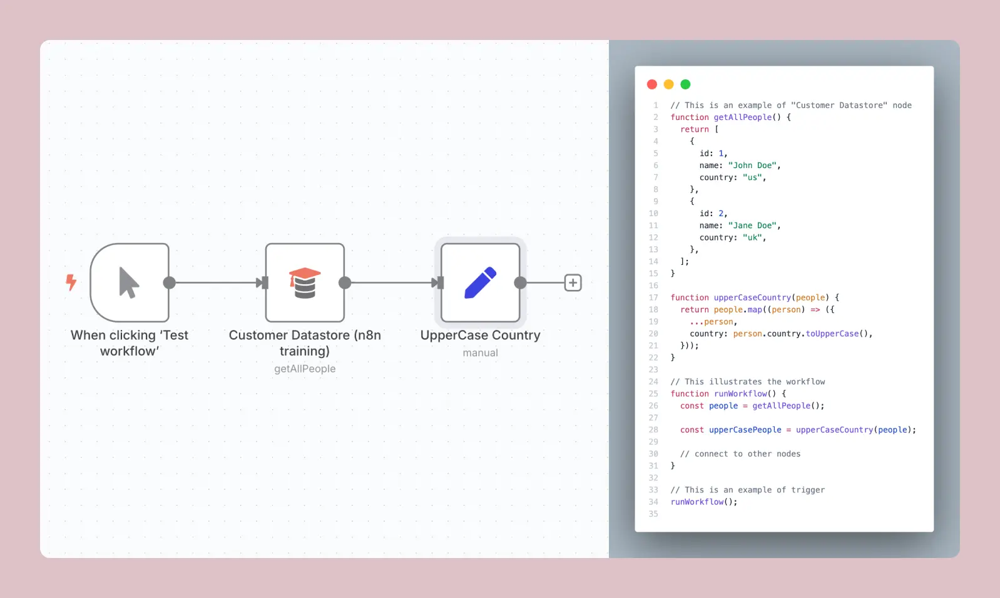
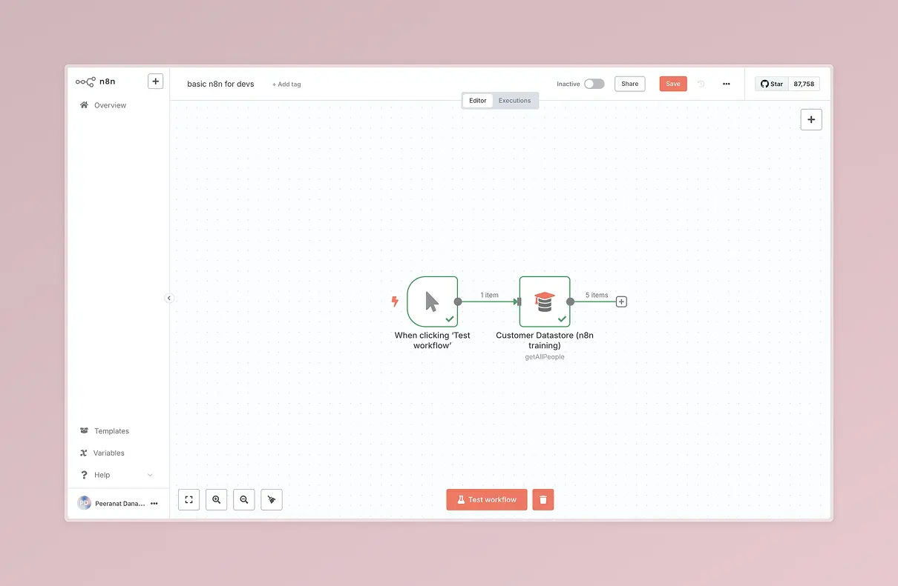
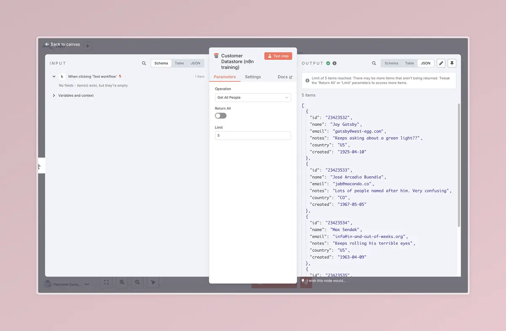
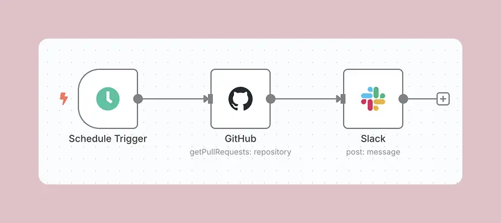
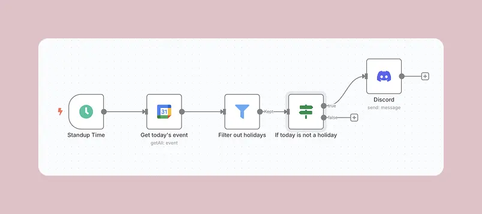
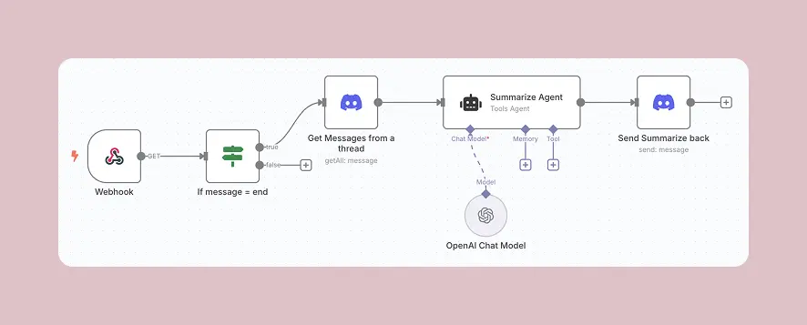

สวัสดีครับ นิลหายไป 2 เดือนแหนะะ ช่วงก่อนหน้าน้ีติดงานแบบวุ่น ๆ กับไปนั่งทำ Project เล่น ๆ ของตัวเองมาอันนึง ช่วงนี้นิลเห็น Content เกี่ยวกับ n8n เยอะมากแล้วก็นิลก็ได้มีโอกาสไปช่วย Facilitate Workshop [AI Automation for Business Transformation รุ่นที่ 1](https://www.skooldio.com/workshops/ai-automation-for-business-transformation) มาครับ ทำให้นิลได้ลองเล่น n8n มาในหลาย ๆ use case เลยครับ ทำให้นิลอยากมาแชร์เป็น Basic ของ n8n สำหรับชาว Dev ได้เข้าใจและเข้ามาลองเล่น Tool ตัวนี้ได้ง่ายขึ้นแหละครับ

## n8n คืออะไร

n8n เป็น Tool ที่เข้ามาช่วยในการทำ Automation ครับโดยจะเริ่มต้นจากการวางสิ่งที่เรียกว่า Trigger เพื่อเป็นตัวเริ่มทำงาน และจะใช้การลากกล่อง (Node) ที่มี Function ต่าง ๆ แล้วเชื่อมต่อกันด้วยเส้น (Edge) ให้เกิด Workflow ขึ้นมาครับ ซึ่งเมื่อ Run Workflow ก็จะเหมือนการวิ่งเริ่มจาก Trigger ไปตาม Node ผ่าน Edge ต่าง ๆ ครับ

ซึ่งเจ้า Node นี้ก็จะมี Function ที่สำเร็จรูปแล้วครับ ไม่ต้องเขียนเอง เช่น ต่อ Google Sheets, ส่ง HTTP Request,ส่ง Email ด้วย Gmail, Database, AI Agent, etc. รวมทั้งสามารถบันทึกพวก Credentials ที่เอาไว้ต่อกับบริการต่าง ๆ ไว้ได้ด้วยครับ

ซึ่งจริง ๆ แล้ว 1 Node ก็เหมือน 1 Function ครับ และ 1 Workflow ก็เหมือนการประกาศ Function ที่เอา Function อื่น ๆ มาต่อกันไปเรื่อย ๆ แหละครับ เดี๋ยวนิลลองเทียบ Side by Side ด้วย Code ดูครับ



และยังไม่หมดครับ เรายังสามารถสร้างเจ้า Workflow เป็น Sub Workflow เพื่อเอาไปใช้ใน Workflow ต่าง ๆ อีกด้วยครับ ซึ่งภาพก็เหมือนเราทำ Function เล็ก ๆ แล้วก็เอาไป Compose ให้เป็น Function ใหญ่ ๆ ครับ

## ความเก่งเจ๋งของ n8n

ด้วยความที่ Node ต่าง ๆ ที่มี Function ที่เขียนให้แบบเสร็จสรรพแล้ว ทำให้เราไม่ต้องมาเขียนเองครับ นอกจากนี้ยังมี UI ให้ลากวางเพื่อให้เกิด Workflow ขึ้นมาได้เลยครับ ทำให้ n8n มีความสะดวกสบายและรวดเร็วในการสร้าง Automation ครับ

นอกจากนี้สำหรับชาว JavaScript แล้ว n8n ยังมี Node ที่เป็น Code ให้เราสามารถเขียน Function ภาษา JavaScript เข้าไปได้ด้วยครับ

อีกสิ่งที่ไม่พูดไม่ได้เลยคือเจ้า Node AI Agent ที่พูดถึงไปก่อนหน้านี้ครับ Node ตัวนี้จะสามารถต่อกับ AI Model เจ้าต่าง ๆ ไม่ว่าจะเป็น Google, OpenAI, Anthropic รวมถึงสามารถต่อกับ Ollama ได้ด้วย รวมทั้งสามารถต่อ Memory หรือเชื่อมต่อกับ Tool ต่าง ๆ เพื่อให้ AI Agent สามารถทำงานต่าง ๆ เช่น ส่ง Email, แก้ไข Google Sheets ได้อีกด้วยครับ

และตัว n8n ยังสามารถ Expose ตัวเอง ออกไปเป็น URL เพื่อรับ Webhook ได้อีกด้วยครับ ถือว่ามีอรรถประโยชน์มาก ๆ

## ลองสร้าง Workflow ใน n8n กัน

เดี๋ยวจะพาทุกคนไปสร้าง Basic Workflow กันฮะ แต่ก่อนจะพาไปเริ่มกัน ขอ Make Sure ว่าทุกคนมี node.js ติดตั้งในเครื่องครับ แล้ว run command

```sh
npx n8n
```

จากนั้นให้เราไปที่ http://localhost:5678 แล้วเราจะเจอกับหน้าตา Interface ของ n8n ครับ
เสร็จแล้วให้ทำขั้นตอนดังนี้ครับ

1. กด Create Workflow ที่มุมบนขวา
2. เมื่อเข้าหน้า Workflow มาให้กด "Add First Step"
3. ให้หาคำว่า "Trigger Manually" จากนั้นกดเพื่อเลือก Trigger นี้เข้า Workflow ครับ
4. กดปุ่ม "+" ที่อยู่ทางขวาของตัว Trigger ของเราครับ จากนั้นหาคำว่า "Customer Datastore (n8n training)" ครับ กดที่ชื่อเพื่อเอา Node นี้เข้า Workflow ของเราครับ
5. พอเพิ่มแล้วจะมีหน้าต่างเด้งขึ้นมา ให้กด Esc หรือกดข้างนอกหน้าต่างนั้นเพื่อปิดไปก่อนครับ
6. ให้ลองกด Test Workflow ดูครับ เราจะเห็น Interface มันมีการขยับเพื่อบอกว่าตอนนี้มัน Run ถึงตรงไหนแล้ว

เท่านี้เราก็สร้าง Workflow ของตัวเองเป็นที่เรียบร้อยแล้วครับ ซึ่งปลายทางทุกคนจะได้ Workflow หน้าตาตามรูปนี้เลย



ทีนี้ถ้าลองกดที่ Node Customer Datastore เราก็จะเจอกับหน้าตาแบบนี้ครับ



ซึ่งเจ้านี้คือผลลัพธ์ของการ Run Node ตัวนั้น ๆ ครับ Input จะเป็นข้อมูลที่อยู่ฝั่งซ้าย Output จะเป็นข้อมูลที่อยู่ฝั่งขวาครับ เราสามารถกดที่แต่ละ Node เพื่อดูแบบนี้ได้เลยครับ

## มาดู Basic use case ของ n8n แบบ DevDev กันดีกว่า

### ส่งข้อมูล Pull Requests ใน GitHub เข้า Slack รายวัน

เราอาจจะตั้ง Schedule ไว้ เช่น ทุก 9 โมงให้ไปดึงข้อมูล Pull Requests ทั้งหมด (หรืออาจจะดึง Issues ด้วย) มา แล้วเอาไป Post ลงไปใน Slack ในทีม Dev เพื่อให้ทุกคนสามารถเห็น Summarize ข้อมูลก่อนที่จะเริ่มงานวันนั้น ๆ ได้



## ทำ Bot Daily Standup

เราสามารถตั้งเวลาไว้แล้วตั้งให้ส่งข้อความลงใน Discord เพื่อเตือน Standup รายวันได้ครับ นอกจากนี้ถ้าบริษัทเรามีการใช้ Google Calendar เราก็สามารถปักวันหยุดบริษัทได้ แล้วตั้งให้มันไม่ส่งข้อความหากวันนั้นเป็นวันหยุดได้ด้วย



นอกจากนี้ยังสามารถทำอีก Workflow นึงให้เป็น Webhook ที่ส่งข้อความเข้ามาเรื่อย ๆ แล้วถ้ามีคนพิมพ์คำว่า End ใน Thread เราก็สามารถที่จะกวาดข้อความทั้งหมดใน Thread นั้น มาให้ AI Agent ทำเป็น Summarize ว่าวันนี้แต่ละคนจะทำอะไร เพื่อให้ทีมเห็นภาพรวมกันง่ายมากขึ้นด้วยครับ



## แล้วนิลใช้ n8n ทำอะไร

ถ้าสารภาพบาปเลยตอนนี้คือ เอาตรง ๆ นิลยังไม่ได้เอา n8n ไปใช้เพื่อ Personal Task ครับ เพราะว่าเราต้องเอา n8n ไป Self-Hosted หรือถ้าใช้ n8n cloud ของฟรีก็มีการจำกัดจำนวน Workflow ด้วย นิลมองว่าถ้าไม่จำเป็นจริง ๆ นิลก็อาจจะไม่ใช้กับงานอะไรที่นิลต้องทำคนเดียวครับ สู้ไปเขียน Code อาจจะง่ายกว่าครับ

แต่ ๆๆๆ ถ้าเป็นงานที่ต้องทำงานร่วมกับคนอื่น ๆ ที่ไม่ได้เป็นสาย Tech จ๋า ๆ หรือไม่ต้องการเขียน Code นิลก็แนะนำให้ใช้ n8n ครับ เพื่อให้สามารถทำงานร่วมกันได้อย่างเห็นภาพและสะดวกขึ้นครับ

---

จบไปละกับ Basic n8n for devs ครับ ตอนแรกนิลอยากเอาอันนี้ไปวางไว้ที่ https://learn.ninprd.com/ แหละ แต่รู้สึกว่ามันเป็นเนื้อหาคร่าวมาก ๆ ผนวกกับตอนนี้นิลยังไม่ได้ลองเล่น n8n แบบเยอะมาก ๆ หรือเจอ use case ที่นิลต้องใช้ n8n มาก ๆ ด้วยครับ ถ้าได้ลองเล่นเยอะ ๆ นิลอาจจะไปนั่งทำเป็นเนื้อหาวางไว้ในเว็บ learn ของนิลก็ได้ครับ

ถ้าใครอยากลองศึกษา n8n เพิ่มเติม ทาง n8n เขามี Tutorial นะครับ ลองไปศึกษากัน[ดูได้ที่นี่เลย](https://docs.n8n.io/try-it-out/tutorial-first-workflow/) หรือสามารถติดตาม Tutorial จากหลาย ๆ เพจได้เลย ไม่ว่าจะเป็น [เทพเอ็กเซล](https://www.facebook.com/thepexcel) [QWERTY is a DUCK](https://www.facebook.com/duckgitalist) หรือ [Prompt Alchemist](https://www.facebook.com/PromptAlchemist) ก็มี Tutorial อยู่ประปรายครับ

ใครมี Workflow เจ๋ง ๆ มาแชร์กันใน Comment ที่ Page ตากล้องที่เขียนโค้ดได้นิดหน่อยได้เลยนะครับ นิลรออ่านอยู่

ขอบคุณทุกคนที่อ่านมาถึงตรงนี้นะครับ เดี๋ยวจะพยายามกลับมาเขียน Monthly Blog ให้ได้เลยย มี Topic อยากแชร์เพียบเลยครับ

ขอให้สนุกกับการทำ Automation ด้วย n8n ครับ

นิล
