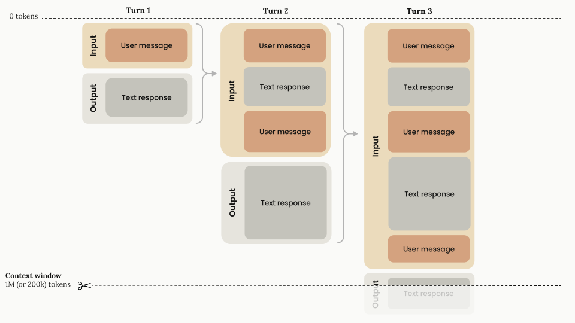
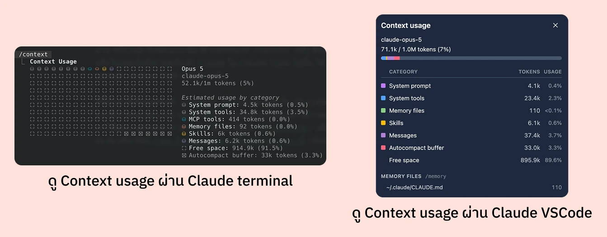

สวัสดีครับ วันนี้นิลมาในหัวข้อเกี่ยวกับ tool ที่มาแรงในช่วงก่อนหน้านี้มาก ๆ และก็มีหลาย ๆ คนใช้แล้วติดลิมิตกันเยอะมาก ซึ่ง tool ตัวนั้นก็คือ Claude Code นั่นเองครับ เจ้า Claude Code เนี่ย หลาย ๆ คนเวลาใช้จะบอกว่าติดลิมิตเร็วมาก ซึ่งนิลในฐานะคนที่ใช้งานไม่ติดลิมิตเลย (เพราะใช้น้อย 5555555) จะมาเล่าเกี่ยวกับ context window กับการประหยัด context window เพื่อให้เรา~~ไม่ติดลิมิต~~ติดลิมิตกันช้าลงอะนะ 5555

## อย่างแรกคือ Context Window คืออะไรนะ

สิ่งแรกที่เราต้องเข้าใจก่อนคือ context window เนี่ย คิดซะว่ามันเหมือนกล่องที่ใส่ข้อความทั้งหมดที่ตัว Claude สามารถหยิบยกขึ้นมาในการคุยกันเพื่อตอบเรา เช่น พวก file ต่าง ๆ ที่เราโยนให้ ข้อความที่เราคุยกับมัน หรือตัวคำตอบที่มันตอบกลับมาหาเราในข้อความก่อนหน้า

ซึ่งตัว context window เนี่ย สามารถเปรียบได้เหมือน short term memory หรือ working memory ของคนแหละครับ ถ้าเราบอกว่าเป็น working memory เนี่ย มันก็จะมีช่องที่จำกัดอยู่ครับ เช่น ตาม [Miller's Law](https://lawsofux.com/millers-law/) แล้วคนทั่ว ๆ ไปจะจำได้แค่ 7±2 อย่างใน working memory ของเราเท่านั้นครับ

ดังนั้นตัว context window ของ Claude ก็จะเจอ concept คล้าย ๆ กันครับ ที่ถ้าเราเพิ่มของที่ให้มันจำเพิ่มเรื่อย ๆ มันก็จะลืมบ้างครับ ซึ่งเราเรียกสิ่งนั้นว่า "Context rot" ครับ ซึ่งเมื่อเกิดอาการนี้เจ้า Claude จะ recall สิ่งที่เคยคุยกันห่วยลงไปเรื่อย ๆ ครับ ถ้าใครอยากอ่านลึก ๆ เรื่องนี้นิลแนะนำให้[ลองอ่านบทความของ Anthropic อันนี้เลย](https://www.anthropic.com/engineering/effective-context-engineering-for-ai-agents)ครับ

ซึ่ง AI แต่ละ model ก็จะมี context window ที่ไม่เท่ากันแหละ ทุกคนก็จะเห็นโฆษณาของ AI provider เจ้าต่าง ๆ เนอะว่าเขาแบบ context window 200,000 tokens บ้าง 500,000 tokens บ้าง 1,000,000 tokens ใช่ครับ หน่วยมันเป็น token นะครับ

## Context Window เกี่ยวอะไรกับการที่ Claude ติดลิมิต

ทีนี้เราต้องแยก context window กับ limit ออกจากกันให้ได้ก่อน

- **Context window** คือ Claude ถือของได้มากแค่ไหนใน session นึง
- **Limit** คือเราใช้ token ได้เยอะแค่ไหนในช่วงเวลานึง (ตามแพลนที่เราจ่ายไป)

ซึ่งทั้ง 2 อันดูจะไม่เกี่ยวกันนะครับ แต่หลักการที่สำคัญมาก ๆ อันนึงที่ทำให้ 2 อันนี้เกี่ยวกันคือ Claude ไม่มีความทรงจำระหว่างข้อความที่เราส่งไปเลยครับ ดังนั้นเวลาที่เราเคาะ enter แต่ละครั้งเนี่ย ตัว Claude Code ก็จะส่งข้อมูลทั้งหมดตั้งแต่ต้นไปพร้อมกับข้อความล่าสุดครับ ซึ่งอันนี้เป็นวิธีการคิดเรื่อง context window ของ Claude Code นะครับ

ขอบคุณ<a href="https://platform.claude.com/docs/en/build-with-claude/context-windows">รูปอธิบายการคิด context window จาก Anthropic</a>

จะเห็นได้ว่าวิธีการคิด context window คือโหดเหี้ยมมาก 5555555 ซึ่งวิธีการคิดแบบนี้ apply กับ AI agent หลายตัวเลยนะครับทุกครั้งที่เราเคาะ enter 1 ครั้งคือส่งข้อความทบต้นไปเรื่อย ๆ ซึ่งสำหรับของ Anthropic แล้ว เขาเอาพวกข้อมูลการใช้ tool และผลลัพธ์ของมันเข้า context window ด้วยนะ บอกเลยว่าบวมมม 555555 ใครอยากอ่านละเอียด ๆ นิลแนะนำลอง[อ่านที่ Anthropic อธิบายเรื่อง context window ไว้](https://platform.claude.com/docs/en/build-with-claude/context-windows)ได้เลย

ซึ่งความเหมือนดอกเบี้ยทบต้นคือ ยิ่งคุยยาว แต่ละข้อความยิ่งแพงขึ้นเรื่อย ๆ ไม่ใช่ว่าเราพิมพ์สั้นแล้วจะถูกลง สรุปคือคนที่บ่นว่า "ใช้ไม่กี่ข้อความก็ติดลิมิตแล้ว" ส่วนใหญ่ไม่ได้ติดเพราะจำนวนข้อความครับ แต่ติดเพราะ session มันอ้วนมากแล้วต่างหาก

ทั้งนี้ทั้งนั้น Claude เขาก็มีการทำ prompt caching นะ มันจะทำให้ส่วนที่มันซ้ำเดิมถูกลงฮะ มันไม่ได้แบบทบต้นแบบ 100% ขนาดนั้นครับ แต่อย่างไรก็ดี concept ของมันยังเหมือนเดิมคือยิ่ง session อ้วน แต่ละข้อความที่ส่งไปจะยิ่งแพงขึ้นเรื่อย ๆ ครับ

## อะไรที่ Claude ยัดใส่ Context Window เราบ้าง

เวลาที่เราเปิด session Claude Code มาเนี่ย Claude แอบยัดของไว้เยอะมาก นิลคัดมาแค่ของหลัก ๆ นะครับ

1. System Prompt
2. ชื่อ MCP tools
3. Skill description
4. ไฟล์ `CLAUDE.md` ที่ root ของเครื่อง
5. ไฟล์ `CLAUDE.md` ที่ project

ซึ่งของพวกนี้มันโดนโหลดเข้ามาเฉย ๆ นะ Claude จะเริ่มคิด token usage ตอนเรา enter คุยกับ AI ครั้งแรกแหละครับ เดี๋ยวทุกคนตกใจว่า หึ้ย มันแอบโหลดมาแล้วแอบคิดเงินตอนเปิด Claude Code เลยหรือเปล่า คำตอบคือไม่นะค้าบบ 555555 ซึ่งเดี๋ยวเราจะประหยัดส่วนนี้ยังไงเดี๋ยวนิลพาไปดูใน section ถัด ๆ ไปคับ

## Context Rot กับ Smart Zone และ Dumb Zone

ทีนี้พอเพื่อน ๆ อ่านกันมาถึงตรงนี้ก็พอจะเดาได้แล้วใช่ไหมล่ะว่านิลกำลังจะพูดอะไร (ไม่ได้กั๊บ//โดนตี) อย่างแรกเลยเราจะเห็นว่าตัว Claude มันโหลดของพวก skill description เข้ามา ชื่อ MCP tools กับตัว `CLAUDE.md` เข้ามาด้วย แปลว่าถ้าเรา install skill กับ MCP ในเครื่องเราเยอะ ๆ เนี่ย หรือถ้าตัว `CLAUDE.md` เรายาว ๆ เนี่ย ก็จะเปลืองมาก ๆ เลย

หรืออีกเคสนึง หลาย ๆ คนใช้ session เดียวในการจัดการงานของตัวเองอาจจะเพราะขี้เกียจขึ้น session ใหม่ หรือไม่รู้ว่าการใช้ session เดิมไปเรื่อย ๆ มันมีข้อเสียอะไรบ้าง จากที่นิลอธิบายเรื่อง context window และวิธีการคำนวณแล้วจะเห็นว่าถ้าเราใช้ไปใน session เดิมเรื่อย ๆ ตัว context window จะใกล้เต็มไปเรื่อย ๆ เพราะอย่างที่คุยกันไปว่าวิธีคำนวณ context window นี่เหมือนกับดอกเบี้ยทบต้นเลยล่ะ รวมถึงมันจะเกิดอาการ Context Rot ได้แหละ

ซึ่งนิลเคยดูวิดีโอของ Matt Pocock เรื่อง Smart Zone กับ Dumb Zone ของ AI ครับ ซึ่งปกติแล้ว model จะเข้าสู่ dumb zone เมื่อใช้ context window ไป 125,000 ถึง 150,000 tokens แหละ (อ้างอิงจากตัวเลขล่าสุดที่ [Matt Pocock แปะในเว็บนี้ครับ](https://www.aihero.dev/ai-coding-dictionary/smart-zone)) แปลว่าถ้าเราทู่ซี้ใช้ session เดิมเกิน 150,000 tokens เราอาจจะเจอกับอาการ context rot ได้เลยนะครับ ซึ่งตัวเลขตัวนี้เป็นสิ่งที่ Claude ไม่ได้บอกเราตรง ๆ แต่เป็นสิ่งที่มีคนพยายาม research หรือลองใช้กัน จนออกมาเป็นตัวเลขนี้ครับ

## แล้วเราจะดูได้ไงว่าแต่ละ session เราใช้ Context Window เท่าไหร่

วิธีง่ายที่สุดสำหรับทุก ๆ รูปแบบของ Claude Code ไม่ว่าจะใช้ผ่าน terminal ใช้ผ่าน Claude app หรือใช้ผ่าน VS Code Extension คือใช้ command `/context` ครับ ซึ่งเมื่อเราเรียกมา เราจะเห็นว่าใน session นึงที่เราคุยกับเจ้า Claude ใน Claude Code ไปนั้น ใช้ context window ไปเท่าไหร่ และอะไรใช้ context window ไปเท่าไหร่บ้างครับ

ทีนี้ถ้าเราขี้เกียจจะพิมพ์ `/context` ใน Claude app จะมีสัญลักษณ์วงกลมที่มุมล่างขวาที่เราสามารถ click และมันจะโชว์ context window มาให้ว่าตอนนี้เราใช้ไปเท่าไหร่แล้ว และก็ถ้าสมมติถ้าเราใช้แบบ terminal เราสามารถใช้ lib ที่ชื่อว่า [ccstatusline](https://github.com/sirmalloc/ccstatusline) เพื่อ setup ได้แหละ ส่วนนิลเป็นสายไม่ค่อยลง lib เพิ่ม นิล[มี code ตัว statusline อยู่ใน GitHub repo นี้](https://github.com/peeranat-dan/claude-config)คับลองไปดูในนั้นกันได้เลย

## เราจะประหยัด Context Window กันยังไงดีล่ะ

### ง่ายสุด เริ่ม session ใหม่

วิธีง่ายสุดเลย คือ ถ้าเราจะไม่ใช้อะไรใน session นั้นแล้ว ก็ขึ้น session ใหม่ครับ 5555555 ถึงจะดูแก้ปัญหาแบบขวานผ่าซาก แต่นิลก็ทำบ่อยนะครับ แบบใช้ไปแล้วและก็กำลังจะเข้า dumb zone แล้ว และเราไม่ได้ใช้อะไรในนั้นต่อ เราก็แค่ขึ้น session ใหม่ไป

หรือถ้าใครที่แค่ขี้เกียจขึ้น session ใหม่ และก็อยากอยู่ session เดิมไปเรื่อย ๆ แต่ไม่อยากได้ context ที่เราเคยคุยไว้ และก็ไม่อยากเก็บประวัติของที่คุยกับ Claude ใน session นั้นไปแล้วไว้ด้วยเนี่ย นิลจะแนะนำ feature "Clear" ซึ่งเราสามารถใช้ด้วยการ `/clear` ในช่องแชทที่เราคุยกับเจ้า Claude ได้เลยครับ ซึ่งพอเรียกคำสั่งนี้ Claude ก็จะล้างสิ่งที่เราเคยคุยกับมันใน session นั้นเหมือนเป็น session ใหม่เลยแหละครับ

### แล้วถ้าอยากได้ของเดิมที่เคยคุยกันไว้ล่ะ

อะ แต่เพื่อน ๆ หลาย ๆ คนก็จะแบบ อ่าว แล้วถ้าอยากได้ context ที่เราคุยกับ Claude ใน chat session นั้นด้วยล่ะ จะทำยังไง อย่างนั้นเราจะใช้ feature ของ Claude ที่มีชื่อว่า **"Compact"** ครับ Compact จะบีบอัดสิ่งที่เราคุยกับ Claude ให้เล็กลงครับ ทำให้ Claude ยังรู้เรื่องที่เราเคยคุยกับมันไป และเราก็ไม่ต้องทิ้ง session ปัจจุบันที่ใช้อยู่ด้วยครับ วิธีการใช้ก็ง่าย ๆ เราสามารถพิมพ์ `/compact` ในช่องแชทที่เรากำลังใช้อยู่ได้เลย

นอกจากนี้ Claude ยังมี feature ที่จะทำการ auto compact ให้เราด้วยครับ default auto compact ของ Claude ตาม docs จะบอกว่าตอนที่จะถึง model limit ครับ เช่น Opus ก็จะประมาณ 900,000 tokens แหละครับ สามารถ[อ่านเรื่อง auto compaction เพิ่มได้ที่ doc ของ Anthropic ](https://code.claude.com/docs/en/model-config#default-auto-compact-thresholds)เลยครับ

ซึ่งเรื่อง auto compact ใครจะตั้งนิลจะแนะนำให้ auto compact ตอน 150,000 tokens แหละครับ เพราะจะยังอยู่ใน smart zone ของ AI หรือถ้าใครรู้สึกว่า 150,000 มันเยอะเกินไป ซัก 125,000 tokens หรือ 100,000 tokens ก็พอครับบ เอาที่ไม่รู้สึกว่ามันโง่เกินไปและไม่ลำบากการใช้ของเราเกินไปครับ ซึ่งการตั้งผ่าน cli ก็สามารถใช้คำสั่ง `/autocompact 150k` ได้เลย

ทั้งนี้ทั้งนั้น ส่วนตัวนิลจะไม่ได้ใช้ `/compact` หรือ auto compaction ของ Claude เลยครับ ด้วยความที่หลักการของ compact จริง ๆ ก็คือการส่ง conversation ทั้งหมดของเราให้ Claude ไปสรุปและเราก็ไม่รู้ตัว system prompt ของ Claude ในตอนที่ compact ด้วย ทำให้นิลเลือกที่จะใช้ skill พวก [handoff](https://github.com/mattpocock/skills/blob/main/skills/productivity/handoff/SKILL.md) หรือไม่ก็ขึ้น session ใหม่ไปเลยมากกว่าครับ ซึ่งอันนี้ก็เป็นเรื่องปัจเจกนาาา แล้วแต่คนชอบครับ

### ลดของที่โหลดตอนเริ่ม session: `CLAUDE.md`, Skills และ MCP

อะ ที่นิลบอกว่าเราจะประหยัดของที่ Claude Code โหลดมาได้ยังไง จำนิลบอกไว้ตอนต้นได้ไหมครับ ว่า `CLAUDE.md`, ชื่อ MCP tools และ skill description พวกนี้โดนโหลดเข้ามาตั้งแต่ก่อนเราพิมพ์อะไรเลย แปลว่ามันจะติดไปกับทุกข้อความที่เราส่งหา Claude ไปตลอดทั้ง session ครับ ยิ่งของพวกนี้ใหญ่ เราก็ยิ่งจ่าย token เยอะขึ้นแบบไม่รู้ตัว

**`CLAUDE.md`** อันนี้ตรงไปตรงมาเลยครับ ยิ่งยาวยิ่งกิน ซึ่ง[ตาม best practice ของ Claude](https://code.claude.com/docs/en/memory#write-effective-instructions) แนะนำว่าไม่ควรเกิน 200 บรรทัด นิลเองตอนแรกก็ชอบยัดทุกอย่างลงไปในไฟล์เดียวครับ แบบ convention, วิธี deploy, วิธีเขียน test อยู่รวมกันหมด ทั้ง ๆ ที่บางอันใช้เดือนละครั้งเอง ของพวกนี้ย้ายไปเป็น skill แล้วให้ Claude โหลดตอนที่ต้องใช้จริง ๆ จะดีกว่าครับ (keyword คือ "Progressive Disclosure" ถ้าสนใจเยอะ เดี๋ยวนิลมาเขียนเรื่องนี้แยกอีกทีนะ)

**Skills** อันนี้นิลว่าคนพลาดกันเยอะที่สุด เพราะเรามักจะคิดว่า skill เยอะ = ทำอะไรได้เยอะ = ดี แต่ skill description ของทุกอันที่เราลงไว้ มันโดนโหลดเข้ามาตั้งแต่เปิด session ครับ ที่ควรเช็คมี 2 อย่าง

อย่างแรกคือ ลงถูกที่ไหม ถ้า skill นั้นใช้กับ project เดียว ให้ลงไว้ที่ `.claude/skills` ใน project นั้นเลย อย่าลงไว้ที่ `~/.claude/skills` ของเครื่อง เพราะไม่งั้นเวลาเราไปทำ project อื่น description ของมันก็ยังตามไปกินที่อยู่ดี อย่างที่สองคือ description ยาวเกินจำเป็นไหม ตัดคำที่ไม่ได้ช่วยให้ Claude ตัดสินใจออกได้เลยครับ (คำพวกนี้เราเรียกว่า no-op word ครับ ถ้าอยากอ่านเพิ่มเติมนิลแนะนำให้[อ่านของพี่ Matt Pocock ได้ที่ post นี้](https://x.com/mattpocockuk/status/2069784839474032896)เลย)

แถมอีกนิดนึง ถ้าเป็น skill ที่เราตั้งใจจะเรียกเองด้วย `/ชื่อ-skill` อยู่แล้ว เราใส่ `disable-model-invocation: true` ใน frontmatter ได้ครับ แบบนี้มันจะไม่โผล่ในลิสต์ตอนเริ่ม session เลย แปลว่ากิน context เป็น 0 จนกว่าเราจะเรียกใช้จริง ๆ

สำหรับ **MCP** ข่าวดีคือ default ของ Claude Code จะโหลดแค่ชื่อ tool เข้ามาก่อนครับ ส่วน schema เต็ม ๆ จะโหลดตอนที่ Claude ต้องใช้จริง ๆ ดังนั้นมันไม่ได้แพงเท่าที่หลายคนกลัวกัน แต่ถ้าเราต่อ server ไว้สิบตัวแล้วใช้จริงสองตัว ชื่อ tool ที่เหลือก็กองอยู่ในนั้นทุก session อยู่ดี ลองถอดตัวที่ไม่ได้ใช้ออก หรือย้ายไปตั้งเป็น scope ของ project แทนที่จะเปิดไว้ทั้งเครื่องครับ

สุดท้าย อย่าเชื่อนิลทุกอย่าง ลองพิมพ์ `/context` ดูก่อนเลยครับว่าในเครื่องเราของพวกนี้กินไปเท่าไหร่ บางเครื่องรวมกันแล้วไม่กี่พัน token ซึ่งแปลว่าไปโฟกัสเรื่อง `/clear` กับลอง `/compact` หรือ handoff ไป น่าจะคุ้มกว่าเยอะ

## บทส่งท้าย

ทั้งนี้ทั้งนั้นอยากจะฝากทุกคนเอาไว้ว่า การประหยัด Context Window เป็นแค่วิธีการนึงนะครับ สุดท้ายเราต้องอย่าลืมว่าเป้าหมายของเราจริง ๆ มันคือการที่งานเสร็จและถูกต้องนะครับ

ดังนั้นถ้าเราประหยัดมากเกินไป เช่น เราใช้ skill บีบอัด output token ออกมา (ตัวอย่างเช่น [caveman](https://github.com/juliusbrussee/caveman) skill) หรือ clear context บ่อย ๆ จนสุดท้ายแล้ว agent เรา context หายหมดและต้องตามหาของใหม่เรื่อย ๆ สุดท้ายเราอาจจะเสีย token มากกว่าเดิมก็ได้นะ

ทุกวันนี้จริง ๆ นิลใช้แค่ตัว statusline ที่นิล custom ไว้เลย ถ้าใช้ token used เกินแสน (นิลเผื่อไว้หน่อย) และนิลต้องใช้ session นั้นต่อ นิลก็ใช้ skill handoff และเอาของที่ handoff มาเริ่ม session ใหม่เลยครับ

สุดท้ายแล้วสิ่งเหล่านี้เป็นเพียงแค่ tools และวิธีการนะครับ อย่าลืมเอาไปปรับใช้ให้เข้ากับ workflow ของตัวเองด้วยนะครับ

ใช้ AI กันแล้ว อย่าลืมประหยัดกันนะครับ แต่อย่าประหยัดกันเกินเหตุนะ 💖

นิล
