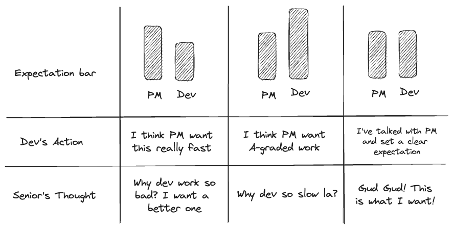

ความคาดหวัง น่าจะเป็นสิ่งที่คนทำงานหลาย ๆ คนละเลยมันไป บางคนคิดว่าก็ทำงานให้เสร็จ ๆ ไปพี่ ๆ Senior ก็น่าจะพอใจแล้วไม่ใช่หรอ หรือบางคนก็คิดว่าต้องพัฒนางานระดับ Premium ออกมา ใช้เวลานานมาก แต่ Senior หรือ PM ไม่พอใจ สิ่งเหล่านี้ทั้งหมดขับเคลื่อนด้วยสิ่งที่เรียกว่า ”ความคาดหวัง” ครับ

สวัสดีทุกคนที่อ่านด้วยนะครับ แล้วก็ขอโทษที่หายไปเกือบเดือน พอดีนิลป่วยบ่อย เนื้อหาของบทความนี้นิลได้แรงบันดาลใจจากการคุยกับ Direct Manager ของนิลนะครับ ตอนช่วงแรก ๆ ที่นิลทำงาน ร่วมกับตอนที่นิลทำงานได้ซักพักและเริ่มสังเกตว่า “ความคาดหวัง” มันสำคัญขนาดนั้นจริง ๆ หรอ
## อะ ลองยกตัวอย่างให้เห็นภาพซักหน่อย

นิลอาจจะยกตัวอย่างในมุม Dev นะครับ บางทีเวลาที่เราได้รับงานจาก Product Manager (PM) หรือว่า Senior เนี่ย เราจะคิดว่าจะใช้เวลากี่วัน มันจะทันกับ Timeline ที่เขาให้มาไหม แล้วเราก็ไปทำตามที่เราคิดมา ซึ่งบางทีเราอาจจะไม่ได้ถามกลับไปหาคนที่มอบงานให้เราเลยว่าเขาคิดว่าเราจะใช้เวลากี่วัน เราอาจจะบอกเขาว่าเราจะใช้ประมาณ 4 วัน พี่เขาก็ Say Yes มา เราก็ไปทำมา จะใช้เวลากี่วันก็แล้วแต่แหละ แต่สุดท้ายเราก็จะรู้สึกว่างานเสร็จ แต่ทางคนที่มอบหมายงานมาอาจจะมีความรู้สึกประหลาดใจที่งานเสร็จเร็วกว่าที่คิด หรืออาจจะหงุดหงิดที่งานเสร็จช้ากว่าที่คิดก็ได้

จากตรงนี้คนอาจจะแบบ เอ้า! ก็ทางคนมอบหมายงานไม่ได้บอกความคาดหวังของตัวเองนี่นา คนทำงานก็ไม่มีทางรู้หรอก แต่ในความเป็นจริงแล้ว ถ้าเราสามารถถามเพื่อดูความคาดหวังของคนมอบงานแล้วทำให้เรากับเขาเห็นภาพเดียวกัน เราจะสามารถสร้างความพึงพอใจให้กับทั้งผู้มอบงานและตัวเราด้วยครับ

ทีนี้ถ้าลองเอาสิ่งที่นิลพูดมาทั้งหมดมาลองวาดเป็น Chart ดู สุดท้ายแล้วนิลได้ภาพประมาณนี้ ไม่รู้ว่าคนอื่นจะพอเข้าใจไหมนะ

## สรุป

จริง ๆ ที่เล่ามานี้อาจจะไม่ Cover ใน Case อื่น ๆ แต่อย่างไรก็ดี จากภาพก็แสดงให้เห็นแล้วว่าแค่เราทำให้ภาพของคนที่มอบงานให้เรากับเรานั้นตรงกันก็สามารถทำให้ทั้ง 2 ฝ่ายสามารถทำงานกันได้อย่างตรงเป้าประสงค์ของตนเอง รวมทั้งที่เล่ามาทั้งหมดไม่ได้มีความอยากให้คนชุ่ยหรือขยันจนเกินไปนะครับ แต่อยากให้ทุกคน set clear expectation ระหว่างเรากับผู้มอบหมายงานเพื่อให้รู้สึกคุ้มค่ากับความพยายามและเวลาที่เราลงแรงไปกับงานนั้นนะครับ 🙂

---

จบไปอีกบทความแล้ว ขอบคุณสำหรับ Comment และ Feedback ที่มีให้ในบทความที่แล้วนะครับ ก่อนหน้านี้ผมพยายามจะทำ Content เป็นรายอาทิตย์แต่ก็ยังติดหล่มความขี้เกียจกับป่วยอยู่บ่อยครั้งครับ ยังไงจะพยายามหา Pace ที่เหมาะสมและมาเขียนอะไรให้ทุกคนอ่านเรื่อย ๆ นะครับ ถ้ามี Topic ไหนที่อยากอ่านกันเป็นพิเศษก็สามารถ Comment กันมาได้เลยนะครับ อยากรู้เหมือนกันว่าอยากอ่านอะไรกัน หรือถ้ามีอะไรอยากจะบอกก็ Comment มาก็ได้นะครับ

ขอให้ทุกคนมีความสุขกับการทำงานกันนะครับ

นิล