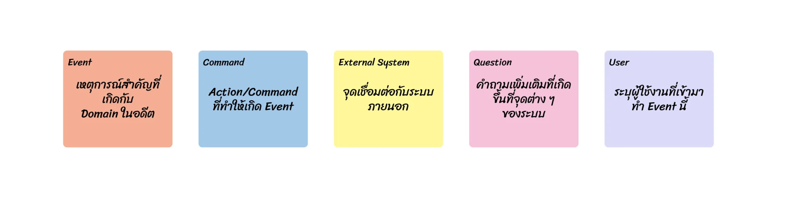
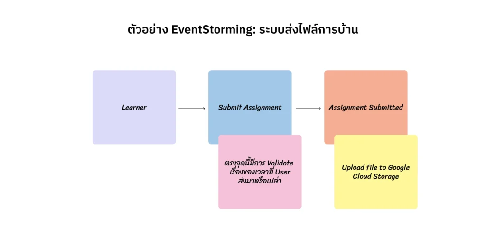

วันนี้นิลมาใน Topic ที่นิลกลับมานั่งดู Session ต่าง ๆ อีกรอบ นั่นคือการทำ EventStorming ครับ ต้องเท้าความก่อนว่านิลได้ฟังพี่รูฟพูดถึงสิ่งนี้ที่ [Session Ubiquitous Language ที่ UXTH Conference 2024](https://uxth.co/) มาครับ และนิลก็รู้สึกว้าวมากและนิลก็ได้ฟังพี่รูฟพูดอีกครั้งจาก [DevDay ของพี่ Siam Chamnankrit บน YouTube](https://www.youtube.com/watch?v=p7IqD83ljvc) (ฟังพี่รูฟแบบดับเบิ้ลเลย) วันนี้นิลเลยอยากเอามาเล่าในมุมที่นิลเข้าใจดูครับ มาลุยกัน

## ปัญหาของโลกการพัฒนา Software ปัจจุบันคืออะไร

ในปัจจุบัน เวลาเรารับงาน Software มาอันนึง Product Manager ไปรับ Requirement จากลูกค้ามาก็จะแปลงเป็นภาษาของตัวเองเพื่อส่งต่อให้ Designer และ Designer ก็จะ Design สิ่งนี้ตามภาษาของตัวเองและส่งต่อไฟล์ Design ให้กับ Software Engineer (Dev) สุดท้าย Dev ก็จะแปล Design เป็นภาษาของตัวเองและออกแบบระบบรวมถึงเขียนโค้ดด้วยชื่อฟังก์ชันหรือตัวแปรที่ Dev ตั้งกันเอง

ซึ่งหมายความว่าปัญหาที่เกิดขึ้นมันคือการที่แต่ละคนมีภาษาของตัวเองและต้องแปลภาษาของคนอื่นเป็นภาษาตัวเอง สมมติเวลา Dev คนเก่าลาออกไปแล้ว Dev คนใหม่มาดู มันก็อาจจะเกิดการสับสนในภาษาเพราะว่าภาษาที่ PM ใช้ ≠ ภาษาที่ Designer ใช้ และ ≠ ภาษาที่ Dev ใช้ หรือที่เราเรียกว่า Language Mismatch เวลา Dev คนใหม่ย้อนกลับไปดูไฟล์ Design เขาก็อาจจะงงเพราะว่าเขาหาไม่เจอว่า Feature ที่ชื่อนี้ใน Code มันคือ Flow ไหนในไฟล์ Design ส่งผลให้ยิ่งนานวันเข้าความสามารถในการ Maintain สิ่งนี้จะต่ำลงเรื่อย ๆ เพราะภาษาของแต่ละคนไม่ตรงกัน

นอกจากนี้ โดยทั่วไป แต่ละตำแหน่งก็จะเป็น Domain Expert (คนที่มีความเข้าใจเชิงธุรกิจเชิงลึก) ในเรื่องต่าง ๆ ซึ่งพอแต่ละคนทำงานแยกกันเนี่ย ก็จะพบกับซวยเมื่อแต่ละคนก็จะ Concern แค่ในงานส่วนของตัวเองโดยที่ไม่ได้คุยกับฝ่ายอื่น ๆ ตั้งแต่เนิ่น ๆ ทำให้สุดท้ายเมื่อทำ Software ไปกลางทางก็อาจจะต้องรื้อเพราะแต่ละ Domain มีของที่ซ่อนอยู่ใต้ภูเขาน้ำแข็ง

## EventStorming คืออะไร

EventStorming เป็น Workshop ที่เอา Stakeholder ที่เกี่ยวข้องกับระบบมาร่วมระดมความคิดกันเพื่อ Explore Business Domain โดยการนำ Post-it สีต่าง ๆ มาเชื่อมต่อกันให้เห็นภาพรวมของการทำงาน ซึ่งจะทำให้เราเห็นภาพรวมของระบบและเข้าใจตัวระบบมากขึ้นว่าเกิดอะไรขึ้นกับแต่ละ Domain รวมทั้งสามารถตั้งคำถามกับการทำงานในระบบเพื่อช่วยกันชี้จุดที่ยังคลุมเครือได้อีกด้วย ซึ่ง EventStorming สามารถนำมาใช้ได้ในหลาย ๆ สถานการณ์ เช่น

1. **การ Improve องค์กร:** การทำ EventStorming จะทำให้เห็นถึง Flow ต่าง ๆ ของ Business และได้เห็นความคิดของฝ่ายต่าง ๆ ในองค์กร ทำให้เราสามารถเห็นภาพรวมและ Next Step ที่เราจะพัฒนาองค์กรไปได้
2. **การแสดงให้เห็นถึง Ecosystem ขององค์กร:** การทำ EventStorming จะทำให้ Stakeholder ทุกคนเข้าใจว่าเรามีทรัพยากรอะไรบ้างและเรากำลังจะสร้างอะไรบ้าง เพื่อให้ทุกคนไปในทิศทางเดียวกัน
3. **การคิด Service ใหม่ ๆ:** การทำ EventStorming จะสร้างความร่วมมือกันในทีมและทำให้แต่ละคนสามารถเสนอไอเดียและมาเข้าใจหลักการทำงานของ Service ใหม่ ๆ และมาเข้าใจว่าเราจะ Deliver Value ได้อย่างไร
4. **การออกแบบ Software ที่ซับซ้อน:** การทำ EventStorming จะทำให้เห็นความต้องการของแต่ละ Stakeholder และสามารถออกแบบ Software ด้วยหลักการ Domain Driven Design (DDD) ได้

ซึ่งวันนี้นิลจะขอ Focus ที่การทำ EventStorming สำหรับการออกแบบ Software นะครับ

## สีของ Post-it ที่ใช้ทำ EventStorming

### Post-it สีส้ม (Event)

เราจะใช้ Post-it สีส้มในการเขียน Event หลัก ๆ ของ Domain นั้น ๆ โดยเราจะต้องเขียนเป็น Past Tense เพื่อระบุว่าเป็นเหตุการณ์ที่เกิดขึ้นไปแล้ว

### Post-it สีฟ้า/น้ำเงิน (Command)

เราจะใช้ Post-it สีนี้เพื่อระบุถึง Command หรือ Action ของ User ที่ทำให้เกิด Event นี้ขึ้นมา

### Post-it สีเหลือง (External System)

เราจะใช้ Post-it สีนี้เพื่อระบุจุดที่เชื่อมต่อ Service ภายนอก

### Post-it สีชมพู (Question)

เราจะใช้ Post-it สีนี้เพื่อตั้งคำถามที่จุดต่าง ๆ ที่เราสงสัย

### Post-it สีม่วง (User)

เราจะใช้ Post-it สีนี้เพื่อบอกว่าผู้ใช้งานใน Flow นั้น ๆ คือใคร

อันนี้เป็นตัวอย่างของชุด Post-it ที่ใช้นะครับ

สีส้มกับสีฟ้าเป็นสีที่ใน EventStorming ทุกคนใช้กัน แต่สีอื่นก็แล้วแต่กำหนดกันเลยฮะ

## ข้อตกลงก่อนทำ EventStorming

อันนี้ก็จะเป็นข้อตกลงของแต่ละที่ที่ทำอีกแหละ แต่คร่าว ๆ ใน Context ทั่วไปน่าจะประมาณนี้ครับ

1. ทุกคนต้องให้ความร่วมมือ เนื่องจากเป็น Collaborative Workshop
2. ทุก Path ต้องจบด้วย Event หมายความว่า User จะ Command อะไรมาก็ตาม สุดท้าย Path นั้น ๆ ควรจบด้วย Event
3. Event ต้องเขียนเป็น Past Tense
4. ถ้าเขียนภาษาอังกฤษไม่ได้ ไม่เป็นไร ให้เขียนภาษาไทยไว้ก่อนและค่อยหา Facilitator มาแปลเป็นอังกฤษให้
5. ถ้าระหว่างทำ EventStorming รู้สึกสงสัยหรือคาใจที่จุดไหน ให้แปะคำถามหรือข้อสงสัยที่ Post-it สีชมพู (Post-it คำถาม) ทันที อย่าเก็บความสงสัยไว้

## ขั้นตอนของ EventStorming

1. Facilitator เล่าภาพรวมของระบบให้ฟัง
2. ผู้เข้าร่วมคนอื่น ๆ ช่วยกัน List Event ทั้งหมดที่เกิดขึ้นได้ และนำมาเรียงกันด้วย Timeline โดย Event ที่เขียนบน Post-it จะเป็นศัพท์ที่ทีมตกลงร่วมกันว่าจะใช้คำนี้
3. เติมข้อมูลของ Command, User, และ External System ที่เกี่ยวข้องทั้งหมดเข้าไป และแน่นอนว่าชื่อ Command, User, และ External System ที่มีการใช้ในนี้ก็ต้องผ่านการตกลงร่วมกับทีมอีก
4. ถ้ามีจุดไหนที่สงสัยหรือคาใจ ติด Post-it คำถามทิ้งไว้
5. เมื่อทำเสร็จแล้วก็จะมา Review กันและเช็คความเข้าใจร่วมกันอีกทีนึง

การทำ EventStorming เป็นสิ่งที่เราสามารถ Iterate ไปเรื่อย ๆ ได้เพื่อทำให้ภาพมันชัดมากขึ้น สุดท้ายก็ขึ้นกับการ Weight ระหว่างความชัดเจนกับเวลาที่ต้องเสียไปในการทำ EventStorming ว่าคุ้มค่าหรือเปล่า

## เราจะ Benefit อะไรจากการทำ EventStorming

แน่นอน อย่างแรกเลยคือเราจะเข้าใจภาพรวมและการทำงานของระบบมากขึ้น รู้ว่า User เป็นใคร มาใช้งานระบบเราในจุดไหน ระบบเราเชื่อมต่อกับอะไร ซึ่งจะทำให้ทีมมีความเข้าใจร่วมกันและทำให้ทีมไปใน Direction เดียวกัน ถ้าในฝั่ง Technical แล้ว การที่เรามาตกลงชื่อ Event, Command, และ Users ร่วมกัน นั่นคือการที่ฝั่ง Business, PM, Designer, และ Dev จะใช้ชื่อเดียวกันในการสื่อถึงสิ่งหนึ่ง ๆ ก็จะทำให้ทีมสามารถสื่อสารกันอย่างเข้าใจมากขึ้น

เมื่อการสื่อสารสามารถ Sync กันได้แล้ว แน่นอนว่าเราจะสามารถ Maintain Software ได้ง่ายขึ้นเพราะว่าของที่เขียนใน Requirement, ชื่อ Flow ใน Design, และชื่อตัวแปรกับฟังก์ชันใน Code ก็จะเหมือนกันหมด ทำให้ถ้าเราต้องการแก้อะไรในฝั่ง Business ฝั่ง Code ก็จะสามารถหาได้อย่างง่ายดาย

## Next Step เราจะศึกษาอะไรต่อดี

นอกจาก Event Storming แล้ว ยังมี Tools อื่น ๆ เพื่อช่วยเราในเรื่องต่าง ๆ ได้

[Domain Storytelling](https://domainstorytelling.org/) – เป็น Tools ที่ใช้ในการ Capture Requirement ในระดับที่สูงขึ้นมาจาก EventStorming อีก ทำให้เราสามารถเห็นภาพกว้างขึ้นมาได้อีกระดับ

[User Story Mapping](https://www.nngroup.com/articles/user-story-mapping/) – เป็น Tools ที่ใช้ในการคุยกันของทีมโดยคำนึงถึงการใช้งานของ User เพื่อให้สามารถแตก Task ย่อยและตัดตอนส่วนที่ไม่จำเป็น จนสามารถพัฒนา Product ในระยะเวลาที่กำหนดได้

## สรุป

- EventStorming เป็นแค่ Tools เฉย ๆ ไม่ได้แก้ได้ทุกปัญหา
- แต่ถ้าทีมกำลังมีปัญหาเรื่องการสื่อสารและการ Maintain Software สิ่งนี้อาจจะช่วยได้
- EventStorming เปรียบเสมือนภาษากลาง (Ubiquitous Language) ในการพัฒนา Software ทำให้ทุกฝ่ายสามารถเข้าใจกัน และเพิ่ม Maintainablilty ให้กับ Software

> ภาษาไม่ควรถูก Limit ที่ทีมฝั่งใดฝั่งหนึ่ง แต่ควรใช้ภาษาเดียวกันสื่อสารทั้งหมดเพื่อ Improve Maintainability และคุยกันรู้เรื่องมากขึ้น

---

เย้ ๆๆ จบไปแล้วกับ Blog ที่นิลเล่าเกี่ยวกับ EventStorming ฮะ จริง ๆ ที่เพิ่งย้อนกลับมาดูคลิปอีกรอบเพราะว่าเดี๋ยวนิลต้องไปเข้า Workshop กับที่ออฟฟิศอะ 5555555 นิลเลยมานั่งย้อนดูฮะ และก็อยากลองเอามาเล่าในความเข้าใจของนิลฮะ

แอบขายของนิดนึง (แต่เขาไม่ได้จ่ายนะ) ตอนนี้ UXTH ร่วมกับ Skooldio กลับมาเปิดขาย Online Rerun ของงาน UXTH Conference 2024 ที่ผ่านมาด้วยแหละ มี Session ที่น่าฟังเพียบบบ ยังไงใครสนใจสามารถเข้าไปดูได้[ที่ลิงก์นี้](https://www.skooldio.com/courses/uxth-con-2024)ได้เลยครับ และก็สามารถไปดู [Session DevDay ที่พี่รูฟพูดที่ช่องพี่ Siam Chamnankit ได้ที่ลิงก์นี้](https://youtu.be/p7IqD83ljvc?si=NkIwNNTvlZkMPICZ)ครับ

ขอให้สนุกกับการสร้างภาษากลางในการทำงาน

– นิล –