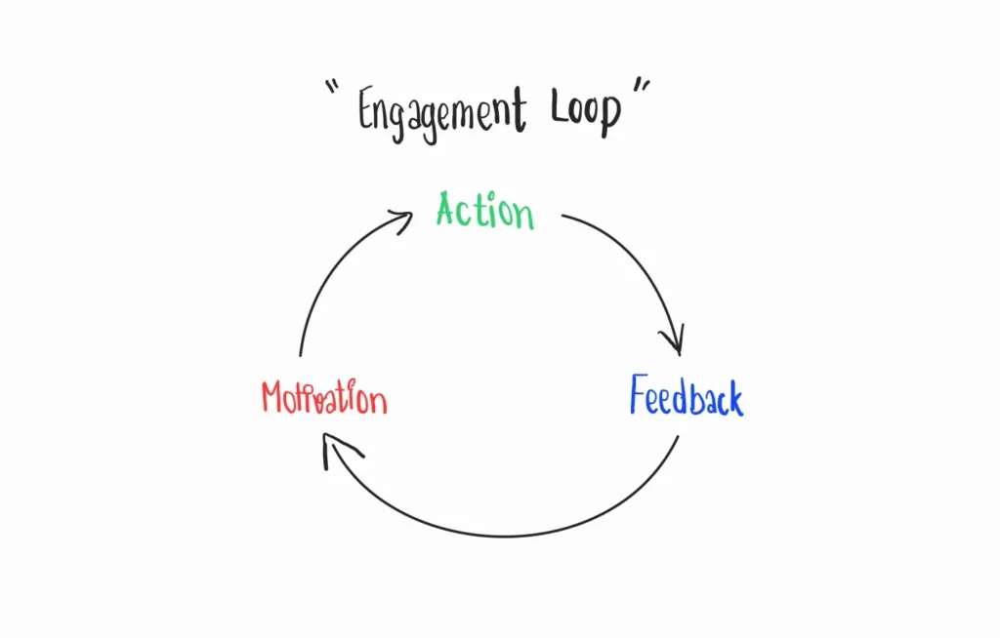

> เราสามารถจูงใจพฤติกรรมที่พึงประสงค์ด้วยกลไกเกม

สรุป Session เกมมิฟิเคชัน: ศิลปะแห่งการสร้างแรงจูงใจผ่านกลไกเกม ในงาน Game Changer ที่จัดโดย [Gang Connector](https://www.facebook.com/Gangconnecter) ซึ่งเป็น Session ของพี่ตรัง สุวรรณศิลป์ แห่ง [Growth Game](https://www.facebook.com/GrowthGameIdea) ครับ

## 🌟 มนุษย์เป็นสัตว์ประเภทเดียวที่เล่นเกม

เชื่อหรือไม่ว่ามนุษย์เป็นสัตว์ประเภทเดียวที่เล่นเกมและเกมไม่เคยบังคับให้ใครเล่น แต่จูงใจให้รู้สึกน่าทำต่อ ดังนั้นเราจึงสามารถ apply concept ของ Gamification ซึ่งคือการ**ใช้องค์ประกอบของเกม**และ**เทคนิคการออกแบบเกม**มาใช้ใน**บริบทที่ไม่ใช่เกม**เพื่อจูงใจให้เกิดพฤติกรรมที่เราอยากให้เกิดด้วยกลไกเกมกับมนุษย์ได้ อย่างไรก็ดี Gamification จะไม่ช่วยเลย ถ้า Content เรายังไม่ดีพอ

## 🌟 การสร้าง Engagement Loop

Engagement Loop คือ Experience ที่จะทำ Motivate User ให้ทำ Action ต่อไปเรื่อย ๆ ได้ โดยองค์ประกอบของ Engagement Loop ประกอบไปด้วย Action, Feedback, และ Motivation

### 🏃 Action

พี่ตรังบอกว่าคนมีหลาย Traits มาก ไม่ว่าจะเป็นคนที่ชอบสำรวจ ชอบการแข่งขัน ชอบสร้างสรรค์ หรือชอบร่วมมือ ซึ่งแต่ละ Traits ก็จะมี Action ที่แตกต่างกันออกไป

#### 🎯 Gamification สำหรับ Action

- Challenge, Quest & Missions
- Boss Fight
- Side Quest
- Protector Quest
- Special Event

### 📢 Feedback

Feedback นี่เป็นตัวอย่างที่มีเยอะมาก เพราะ Key หลักของ Gamification คือการ Feedback (ตัวหลัก ๆ นิลจะติด ✨ ไว้นะครับ)

#### 🎯 Gamification สำหรับ Feedback

##### แต้ม (Point) ✨

แต้มเป็นสิ่งที่เอาไว้ดู Progress และเป็น**การเปลี่ยนพฤติกรรมให้เป็นรูปแบบที่จับต้องได้** เช่น XP ในเกมหรือดาวใน Angry Bird อีกตัวอย่างนึงที่น่าสนใจคือฉลากประหยัดไฟเบอร์ 5 ซึ่งมี 5 ดาว ทำให้คนเลือกใช้เครื่องใช้ไฟฟ้าเบอร์ 5 และจูงใจให้ผู้ผลิตสร้างเครื่องใช้ไฟฟ้าแบบเบอร์ 5 ขึ้นมา

##### เหรียญตรา (Badge) ✨

เหรียญตราเป็นสิ่งที่**เปลี่ยน Achievement ให้เป็นสิ่งที่จับต้องได้** และช่วยให้คนรู้สึกดีเมื่อกลับมาเห็นได้ เช่น การให้ Badge เมื่อบริจาคเลือด การให้ Certificate เมื่อจบหลักสูตร หรือการทำกระดานความประพฤติ

##### ตารางอันดับ (Leaderboard) ✨

ใช้เพื่อบอกว่าตัวเองอยู่อันดับไหน เทีบกับคนอื่น ๆ ซึ่ง**เป้าหมายคือการสร้างการแข่งขัน**

##### Level

ใช้บอกระดับความสามารถ และใช้ในกรณีที่มีการเลื่อนระดับหรือเลื่อนขั้น

##### Progress Bar

ใช้บอกว่าตัวเราทำถึงตรงไหนของ Task นี้แล้ว เพราะคนจะชอบดูว่าเราทำอะไรยังไม่เสร็จ

##### Rewards

- Fixed Rewards: คงที่ คาดเดาได้ เช่น เงินเดือน
- Variable Rewards: ไม่คงที่ สร้างสีสัน เช่น มีเงินแปะอยู่ใต้โต๊ะ ให้ลองคลำใต้โต๊ะ
- Proportional Rewards: ขึ้นกับคุณภาพหรือความคืบหน้า เพื่อสร้างประสิทธิภาพบางอย่าง เช่น การจ่ายโบนัส
- Limited Rewards: เป็นรางวัลที่มีจำกัดเพื่อสร้างการเรียนรู้ เช่น Lottery, Collection, หรือ Easter Eggs

### 💪🏻 Motivation

เป็นสิ่งที่หลาย ๆ คนลืมเวลาออกแบบเกมมิฟิเคชัน หลาย ๆ คนจะทำให้เกิดแค่ Action และ Feedback แต่ไม่มีการสร้าง Motivation ให้ ซึ่ง Motivation นั้นมี 2 แบบ นั่นคือ Extrinsic Motivation นั่นคือ Motivation ที่มาจากปัจจัยภายนอก ส่วน Intrinsic Motivation ซึ่งคือปัจจัยที่มาจากภายใน

#### 🎯 Gamification สำหรับ Motivation

- Story: สร้างเรื่องราวบางอย่างให้ User รู้สึกว่ามีเบื้องลึกเบื้องหลังอะไร
- Surprise & Curiosity: สร้างเรื่อง Surprise บางอย่างเพื่อให้ User รู้สึกจดจำและรู้สึกว่าจะทำไปเรื่อย ๆ เพื่อเจอ Surprise
- Torture Breaks: ทำให้ User ต้องหยุดอย่างทรมานเพื่อให้ User ทำบางอย่าง เช่น เกมที่มีหัวใจ 5 อันและเมื่อหัวใจหมดต้องเติมหัวใจ

## 🌟 หลักจิตวิทยาที่เกมมิฟิเคชันใช้ในการจูงใจ

- **Scarcity:** คนจะอยากได้ของเพิ่ม เมื่อรู้สึกว่าของชิ้นนั้นหายากหรือมีจำกัด
- **Loss Aversion:** คนจะมีแรงจูงใจเพิ่มขึ้นเพื่อหลีกเลี่ยงการสูญเสียมากกว่าการได้ผลประโยชน์
- **Zelgarnik Effect:** คนจะจำสิ่งที่ไม่เสร็จมากกว่างานที่เสร็จแล้ว ซึ่งสิ่งที่สามารถเอามาใช้กับ Zelgarnik Effect คือ Progress Bar และ Notification Count

## 🌟 หลักการคิดในการออกแบบ

เวลาเราจะเริ่มในการคิดถึง Gamification ให้เริ่มที่ **Goal** ว่าอยากได้พฤติกรรมอะไร และให้ไปต่อที่ **Gap** ว่าเขายังไม่ทำพฤติกรรมนั้น ๆ เพราะอะไร แล้วจึงเอาไปออกแบบ **Gamification** เพื่อจูงใจพฤติกรรมนั้น ๆ

ถ้าเวลาเราจะเอาไปนำเสนอกับทีมบริหารแล้ว เพื่อให้เขา Buy-in ให้นำเสนอในรูปแบบของ Goal และดูว่ามี KPI อะไรที่ตอบ Goal นั้น จากนั้นค่อยบอกว่าเราจะสร้างเสริม Behavior อะไรให้กับ User บ้าง

## 🌟 ปัจจัยที่ขัดขวางการ Action

อย่าเพิ่งโทษ User เมื่อเขาไม่ทำอะไรบางอย่าง มันมีหลาย ๆ ปัจจัยที่ขัดขวางการทำ Action เช่น

1. ขาดแรงจูงใจ
2. ขาดความรู้/ความสามารถ
3. ขาดโอกาส

ให้ Check ตลอดว่าเราต้องการ Gamification จริงไหม? Gamification เป็นแค่เครื่องมืออันนึงในการจูงใจพฤติกรรมเท่านั้น

มีเส้นบาง ๆ ระหว่างการสร้างแรงจูงใจกับการชักใย เพื่อรักษาจริยธรรมของการใช้ Gamification ควรจะสร้างแรงจูงใจมากกว่าชักใยให้ใครทำอะไรบางอย่างให้เรา
