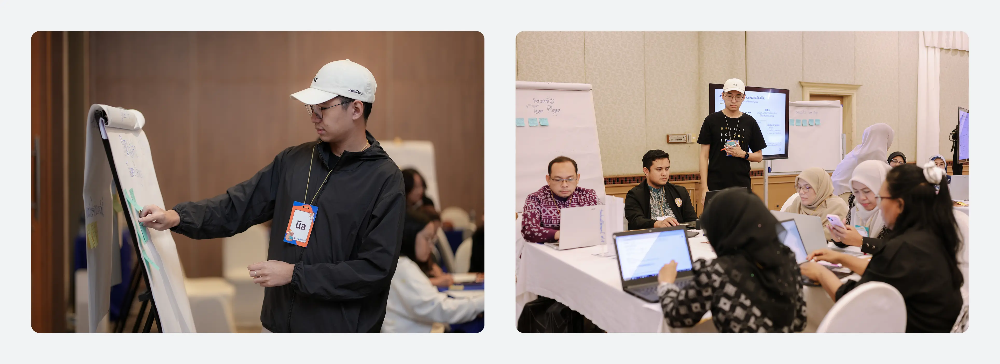
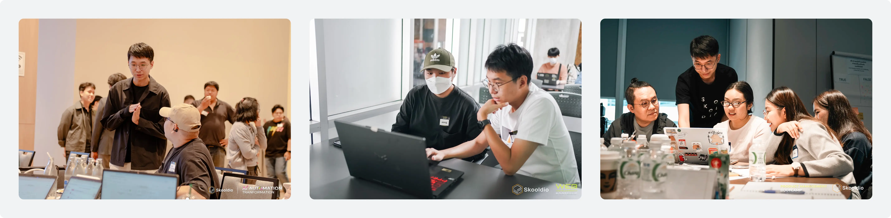
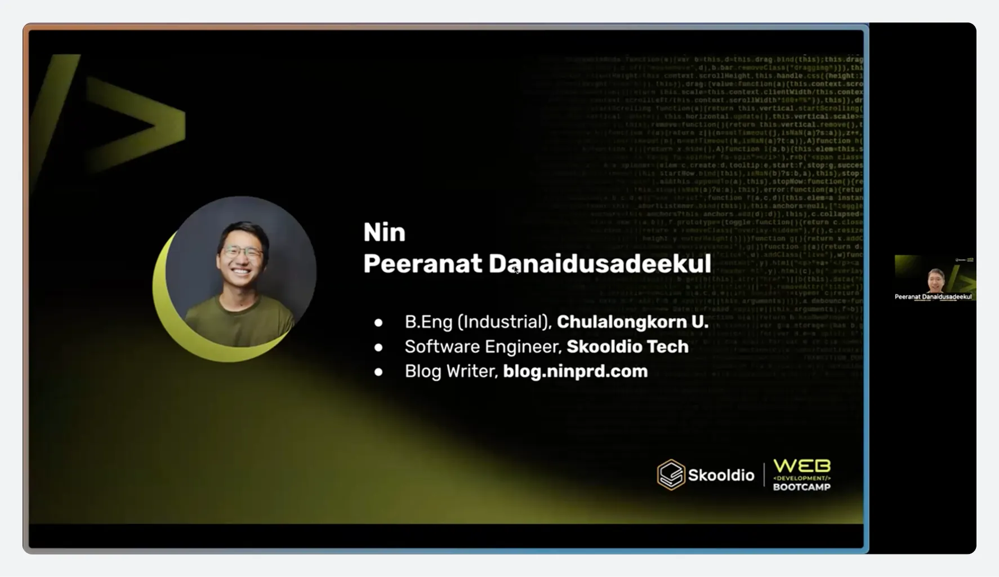
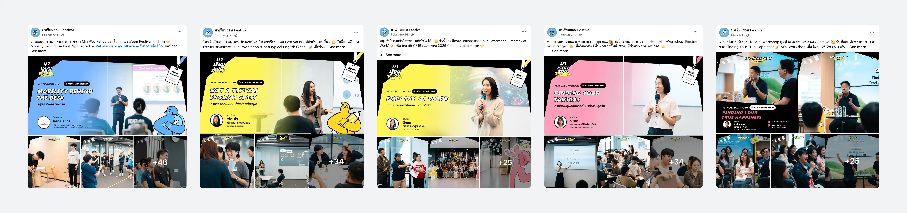

> สีเหลืองเยลโล่ว บริษัทที่อยากเข้า Skooldio ผ่ามมม

นี่เป็นประโยคที่นิลใช้ใน form สมัครงานเมื่อ 4 ปีที่แล้วครับ เป็นช่วงเวลาที่น่าจดจำสำหรับนิลเลยแหละครับ ตอนนี้ผ่านมา 4 ปีแล้ว หมดเวลาสนุกแล้วสิครับ ถึงเวลาที่นิลจะออกไปเติบโตในที่แห่งอื่นแหละครับ นิลแอบอยากมา recap ว่าใน 4 ปีนี้ นิลได้ทำอะไรบ้างกับ Skooldio ครับ นิลอยากเริ่มจากสิ่งที่นิลได้ลองใน 4 ปีที่ Skooldio และจบด้วยสิ่งที่นิลได้เรียนรู้นะครับ ใครอยากอ่านตรงไหนสามารถเริ่มอ่านจากจุดนั้นได้เลยครับ

---
## สิ่งที่นิลได้ลองใน 4 ปีที่ Skooldio Tech

เอาล่ะ 4 ปีทุกคนคิดว่านิลจะได้เป็นอะไรมาแล้วบ้าง มาดูกั๊น 555555
### Technical Growth

#### ได้ลองเป็น PM และ UX/UI Designer จำเป็นในหลาย ๆ project

อย่างที่เคยบอกใน blog แรกไปว่านิลเคยอยู่ทีมที่เป็น Proof of Concept (PoC) ซึ่งเป็นทีมที่ต้องพัฒนา product อย่างไว เลยมีบาง project ที่พี่ ๆ ให้นิลลองไปรับ requirement กับลูกค้าเอง หรืออาจจะมีบาง project ที่รีบมากและไม่ได้ design ของบางส่วนไว้ ทำให้นิลได้ลองจับงานทั้ง requirement เขียน user story จนถึงการไปก๊อก ๆ แก๊ก ๆ Figma มาด้วยแหละ ถือว่าได้ลองอะไรเยอะเลยครับ

#### ได้เป็น Dev Lead ทำ Learning Platform สำหรับนักเรียนหลักหมื่นคนทั่วไทย

อันนี้เรียกได้ว่า highlight เลยแหละครับ นิลได้ร่วมทำ platform KapiBarian ใน [Craft AI Project](https://www.facebook.com/people/CRAFT-AI-Project/61578569144193/) เพื่อพัฒนา platform ที่ช่วยส่งเสริม reading literacy และ critical thinking ให้กับน้อง ๆ ครับ รวมถึงต้องสามารถให้ครูมาดูข้อมูลและช่วยส่งเสริมการพัฒนาน้อง ๆ ได้อีกด้วย

ใน project นี้ นอกจากเป็น Dev ที่ทำงาน ต้องเป็น Dev Lead คอยดูงานน้อง ๆ และควบคุม timeline ของ project งานนี้นิลยังควบงาน Software Architect ที่ต้องวาง architect ของระบบและเป็น DX Engineer ที่ช่วยลดคอขวดของการทำงานของชาว Dev และต้องบินไปตามจังหวัดต่าง ๆ เพื่อสอนคุณครูใช้งานระบบด้วยครับ บอกเลยว่าเหนื่อยมากกกกก แต่ก็สนุกมากเหมือนกันครับ ยิ่งช่วงท้าย ๆ นี่นิลคิดว่านิลเริ่ม sync กับน้อง PM จนมองตาแล้วออก requirement กันแล้วแหละ 555555 แต่เสียดาย นิลแรงหมดก่อน แหะ ไม่งั้นน่าจะได้ทำอะไรที่สนุกกันอีกเยอะเลยแหละ (อ่ยยย 😔)

### Communication Growth

#### ได้ลองเขียน Blog (และยาวมาถึงทุกวันนี้)

อันนี้เป็นหนึ่งในสิ่งที่นิลรู้สึกว่า success สำหรับนิลมากเลยครับ เมื่อ 4 ปีก่อน นิลรู้สึกว่าตัวเองเป็นคนที่พูดไม่รู้เรื่องเลย เป็นคนที่เรียบเรียงคำพูดไม่เป็นเลย พอนิลทำงานที่ Skooldio ครบ 1 ปี นิลก็ได้เห็นพี่ ๆ เขียน LinkedIn ในการครบรอบการทำงานและนิลก็เห็นพี่ ๆ ที่ออฟฟิศเขียน blog กัน นิลเลยอยากลองมั่ง [ซึ่งออกมาเป็น blog แรกอันนี้](https://blog.ninprd.com/blog/1-year-at-skooldio)ครับ

และหลังจากที่นิลลองเขียน blog เมื่อ 3 ปีที่แล้ว และได้ออกไปงาน meetup งาน conference รวมถึงได้เป็น facilitator workshop ที่ต้องใช้ skill การพูดและการอธิบายเยอะ ๆ แล้ว นิลรู้สึกว่านิลสามารถเรียบเรียงการพูดนิลได้ดีขึ้น และสามารถอธิบายของหลาย ๆ อย่างให้เพื่อน ๆ เข้าใจได้ดีขึ้นครับ 

ล่าสุดคุยกับเพื่อนที่เรียนสถาปัตย์มาแล้วเพื่อนบอกว่า อยากคุยกับ Dev ที่สื่อสารออกมารู้เรื่องแล้วคิดถึงนิลคนแรก ในใจนิลแบบ 🥹 รู้สึกภูมิใจอันนี้มาก ๆๆ 😭 โฮฮฮ

#### ได้ลองเป็น Speaker พูดหน้าห้องเรียน

อันนี้เป็น event ที่เกิดขึ้นงง ๆ ฮะ เรื่องหลัก ๆ เลยมีอยู่ว่า manager ที่ออฟฟิศนิลเป็นเพื่อนกับอาจารย์วิศวะภาคคอมที่จุฬาฯ ครับ และมีอยู่คาบนึงที่อาจารย์เขาไม่ว่างเลยอยากให้พี่ manager คนนั้นมาแชร์เกี่ยวกับการทำงานในบริษัทให้น้อง ๆ วิศวฯ จุฬาฯ ปี 1 ฟังกันครับ ซึ่งพี่ manager เขาก็ให้โอกาสนิลในการมาพูดหน้าห้องเรียนให้น้อง ๆ ฟังกัน ซึ่งก็เป็นโอกาสที่ทำให้นิลได้เรียนรู้เกี่ยวกับการพยายามควบคุมห้องเรียนด้วย ถือว่าได้ลองทำอะไรใหม่ ๆ ดีครับ

#### ได้ลองออกไป Conference และ Meetup

นิลได้เริ่มที่การได้ลองไป UX Day ของ Gang Connector ในปี 2023 ครับ ซึ่งตอนนั้น Skooldio เป็น sponsor เลยทำให้มีตั๋วเข้างานครับ เอาตรง ๆ คือนิลรู้สึกว่าตัวเองเป็นคนที่ social awkward มาก ๆ แต่ก็คิดอีกมุมนึงว่า ถ้านิลไป น่าจะได้เจอเพื่อน ๆ UX ในบ. แหละ นิลเลยกัดฟัน 1 ทีแล้วก็ตัดสินใจไปครับ แต่ในความเป็นจริง ไม่มีเพื่อนไปเลยครับ นั่นเลยทำให้นิลต้องพยายามเอาตัวรอดในงาน conference ครั้งแรก และก็ได้ค้นพบท่าในการเข้าสังคมรูปแบบใหม่คือ ถ้าเราคุยกับ extrovert คนนึงแล้วเขาถูกชะตากับเรา เขาจะพาเราไปด้วยทุกที่ในงานและพาเราไปรู้จักคนเยอะมากเลย

ซึ่งนิลก็ได้เรียนรู้ว่า conference/meetup เนี่ย value ที่มากกว่าการมาฟัง topic ต่าง ๆ คือการได้คุยกับคนอื่น ๆ ในงานและแลกเปลี่ยนความคิดในหัวข้อที่เราสนใจร่วมกัน และมันทำให้เราได้คุยกับคนที่มีความชอบคล้าย ๆ กัน รวมถึงมันได้ connect กับผู้คนไว้ และเราก็จะสามารถเห็น movement ของคนที่ทำของใกล้ ๆ กันได้ (และมันได้ของตามบูธที่เขามาเปิดเยอะด้วย ฮา 5555555)

#### ได้ลองเป็น TA และ Facilitator ตาม workshop ต่าง ๆ

นิลได้เริ่มเป็น TA จาก bootcamp ที่มีชื่อว่า [Web Development Bootcamp](https://landing.skooldio.com/web-development-bootcamp) ครับ โดยตอนแรกก็แอบไม่มั่นใจ เพราะรู้สึกว่าตัวเองยังอธิบายเกี่ยวกับ technical ได้ไม่ดีขนาดนั้น แต่พอลองได้ทำก็รู้ว่าจริง ๆ ตัวนิลก็ทำได้นี่นา หลังจากที่นิลรู้สึกว่านิลทำได้แล้ว นิลก็เริ่มขยายผลไปตาม workshop ต่าง ๆ ของ Skooldio ครับ เริ่มจาก [Product Manager Bootcamp](https://landing.skooldio.com/product-management-bootcamp), Prompt Engineering and RAG, [AI Automation for Business Transformation](https://www.skooldio.com/workshops/ai-automation-for-business-transformation) และ [AI Automation Transformation](https://www.skooldio.com/workshops/ai-automation-transformation)

### Random Event

#### ได้แข่ง Hackathon ในนามบริษัท

ย่างเข้าปีที่ 2 ของการทำงาน นิลก็ได้ถูกชวนไปส่ง project เข้าแข่ง [hackathon ของ ETDA ในรายการ Hack for GROWTH](https://www.etda.or.th/th/hackforgrowth) ครับ ซึ่งเป็นการหา solution การส่งเสริมในหมวดการท่องเที่ยวครับ ซึ่งตอนนั้นก็ถึงรอบ 20 ทีมสุดท้ายแหนะะ ยังคงคิดถึงพี่ ๆ ที่อยู่ในทีมที่แข่งด้วยกัน เป็น moment ที่สนุกมากครับ ได้เข้าไปเรียนรู้อะไรเยอะเลยว่าโลกนี้ไม่ได้จบที่แค่ coding แต่ idea และ business มันต้องมาด้วย

#### ได้ลองสอน Class ใน Web Development Bootcamp รุ่นที่ 2

นิลได้รับโอกาสจากพี่ฝั่ง business ว่าอยากได้คนสอนเกี่ยวกับ git ซึ่งพี่เขามองว่านิลดูสอนได้และนิลก็เป็น TA ใน bootcamp นี้อยู่แล้ว คนเรียนทุกคนน่าจะรู้จัก และก็นิลก็ย้ายสายมาด้วย อาจจะสามารถอธิบายในมุมที่น้อง ๆ ที่ย้ายสายเหมือนกันจะเข้าใจได้ ซึ่งเอาตรง ๆ คือตอนนั้น นิลไม่มั่นใจเลย แต่ในหัวนิลก็คือ *"ลองดู"* ครับ

ซึ่งก็ซ้อมสอนหลายรอบมาก เตรียมกับน้อง TA เยอะมาก ก็ยังมีจุดที่พลาดอยู่ครับ ตอนสอนนิลก็ยังลน ๆ และก็มี slide นึงที่พลาดแบบมี comment TODO ไว้ใน slide ด้วย (ขอโทษนักเรียนรุ่นนั้นด้วยครับ 🥲) สุดท้ายก็ผ่านมาได้แบบทุลักทุเลมาก ๆ มองย้อนกลับไปต้องขอบคุณพี่ ๆ ที่ไว้ใจให้สอนและน้อง ๆ TA ที่ support กันวันนั้น รวมถึงคนเรียนทุกคนที่อยู่ฟังกันจนจบด้วยครับ ขอบคุณครับ ✅

#### ได้เรียน bootcamp 7 หมื่นฟรี

อันนี้เริ่มจากการที่นิลสนใจ UX จากการไป [UX Day ในปี 2023](https://www.facebook.com/photo/?fbid=203003242246877) และ UX Conference ในปี 2024 มา ทำให้นิลเริ่มจะสนใจในสาย UX มากขึ้นครับ นิลเลยตัดสินใจขอเรียน [UX/UI Bootcamp ของ Skooldio](https://landing.skooldio.com/ux-ui-bootcamp) ไป (ซึ่งเป็นสวัสดิการที่จะสามารถขอเรียน Bootcamp ฟรีได้นะครับ อิ_อิ) ซึ่งนิลก็บอกตรง ๆ เลยว่าคุ้มมากกก สามารถ[อ่าน review ของนิลได้ที่นี่เลย](https://blog.ninprd.com/blog/skooldio-ux-ui-bootcamp-7-review) 

#### ได้ลองเป็นช่างภาพงาน event

เมื่อก่อนนิลรับงานถ่ายรูปพวกรับปริญญาแหละครับ ซึ่งในตอนนี้ร่างกายนิลก็รับการถือกล้องหนัก ๆ เป็นเวลานาน ๆ ไม่ไหวแล้ว นิลก็เลยเลือกจะเลิกรับงานถ่ายรูปไป ทีนี้สิ้นปีที่แล้วมีการรับสมัคร staff [งานมาเรียนธอนของ Skooldio](https://www.facebook.com/MarianthonFestival/) ซึ่งนิลก็อยากไปช่วย volunteer มาก ๆ ครับ โดยที่พี่ ๆ เขารู้ว่านิลถ่ายรูปได้ พี่เขาเลย assign นิลมาเป็นตากล้อง ซึ่งเอาจริง ๆ เลยคือนิลไม่มั่นใจเลยครับว่าจะเป็นตากล้องงาน event ได้เพราะไม่เคยทำแบบจริง ๆ จัง ๆ เลยครับ (ไม่มั่นใจอีกแล้วครับท่านผู้ชม 5555555)

แต่สุดท้ายนิลก็รอดออกมาได้ครับ นิลได้เจอกับพี่ ๆ หลายคนเลย ทั้งพี่เนียร์จาก [Rebalance](https://web.facebook.com/rebalpt) พี่คะน้าจาก[เพจ Farang Angmor](https://web.facebook.com/KanaFarangAngmor) พี่จอยจาก[เพจ Finding Joy](https://web.facebook.com/profile.php?id=61559748992181) อาจารย์เกดจาก[เพจเกตุวดี Marumura](https://web.facebook.com/Gademaru) เจ้าของหนังสือริเน็นที่โด่งดังมาก ๆ และก็ได้เจอ[พี่ ๆ ทีมเสือเผ่น](https://web.facebook.com/seuxphen)มาสอนการวิ่ง และก็[พี่เอ๋ นิ้วกลม](https://web.facebook.com/roundfinger)ด้วย เป็นการทำงานที่ได้รับความรู้ในหลาย ๆ ด้าน และทำให้นิลมองโลกการทำงานโดยเลนส์ใหม่ ๆ ด้วยครับ ขอบคุณพี่ ๆ ที่ให้โอกาสนิลได้ทำตรงนี้ด้วยครับ

---
## สิ่งที่ได้เรียนรู้ในการทำงาน 4 ปี

นิลกลัวจะเขียนเยอะเกิน ขอคัดอันเด็ด ๆ มา 10 ข้อละกันครับ

1. *เราทุกคนมี pace ของตัวเอง เข้าใจตัวเองและอย่าเร่งตัวเอง*

ในช่วงแรก ๆ ที่นิลทำงานครับ นิลคิดว่าตัวเองช้ากว่าคนอื่น พยายามอัดงานเข้าไป พยายามเรียนรู้เพิ่มเยอะ ๆ เพียงเพราะนิลคิดว่านิลกำลังทำได้ไม่ดีพอ นิลต้องตาม Dev คนอื่น ๆ ให้ทัน แต่พอไปคุยกับ manager มาจริง ๆ นิลก็ทำได้ตาม expectation ของ junior แล้ว หรือทำได้ตามที่พี่ ๆ เขาคาดหวังแล้ว ซึ่งนิลก็กลับมาคิดได้ว่าจริง ๆ ทุกคนก็มี pace ของตัวเองครับ เราต้องรู้ก่อนว่าตอนนี้เรากำลังพุ่งไปด้วยความเร็วเท่าไหร่ และเราต้องกลับมาคิดดี ๆ ว่าการพุ่งไปด้วยความเร็วเท่านั้น ส่งผลกับเราอย่างไรบ้าง

2. *อย่ารอจนพร้อม 100% ค่อยลอง*

ถ้าสังเกตดูในพาร์ทก่อนหน้านี้ เกือบทุกอย่างที่นิลได้ลอง ไม่ว่าจะเป็น TA, การสอน class Web Dev Bootcamp, ช่างภาพงาน event, หรือการขึ้นไปพูดหน้าห้องเรียน นิลเริ่มต้นด้วยความรู้สึก "ไม่มั่นใจ" แทบทั้งนั้นเลยครับ 5555 นิลรู้สึกว่าตัวเองยังไม่พร้อม ยังเก่งไม่พอ ยังอธิบายได้ไม่ดีพอ แต่พอได้ลองทำจริง ๆ นิลก็พบว่าเราทำได้นี่นา และเราเก่งขึ้นจากการได้ลองทำ ไม่ใช่จากการรอให้พร้อมก่อน learning ที่ได้คือถ้ามัวรอให้พร้อม 100% ก่อนค่อยลอง เราอาจจะไม่ได้เริ่มสักที ความพร้อมหลาย ๆ อย่างมันมาจากการลงมือทำไปเลยมากกว่าครับ

3. *อย่าเพิ่งรีบแก้ปัญหา ถ้ามันยังไม่เกิด*

หลาย ๆ ครั้ง นิลจะเป็นสาย preventive โดยจะพยายามแก้ปัญหาก่อนที่มันจะเกิด เพราะนิลอาจจะเคยผ่านมาแล้ว และนิลก็รู้ว่ามันจะเป็นปัญหา แต่เวลาที่มันยังไม่เป็นปัญหาเนี่ย ทุกคนจะมองว่านิลคิด worst case เกินไป หรือหลาย ๆ คนจะไม่เชื่อนิลในตอนแรกครับ ซึ่งสุดท้ายตอนที่ทุกคนเจอปัญหานี้จริง ๆ และมันก็ใหญ่มาก ๆ แล้ว ซึ่งนิลก็ได้ learning ว่านิลควร point ปัญหาให้ถูกเวลามากขึ้นครับ

4. *ทุกครั้งที่เราแก้ปัญหานึง จะมีอีกปัญหานึงโผล่มาเสมอ*

ในองค์กรของเราจะเต็มไปด้วยปัญหาครับ ซึ่งนิลก็จะอยากแก้ปัญหาตรงนู้นตรงนี้ตรงนั้นเต็มไปหมด บางอันนิลก็แก้ได้ บางอันก็แก้ไม่ได้ แต่พอนิลยิ่งแก้ปัญหาไปเรื่อย ๆ นิลก็ค้นพบว่านิลก็จะเจอปัญหาเรื่อย ๆ นี่นา ซึ่ง learning ที่ได้ก็คือนิลควร prioritize ปัญหาที่จะแก้ รวมถึงแก้บางอัน และเรียนรู้ที่จะอยู่กับบางปัญหาให้ได้

5. *เวลาคุยกับใคร ให้คุยในหน่วยเงินที่เขาสนใจ*

เวลาเราคุยกับ PM เราก็ควรจะคุยกับเขาว่า solution A ใช้เวลากี่วัน มี trade off อะไร ไม่ใช่ว่าเราจะไปคุยกับเขาว่าการทำ solution A ใช้ library นี้แล้วมันทำแบบนี้ วู้ฮู้~

ข้อนี้จริง ๆ มันคือการ know your audience ครับ คุยกับใครก็ใช้ภาษาคนนั้น หรือใช้หน่วยที่คนนั้นสนใจ มากกว่าการที่เราจะใช้หน่วยเงินของตัวเองในการคุยในทุก ๆ ที่

6. *อย่าคิดไปเองว่าสิ่งที่เราทำมันมี value ถ้าบริษัทไม่ได้สนใจขนาดนั้น*

อันนี้เป็นบทเรียนที่เจ็บอยู่เหมือนกันครับ หลาย ๆ ครั้งนิลจะอินกับงานบางอย่างมาก ๆ คิดว่ามันเจ๋ง มันมีประโยชน์ มันต้องเป็นของที่สำคัญแน่ ๆ แล้วก็ทุ่มแรงลงไปเต็มที่ แต่สุดท้ายมันกลับไม่ใช่สิ่งที่บริษัทกำลัง focus อยู่ในตอนนั้น สิ่งที่เรามองว่ามี value มาก ๆ เลยกลายเป็นของที่ไม่มีใครสนใจเท่าที่เราคิด เช่น นิลเคยไป optimize CI จากที่มัน run maximum 45 นาที เหลือ maximum แค่ 10 นาที ยิ่งงานที่ run น้อย ๆ เนี่ย เหลือแค่ 3 นาทีด้วยซ้ำครับ ซึ่งในมุมนิลมันคือการ optimize ขั้นเทพแบบ เชรดดด กูทำได้ไงวะ

แต่สุดท้ายแล้วสิ่งนี้ไม่ใช่สิ่งที่ทีม focus ตอนนั้นครับ ทีมกำลัง focus deliverable กันในระดับที่สามารถปิด CI ทิ้งได้เลยแหละ (ใช่ครับ ปิดทิ้งเลย 😭) นิลเลยได้ learning ว่า value ของงานไม่ได้ตัดสินจากเราคนเดียว แต่มันต้องสอดคล้องกับสิ่งที่ทีมหรือบริษัทกำลังให้ความสำคัญด้วย ก่อนจะทุ่มแรงลงไป ลองเช็คก่อนว่าของที่เราจะทำมัน align กับ direction ขององค์กรไหม

7. *ทำงานอย่าติดเกรงใจขนาดนั้น*

หลาย ๆ คนเวลาทำงานครั้งแรกแล้วขอ request อะไรจากพี่ ๆ ไป เราจะชอบรอ หรือถ้าพี่ ๆ บอกว่าไม่ได้ เราก็จะถือว่าเราไม่ได้ (หรืออันนี้อาจจะเป็นที่นิล) แต่ถ้าสิ่งนั้นเป็นสิ่งที่จะทำให้เราอยากทำงานที่นี่ต่อ หรือเป็นสิทธิที่เราพึงได้ ก็สู้เพื่อสิ่งนั้นเถอะ อย่าเกรงใจขนาดนั้นเลย

8. *ทุก ๆ อย่างในการทำงานเป็น trade off ดูดี ๆ ว่าตอนนั้นทีมกำลัง focus อะไรกันอยู่*

ในช่วงแรก ๆ ของการทำงาน นิลเป็นคนที่ทำงานไวมาก แต่สุดท้ายมัน trade กับคุณภาพของ code ที่เขียน ในขณะเดียวกัน ตอนนี้นิลทำงานด้วยวิธีที่ใช้เวลาวางแผนเยอะมาก ๆ ข้อเสียคือใช้เวลาวางแผนเยอะ แต่นิลสามารถลด surprise ได้ทั้งหมด ซึ่งทั้ง 2 วิธีนี้ ไม่มีวิธีไหนที่ผิดเลย แต่ถ้าตอนนั้นทีมกำลังเร่ง กำลังรีบ ทุกอย่างต้องรีบทำ การที่นิลใช้เวลาวางแผนนานก็อาจจะไม่ตอบโจทย์ก็ได้ หรือถ้านิล focus คุณภาพดี ๆ การเร่งแบบแรกของนิลก็อาจจะไม่มีประโยชน์ก็ได้

9. *หน้าที่ของ engineer คือการ deliver solution อย่าทำตัวเป็น blocker ของทีม*

ในช่วงแรก ๆ ของการทำงาน project นึง นิลเอา practice ของ software ไปเป็นตัวตั้ง ว่าเราจะไม่ทำสิ่งนี้ ถ้ามันขัด coding standard หรือ software practice ในบางอย่าง ถ้าสิ่งที่ลูกค้าขอไม่ได้ขัดกับสิ่งที่เราตกลงเป็นลายลักษณ์อักษรไว้ เราในฐานะ engineer ก็ควรดัน solution ที่พา user ไปถึง goal มากกว่าจะไปยึด coding standard

10. *การลาออก ก็เหมือนการบอกเลิกความสัมพันธ์*

ในวันที่นิลตัดสินใจลาออกและค่อย ๆ เดินไปบอกทีมทีละคน หรือทีละกลุ่ม นิลรู้สึกหนักใจมากครับ ลามไปถึงการนอนไม่หลับเลยแหละ เพราะนิลรู้สึกเหมือนกำลังจะเดินออกจากความสัมพันธ์ที่เราสู้ด้วยกันมา 9 เดือน หรือบางคนก็เจอนิลตั้งแต่นิลเพิ่งเข้า นิลรู้สึกผูกพันกับที่นี่มากเลยครับ และการตัดสินใจนี้ไม่ใช่เรื่องง่ายสำหรับนิลเลย ;-;

---

จบไปแล้วนะครับ ทั้ง blog ทั้ง journey ของนิลที่ Skooldio อย่างที่บอกเลยว่าเป็น 4 ปีที่ครบรสมาก ๆ ยังมีหลาย ๆ อย่างที่อยากทำที่นี่ แต่ก็ด้วยโอกาสและเวลา นิลก็อาจจะต้องไปต่อละครับ ขอบคุณ Skooldio รวมถึงเพื่อน ๆ พี่ ๆ น้อง ๆ ที่บริษัทด้วยครับ ทุกคนน่ารักกับนิลมาก ถ้าเจอกันตามงาน meetup หรือ conference ก็ทักกันด้วยน้าา 🤣 ส่วน journey ถัดไปนิลจะไปทำที่ไหนต่อ รอติดตามได้เลยครับ

ขอบคุณทุก ๆ คนที่อ่านมาถึงตรงนี้ครับ

นิล

