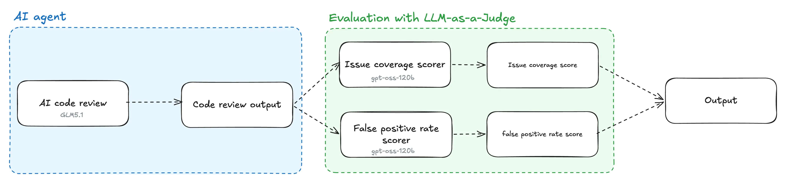
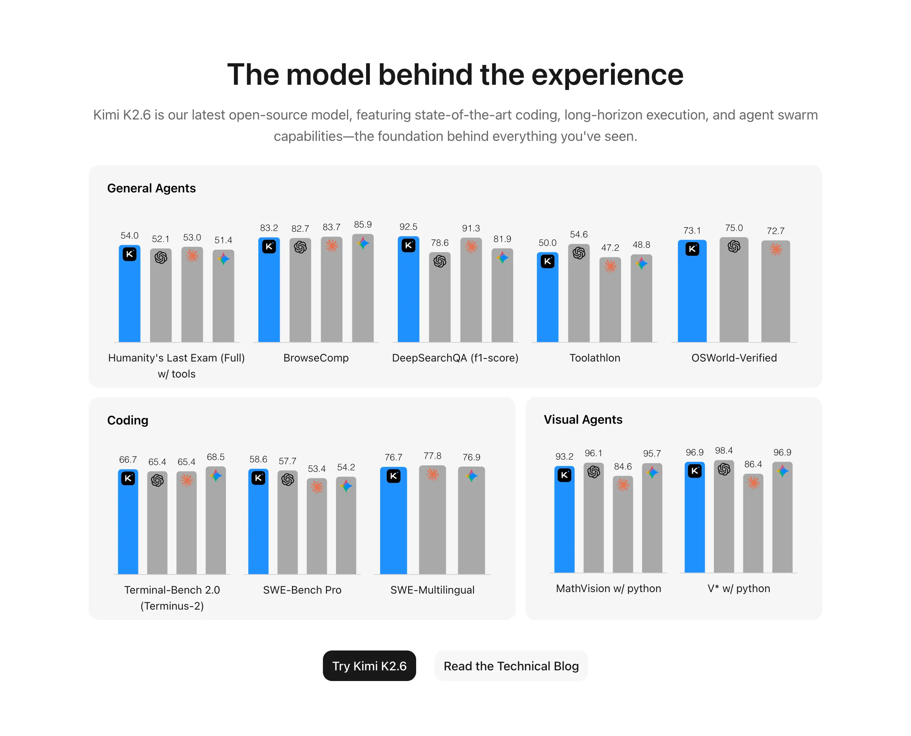
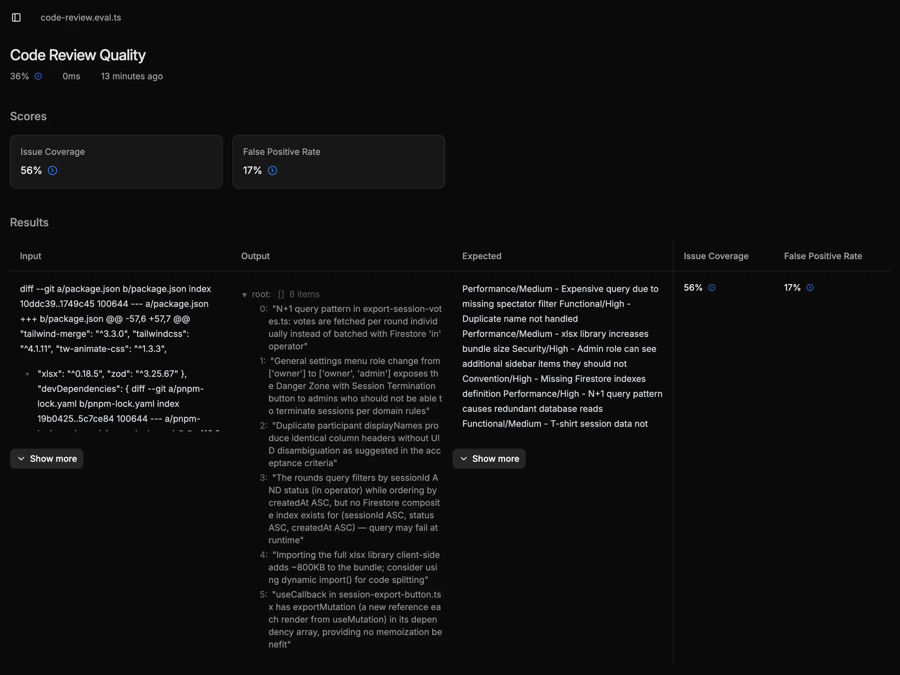

สวัสดีครับ ในช่วงวันหยุดแบบนี้ นิลจะมาทำภาคต่อของเจ้า [Holiday Hack รอบที่แล้ว](holiday-hack-code-review-agent-typescript-glm.md) ซึ่งเป็นเจ้า code review agent ที่นิลลองไปทำใน [repository scrum-poker ของนิล](https://github.com/peeranat-dan/scrum-poker)นะครับ (ขายของอีกรอบ 5555) ถ้าใครยังไม่ได้อ่าน [สามารถกลับไปอ่านได้ที่ลิงก์นี้เลยครับ](holiday-hack-code-review-agent-typescript-glm.md) อะ ซึ่งรอบที่แล้ว เราได้ว่า code review agent ของนิลสามารถ catch issue ได้ 4 ใน 5 issues (80%) ที่นิลตั้งธงไว้ครับ ส่วนภาคต่อวันนี้นิลจะทำอะไรมาดูกันครับ

เท้าความนิดนึง รอบที่แล้วนิลทำ AI code review agent ไป 1 ทีโดยนั่งปรับ Prompt เพิ่ม Context งก ๆ ไปเรื่อย ๆ ในหลาย iteration รอบนี้นิลอยากวัดผลจากสิ่งที่ทำไป ด้วยการทำสิ่งที่เรียกว่า evals ครับ อะ ถ้าใครงงคำว่า evals เดี๋ยวนิลอธิบายให้ฟัง 1 ทีครับ

## Evals (Evaluation) คืออะไร?

อะ ถ้าพูดถึง concept ของการทำ evals หรือที่เราจะเรียกเต็มยศว่า evaluation เนี่ย เราอาจจะต้องถอยมาที่การพัฒนา software ทั่วไปครับ ว่าปกติแล้ว เวลาเราเขียน code กันเนี่ย ถ้าเราอยากเช็คว่า function นั้น ๆ มีการทำงานถูกต้องไหม เราก็จะใช้ unit test เป็นตัวบอกใช่ไหมล่ะครับ และถ้าเราอยากทดสอบการทำงานของระบบที่เชื่อมต่อกันล่ะ สิ่งนั้นก็ถูกตอบด้วยผลลัพธ์ของ integration testing ครับ และสุดท้ายคือถ้าเราอยากทดสอบ flow การทำงานของเว็บล่ะ เราก็จะใช้ end-to-end testing เพื่อตอบว่าระบบยังทำงานด้วย flow ที่เรากำหนดได้อยู่

แล้วสำหรับพวก AI application ล่ะ เราจะเช็คอะไรกันล่ะ นั่นสิครับ ผิด ๆ เราจะ set metric ต่าง ๆ ที่เกี่ยวข้องกับ LLM เช่น accuracy toxicity และ hallucination และดูว่า AI application ของเราตอบมาถึงเกณฑ์ที่เรากำหนดไว้ไหม ซึ่งเราเรียกการทำแบบนี้ว่าการทำ AI evaluation (evals)

## แล้วเราทำ evals กับอะไรได้บ้าง

บอกเลยว่าจริง ๆ เราทำ evaluation ได้ทั้งกับของที่ยังไม่ deploy เพื่อให้เรามั่นใจคุณภาพก่อนเอาไปใช้จริงได้ครับ สิ่งนี้เรียกว่า pre-deployment evaluation ส่วนเมื่อเรา deploy ตัว AI agent ของเราไปซักพักแล้วเกิดข้อมูลการใช้งานจริงแล้วเราอยากมาดูว่าการทำงานของ agent มัน perform เป็นยังไงบ้าง เพื่อเอาไปปรับตัว agent ของเราต่อไป อันนั้นเราจะเรียกว่า post-deployment evaluation ครับ ซึ่งอย่างที่เขียนไปว่ามันมีเป้าประสงค์การใช้งานที่ต่างกัน

## แล้วทำ evals ไป ใครจะบอกว่า output ผิดหรือถูก?

จริง ๆ ที่นิลทำไปเมื่อ blog ที่แล้วอะครับ ที่นิลนั่งติ๊ก ✅ กับ ❌ ในการเจอแต่ละ issue เนี่ย อันนี้ก็ถือว่านิลเป็นคนบอกแล้วใช่ไหมล่ะครับว่า output มันผิดหรือถูก ซึ่งในโลกของการทำ evals เนี่ย ก็มีวิธีเช็คหลัก ๆ 2 แบบคือ
1. **Human Expert:** ให้บุคคลที่เป็นผู้เชี่ยวชาญใน field นั้น ๆ มานั่งดูว่า output ของ AI ตรงกับที่อยากได้ไหม คล้าย ๆ กับ blog ที่แล้วของนิลที่นิลมานั่งดูผลลัพธ์ของ AI แบบตาแตก 😵‍💫 ซึ่งก็จะมีข้อดีที่ความแม่นยำแต่ข้อเสียหลัก ๆ เลยคือ scale ไม่ได้
2. **LLM-as-a-Judge:** ให้ LLM อีกเจ้าหรืออีก Model นึงมานั่งตรวจ โดยส่ง prompt และ expected output ให้มัน โดยมันจะคืนกลับมาเป็น score ซึ่งเราก็สามารถให้ metric ได้ว่าเราอยากให้มันคืนกลับมาเป็นคะแนนในแง่มุมไหน เช่น accurate ไหม ไรงี้ ซึ่งข้อดีก็คือ automate ได้ แต่ข้อเสียคือเราอาจจะเจอ bias ของ LLM model ตัวที่ใช้ judge ครับ

## แล้ววันนี้นิลจะทำอะไรบ้าง

อย่างแรกเลยคือนิลจะทำ pre-deployment evals ครับ เพื่อให้นิลรู้ว่าเจ้า AI code review ของนิลมัน perform ยังไงนะครับ โดยสิ่งที่นิลต้องเตรียมคือ ground truth หรือ source of truth ว่าสิ่ง input และ output ที่นิล ในฐานะ human expert ต้องการ หน้าตาเป็นยังไงครับ จากนั้น นิลจะต้องไป setup การทำ evaluation ใน project เดิมที่นิลเคยทำแหละ 

ซึ่งการทำ evals วันนี้นิลเลือกเป็น LLM-as-a-Judge เพราะรอบที่แล้วนิลทำแบบ human expert ไปแล้วยังไงล่า แล้วนิลจะทำด้วย library ชื่อว่า [Evalite](https://evalite.dev/) ของ [Matt Pocock](https://x.com/mattpocockuk) น่ะครับ เพราะเป็น library ที่เป็นภาษา TypeScript และสร้างมา on top library ที่มีชื่อว่า [Vitest](https://vitest.dev/) ที่นิลใช้งานอยู่แล้วครับ 

โดย metric ที่นิลจะ run วันนี้ก็จะมี 2 ตัวหลัก ๆ ตามนี้
1. **Issue Coverage**: AI เจอกี่ issue จากที่ตั้งไว้ ซึ่งสิ่งนี้คือสิ่งที่นิลทำใน Holiday Hack รอบที่แล้ว แต่รอบนี้นิลมาทำแบบ automate ครับ ซึ่งในรอบนี้นิลขอขยายจาก 5 issues เป็น 9 issues เพราะนิลอยากรู้ว่าจาก 9 potential issues มัน catch ได้เท่าไหร่กันแน่ (ซึ่งเดี๋ยวมีเทียบกับ 5 issues รอบที่แล้วให้เห็นด้วยครับ)
2. **False Positive Rate:** AI report issue ที่ไม่มีอยู่จริงเยอะแค่ไหน ซึ่งจริง ๆ ในรอบที่แล้วนิลก็ทำไปแล้วเหมือนกัน รอบนี้นิลมาลอง automate ดูครับ

สุดท้าย ๆๆ ตัว model ที่นิลจะเอามาทำ evals คือ openai/gpt-oss-120b ซึ่งนิลใช้ฟรีจาก [OpenRouter](https://openrouter.ai/) ครับ ที่นิลเลือก model นี้เพราะมันฟรีและมันเป็นของ OpenAI ดังนั้นมันน่าจะ support พวก lib ของ OpenAI ที่นิลใช้อยู่ในการทดลองนี้ครับ ซึ่งถ้าเรามองภาพทั้งหมดแล้ววันนี้เราจะมาทำสิ่งนี้กันครับ



## เริ่มสร้าง Ground Truth กัน

ซึ่งเมื่อจะ setup ground truth นิลก็ต้อง setup จากผลลัพธ์การทดลองครั้งที่แล้วครับ ซึ่งนิลขอยกตารางจากรอบที่แล้วมาแล้วเติม category ว่าเป็น bug ประเภทไหน รวมถึงเพิ่ม severity ว่าบัคนี้รุนแรงแค่ไหนด้วยครับ

| Issue                                     | Category     | Severity |
| ----------------------------------------- | ------------ | -------- |
| Query เปลือง (spectator filter)           | Performance  | Medium   |
| Handle ชื่อซ้ำ                            | Functional   | High     |
| xlsx bundle size                          | Performance  | Medium   |
| สิทธิ์ admin เห็น sidebar เพิ่ม           | Security     | High     |
| Firestore Indexes                         | Convention   | High     |
| N+1 query pattern                         | Performance  | High     |
| T-shirt session data not mapped correctly | Functional   | Medium   |
| Handle vote value (-1 หรือ -2)            | Edge Case    | Medium   |
| มี browser side-effect ใน service         | Code Pattern | Low      |

ซึ่งทุกคนอาจจะถามว่าแล้วตารางนี้จะ turn ไปเป็น ground truth ได้ยังไง นิลตอบเลยว่า ก็นี่แหละ ground truth ที่เรากำลังตามหาครับ 😎 หลัก ๆ มันคือข้อเท็จจริงที่เราจะเอาไป validate กับผลลัพธ์ครับ

## Setup Codebase + Evalite

อย่างที่บอกไปว่านิลจะใช้ Evalite ดังนั้นนิลก็เปิด docs แล้วก็ลุยเลยครับ อย่างแรกเลยคือนิลรู้ว่าเดี๋ยวเราต้องเรียกตัว code review ในการทำ evals แน่ ๆ นิลเลยเลือกจะ refactor code review function ก่อนครับ

จากที่นิล refactor ตัว code review function ออกมาแล้ว นิลต้องไป setup scorer ก่อนครับ scorer คือตัวตรวจคะแนนซึ่งจะสอดคล้องกับ metric ที่เรา set มาตอนแรกครับ ซึ่งก็คือ issue coverage กับ false positive rate ครับ

หลักการง่าย ๆ ของการสร้าง scorer คือให้สร้าง prompt อีกชุดนึงให้ LLM review โดยบอก role และให้มัน structured output แบบที่เราอยากได้ออกมา ซึ่งใน score ของนิลที่ทำ issue coverage นิลจะมี ground truth issue ทั้งหมดและวัดกับ output ที่ AI ดักได้ ซึ่งเมื่อเอา issue ที่ดักได้จาก list ที่กำหนด นิลก็จะรู้ว่ามันดักได้กี่ issue จากทั้งหมดครับ

ส่วน false positive rate นิลวัดจากเอา issue ทั้งหมดที่มัน report มากับ issue ทั้งหมดที่เรารู้มาเพื่อดูว่ามัน report ของที่ false positive ไปกี่อันครับ ซึ่งเดี๋ยวนิลจะแปะ code ของทั้ง 2 scorer ไว้ใน repository นะครับ เผื่อให้ทุกคนไปอ่านกันได้

อีกอันที่นิลต้องตัดสินใจคือเรื่อง scoring scale ครับ จริง ๆ แล้วการทำ evals เราสามารถเลือกได้ว่าจะวัดผลแบบ binary (ถูก/ผิด) หรือจะใช้ Likert Scale แบบ 1-5 คะแนนแบบที่เราเห็นในแบบประเมินทั่วไปก็ได้ แต่สำหรับ blog นี้นิลเลือกใช้ binary (✅/❌) ครับ เพราะ issue มันมีอยู่จริงหรือไม่มี ไม่มีกึ่งกลาง ยิ่งถ้าใช้ 1-5 เราก็ต้องมาตีความกันอีกว่า "เจอ issue นี้ได้ 2 คะแนน" หรือ "ได้ 4 คะแนน" แปลว่าอะไรกันแน่ ซึ่งมันเพิ่มความกำกวมและซับซ้อนโดยไม่จำเป็นครับ

ซึ่งปลายทางแล้วตัว Evalite code ที่เป็นการทดสอบจะเหลือแค่นี้ครับ

```ts wrap
evalite("Code Review Quality", {
  data: [
    {
      input: diffContent,
      expected: expectedIssues,
    },
  ],
  task: async (input): Promise<string[]> => {
    return callAIReviewer(input);
  },
  scorers: [IssueCoverage, FalsePositiveRate],
});

```


> ⚠️ ก่อนจะไปถึงผลลัพธ์ อยากแทรกตรงนี้ก่อนนิลเจอปัญหาของ openrouter model เรื่องการทำ structured output หนักมากเลยครับ นิลใช้เวลานั่ง retry ผลนานมาก กว่ามันจะออกมาอย่างที่นิล expect ไว้น่ะครับ ซึ่งถ้าใครเล็งจะใช้ free model ก็อาจจะต้องระวังเรื่องนี้ด้วยนะครับ ถ้าถามว่านิลแก้ไง นิลแก้ด้วยการนั่ง spam ไปเรื่อย ๆ ครับ 5555555555

## Evals ด้วย gpt-oss-120b

### AI review output (reviewer: GLM 5.1)

```md wrap
"General settings tab now visible to admins, potentially exposing the owner‑only SessionTerminationButton"

"Duplicate participant names are not handled with uid suffixes in the Excel header as required"

"Export service suffers from an N+1 query by fetching votes separately for each round"

"Potential missing Firestore composite index for the rounds query (sessionId, status, createdAt)"

"Bundle size increase due to importing the entire xlsx library without lazy loading"
```

### Issue Coverage

| Issue                                     | Catch? | Rationale                                                                                             |
| ----------------------------------------- | ------ | ----------------------------------------------------------------------------------------------------- |
| Query เปลือง (spectator filter)           | ❌      | The AI review does not mention a missing spectator filter or an expensive query related to it.        |
| Handle ชื่อซ้ำ                            | ✅      | The AI review explicitly states that duplicate participant names are not handled.                     |
| xlsx bundle size                          | ✅      | The AI review notes a bundle size increase due to importing the entire xlsx library.                  |
| สิทธิ์ admin เห็น sidebar เพิ่ม           | ✅      | The AI review flags that a general settings tab is now visible to admins, implying extra UI exposure. |
| Firestore Indexes                         | ✅      | The AI review mentions a potential missing Firestore composite index for the rounds query.            |
| N+1 query pattern                         | ✅      | The AI review describes an N+1 query pattern in the export service.                                   |
| T-shirt session data not mapped correctly | ❌      | The AI review does not discuss T‑shirt session data mapping.                                          |
| Handle vote value (-1 หรือ -2)            | ❌      | The AI review does not mention handling of negative vote values.                                      |
| มี browser side-effect ใน service         | ❌      | The AI review does not reference any browser side-effect inside a service.                            |

Total Issue Coverage: ***56%***

### False Positive Rate

| Issue                           | False Positive? | Rationale                                                                                      |
| ------------------------------- | --------------- | ---------------------------------------------------------------------------------------------- |
| สิทธิ์ admin เห็น sidebar เพิ่ม | ❌               | This matches the known Security/High issue where admins can see sidebar items they should not. |
| Handle ชื่อซ้ำ                  | ❌               | Corresponds to the known Functional/High duplicate name handling issue.                        |
| N+1 query                       | ❌               | Matches the known Performance/High N+1 query pattern causing redundant reads.                  |
| Firestore Indexes               | ❌               | Same as the known Convention/High missing Firestore indexes definition issue.                  |
| xlsx bundle size                | ❌               | Identical to the known Performance/Medium issue about the xlsx library increasing bundle size. |

False Positive Rate: **0%** 

> "ตัวเลขนี้ดูดีมาก แต่เดี๋ยวไปเจอกันที่สรุปผลนะครับว่ามันหมายความว่าอะไรจริง ๆ"

ทีนี้นิลขอลองใช้ LLM อีกเจ้าในการทำ evals นิลอยากลอง run อีก 1 ทีเพราะนิลอยากรู้ว่าถ้าเปลี่ยน model ในการ judge จะได้ผลลัพธ์ต่างกันไหม ซึ่ง model ที่นิลเลือกมานั่นก็คือ kimi-k2.6 ครับ เพราะอะไรน่ะหรือ เพราะนิลติด rate limit ของ OpenRouter แล้วยังไงล่ะ 555555 แล้วก็ Kimi ก็เป็น model ที่ค่อนข้างเก่งและ claim ว่าตัวเองสูสีกับ Opus 4.6 ด้วยแหละครับ ขอญาตแปะ benchmark 1 ทีครับ



ซึ่งใน run นี้ GLM 5.1 ยังเป็นตัว reviewer เหมือนเดิมนะครับ เปลี่ยนแค่ judge model อย่างเดียว

## Evals ด้วย kimi-k2.6

### AI review output (reviewer: GLM 5.1)

```md wrap
"Missing duplicate participant name deduplication; UIDs not appended to duplicate display names as required by AC"

"Missing validation for illegal Excel characters in generated worksheet names"

"T-shirt vote values exported as raw numbers instead of human-readable labels like XS, S, or M"

"N+1 query pattern fetching votes per-round instead of batching with an in-operator query on round IDs"

"Missing required Firestore composite index for querying rounds by sessionId, status, and createdAt"

"Browser download side effect inside the service function makes it untestable and couples logic to browser APIs"

"Unit tests do not cover t-shirt sizing value mapping in exported workbooks"
```

### Issue Coverage

| Issue                                     | Catch? | Rationale                                                                                                                           |
| ----------------------------------------- | ------ | ----------------------------------------------------------------------------------------------------------------------------------- |
| Query เปลือง (spectator filter)           | ❌      | The AI discussed an N+1 query and a missing composite index but never mentioned a missing spectator filter.                         |
| Handle ชื่อซ้ำ                            | ✅      | The AI explicitly noted missing duplicate participant name deduplication and that UIDs are not appended to duplicate display names. |
| xlsx bundle size                          | ❌      | The AI mentioned Excel worksheet validation and exports but did not mention bundle size concerns for the xlsx library.              |
| สิทธิ์ admin เห็น sidebar เพิ่ม           | ❌      | The AI review did not mention admin roles, sidebar items, or related security issues.                                               |
| Firestore Indexes                         | ✅      | The AI called out a missing required Firestore composite index for querying rounds.                                                 |
| N+1 query pattern                         | ✅      | The AI explicitly identified the N+1 query pattern and suggested batching with an in-operator query.                                |
| T-shirt session data not mapped correctly | ✅      | The AI noted t-shirt vote values are exported as raw numbers instead of human-readable labels and mentioned value mapping.          |
| Handle vote value (-1 หรือ -2)            | ❌      | The AI discussed raw number exports but never mentioned handling edge case vote values like -1 or -2.                               |
| มี browser side-effect ใน service         | ✅      | The AI explicitly flagged a browser download side effect inside the service function as untestable and coupled to browser APIs.     |

Total Issue Coverage: ***56%*** (เท่าเดิม แต่เจอคนละปัญหากัน)

### False Positive Rate

| Issue                                                | False Positive? | Rationale                                                                                                                                                |
| ---------------------------------------------------- | --------------- | -------------------------------------------------------------------------------------------------------------------------------------------------------- |
| Handle ชื่อซ้ำ                                       | ❌               | This issue describes the known Functional/High duplicate name handling bug by specifying that deduplication and UID appending are missing.               |
| Validate illegal excel character in worksheet name   | ✅               | None of the known issues mention worksheet name validation or illegal Excel characters, making this an unrelated concern.                                |
| T-shirt vote value mapping                           | ❌               | Exporting raw numbers instead of human-readable labels is a concrete instance of the known Functional/Medium t-shirt session data mapping issue.         |
| N+1 query                                            | ❌               | This is a direct description of the known Performance/High N+1 query pattern issue, only with additional technical detail.                               |
| Firestore Indexes                                    | ❌               | This specifies the exact missing Firestore composite index, which is a reasonable variant of the known Convention/High missing indexes definition issue. |
| browser side effect                                  | ❌               | This directly restates the known Code Pattern/Low issue regarding browser side effects inside a service function.                                        |
| Unit tests do not cover t-shirt sizing value mapping | ✅               | The known list identifies a functional data mapping bug rather than a test coverage deficiency, so this is not a known or variant issue.                 |

False Positive Rate: **17%** (น่าสนใจจ ไว้เจอกันที่สรุปผล)

ซึ่งนิลลืมแคปผลของ run 1 มา ขอแก้ตัวที่ run 2 ครับ (แปะรูป Evalite หน่อย เผื่อใครอยากเห็น dashboard ของ Evalite 555555)



เอาล่ะ ความสนุกอยู่ตรงที่การสรุปผลแล้วววว

## สรุปผลกัน 1 ที

จากการลอง evals ครั้งแรก นิลพบว่าถ้าเราเทียบ 5 issues เดิมที่เราเคยติ๊กถูกไปเมื่อรอบที่แล้ว รอบนี้ก็ยังติ๊กถูก 4 จาก 5 อันเดิมนะ ซึ่งที่เลขมันน้อยลงเพราะนิลเพิ่ม issue มาอีก 4 อัน มันเลยลดจาก 80% เหลือ 56% ครับ ซึ่งในการ run evals แรกอนาคตก็ดูสดใสมากครับ

ทีนี้พอมาใน evals run ที่ 2 ที่เราลองเปลี่ยน model ในการ evals นิลกลับเจอว่าตัว AI code review ของนิลตอบ issue ได้ไม่เหมือนเดิมซะงั้น แต่ก็ยังคง issue coverage ที่ 56% เพราะไปเจอ issue ตัวล่าง ๆ แทน แปลว่าจริง ๆ แล้วตัว code review agent ของนิลก็ยังไม่เสถียรขนาดนั้นเหมือนกันครับ ซึ่งก็เป็นปกติของ LLM แหละที่แม้ prompt ตั้งต้นจะเหมือนกัน แต่ output ที่ออกมาอาจจะเหมือนหรือไม่เหมือนกันก็ได้

ส่วน false positive rate ที่ AI ให้มาเนี่ย ตอน run แรกนิลก็แอบยิ้มแล้วครับ แต่พอมาดูผลลัพธ์อีกที ground truth ของนิลอาจจะยังไม่มากพอ ไม่ครอบคลุมพอด้วยครับ และพอ run evals ครั้งที่ 2 นิลก็ค้นพบว่าจริง ๆ issue ที่มัน flag มาเป็น false positive เนี่ย จริง ๆ เป็น issue ที่ valid หมดเลยนะครับ นิลว่าอันนี้เป็นที่ ground truth ของนิลไม่แน่นพอจริง ๆ ทำให้ตัว LLM report issue ที่ valid เป็น false positive ครับ

## Step ต่อไปคืออะไร?

จากที่เห็นตอนนี้นิลจะยังทำได้แค่ทีละ 1 PR อยู่ แปลว่าถ้านิลเอา PR อื่น ๆ มา review มันอาจจะไม่ได้ผลลัพธ์ได้เท่ากับ PR ที่นิลเตรียมไว้ครับ ทีนี้นิลกำลังเล็งการทำให้ตัว AI agent นี้มัน general มากขึ้นอยู่ ซึ่งเดี๋ยวในรอบหน้านิลจะลองสร้าง workflow ต่อ เดี๋ยวขอไปสำรวจก่อนว่าตัวอื่น ๆ ในตลาดทำยังไง (เพื่อจะ steal like an artist 😎) หยอกครับ นิลอยากรู้ว่าเจ้าอื่น ๆ ในตลาดเขาทำยังไง นิลจะได้เอามาปรับตัว agent ของนิลให้มันทำงานได้ effective มากขึ้นครับ

อีกอันที่นิลเจอระหว่างทางคือความสับสนว่า เราควร structure repository นี้ยังไงดี เพราะตอนแรกนิลวาง repository แบบ Proof of Concept (PoC) มาก ๆ พอนิลอยากจะ scale นิลก็ต้องมา refactor นู่นนี่นั่น ยิ่งที่ชัดสุดเลยคือตัวการ reuse AI model ข้ามแต่ละ module ที่ดูจะแอบต้อง duplicate code หรือการที่ต้อง declare model ที่เราใช้แยกแต่ละที่ที่เราใช้ก็ดูที่จะมีปัญหาเรื่องการ maintain code อยู่เหมือนกัน 

รอบหน้านิลอาจจะต้องลองเปลี่ยนไปใช้พวก framework ต่าง ๆ เช่น Mastra หรือ Voltagent เพื่อทำให้ code เป็นระเบียบมากขึ้น และเพิ่มความเป็นระเบียบให้กับ code แหละ แต่ไว้ว่ากันคราวหน้า คราวนี้นิลได้ผลการทดลองมาล้า 555555 คราวหน้าอาจจะต้องเริ่มใช้ framework มั่งละะ 😎

---

จบไปแล้วนะครับกับ Holiday Hack เรื่องการทำ evaluation จริง ๆ evaluation ก็ไม่ได้ยากอย่างที่คิดกันใช่ไหมล่ะครับ แอะ จริง ๆ ยากครับ มันต้องใช้ resource ของ human expert ค่อนข้างเยอะเลย ในการสร้าง ground truth ขึ้นมา ซึ่ง eval ของนิลก็เป็นแค่การ transform manual review มาเป็น automation เฉย ๆ ถ้าทำจริง ๆ ยังมีขั้นตอนอีกเยอะเลยครับ ซึ่งก็ไว้ explore กันต่อครับ รอบนี้นิลทำเสร็จแล้วก็โดดลงไปแช่ onsen ละสั่ง soft serve ชาเขียว 1 อัน (คิดกับตัวเองว่าตรูออกกำลังกายไปทำไมฟระ 5555555)

ขอให้ทุกคนสนุกกับการทำ evaluation ครับ

นิล

## Links used in this experiments

- [Evaluation codebase](https://github.com/peeranat-dan/weekend-hack-code-review-agent-typescript/tree/setup-evals-experiment)
- [Evaluation scorer and evals file](https://github.com/peeranat-dan/weekend-hack-code-review-agent-typescript/blob/setup-evals-experiment/src/evals/code-review.eval.ts)
- [Previous Holiday Hack](holiday-hack-code-review-agent-typescript-glm.md)
