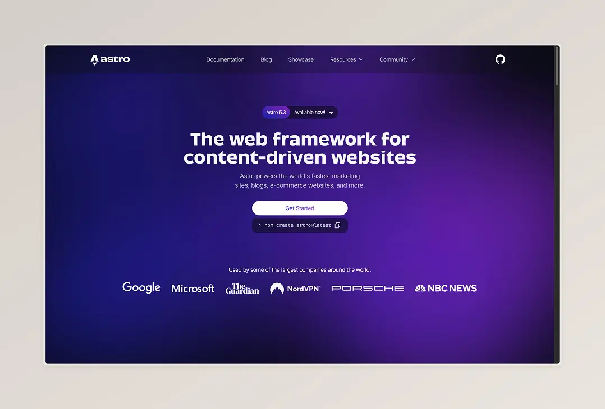
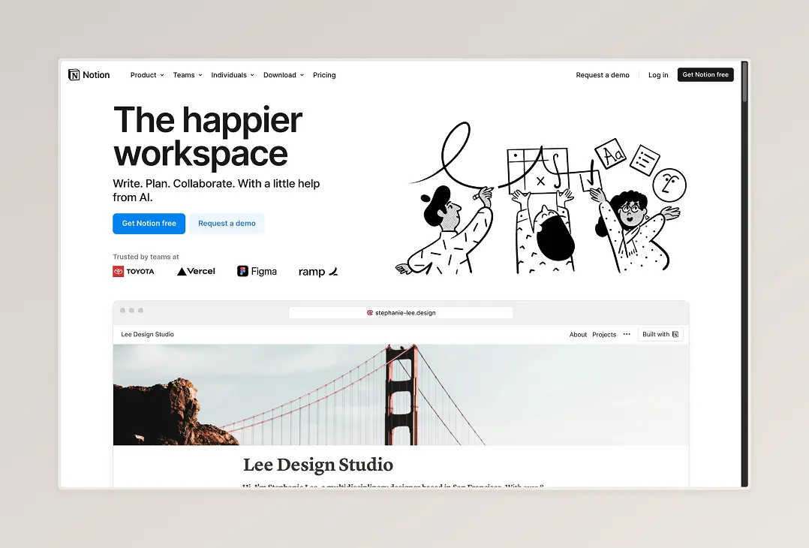
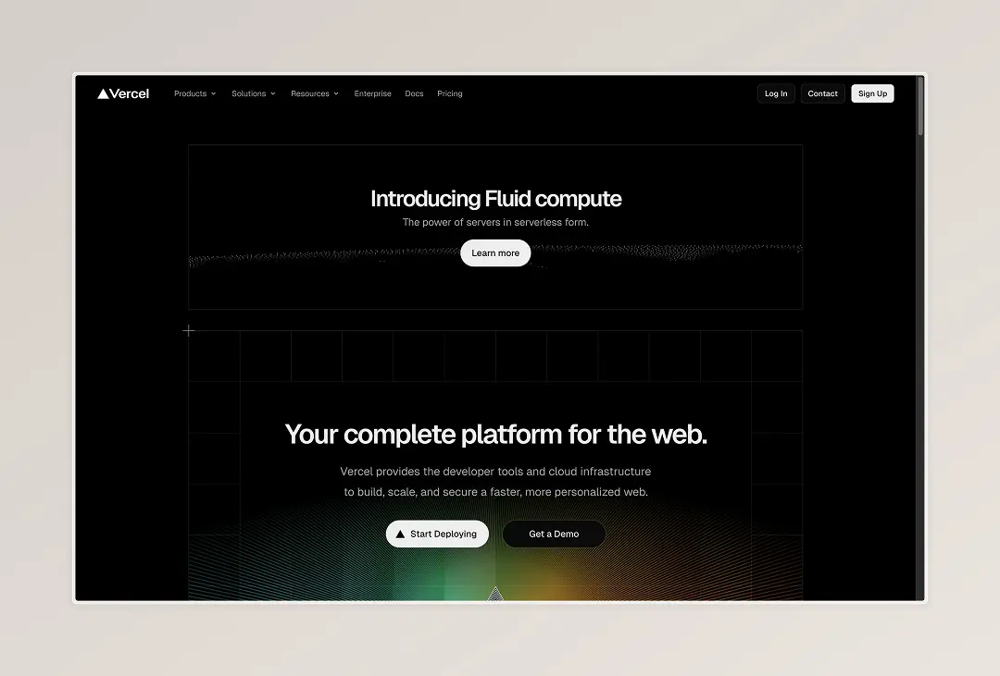

> ⚠️ นิลไม่ได้รับ Sponsor จาก Product ที่นิลพูดถึงใน Blog Post นี้นะครับ แต่ถ้าอยาก Sponsor ก็ติดต่อมาได้ครับ 🙂

สวัสดีครับทุกคน วันนี้นิลอาจจะมาใน Topic ที่มีการผสานเรื่องของ Technical เข้ามาในสัดส่วนที่ค่อนข้างมาก ยังไงเดี๋ยวจะเล่าเป็น General ไปก่อน ถ้าถึงจุดที่เป็น Technical นิลจะคั่นเอาไว้นะครับ เผื่อใครที่ไม่ได้อยากอ่าน Part ที่เป็น Technical จะได้อ่านส่วนที่เป็น General แล้วข้ามไปตอนจบเลยครับ

วันนี้มาคุยกันว่าด้วยเรื่องการย้ายจาก Medium มาเป็น Blog Post ที่เป็น Website อีกตัวนะครับ ซึ่งเป็นการเขียน Code เพื่อดึงข้อมูลจาก Notion มาแสดงผลยังหน้า Website ของตัวเองนะครับ เหตุผลที่ผมย้ายมาคืออะไร เดี๋ยวไปดูกันเลยครับ

ต้องเท้าความไปถึงตอนแรกที่นิลเขียน Blog นะครับว่าทำไมถึงเลือก Medium เป็น Platform ในการเขียนและเผยแพร่ Blog ซึ่งเหตุผลของนิลมีอยู่หลายข้อเลยคือ

1. เป็น Platform ที่ใช้กันอย่างแพร่หลายอยู่แล้ว ทุกคนเข้าถึงง่าย ไม่น่าอันตรธานหายไปง่าย ๆ
2. มีการทำ SEO ที่ดี สามารถทำให้เราถูกค้นหาจาก Google ได้ง่าย (มั้ง)
3. มีการเก็บสถิติจากการเข้าชมให้ สามารถนำมาวิเคราะห์เป็นตัวเลขได้
4. (สำคัญที่สุด) Free to use ทั้งฝั่งผู้ใช้งานกับผู้สร้าง Content

และพอนิลคิดจะทำจริงจังขึ้นมา นิลเลยไป Manage content ใน [Notion](https://notion.so/) โดยแบ่ง Content ออกเป็น Platform ที่จะปล่อย (เผื่อการปล่อยในหลาย ๆ Platform ในอนาคต 👀) และการแบ่งเป็น Status ของ Content นั้น ๆ ซึ่ง Workflow สำหรับการปล่อยบทความของนิลก็กลายเป็น

ซึ่งในตอนแรกก็ไม่มีปัญหาอะไรหรอกครับ จนกระทั่งวันนึงผมพิมพ์ข้อความใน Blog ผิด ทำให้ผมต้องแก้ทั้งใน Medium และ Notion นี่แหละครับ จุดที่ทำให้นิลเริ่มคิดที่จะหาวิธีแก้ เพราะว่านิลไม่อยากจะ Double Work เวลาแก้งานแล้วก็ต้องทำ 2 ที่ นิลเลยเริ่มคิดว่าอยากทำให้ซักที่เป็น Single Source of Truth เพื่อที่จะได้แก้ที่เดียวและส่งผลให้ทั้ง 2 ที่มีหน้าตาข้อมูลที่เหมือนกัน

พอมาถึงตรงนี้นิลเลยไปหาตัวเลือกว่ามีตัวเลือกไหนบ้างที่เป็นทั้ง Content Management System (CMS) และสามารถ Publish Content ในรูปแบบ Website ได้ซึ่งนิลเจอหลายตัวที่สามารถ Management Content ได้ แต่สุดท้ายก็จะมาติดปัญหาเรื่อง Pricing อยู่ดี ด้วยความที่หลาย ๆ Platform จะมี Free tier ที่ไม่ได้สูงขนาดที่เรามั่นใจว่าช่วงแรกเราจะไม่ไปชนจุดนั้นได้ สุดท้ายด้วยความที่มีพื้นฐานด้านการเขียน Code เลยเลือกที่จะใช้ Notion เป็น Platform ที่เก็บข้อมูลและเขียน Website เพื่อดึงข้อมูลจาก Notion ไปแสดงผลครับ

— เข้า Part Technical แล้วจ้า ✨ —

## เลือกจะเขียน Web แล้ว เลือก Framework/Library อะไร?

โอเค ถ้าจะเริ่มตรงนี้ต้องย้อนกลับไปที่เขียนไปข้างต้นถึงจุดที่ทำไมนิลเลือก Medium นะครับ ถ้าไม่นับเรื่องของความเป็น Platform ของ Medium ก็จะเป็นเรื่องการที่ทำ SEO ดี มี Analytics และ Free to use ครับ พอมามองจุดนี้ นิลคิดว่าเรื่องของ Analytics กับ SEO ในช่วงแรกนั้นอาจจะไม่จำเป็นเท่าไหร่ เพราะว่าคนที่เข้ามาอ่านน่าจะเป็นคนรู้จักนิลอยู่แล้ว ที่จะเห็นผ่านจากการแชร์ใน Instagram ส่วนตัวหรือ LinkedIn เพราะงั้นนิลเลยยังไม่อยากได้ Analytics ขนาดนั้นครับ แต่อาจจะต้องคิดเผื่อ SEO นิดนึงครับ พอเป็นเรื่องของ SEO เนี่ย ก็แปลว่านิลต้องหา Library/Framework ที่สามารถทำ Server-side Rendering (SSR) หรือ Static Site Generation (SSG) เพื่อให้ตัวหน้าเว็บถูก Render และมี Content ที่จะทำ SEO ได้อยู่ฝั่ง Server นิลเลยตัด Library/Framework ที่เป็น Client-side Rendering ไปก่อนครับ

ด้วยความที่สุดท้ายนิลมองว่าอยากได้ Performance และเรื่องของการเป็นแค่เหมือนเว็บที่เอาไว้อ่านบทความนิลเลยเลือก [Astro](https://astro.build/) มาทำเป็น Server-side Rendering ด้วยเหตุผลดังนี้ครับ

1. เป็น Framework ที่มี Integrations กับ Frontend Library/Framework หลายตัว เช่น React, Preact, Vue, Svelte, Solid, etc. ทำให้สามารถเขียน Component ด้วย Syntax ของ Frontend Library/Framework ต่าง ๆ ได้ โดยใน Project นี้นิลใช้เป็น Astro + React ซึ่งปกติก่อนหน้านี้นิลเขียน React อยู่แล้ว การเขียน React ใน Astro ก็ทำให้ Feel Homie มาก ๆ ครับ
2. เราสามารถเลือกได้ว่าเราจะทำ SSR SSG หรือ Hybrid Rendering โดยเลือกได้ว่าหน้าไหนเราจะทำ SSR หรือ SSG
3. ไม่โหลด JavaScript ไปยัง Browser (ถ้าเราไม่ทำให้มันเรียก JavaScript) ทำให้หน้า Website โหลดเร็ว Performance ดีมาก
4. มี Integration กับ TailwindCSS ซึ่งปกตินิลใช้ TailwindCSS ในการทำ Styling อยู่แล้ว ข้อนี้เป็น 1 ในปัจจัยตัดสินใจหลักเลยครับ
5. ตอนนี้นิลยังคงสับสนกับการ cache ของ NextJS ตัว app directory และก็ยังงง ๆ เรื่องของ data fetching ของ Version ใหม่ของมันอยู่ + Library บางตัวก็เหมือนจะยังไม่ support Next Version ใหม่ นิลเลยมาลองใช้ของที่ใกล้เคียงกันครับ
6. สามารถเขียน Server Endpoint ได้ จริง ๆ ก็คือสามารถเขียน API Route ข้างใน Frontend Repo ได้เลย ซึ่งอาจจะทำให้นิล Extend ของเพิ่มในอนาคตได้ครับ

## โอเค ได้ Framework ที่จะใช้แล้ว ไปต่อที่ CMS กัน

อย่างที่บอกไปตอนแรกว่านิลใช้ Notion ในการ Manage Content แต่ตอนที่เลือกตอนแรกก็มีความไปหาตัวเลือก Headless CMS เจ้าอื่น ๆ เช่น Strapi, Storyblok, WordPress, Webflow, etc. แต่ CMS ส่วนใหญ่จะมาติดปัญหาที่ Pricing ที่ค่อนข้างสูงหรือถ้าไม่อยากจ่ายราคาแพงก็ต้อง Self-Hosted เอง หรืออีกปัญหาคือ Free tier ที่นิลไม่รู้ว่าจะชนเมื่อไหร่ กลัวต้องมาลำบาก Migrate ของถ้ามันชนเร็ว นิลเลยกลับมามอง Notion ที่เคย Setup ไว้อยู่เพื่อ Manage Content อยู่แล้ว รวมทั้ง Notion เองก็มี SDK ของ JavaScript ที่ใช้งานไม่ยากมาก (ติดความยากที่การประกาศ Type นิดนึง) ทำให้นิลเลือกจะใช้ Notion ที่ตัวเองเคย Setup ไว้มาใช้ต่อครับ

## ว่าด้วยเรื่อง Deployment

นิลเลือกที่จะ Deploy ที่ Vercel ด้วยเหตุผลที่ว่า

1. Vercel มี Deployment CI คือเราไม่จำเป็นต้อง Setup CI เอง ประหยัดเวลาได้เยอะเลย
2. รองรับการ Deploy Serverless Function อยู่แล้ว
3. User Interface ของ Website สวย และ User Experience ก็ใช้งานง่าย
4. (สำคัญที่สุด) Free 555555555555

## Feature(s)/Enhancement(s) ที่อยากเพิ่มในอนาคต

- คิดว่าอยากเพิ่มทางให้สามารถกด Like/Comment ได้เหมือนใน Medium หรือ Application อื่น ๆ
- อยากเพิ่ม Analytics เข้ามาเพื่อนำตัวเลขมาวิเคราะห์ (อันนี้อาจจะเป็นอนาคตอันไกลหน่อย)
- อยาก Redesign หน้าเว็บหมดเลย ตอนนี้ทำมาแบบเร็ว ๆ คิดว่าจริง ๆ น่าจะต้องปรับเยอะเลย
- ตอนนี้นิลใช้วิธีเขียน API ด้วย Astro แล้ว host ในอีก Project นึง เพื่อเอามาใช้งานเป็น API แบบไว ๆ นิลเลยคิดว่าในอนาคตน่าจะต้องปรับในส่วนนี้ด้วยครับ ตอนนี้ชุ่ยด้วยกรอบเวลาที่วางไว้กับตัวเองด้วย

---

จบไปแล้วนะครับกับ Blog ว่าด้วยเรื่องการย้ายถิ่นฐานของ Blog ครั้งแรก อาจจะไม่ใช่ทุกครั้ง แต่นิลคิดว่าการที่เราจะประดิษฐ์หรือสร้างอะไรขึ้นมาอย่างนึง อาจจะมาจากความที่เราทำงานซ้ำซ้อนจนทำให้รู้สึกว่า ถ้าเราลดความซ้ำซ้อนตรงนี้ได้ก็คงดีนะ เป็น Blog แรกที่นิลลองเขียนเกี่ยวกับ Technical ครั้งแรก แต่กว่าจะคลอดมาได้ก็ใช้เวลานานมาก ด้วยความที่ในสัปดาห์ที่ผ่านมานิลจัดการเวลาไม่ดีเองนะครับ จะปรับปรุงแล้วว่ากันใหม่สำหรับ Blog หน้าครับ ส่วนเรื่องเนื้อหาใครอ่านแล้วเอ้ะตรงไหน ลองทักมาคุยหรือ Feedback กันหลังไมค์ได้ครับ

ขอให้สนุกกับการสร้างของกันครับ

นิล