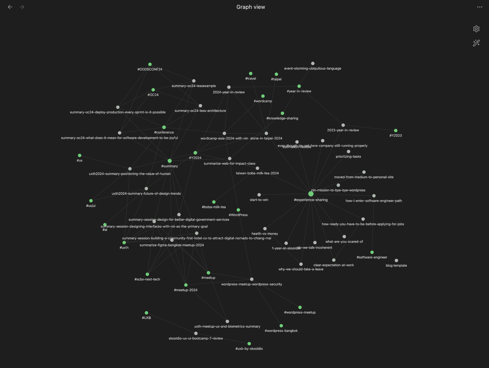
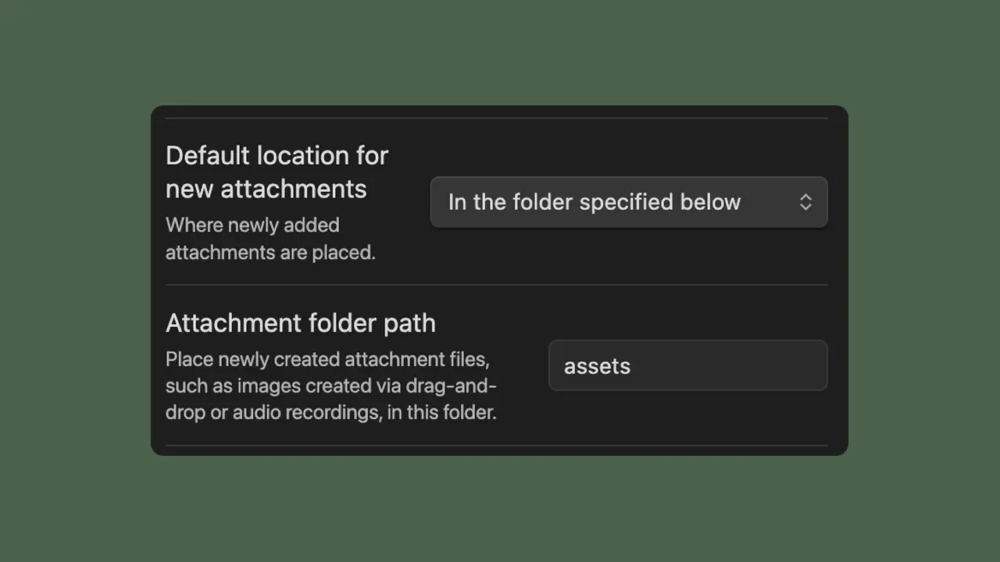

สวัสดีครับ หลังจากผ่านการใช้งาน WordPress ของฟรีมาเกือบ ๆ จะ 1 ปี ตอนนี้มันใกล้ช่วงที่นิลจะต้องจ่ายตังละ ผนวกกับช่วงก่อนหน้านี้ก็มีดราม่ากันเล็กน้อย นิลเลยเกิดไอเดีย**ปฏิบัติการหนี WordPress** ขึ้นมาครับ ซึ่งปฏิบัติการนี้จะเป็นยังไงไปดูกันครับ

> ⚠️ คำเตือน: ใน Blog นี้อาจจะมี Technical ผสมอยู่เรื่อย ๆ นะครับ เดี๋ยวนิลจะเขียนบอกไว้นะเผื่อคนที่ไม่ได้สนใจ Technical มากจะได้ข้ามได้ครับ

เอาล่ะ งั้นมาเริ่มกันเล้ย

## จะย้ายออกอีกละหรอ?

ถึงจะเป็นการย้ายออกจาก Platform รอบที่ 4 ของนิลแล้ว (Medium, Notion, WordPress.com, WordPress.org) แต่ถ้าถามแบบนี้ก็ต้องตอบว่าใช่ครับ 55555555

เหตุผลที่นิลจะย้าย CMS ในครั้งนี้ หลัก ๆ เลยคือต้นทุนครับ ถ้านิล Host WordPress.org ต่อไป นิลก็จะมีต้นทุนในการเช่า Server ของเขาอยู่ครับ ซึ่งเป็นต้นทุนที่นิลเริ่มรู้สึกว่ามันไม่คุ้มถ้านิลจะลงทุนเองในตอนนี้ครับ

จริง ๆ อีกเหตุผลคือนิลอยากถือ Content ไว้กับตัวเองครับ เวลาเราเอา Content ไปฝากไว้กับ WordPress เนี่ย เราเอารูป เอา Content ของเราไปฝากไว้กับ Server ของเขา ซึ่งวันใดวันนึง ถ้า Service ซักอันนึงล่มขึ้นมา ข้อมูลนิลอาจจะหายไปตลอดกาลเลยก็ได้แหละครับ

เหตุผลสุดท้ายเลยก็คือปีนี้นิลยังอยากลองเล่น Tools ใหม่ ๆ ลองหา CMS ใหม่ ๆ ดูอยู่ครับ ซึ่งการที่นิลต้องดึงข้อมูลจาก Platform ต่าง ๆ มาเพื่อแสดงผลเนี่ย ทำให้นิลต้องหาท่า Hack เยอะมากเพื่อให้มันทำงานได้ครับ ซึ่งก็บอกเลยว่าเสียเวลาเป็นอย่างมาก

ทั้งหมดนี้เลยเป็นเหตุผลที่ทำให้นิลเริ่มหาทางเลือกออกจาก WordPress ครับ อย่างที่ชื่อ Blog บอกเลยครับว่านี่คือ **ปฏิบัติการหนี WordPress** (เว่อชิบหาย 555555555)

## เริ่มขั้นตอนการค้นหาทางเลือกใหม่

พอพูดถึงปฏิบัติการแล้ว สิ่งที่ต้องทำอย่างแรกคือวางแผนครับ นิลลองหา **WordPress Alternatives** ก่อนเลย เพื่อลองดูว่ามี CMS เจ้าไหนบ้างที่ตอบโจทย์การเขียน Blog ใส่รูปง่าย ใส่ Content ดี และต้องสามารถนำมาเชื่อมกับเว็บ Blog เดิมของนิลที่เขียนด้วย Astro ได้ด้วย

ตอนแรกที่นิลหามา มี CMS หลายตัวมาก ไม่ว่าจะเป็น Strapi, Directus, Ghost, Contentful, PayloadCMS แต่สุดท้ายพอเทียบกับสเปคด้านบนแล้ว นิลก็เหลือตัวเลือกเดียวคือ Ghost เลยครับ นิลเลยลองไปเล่นเจ้า Ghost เพื่อมาเปรียบเทียบ Experience กับ WordPress ดูครับ

> ℹ️ จริง ๆ นิลลองเล่น Strapi, Directus, Contentful มาละครับ ถ้าใครอยากรู้ข้อดีข้อเสีย เดี๋ยวนิลมาเขียนไว้ครับ

ผลที่ออกมาคือ Ghost ก็พอฟัดพอเหวี่ยงนะครับ ในด้าน Editor Ghost ทำได้ดีมากเลย แถมมี Theme ให้เลือกใช้ได้ประมาณนึงด้วย แปลว่านิลแทบจะสามารถโยนเว็บที่นิลเขียนด้วย Astro มาทิ้งได้เลยนะ 5555555

ปรากฎว่านิลลืมดูครับ Ghost มันต้องจ่ายตังรายปี โอ้แม่เจ้า ก็ว่าทำไมมันดูดีจังวะ 55555555 คือกด Free-Trial ไปแล้วด้วยนะ บ่งบอกถึงความไร้สติตอนกด Free-Trial สุด นิลแม่งไม่ได้อ่านอะไรเลยนี่นา 5555 

## หมดความหวังนั่งน้ำตาริน

หลังจากเห็นราคา Ghost แล้ว นิลก็นั่งคอตกแบบมนุษย์เงินเดือนที่เดือนชนเดือนเลยครับ แบบซึมไปเลยแหละ จนกระทั่งนิลนึกถึงบทสนทนาที่คุยกับชุน (เจ้าของเพจ [LearnAlgorithm.com](https://www.facebook.com/learnalgorithm)) ว่าชุนก็ทำเว็บเหมือนกัน แต่หลังบ้านของชุนจริง ๆ แล้วคือการเขียน File Markdown ผ่าน App ที่มีชื่อว่า [Obsidian](https://obsidian.md/) ครับ

ต้องเท้าความก่อนว่า Obsidian จริง ๆ แล้วเป็น Note Taking App ครับ โดยเวลาเขียนเราจะเขียนใน Format ที่เรียกว่า Markdown แหละ จุดเด่นของเจ้านี่คือความ Flexible ในการใช้งานครับ เราสามารถมาแบบ No-Brain แล้วใช้มันเป็นเหมือน Notes ของ Apple หรือเราจะทำตัวเป็น Hackerman แล้ว Custom มันเยอะ ๆ ก็ได้ และที่น่าจะสำคัญที่สุดสำหรับนิลครับ คือเวลาเขียนมันสร้าง File Markdown จริง ๆ ไว้ในเครื่องเราครับ

หลาย ๆ คนอาจจะสงสัยว่า แล้วการได้ไอเจ้า Markdown มาไว้ในเครื่องสำคัญยังไง จำได้ไหมครับว่าตอนแรกนิลบอกว่านิลอยากเก็บ Content ไว้กับตัวเองครับ ซึ่งการที่เราสามารถสร้าง File Markdown และเก็บไว้ก็คือเราสามารถนำ Content ไปแปรรูปได้ง่ายมากครับ โดยที่ไม่ต้องพึ่งพาความสามารถของ Platform ใด ๆ เลย

การลองเล่น Obsidian ช่วงแรก ๆ ก็ต้องบอกเลยว่าอิหยังวะสุด ๆ ตอนแรกนิลพยายามทำความเข้าใจทุก Feature ของมัน พยายามลองหา Tutorial ให้ใช้เป็นทุกอย่างเลยดูเยอะมาก ๆ แบบโคตร Overwhelm เลยครับ ตอนแรกก็แอบมีความคิดจะถอดใจละ

แต่พอนิลเกิดความคิดที่ว่าลองใช้แล้วค่อย ๆ เรียนรู้ไป นิลก็ลองใช้ไป อยากรู้ตรงไหนค่อยไปหาเพิ่ม ซึ่งตอนนี้มันก็ทำให้นิลเริ่มกลับมาตาเป็นประกายอีกครั้งเลยแหละครับ 🤩 ประสบการณ์การเขียนโดยรวมคือค่อนข้างดีเลยครับ จนตอนนี้นิลก็ Setup มันมาค่อนข้างเยอะแล้วแหละ 55555 บอกเลยว่า "ของดีย์"

## สรุป Stack ตอนนี้ใช้อะไรบ้าง

> ⚠️ เข้าสู่ช่วง Technical ใครไม่สนใจข้ามไปที่ [บทส่งท้าย](#บทส่งท้าย) ได้เล้ย

ตอนนี้ Stack ของ blog.ninprd.com คือหน้าเว็บใช้ [Astro](https://astro.build/) เป็น Web Framework ที่เก่งเจ๋งเรื่องของการทำ Content รวมทั้งยังเขียนด้วย Syntax ที่คล้ายกับ HTML สุด ๆ รวมถึงมี Official/Community Integrations เยอะโคตร ทำให้จะทำอะไรก็ง่ายไปหมดเลย และก็นิล Build เป็น Static Web ครับ จะได้ไม่ผูกติดกับ Platform ใด Platform หนึ่งมากเกิน

ตัว Content ตอนนี้นิลเขียนเป็น File Markdown (.md) ธรรมดาเลยครับ ซึ่งนิลเลือกเขียนผ่าน Obsidian ครับ นอกจากเรื่องของประสบการณ์การเขียนที่กล่าวไปข้างต้นแล้ว อีกอย่างที่ทำให้นิลชอบมากคือ Graph View ของ Obisidian ครับ สิ่งที่ Graph View ให้คือความเชื่อมโยงกันของ Blog นิลครับ ทำให้นิลเห็น Pattern และหมดหมู่ของที่ตัวเองเขียนไปว่า เอ้ะ ปีนี้เขียนไปกี่บทความ เป็นบทความเรื่องอะไรบ้าง เชื่อมอะไรกันอยู่บ้างครับ


<p align="center"><i>Graph View ของ Blog ของนิลเอง</i></p>

วิธีการที่เราจะใช้ Obsidian กับ Astro ได้คือให้เราสร้าง Vault ของ Obsidian ใน Folder ของ Project Astro เลยครับ จากนั้นให้เราสร้าง Content Collection ของ Blog ใน Astro เลย โดยการตั้งค่าเป็นไปตามนี้ครับ

```ts title="content.config.ts"
const blog = defineCollection({
	loader: glob({
	pattern: ['**/*.{md,mdx}', '!templates/**', '!src/blog/.obsidian/**'],
	base: '<directory ที่เราสร้าง Vault ของ Obsidian ไว้>',
}),
```

ซึ่งหลายคนก็อาจจะสงสัยว่าแล้วไฟล์ภาพจะไปเก็บที่ไหน ซึ่งส่วนตัวแล้วนิลก็เก็บไว้ใน Vault นี้แหละครับ นิลก็จะไปตั้งค่าที่ Obsidian ครับ กดปุ่ม `Cmd + ,` เพื่อเปิด Settings จากนั้นไปที่เมนู Files and links ครับ ให้เราหาการตั้งค่าที่ชื่อว่า "Default location for new attachments" แล้วเลือก "In the folder specified below" แล้วในช่องต่อมาก็กรอกว่าอยากให้รูปอยู่ตรงไหน ส่วนตัวนิลสร้างเป็น Folder ชื่อว่า assets ไว้ครับ


<p align="center"><i>การตั้งค่า Attachments ใน Obsidian ของนิล</i></p>

นอกจากนี้ ตัว Web ก็ยังอยู่ใน [Turborepo](https://turbo.build/) ครับ ซึ่งเป็น Monorepo Tools ตัวนึงที่เด่นเรื่องของความเร็วกับความง่ายในการ Setup ครับ ซึ่งสาเหตุที่ทำให้นิลเลือกใช้ Turbo ก็คือออ นิลทำเว็บใหม่แยกออกมาอีกเว็บครับโดยต้องการ Share Styling, UI Component กันครับ

เว็บใหม่ที่นิลทำมาเพื่อเอาไว้แบ่ง Content อันไหนที่เป็น Technical Knowledge Sharing ที่เป็น Series ต่อกัน หรืออันที่นิลอยากเก็บเอาไว้ ก็จะเอาไปไว้ที่ตรงนู้น เช่น WordPress Basic Series ก็กำลังย้ายไปเว็บใหม่ครับ ส่วนตรงนี้ก็จะยังเป็น Content เล่าชีวิต สรุป Meetup, Conference สัพเพเหระเหมือนเดิมครับ ใครสนใจ รอติดตามที่[ลิงก์นี้](https://learn.ninprd.com)เลยครับ เดี๋ยวทำเสร็จแล้วจะลงเพจอีกทีครับ
## บทส่งท้าย

ต้องบอกว่า Blog นี้เป็น Blog ที่ใช้เวลาค่อนข้างนานมากในการเขียนเพราะว่านิลนั่งย้าย Content ออกจาก WordPress นานมากกกก แล้วก็ยังใช้เวลากับการศึกษากับ Obsidian ค่อนข้างเยอะครับ เลยเป็นเหตุผลที่นิลไม่ได้เขียน Blog ของเดือนมกรา (อันนี้อ้างแหละ จริง ๆ แล้วคืองานเยอะเกิน 55555) 

อีกปัจจัยนึงที่ทำให้นิลเลือกมา Obsidian คือตอนนี้นิลกำลังจะเอาของจำพวก Learning ไปจดใน Obsidian แทน Notion ครับ เพราะ Obsidian มันแอบไวกว่าอะ 5555555 ละก็มันเห็น Graph View ด้วย ทำให้เราเห็นว่าแต่ละเรื่องที่เราเรียนมามันเกี่ยวข้องกับเรื่องอะไรบ้างครับ

จบไปแล้วกับ Blog อันร่ายรำอารัมภบทมาอย่างเยอะสุดท้ายก็คือย้ายบ้านนั่นแหละ 55555555 ถือว่าภารกิจสำเร็จแล้วกันครับ ขอบคุณชุนมากที่แนะนำ Obsidian มาให้ลองใช้ ใครอยากอ่าน Tech Stack ตึง ๆ ของ [LearnAlgorithm.com](https://learnalgorithm.com/) สามารถไปอ่านได้[ที่นี่](https://www.facebook.com/share/p/1HMWmGmGEW/)เลยนะ นอกจากนี้นิลก็ขอขอบคุณทุกคนที่ยังอ่านมาถึงจุดนี้นะครับ ทุกคนเก่งมาก 555555 ขอบคุณทุกคนที่ติดตามนิลนะครับ ปีนี้เดี๋ยวมี Content สนุก ๆ มาอีกเยอะเลย รอได้เลยครับ 😎

ขอให้ทุกคนสนุกกับการเขียน

-- นิล --