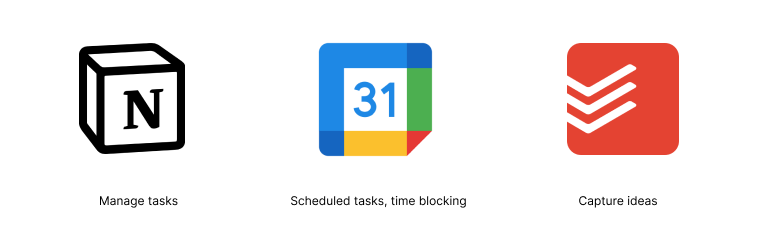

> นิลครับ พี่ขอ 5 นาทีได้ไหมครับ?
> 
> – ทุกคนที่ทักนิลเรื่องงานมาช่วงนี้

คำพูดนี้ถูกยกเอามาอีกครั้ง เพราะคำพูดนี้ก็เป็นหนึ่งในชนวนที่ทำให้เกิด Blog นี้เหมือนกันครับ ช่วงนี้นิลจะเจอหลาย ๆ คนทักมาว่าขอเวลาซัก 5 นาที ช่วงแรก ๆ นิลก็ให้ 5 นาทีกับทุกคนไปครับ แต่มันก็เป็น 5 นาทีจอมปลอมกันหมดเลย เวลานิลหายไป 1 ชั่วโมงบ้าง 2 ชั่วโมงบ้าง จนสุดท้ายเวลาทำงานหลักของนิลหายหมดเลยครับ ทีนี้นิลเลยเริ่มมาคิดว่านิลน่าจะต้องมาตั้ง Priority ของการคุยกับแต่ละคนครับ

## แล้วทีนี้จะดูได้ไงว่างานไหน Priority มากกว่า?

หลาย ๆ คนที่ทักเรามามักจะบอกว่าเรื่องของเขามันด่วนมากและให้รีบจัดการ หรืออาจจะให้เรารีบ Investigate ปัญหาที่เขาเจอ ถ้าเราจัดการให้กับทุกคนทีเดียว ตายแน่ครับ เพราะนิลทำมาแล้ว ตัวแทบระเบิด 5555 ดังนั้นจริง ๆ เราควรถามพวกเขาเหล่านั้นไปก่อนว่าแต่ละคนติดต่อมาด้วยเรื่องอะไร อาจจะให้เขาเล่ากันแบบคร่าว ๆ ซึ่งพอฟังบางคนที่เขาว่างานของตัวเองนั้นด่วน แท้จริงแล้วก็ไม่ได้ด่วนอะไรเลยครับ เป็นงานธรรมดาที่ต้องนำไปต่อคิวเข้า Backlog เท่านั้น แต่ในขณะเดียวกันบางคนที่ทักเรามานั้น เขาก็ทักมาด้วยความเร่งด่วนจริงครับ

## เมื่อกี้ยังไม่ตอบเลยว่าดูยังไงว่างานไหน Priority มากกว่า!

ปกตินิลจะแบ่งงานในหัวตัวเองเป็น 3 ส่วนคือ งานที่เร่งด่วน งานที่ต้องทำแต่ไม่รีบ และงานที่ไม่ต้องทำ ซึ่งแน่นอนพอนิลเข้า Filter ในหัวไปแล้วว่างานนั้นมันไม่ต้องทำ นิลปฏิเสธและโยนทิ้งเลย ทีนี้ถ้ามันเป็นงานประเภทที่เหลือนิลก็เรียงตามที่นิลเขียนมาเลยครับและก็จะเอา Deadline มาประกอบอีกทีครับว่างานไหน Deadline ก่อน งานนั้นก็จะถูกหยิบมาก่อนแหละครับ ทั้งนี้ถ้าเราได้รับงานที่สำคัญมาแต่นิลประเมินแล้วว่า Manpower ของนิลทำไม่ทัน Deadline นิลก็จะไม่รับงานนั้น ๆ มาครับ หรือถ้าเป็นงานในบริษัทนิลก็ต้องแบ่งงานออกไปให้คนอื่นที่สามารถทำงานนั้น ๆ ได้เหมือนกันครับ

ทีนี้ถ้ามาพูดในบริบทของบริษัทที่ทำงานกันแบบ Agile นิลว่าเราต้องมองย้อนกลับไปถึง Sprint’s Goal, Team’s Goal, รวมถึง Personal Responsiblities ครับว่างานที่เขาจะเข้ามาคุยกับเรานั้น มันตรงกับของที่นิลเขียนไปก่อนหน้านี้หรือเปล่า เช่น ถ้า Sprint นั้น ทีมคุยกันแล้วว่าจะทำ สมมติว่าเป็นการสร้างเมนูในการ Navigate ให้กับ User และเอาไปวางตามหน้าต่าง ๆ ในเว็บไซต์ ถ้าทีมคุยกันแล้วว่าใน Sprint นี้ Goal ของเราคือสิ่งเหล่านี้ แปลว่างานที่ทักมาที่ไม่เกี่ยวกับ Goal ก็ไม่ควรจะถูกยกเป็น Priority ขึ้นมาและควรเอาไปต่อตูดที่ด้านล่างของ Backlog ทั้งนี้ทั้งนั้น ถ้างานนั้น ๆ แทรกเข้ามาแล้วเราคุยกันในทีมว่างานที่เข้ามานั้น ต่อให้ไม่ตรงกับ Sprint Goal แต่เป็นเรื่องใหญ่และเป็นเรื่องที่ต้องรีบทำ ทีมก็อาจจะต้องยก Priority งานที่แทรกเข้ามาได้ แต่นิลว่ามันเป็น Case-By-Case ไปแหละเรื่องพวกนี้

ถ้าถามว่ามันมีพวก Framework หรือแนวคิดอะไรที่ช่วยให้เรา Manage Task ได้ง่ายขึ้นไหม นิลขอนำเสนอ Eisenhower Matrix ครับ ตัว Matrix นี้จะให้เราแบ่งงานออกเป็น 4 ประเภทคือ

1. งานที่สำคัญและเร่งรีบ (ต้องทำเลย)
2. งานที่สำคัญแต่ไม่รีบ (ไว้ทำทีหลังได้)
3. งานที่ไม่สำคัญแต่เร่งรีบ (แบ่งงานให้คนอื่นทำได้)
4. งานที่ไม่สำคัญและไม่รีบ (ช่างมันได้เลย)

ซึ่งใครอยากจะเข้าใจตัว Matrix นี้เพิ่มเติมนะครับ สามารถไปลองอ่านได้ที่[ลิงก์นี้](https://www.eisenhower.me/eisenhower-matrix/)เลย

## Manage Task ที่เข้ามาทั้งหมดแล้ว ลืมอะไรไปหรือเปล่า?

ต่อให้เรา Manage Task ทั้งหมดที่เข้ามาได้แล้ว สิ่งที่หลาย ๆ คนรวมถึงตัวนิลลืมคือการเหลือเวลาส่วนตัวให้กับตัวเองครับ ตัวนิลในช่วงธันวานี่ถือว่างานแทรกเยอะมากและนิลตั้งใจว่าจะทำทุกอย่างให้เสร็จ สรุปนิลทุ่มเวลาให้กับงานบริษัทอาทิตย์ละ 7 วันเลยครับ สุดท้ายสุขภาพก็พัง รู้สึกล้าง่ายและไม่ Fresh แบบ 100% เหมือนเมื่อก่อน ช่วงหลังปีใหม่มานี่นิลถึงได้เริ่มเอา Balance กลับมาด้วยการลดเวลางานให้กลับไปเหมือนปกติชนก่อนและไม่คิดเรื่องงานนอกเวลางานครับ ผลสรุปที่นิลได้ตอนนี้คือความ Fresh ถึงจะยังไม่เต็ม 100% แต่ว่าก็มากกว่าช่วงธันวามากครับ

แต่ถ้าใครยังมองไม่เห็นความสำคัญของการดูแลและให้เวลาตัวเองตัวเองหรือว่ามองว่า Task ที่ต้อง Manage มันสำคัญกว่า ก็ให้ลองมองห้วงเวลาที่เราจะใช้กับตัวเองเป็น Task นึงแล้วโยนการให้เวลาตัวเองไปในขั้นตอนของการ Prioritizing ดูก็ได้ นิลหวังว่ามันจะกลายเป็น Task ที่ทุกคนเห็นความสำคัญนะครับ

## แนะนำ Tools ที่ปกตินิลใช้ดีกว่า

ปกติเนี่ยนิลจะใช้ตัว Notion ในการ Manage Task ต่าง ๆ ครับ รวมถึงการทำ Documentation หรือการจด Note ต่าง ๆ เนี่ย นิลก็ใช้ Notion เป็นหลักเลยครับ ซึ่งนิลชอบ [Tutorial](https://youtu.be/bP8wTapHsbc?si=k3ba2Hee6Qmd57yf) ของคนนี้มาก ลองไปตามดูกันได้ครับ

อีก Tool นึงท่ีนิลใช้คือ [Google Calendar](https://calendar.google.com/) ครับ ซึ่งสิ่งนี้ปกตินิลใช้ในการลงตารางการนัดหมายและ Block เวลาการทำงานให้ Focus เพื่อให้สิ่งที่สำคัญมันลุล่วงไปก่อนครับ แค่มีบัญชี Google ก็สามารถใช้งานได้แล้ว นิลว่าสะดวกมากเลยครับ

นิลมีใช้อีกตัวนึงเพื่อใช้ในการ Capture Idea แบบเร็ว ๆ ด้วย ซึ่ง Tools นั้นก็คือ Todoist นั่นเองครับ นิลใช้ App ตัวนี้ในการจดเวลาเจออะไรเร็ว ๆ เช่น มีคนทักให้ทำสิ่งนึงให้แต่ไม่รีบ นิลก็จะจดไว้ใน Todoist ก่อนแล้วพอถึงที่ทำงานหรือเริ่มวันทำงานก็จะกาง Todoist ออกมาเพื่อดูว่ามี Issue เล็ก ๆ น้อย ๆ อันไหนบ้างที่นิลสามารถเก็บได้หรือมีงานอะไรเล็ก ๆ น้อย ๆ ที่คั่งค้างอยู่หรือเปล่า

---
จบไปแล้วนะครับ Blog นี้ นิลคิดว่าเป็นหนึ่งใน Blog ที่ยาวที่สุดในช่วงนี้เลย ตัว Blog นี้นอกจากอยากให้คนฝึก Prioritize งานที่เข้ามาแล้ว อยากให้ดูแลตัวเองกันด้วยครับ โหมงานกันหนัก ๆ ก็อย่าลืมแบ่งเวลาซักนิดนึงมาดูแลตัวเอง นิลคิดว่ามันอาจจะเป็นเรื่องที่หลาย ๆ คนมองข้ามมันไป แต่นิลไม่อยากให้ทุกคนมามองเห็นมันในวันที่สายไปแล้วนะครับ ยังไงก็ดูแลสุขภาพกันด้วย ช่วงนี้นิลเพิ่งป่วยเพิ่มเป็นบ่าอักเสบ พูดเสร็จแล้วก็ไปยืดร่างกายตามหมอสั่งก่อน 5555555

ขอให้ทุกคนสนุกกับการ Prioritize งานครับ

– นิล –