สวัสดีครับ วันนี้นิลมาเล่าสิ่งที่เรียกได้ว่าเป็นก้าวใหญ่อันนึงของนิลมาก คือช่วงพฤษภาถึงกรกฎาที่ผ่านมา นิลได้มีโอกาสไปเรียน [UX/UI Bootcamp ของ Skooldio](https://landing.skooldio.com/ux-ui-bootcamp?utm_source=ninprd&utm_medium=organic) มาครับ ซึ่งถ้าคนที่อ่านมาซักพักก็จะเห็นอยู่แล้วว่านิลทำงานเป็น Software Engineer ที่ Skooldio Tech อยู่แล้วนะครับ อันนี้ก็เหมือนเป็นสวัสดิการอย่างนึงของพนักงานที่สามารถเรียน Bootcamp ได้ฟรีครับ (แอบขายบริษัทนิดนึงครับ 55555) ซึ่งนิลได้ตั้ง Expectation ของการเรียน UX/UI Bootcamp (ขออนุญาตเรียกสั้น ๆ ว่า UXB) ของนิลในครั้งนี้ไว้แบบนี้ครับ

- อยากเข้าใจ Design Process ทั้งหมด คือเรียนทฤษฎีแล้วไม่ได้ลงมือทำจริงมันแอบหลงทางนิดนึง
- อยากเข้าใจว่าตอนที่ Dev ได้ Design มา มันแอบเอ้ะว่าแบบ ทำไมของชิ้นนี้ถึงมาแบบนี้นะ
- อยากสามารถจบงาน (Design Process -> Dev Process -> Deliver งาน) ด้วยตัวคนเดียว หรือสามารถ Interchange Role ตัวเอง (Dev, Design) เพื่อส่งมอบงานได้
- อยากเรียนสดกับพี่แบงค์ (อันนี้สำคัญมาก 55555555) เอฟซีพี่แบงค์ครับ

เอาล่ะ นิลเล่า Expectation ของตัวเองไปแล้ว ก่อนจะไปต่อขอปูพื้นฐานกันนิดนึงก่อนดีกว่าฮะ

## Bootcamp คืออะไรนะ?

Bootcamp คือหลักสูตรการเรียนรู้แบบเข้มข้นและเน้นการปฏิบัติจริง ซึ่งจะมีจุดมุ่งหมายคือการพาทุกคนพัฒนา Skill เฉพาะด้านนั้น ๆ หรือสำหรับสายงานนั้น ๆ โดยส่วนใหญ่แล้วจะหลักสูตรแบบ 3-6 สัปดาห์แหละครับ ยกตัวอย่าง เช่น UX/UI Bootcamp เพื่อพาทุกคน Upskill UX/UI เพื่อย้ายสายงานเป็น UX/UI Designer หรือ Web Development Bootcamp ที่มีเพื่อพาทุกคน Upskill สู่สายงาน Web Developer ครับ

## รูปแบบการเรียนเป็นยังไงบ้าง?

ในรุ่นที่นิลเรียนเป็นการเรียนแบบ Hybrid ครับ คือเรียน Offline วันเสาร์ 9:00 – 18:00 กับเรียน Online วันพุธช่วง 19:00 – 21:30 และก็เรียนประมาณ 6 อาทิตย์ครับ เรียกได้ว่าเรียนฉ่ำมาก นอกจากเรียนแล้วก็ยังมี Group Project ที่จะช่วยให้เราเข้าใจการทำงานเป็นทีมในฝั่ง UX มากขึ้น รวมทั้งมี Project เดี่ยวด้วย ซึ่งเดี๋ยวนิลจะแชร์ Key Takeaway แบบคลาสต่อคลาสเลยว่าแต่ละคลาสได้เรียนอะไรบ้าง ถ้าพร้อมแล้วก็ ไปลุยกันเล้ย

## Week 1: Empathize User & Business

วีคนี้เราจะได้เรียนเกี่ยวกับการ Empathize ผู้ใช้งานและ Stakeholders ผ่าน Lecture และ In-Class Activity กับพี่คุปปี้ครับ โดย Key หลัก ๆ มีประมาณนี้ครับ

- เวลาได้รับโจทย์มา อย่ารีบทำตามทันที ต้อง Fact Check ว่ามีปัญหานั้นอยู่จริงไหม
- ถ้าปัญหานั้นมีอยู่จริง ก็เข้าไปสู่ Design Process ต่อ ถ้าไม่มีอยู่จริงก็ต้องไป User Research หาความจริงกันต่อ
- อยากรู้ข้อมูลแบบไหน ค่อยเลือกเครื่องมือ Research เครื่องมือ Research มีหลายตัวมาก [สามารถไปอ่านสรุป Research Methods ทั้งหมดของ nngroup ได้ที่นี่ครับ](https://www.nngroup.com/articles/research-methods-glossary/?lm=ux-research-cheat-sheet&pt=article)
- เวลาทำ User Interview พยายามทำถามคำถามปลายเปิด -> ได้ Insight -> Insight จะสะท้อนออกมาในงาน Design ไม่มากก็น้อย
- วางแผน Interview ด้วยการตั้งเป้าหมายการเรียนรู้ คิดคำถามจากเป้าหมายนั้น ๆ และนำคำถามมาเรียงจากห่างจาก Product ที่สุด ไปใกล้ Product ที่สุด
- จะ Interview ให้ดี ต้องฝึกฝน ทำบ่อย ๆ
- เจอ Stakeholder ให้เช็คว่าเรายัง Align กันไหม Stakeholder ยังเชื่อเราไหม เขามี Personal Goal ยังไง
- นอกจากจะเข้าใจ User แล้ว ยังต้องเข้าใจ Business ด้วย เพราะเขาเป็นคนที่กำเงินและมีความฝันอยากสร้าง Product
- ควรใช้ [Stakeholder Mapping](https://www.nngroup.com/articles/stakeholder-analysis/) เป็น Tools เพื่อเข้าใจว่าเราต้องบริหารการเข้าหาคนแต่ละคนที่ทำงานด้วยอย่างไร

Key หลักที่ได้จาก Week นี้คือ:

> ทำ User Interview เพื่อลดความเสี่ยงให้กับ Business

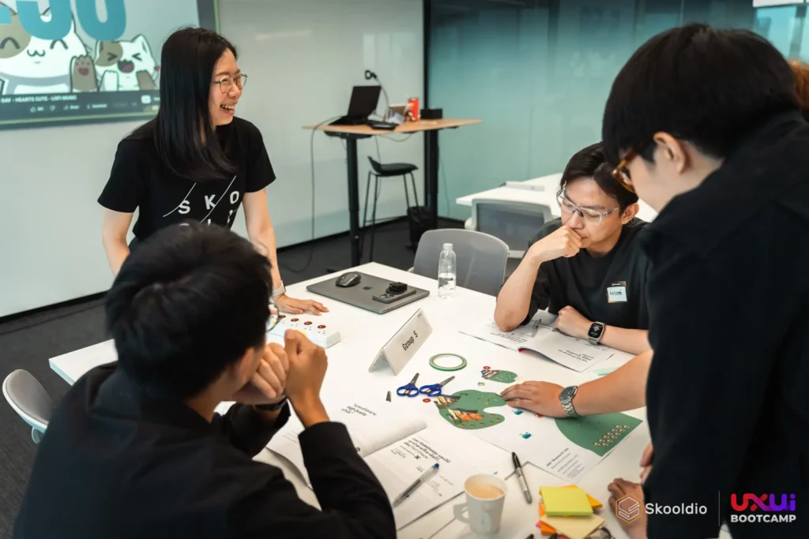
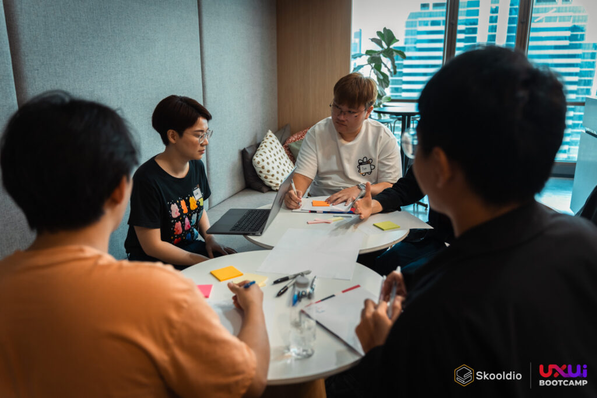

## Week 2: Problems to Solutions

วีคนี้เราจะได้เรียนและทำเวิร์คช็อปแบบตะโกนกับพี่คามิน ซึ่งจะเป็นการเอา User Insights จาก Interview ที่เราทำมาเมื่อวีคที่แล้ว มา Define ปัญหาที่เราจะแก้ผ่าน Tools หรือ Frameworks ต่าง ๆ จนได้ Solution คร่าว ๆ แหละ โดย Key หลัก ๆ มีประมาณนี้

- การจะเข้าใจปัญหาให้มากขึ้น ต้องกลับไปดูให้ลึกขึ้นใน Research Notes ว่าพูดเรื่องนั้นซ้ำ ๆ มีหลักฐานบ่งชี้ หรือได้รับบริบทบางอย่างจากการสัมภาษณ์มาไหม
- เราใช้ Affinity Mapping เพื่อจัดกลุ่ม Users และตีความคำพูดที่ Users แต่ละกลุ่มพูดออกมา เพื่อเข้าใจในภาพกว้างของกลุ่ม Users ของเรา
- แตก Affinity Mapping เป็นข้อมูล Insights ผ่าน Framework/Tools อื่น ๆ เพื่อทำให้เราเห็นรายละเอียดของ Users มากยิ่งขึ้น
    - ใช้ Persona เพื่อ Represent กลุ่ม Users ที่เราไปทำการสัมภาษณ์มา
    - ใช้ A Day In Life หรือ User Journey เพื่อให้เห็นภาพในแกนเวลาว่า Users กลุ่มนั้น ๆ ใช้ชีวิตยังไง มี Opportunity ในช่วงเวลาไหนที่จะทำให้ชีวิตเขาง่ายขึ้นหรือแก้ปัญหาอะไรได้ในจุดนั้น ๆ หรือเปล่า
    - ใช้ How Might We (HMW) เพื่อสร้าง Problem Statements ที่มาจาก User Insight ของเรา เช่น ตั้งคำถามว่า _“ทำยังไงถึงจะช่วยให้คนตัวสูงสามารถนั่งเก้าอี้ออฟฟิศนาน ๆ แล้วไม่ปวดหลัง”_
    - เอาข้อมูลจาก HMW มาเรียงด้วย Prioritization Matrix เพื่อให้เห็น Landscape ของปัญหาทั้งหมดว่าปัญหาไหนที่ควรสนใจ
- การทำ UX Process ไม่ใช่ Waterfall Process เป็นสิ่งที่เราต้อง Iterate ไปเรื่อย ๆ และคอยย้ำกับตัวเองถึงสิ่งที่ตัวเองรู้และไม่รู้เกี่ยวกับ Users
- เราควรทำ Presentation Script เพื่อนำเสนอข้อมูลที่เราได้มาจากการไปศึกษา Users ผ่านเครื่องมือต่าง ๆ เพื่อให้คนอื่น ๆ ในทีม ไม่ว่าจะเป็นฝั่งผู้บริหาร Business หรือ Team Dev เข้าใจภาพเดียวกัน

Key หลักที่ได้จาก Week นี้คือ:

> การทำ UX Process ไม่ใช่เส้นตรง เราต้องตระหนักรู้ว่าตอนนี้เราอยู่ตรงไหน และคอยย้ำกับตัวเองตลอดว่าเรารู้หรือไม่รู้อะไรเกี่ยวกับ Users

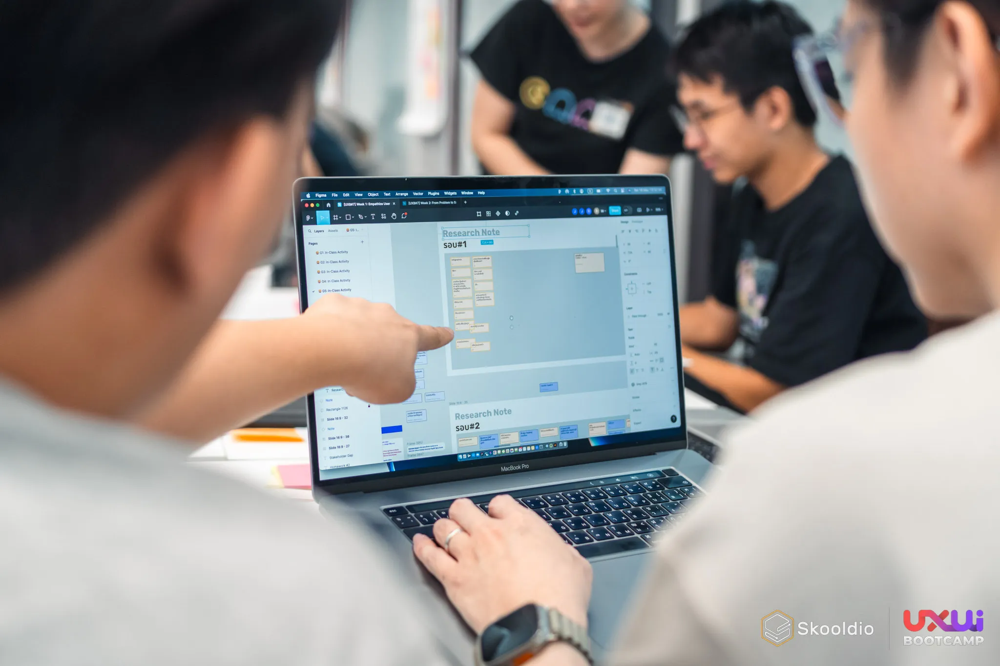
## Week 3: UI Interaction Design

เอาล่ะ วีคนี้โคตรมันส์ Instructor คือพี่แบงค์แห่ง UX Academy ครับ ซึ่งในวีคนี้พี่แบงค์ก็จะมาสอนหลักการต่าง ๆ ของการทำ UI และการทำ UI Interaction Design ครับ วีคนี้ In-Class Activity เยอะมากกก ได้ใช้ Figma ฉ่ำมาก Key หลัก ๆ ของ Week 3 มีประมาณนี้ครับ

- การทำ Job to be done เพื่อช่วย User ก้าวผ่าน Struggle Moment
- เวลาทำ Journey เริ่มทำเป็น Text และเริ่มทำที่ Start Stop แล้วค่อยมา Connect Flow ตรงกลาง ถ้าไม่พอใจ Flow ตรงไหนให้แก้ในรูปแบบของ Text เมื่อพึงพอใจแล้วค่อยวาด Wireframe ออกมา
- ยิ่งเราขยับ Wireframe เร็วเท่าไหร่ ยิ่งราคาถูก
- 4 Tips for Prototyping
    - General to Detail: ข้อมูลควรจะไล่จากกว้าง ๆ จนละเอียด เหมือนพวก Mailbox ที่ฝั่งซ้ายสุดเป็น Email Folder (General) ตรงกลางเป็นรายการ Email ใน Folder นั้น (เจาะจงเข้ามา) และฝั่งขวาก็จะเป็นเนื้อความและรายละเอียดของ Email นั้น ๆ (ละเอียดที่สุด)
    - Object not Action: เช่น หากเราต้องการออกแบบแอปช่วยเตือนกินยา ให้ออกแบบด้วยที่ในหน้าเป็นรายการยา ไม่ใช่ Action ต่าง ๆ เช่น กินยา แจ้งเตือนการกินยา
    - Basic Location: เวลาวางของใน UI ให้วางที่ที่มันควรจะอยู่ เช่น แถบเมนูหลักในแอปมือถือเป็นแถบอยู่ด้านล่าง อย่าเอาเมนูไปไว้ด้านซ้ายหรือด้านขวา
    - Real not Abstract: ข้อมูลที่มาใช้ Mock ใน Wireframe ไม่ควรเป็นแค่กล่องสี่เหลี่ยมและกากบาทหรือแค่แถบสีดำคาดตรงที่เป็นข้อความ แต่ควรเป็นรูปและข้อความที่ดูสมจริงขึ้นมา เพื่อให้คนมาดู Wireframe เห็นภาพมากขึ้น
- เราสามารถเอา Gestalt’s Law มาช่วยในเรื่องการ Grouping ของเพื่อลดความซับซ้อนของ UI ได้
- การออกแบบ ไม่ใช่แค่คำนึงถึง User และ Business ยังต้องคำนึงถึง Platform ที่เราออกแบบ เช่น เรากำลังทำแอปบน iOS หรือ Android รวมถึงต้องคำนึงถึง Developer ด้วยว่าที่เราออกแบบไป ใช้เวลา Dev ทำยากแค่ไหน

วีคนี้ได้ทำอะไรเยอะมากจริง ๆ พี่แบงค์สอนพวก Shortcut Figma ที่ใช้บ่อย ๆ ด้วย ดีมากเลยยย Key หลักที่ได้จากวีคนี้เยอะมาก แต่นิลชอบอันนึงมากคือ

> เราเรียนหลักการต่าง ๆ เกี่ยวกับ UI เพื่อสร้างของที่ใช้งานง่ายและเอาไปคุยกับ Stakeholder ได้อย่างมีเหตุผล

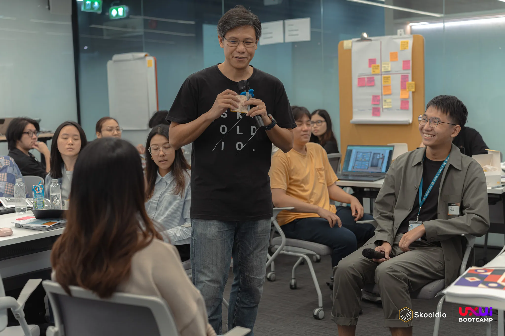
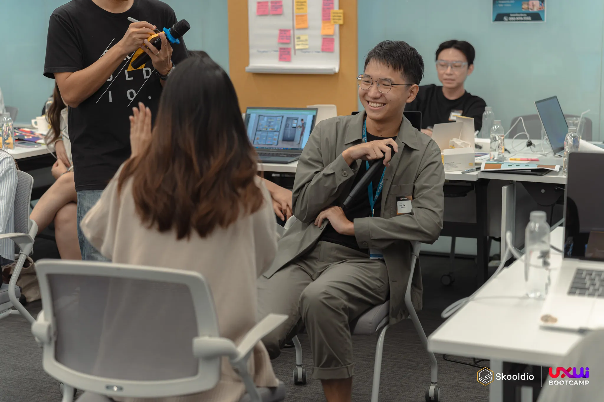
## Week 4: Design Psychology

วีคนี้ Instructor คือพี่ปุ้ม Head of UX Design ที่ Skooldio ครับ พี่ปุ้มจะมาเล่าเกี่ยวกับ UX/UI ในมุมของหลักการต่าง ๆ ทาง Psychology ครับ ซึ่งด้วยประสบการณ์และการยกตัวอย่าง Good และ Bad Examples ของพี่ปุ้มทำให้การเล่าเรื่อง Psychology นั้นฟังดูย่อยไม่ยากอย่างที่คิดไว้ครับ ในวีคนี้ Key หลัก ๆ มีประมาณนี้ครับ

- การใช้หลักการทาง UX มาประกอบการออกแบบประสบการณ์การใช้งานนั้นจะไม่ได้สร้างการสวยแบบปัจเจกแต่จะสร้างความเอกภาพในเชิงความคิดเกี่ยวกับประสบการณ์การใช้งาน
- เมื่อเวลาเราได้รับข้อมูลมาก ๆ ในแต่ละครั้ง เราจะเกิด Cognitive Load ซึ่ง Information ที่โดนยัด ๆ เข้ามา ส่วนใหญ่จะหายไป
- Design Affordance คือการออกแบบของที่ทำให้ User ต้องคิดก่อนว่าจะใช้งานมันยังไง
- การออกแบบ Digital Products ที่ดี นอกจากจะออกแบบให้ใช้งานง่ายแล้ว อีกแกนที่ควรคิดคือการลดการใช้ความคิดของ User
- การใช้หลักการต่าง ๆ เพื่อออกแบบทั่วไป
    - Gestalt’s Law of Grouping + Closure/Continuity
    - Visual Hierarchy
    - 10 Usability Heuristics หรือ Mental Shortcuts
    - The Magic Number (7±2)
- นอกจากหลักการที่พูดไปแล้ว หากเราไม่เข้าใจวิธีคิดของ User (Mental Model) เขาก็ยังจะไม่เข้าใจ Web/App ของเรา
- วิธีที่ใช้เพื่อเข้าใจ Mental Model นั้น สามารถทำได้โดยการทำ Usability Testing, การทำ Information Architecture (IA) และการทำ Card Sorting
- การวาด User Flow เพื่อให้เรารู้ว่าใน Web/App ของเรามี Flow อะไรบ้าง และให้เราเห็นจุดตัดสินใจใน Product ของเรา
- ปกติ Flow แรกมักจะเป็น Flow ที่ User สามารถใช้งาน Product ของเราได้เลย แต่จริง ๆ มันจะมีพวก Unhappy Path, Empty State, Error State, Edge Cases ด้วยแหละ ต้องคิดเผื่อเรื่องพวกนี้ เพราะเป็นสิ่งที่ Developer จะมาถาม
- สิ่งที่จะเป็น Indicator ว่า Hi-Fi ของคุณเรียบร้อยแล้ว คือเมื่อเอาไปให้ User ทดสอบแล้ว User พูดว่า “สิ่งนี้เหมือนของจริงมากเลยนะ มันยังกดไม่ได้อีกหรอ”

วีคนี้เนื้อหาอัดแน่นมาก จบคลาส สมองไหล Cognitive Load TO THE MAX เลยยย นิลว่า Key หลักของวีคนี้คือ

> นอกจากจะต้องออกแบบตามหลักการต่าง ๆ แล้ว เรายังต้องเข้าใจ Mental Model ของกลุ่มผู้ใช้งานของเรา เพื่อให้ Web/App ใช้งานง่ายและลดความต้องคิดของผู้ใช้งาน

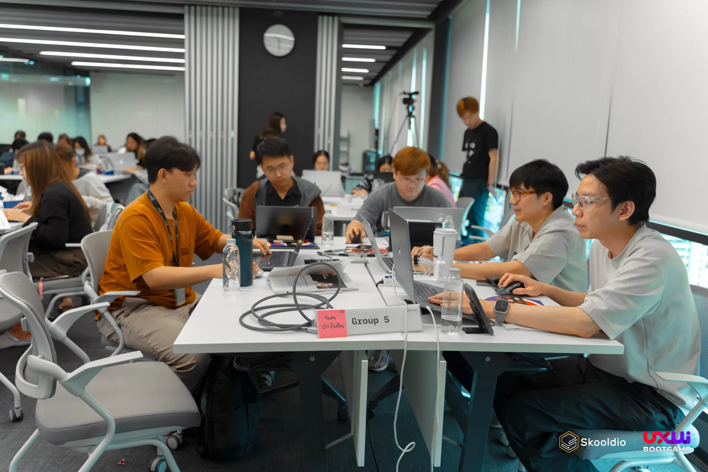

## Week 5: Design Systems

ในวีคนี้ส่วนใหญ่จะเป็นงานปฏิบัติครับ วันนี้พี่แบงค์มาสอนในเรื่องต่าง ๆ ของการทำ Design System ตั้งแต่ Basic ยันไปถึงเรื่องของ Figma Variables ซึ่งเป็น Feature ใหม่ของ Figma เลยครับ ในวีคนี้ Key หลัก ๆ ที่ได้จะเป็นประมาณนี้ครับ

- Auto Layout จริง ๆ แล้วหลักการจะเหมือนกับ Flex Box ที่ Developer ใช้เพื่อเขียนเว็บไซต์
- ถ้าเราลดความซับซ้อนของ Components แล้ว Dev จะไม่ต้องไปมโนวิธีการปั้น Components ใน Code เลย
- การทำ Components ให้ไปในทิศทางเดียวกัน เช่น การใช้ Variant หรือการใช้ Swap Instance ควรจะใช้เหมือน ๆ กัน จะทำให้เราทำงานกับทีมง่ายขึ้น
- ยังไม่ต้องรีบทำของให้เป็น Components มาก ให้ลองทำซัก 2-3 หน้าก่อน แล้วจะเริ่มเจอว่าของชิ้นนี้ซ้ำกันเยอะ ๆๆๆ และค่อยหยิบมาทำ Components
- Design System มีหลักการในการขึ้นหลายแบบ สุดแท้แล้วแต่ละทีม แต่เราควรมี System เพราะเป้าหมายของการทำ System คือการทำให้ทีมหาของเจอง่าย
- ช่วงแรก ๆ เวลาเราทำ Design ให้มาด้วยแนวคิดที่ว่า “เดี๋ยวของเราก็โดนรื้อ”
- ควรใช้ Figma Shortcuts เยอะ ๆ เพื่อลดการขยับข้อมือ (เพื่อลดอาการปวดข้อมือ)
- การทำสี พวก 100 200 มีหลายท่ามาก ๆ ไม่ว่าจะเป็นการปรับ Opacity, การใช้ HSL, หรือการใช้มาตรฐานใหม่อย่าง OKLCH
- เราสามารถใช้ Figma Variables เพื่อจัดการข้อมูลได้ทั้งสี การทำ Light Mode, Dark Mode และการออกแบบหลายภาษา (Internationalization; i18n)

Week นี้หลัก ๆ จะปฏิบัติเยอะมากกและเหนื่อยมากกกกกกกกก แต่ที่ชอบคือการมาด้วยแนวคิดที่ว่าเดี๋ยวของก็โดนรื้อครับ อย่ารีบใส่แรงในช่วงแรก ๆ ของการ Design ครับ

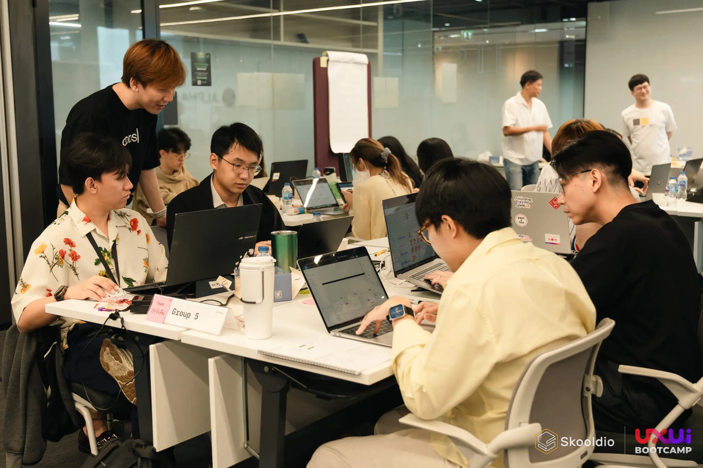
## Week 6: Lean UX

ในวีคนี้ได้เรียนกับพี่ชาญ Lead Design Consultant ที่ Thoughtworks ฮะ พี่ชาญมาเล่าว่าก่อนที่เราจะทำ Design Thinking ที่เป็น Double Diamond Space เนี่ย เราต้องเข้าใจเรื่องของ Vision ขององค์กรกับ Vision ของ Product และการวัดผลซึ่งเป็นขั้นตอนหลังจากทำ Design Thinking ฮะ ซึ่ง Key หลัก ๆ ของ Week นี้มีตามนี้ครับ

- การตั้ง Vision Statement ที่ดี คือต้องสามารถสร้างเป้าหมายร่วมกัน ทำได้จริง และวัดผลได้ ซึ่งในทีมต้องเห็นเป้าหมายเดียวกัน และ Vision ต้องไม่ Lock เราจนเกินไปและต้องไม่ใส่ Requirement ของ Product เข้าไปใน Vision ด้วย
- พอเราตั้ง Vision แล้ว เราก็จะมี Goal ที่ตอบรับ Vision นั้นและ Strategy ที่ตอบ Goal นั้น ๆ และจะลงไปถึง Initiatives ในการเริ่ม Strategy นั้น ๆ ขึ้นมา ซึ่ง Process ในการคิดของเหล่านี้ไม่ใช่เส้นตรง ค่อย ๆ Iterate ไปเรื่อย ๆ และเราควร Challenge Vision เราอยู่เสมอ ๆ
- เมื่อเรามี Strategy แล้ว เราก็ต้องมีการวัดผลว่า Strategy นั้น ตอบ Goal แค่ไหน ซึ่งสามารถวัดด้วย Metric ต่าง ๆ
- พี่ชาญแนะนำ Framework ตัวนึงที่ชื่อว่า Lean Value Tree ซึ่งช่วยจัดระเบียบความคิด แบ่งแยก Vision, Goal, Strategy และ Initiatives ออกจากกัน เพื่อให้เราเข้าใจและบรรลุจุดเป้าหมายต่าง ๆ ได้ ([สามารถอ่านเรื่อง LVT เพิ่มได้ที่นี่](https://www.thoughtworks.com/en-th/insights/blog/digital-transformation/how-to-brew-a-perfect-strategy-responsibly-part-one))
- Design Process ไม่ใช่ Perfect Double Diamond เราอาจจะต้องยืดบาง Part ออกซึ่งขึ้นกับโจทย์ที่เราได้รับว่าควรจะเน้นที่ Part ไหนของ Design Thinking (Empathy, Define, Ideate, Prototype & Test)
- เราควรที่จะทำ UX แบบ Lean นั่นคือ ทำน้อย ล้มไว และพัฒนาอย่างมีจุดหมายและยั่งยืน
- ใน Product Life Cycle นั้น เราอาจจะไม่ต้องทำ Product ก่อน แต่ให้เราไปเริ่มที่การ Discovery กับการทำ Proof Of Concept (POC) ก่อนว่ามีความสนใจในท้องตลาดแค่ไหน เมื่อ POC เสร็จและผลลัพธ์คือมีความสนใจเยอะ เราอาจจะลองทำ Minimum Viable Product (MVP) เพื่อนำไปลองตลาดจริงได้
- เวลาทีมเคลื่อนตัวไปนั้น ควรที่จะเคลื่อนตัวไปในทิศทางเดียวกันอย่างสมดุล ไม่งั้น Product จะไม่ขับเคลื่อนตาม
- เมื่อ Product ถึงจุด Decline (อาจจะไม่มีผู้ใช้งาน หรือด้วยความที่ไม่มีเงินทุนมาทำต่อแล้ว) บริษัทอาจจะต้องหา New S-Curve หรือความเป็นไปได้ใหม่ ๆ เพื่อจะกลับมาแข่งขันในตลาดอีกครั้ง
- การจะวัดผลของ Strategy ได้ เราต้องตั้งไม่ตั้ง Vanity Metrics (Metrics ที่ช่วยให้เรารู้สึกดี เช่น App มียอด Download 5 ล้านแต่จริง ๆ มี Monthly Active User แค่ 300) และต้องเป็น Actionable Metrics คือ Metrics ที่สามารถบอกได้ว่าเราจะพัฒนา Product เราต่อไปในทิศทางไหน

จริง ๆ มีอีกเยอะมาก แต่นิลกลัวจะสปอยเยอะเกิน 555555 เอาเป็นว่าวีคนี้สิ่งที่นิลชอบคือนอกจากการเข้าใจศาสตร์ของการ Design แล้ว เรายังต้องเข้าใจในมุมขององค์กรและการวัดผลอีกด้วย เป็นสิ่งที่นิลรู้สึกว่าว้าวมากเลยเพราะว่าเป็นการสอนที่บอกเราว่า นอกจาก Stakeholder และ User แล้ว เรายังต้องดูแลทีมของเราและเราควรจะมาร่วมกันไปในทิศทางเดียวกันเพื่อพาทุก ๆ ฝ่ายไปถึงเป้าหมายเดียวกัน

---
## Group Project

ระหว่าง 6 คลาสสุดตึงก็จะมีงานกลุ่มที่เราจะต้องไปทำในแต่ละอาทิตย์ครับ ซึ่งตอน Orientation เราจะได้โจทย์มาเพื่อไปทำ UX และ UI Process และนำมา Pitch กันในคลาสสุดท้ายครับ ซึ่งนิลสปอยโจทย์ไม่ได้แต่ว่ากลุ่มนิลได้โจทย์ที่หินมากฮะ ใครอยากรู้ว่านิลได้โจทย์อะไร [ดู Project “สุขี” ใน Landing Page ของ UXB ได้](https://landing.skooldio.com/ux-ui-bootcamp?utm_source=ninprd&utm_medium=organic) 5555555 ระหว่างทางเนี่ย เราก็ต้องไป Interview Stakeholder, Interview Users, ทำ UX Process ต่าง ๆ รวมทั้งได้ทำ UI Process ต่าง ๆ พวกการทำ Wireframe, High Fidelity Design, Design System, Prototyping เพื่อเอาไป Test กับ Users อีก รวมถึงได้ใช้ Figma Local Variables ในการลองทำแอปในรูปแบบ Dark Mode ด้วย (อันนี้เป็นโจทย์เสริมซึ่งทีมนิลก็สู้ด้วยไง ทำไปซะหมดเลย 555555) ซึ่งในระหว่างทางเราก็จะผ่านขั้นตอนเหล่านี้และผ่านการทำงานและตบตี (ถกกันเรื่องความคิดและไอเดีย) กับเพื่อนร่วมทีมจนสุดท้ายก็ผ่านพ้นไปด้วยดีครับ อย่างที่เขียนบอกไว้เลย ใน Project เราได้ทำอะไรเยอะมากและเราจะได้ทวนของเหล่านั้นในระหว่างการทำ Presentation ไปนำเสนอในคลาสสุดท้ายครับ นอกจากนั้น การได้ดูกลุ่มอื่น ๆ นำเสนอผลงานตัวเองก็ถือเป็นการได้ดูวิธีการทำงานและวิธีคิดของกลุ่มอื่น ๆ ด้วย เพื่อนร่วมรุ่นทุกกลุ่มคือสุดมากกก ถึงขนาดที่พี่แบงค์บอกว่ารุ่นนี้ใส่พลังกับ UXB เยอะมาก ปลาบปลื้มสุดด ภาพสรุปตอนจบนั้นคือการที่เราได้เข้าใจการทำงานในขาของ UX, UI และการทำงานเป็นทีมครับ
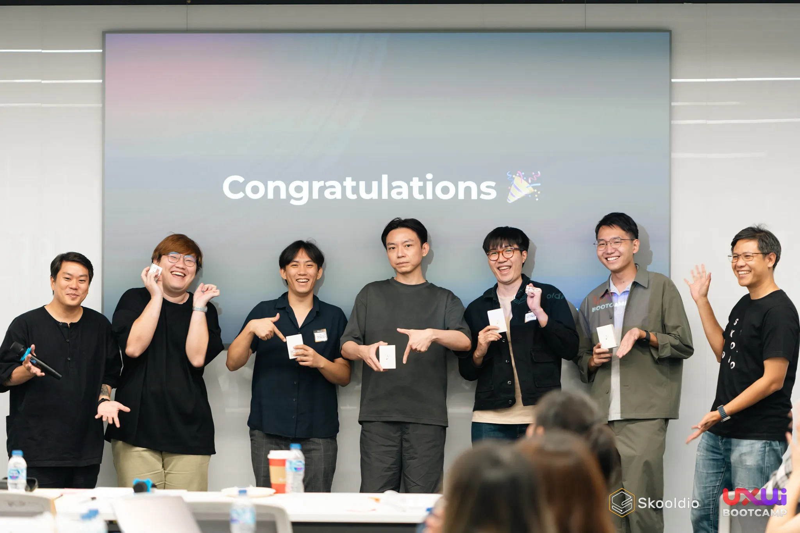
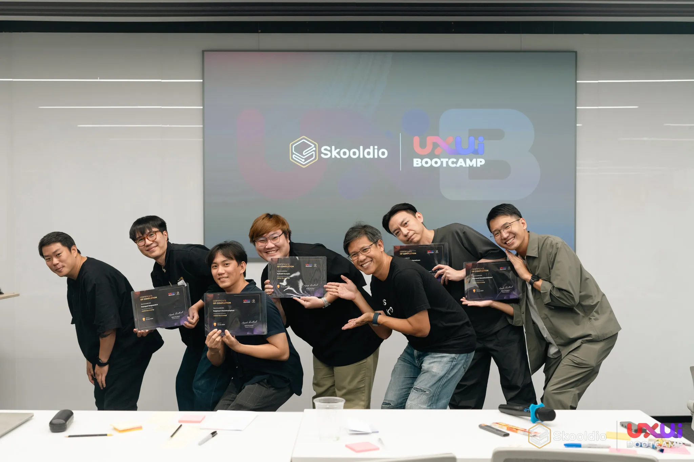

หลังจากจบในส่วนที่เราไปนำเสนองานกลุ่มกันจบแล้ว ก็มี Session Wrap-Up Bootcamp ครับ พี่แบงค์ก็มาทวนให้อีกรอบว่าเราผ่านอะไรกันมาบ้างในระยะเวลา 3 เดือนที่ผ่านมา ซึ่งภาพคร่าว ๆ ก็เป็นประมาณนี้ครับ

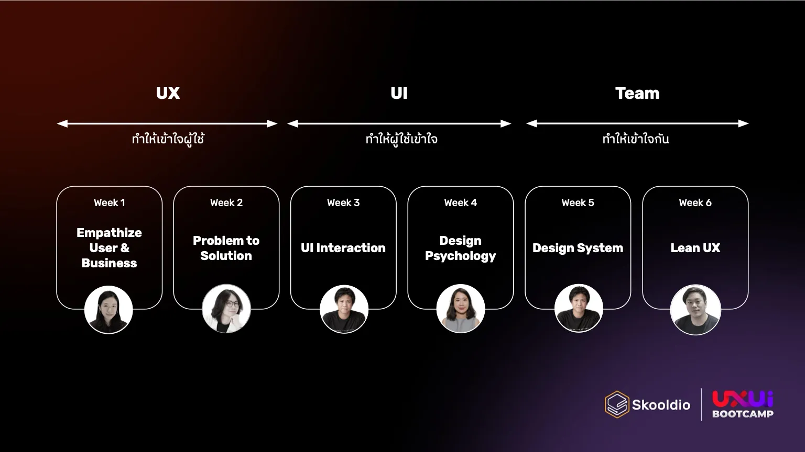

จากภาพนี้จะเห็นได้เลยว่า UXB นี่ค่อนข้างวางหลักสูตรมาให้เรียนไล่จากความเป็น UX มาทำ UI และเข้าใจการทำงานกับทีมมากขึ้นครับ หลังจากเรียนไปก็รับรู้ถึงความตั้งใจของ Program Director, Instructor, Facilitator และทีม Business Development ที่ร่วมกันสร้างบรรยากาศการเรียนรู้ให้กับคนเรียนทุกคนจริง ๆ (ขอบคุณทุกคนมา ณ ที่นี้คร้าบบ)

จบงานก็มี Party Networking ครับ นั่งคุยกับ Instructor ทั้งพี่แบงค์ พี่ชาญ แล้วก็คุยกับเพื่อน ๆ ร่วมรุ่นครับ ทุกคนเหมือนรู้จักกันมานานมากกก นั่งคุยนั่งดริ้งค์กันแบบสุดมาก 555555 ตอนท้าย ๆ นิลก็ได้คุยกับหลาย ๆ คนที่นิลไม่เคยได้คุยใน Bootcamp เลยด้วย ละตอนจบนิลก็ได้ถ่ายรูปกับพี่แบงค์มาด้วย นี่ถือว่า Complete ชีวิตประมาณนึงละ 5555555555

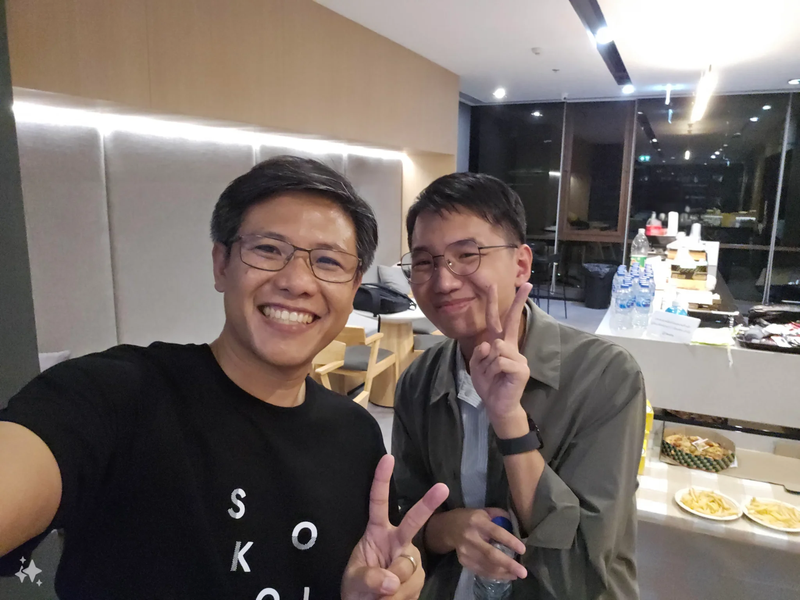

เอาล่ะ เวลาเราตั้งเป้าอะไร เราต้องมา Review ว่าการที่เราทำสิ่งนั้นมันตอบเป้าที่เราตั้งไว้ไหม นิลจะเอา Expectation ของนิลต่อ UXB ลงมาไล่ดูนะครับว่าการเรียนในครั้งนี้มันตอบโจทย์นิลไหม

### อยากเข้าใจ Design Process ทั้งหมด คือเรียนทฤษฎีแล้วไม่ได้ลงมือทำจริงมันแอบหลงทางนิดนึง

✅ อันนี้ได้เข้าใจและลงมือทำจริงเลยครับ อาจจะไม่ได้เข้าใจแบบถ่องแท้ขนาดนั้น แต่นิลรู้สึกว่ามันดีมาก ๆ ที่เราได้เห็นภาพจริงทั้งหมดและเข้าใจว่าเราทำแต่ละ Process เพื่ออะไร รวมทั้งการที่ได้เข้าใจว่า Design Process ไม่ใช่เส้นตรงด้วย อันนี้ชอบมาก ในฐานะเด็ก IE คนนึงส่วนใหญ่จะชอบมองของให้เป็น Linear Process และทำต่อไปเรื่อย ๆ แต่พอมาเรียน UX ปุ๊ป รู้สึกฝืนธรรมชาติของตัวเองพอตัว แต่ก็ได้มุมมองใหม่ ๆ มาเยอะเลย

### อยากเข้าใจว่าตอนที่ Dev ได้ Design มา มันแอบเอ้ะว่าแบบ ทำไมของชิ้นนี้ถึงมาแบบนี้นะ

✅ นิลคิดว่าอันนี้นิลได้เข้าใจมากขึ้นครับว่าบางทีเวลาเราไป Interview User มาแล้ว หรือตอนที่ไป Interview Stakeholder ทำให้ Designers เห็น Insights บางอย่างที่ Dev ไม่เห็น และออกแบบของออกมาแบบนั้น ซึ่งสิ่งนี้ถ้า Designers สามารถอธิบาย Dev ได้นิลคิดว่าจะเป็นเรื่องที่ดีมาก ๆ ครับ

### อยากจบงานด้วยตัวคนเดียวได้

✅ อันนี้นิลคิดว่าส่วนตัวนิลน่าจะทำไหวแล้วนะ 5555555 (ใครสนใจติดต่อจ้าง Design/Dev จ้างได้ครับ 🥺) แต่นิลมองอย่างงี้ครับ การที่เราจะพัฒนา Product อะไรแต่เราพัฒนาด้วยตัวคนเดียวเนี่ย สุดท้ายเราจะขาดมุมมองจากคนอื่น ๆ ซึ่งเวลาทำงานหลาย ๆ คนเราจะได้สิ่งนี้ครับ ทำให้นิลแอบคิดว่าสุดท้ายยังไงเราก็ควรจะทำงานเป็นทีมน่าจะเป็นตัวเลือกที่ดีกว่าครับ

### อยากเรียนสดกับพี่แบงค์ เอฟซีพี่แบงค์ครับ

✅✅ อันนี้ได้แบบเต็ม ๆ เลยครับ ได้ Wisdom จากพี่แบงค์มาตลอดเลย ขอบคุณพี่แบงค์ที่เป็นคนที่ทำให้นิลสนใจในเรื่องของ UX มากขึ้นครับ

ก็ถือว่าการที่นิลใช้เวลามาเรียนประมาณเกือบ ๆ 3 เดือนในรอบนี้ตอบโจทย์ของนิลทุกข้อเลยครับ เหนื่อยแต่สนุกมากกกก ซึ่งนี่เป็นแค่ส่วนหนึ่งของคลาสทั้งหมดกับประสบการณ์ที่จะได้รับครับ ยังไงถ้าใครสนใจดูรายละเอียดเพิ่มเติม สามารถไปดู Course Syllabus รุ่นใหม่ ๆ ได้ที่ [หน้าเว็บของ UX/UI Bootcamp By Skooldio](https://landing.skooldio.com/ux-ui-bootcamp?utm_source=ninprd&utm_medium=organic) ได้เลยครับ

ใครสนใจตัว Bootcamp นี้และอยากถามข้อมูลเพิ่มเติมจากนิลสามารถทักนิลมาทาง [LinkedIn: Peeranat Danaidusadeekul](https://www.linkedin.com/in/peeranatd/) ได้เลยนะครับ

ขอให้ทุกคนสนุกกับการเรียนรู้และการ Upskill ครับ

– นิล –