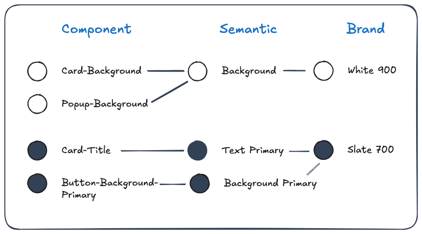

สวัสดีครับ วันนี้นิลได้มีโอกาสไปงาน SCBX Unleashing CX: EP3 Figma Bangkok Meetup มาครับ ซึ่งในงานก็มี Session ในฟังถึง 3 เรื่องเลย หัวข้อแรกพี่แบงค์มาพูดถึงเทคนิคและวิธีการจัดระเบียบ Design System ในสำหรับงาน Scale เล็ก กลาง ใหญ่ครับ หัวข้อที่ 2 อ.วิชัยจากเพจ Qwerty is a DUCK วันนี้อาจารย์มาแบ่งปัน Tools เพื่อเพิ่ม Quality of Life ให้กับชาว Design ครับ และ Session สุดท้าย พี่แบงค์ อ.วิชัย และคุณเอกจากเพจ UncleAke มาเปิดวงคุยเกี่ยวกับ Figma UI3 ว่ามันต่างจาก UI เก่ายังไงและเขาสูญเสียอะไรไปบ้างเพื่ออะไรครับ แต่ละหัวข้อจะเป็นยังไง ไปดูกั๊น
## Design System แบบพอดีคำ

พี่แบงค์บอกว่าหลาย ๆ องค์กรชอบทำ Design System แบบคำใหญ่เกิน (ทำเยอะเกินที่ตัวเองใช้) ทำให้รสชาติไม่อร่อยครับ หลัก ๆ แล้วเราควรออกแบบ Design System ตาม Cognitive Load ของ Project ไป ซึ่งถ้างานขนาดเล็ก เราก็อาจจะไม่จำเป็นจะต้องมี Design System จริงจังก็ได้ แค่วางของในหน้าเดียวกันก่อนก็ได้ ถ้างานใหญ่หน่อยก็อาจจะต้องทำจริงจังขึ้นมา

ซึ่งการจะวัดว่างานนั้นมีขนาดเท่าไหร่ พี่แบงค์บอกว่าเราจะใช้ปริมาณหน้ามาวัด ถ้าประมาณ 10 หน้าเราจะเรียกว่างานขนาดเล็ก ถ้าไม่เกิน 50 หน้า เราจะเรียกว่าขนาดกลาง และมากกว่า 100 หน้าก็จะเป็นขนาดใหญ่ครับ

เราจะแบ่ง Design System ออกเป็น 3 แบบตามจำนวนหน้าครับ แบบแรกประมาณ 10 หน้า แบบที่ 2 คือประมาณ 50 หน้าและสุดท้ายคือประมาณ 100 หน้าครับ ซึ่งแต่ละแบบก็จะมีการทำ Desing System ที่ต่างกันออกไปครับ ซึ่งเดี๋ยวจะถูกพูดถึงในลำดับถัด ๆ ไป

นอกเหนือจากเรื่องของการออกแบบตามขนาดแล้ว พี่แบงค์ยังให้ Component Guide เพิ่มเติมมาตามนี้ครับ

🌟 **วาง Component ใกล้กับที่ ๆ ใช้มันมากที่สุด**

ถ้าใช้ Component นั้นแค่ 1 ที่ให้วาง Component นั้น ๆ ไว้ข้าง Frame ที่ออกแบบเลย

ถ้าใช้ Component นั้นมากกว่า 1 ที่ให้วาง Component ใกล้ ๆ และครอบด้วย Frame เอาไว้

ถ้าใช้ Component นั้นมากกว่า 1 หน้าให้สร้าง Page: Component ใน Figma แล้วย้าย Component เราไปอยู่ในนั้น

เราสามารถใส่ Emoji ❖ (ชื่อของมันคือ Black Diamond Minus White X) นำหน้า page ของ component เพื่อให้หา page นั้นง่าย ๆ ด้วยครับ

ถ้าใช้ Component นั้นมากกว่า 1 Figma file: ให้แยกเป็น Figma component file และ import เข้ามา

🌟 **ใช้ชื่อให้สม่ำเสมอกันทั้ง Project**=

หลัก ๆ แล้วการทำ naming ของนั้นมีด้วยกัน 3 ระดับ

ระดับแรกสุดคือ Brand Color หรือใช้ชื่อของสี เช่น Slate 700, White 900 เป็นต้น

ระดับที่สองคือ Semantic Color หรือการระบุหน้าที่ของสีนั้น ๆ เช่น Text-Primary, Background-Primary, Background เป็นต้น

และระดับสุดท้ายคือ Component นั่นคือการเอาชื่อ Component มาระบุเข้าไป เช่น Card-Title, Card-Background เป็นต้น

ซึ่งหลัก ๆ จากข้อนี้คือให้เราเริ่มจากการค่อย ๆ กำหนด brand color ละไล่ไป semantic และค่อยไล่ไป component **อย่ารีบซับซ้อนโดยไม่จำเป็น**

Tips อีกข้อที่พี่แบงค์บอกมาคือ อย่าใช้ Hex Code ในการใส่สีใน Frame เด็ดขาด เพราะทำให้เราต้องตามแก้เยอะ ให้กำหนดสีเป็น Local Styles หรือ Variables เอาไว้

พี่แบงค์ฝาก plugin Figma ไว้อีกตัวครับชื่อว่า [Design Lint](https://www.figma.com/community/plugin/801195587640428208/design-lint) เอาไว้ช่วย detect ว่าตรงไหน เรามีการ hard code พวก Hex Code ไว้ หรือว่ามีการใช้ของไม่ถูก system

🌟 **ให้แต่ละ group มี component หลัก 7 ตัว**

ในข้อนี้พี่แบงค์บอกว่าเราสามารถใช้หลาย ๆ หลักการเพื่อเข้ามาช่วยเรื่องนี้ได้ เช่น Atomic Design เป็นต้น แต่มันก็อาจจะไม่ใช่วิธีที่ดีที่สุดสำหรับเราก็ได้ ลองนึกเวลาเรากอง component เอาไว้เยอะ ๆ แล้วเราต้องกลับมาหาของในกอง component นั้นอะ ยากอยู่นะ

ดังนั้นวิธีที่พี่แบงค์ทำก็คือ ค่อย ๆ ปั้น component มาเรื่อย ๆ และเมื่อของที่ใกล้เคียงกันครบ 7 อันเมื่อไหร่ให้ group มันแล้วตั้งชื่อให้พวกมัน ทำแบบนี้ไปเรื่อย ๆ เราจะหาของง่ายมากขึ้นเพราะ group นึงเราจะมีของไม่เกิน 7 อันและจะเป็น 7 อันที่เรา group ของใกล้ ๆ กันไว้

อีก Tips นึงจากพี่แบงค์คือใน group นึงเนี่ย ควรวางของในแนวเดียวกัน (แนวตั้ง/แนวนอน) เพื่อให้สามารถ scan หาของจากบนลงล่างหรือซ้ายไปขวาทางใดทางหนึ่งเท่านั้น

## Awesome ~~Plugins~~ Tools

ในหัวข้อนี้ อ.วิชัยบอกว่าตัวเองไม่ได้เป็น Designer เลยไม่ได้แนะนำ plugin Figma แหละ แต่มาแนะนำ tools ที่อาจจะทำให้คุณภาพชีวิตเหล่า Designer ดีขึ้นครับ จะมีตัวอะไรกันบ้าง ไปดูกันเลย

**🌟 Design Sidekick**

เพื่อน ๆ เคยเข้าไปหน้าเว็บไหนแล้วรู้สึกว่าถูกใจ อยากดูดสีมาใช้ไว ๆ ไหมครับ หรืออยากรู้ว่าเขาใช้้ Typography แบบไหน ถ้าเคยล่ะก็ ลองใช้่ Chrome Extension: Design Sidekick เป็นตัวช่วยดูสิครับ

ตัว extension นี้จะสามารถทำให้เราเห็น palette หลักของเว็บไซต์ รวมถึงสามารถดู typography style ต่าง ๆ ของหน้าเว็บไซต์นี้ทั้งหมดครับ นอกเหนือจากนั้นแล้วยังสามารถดู SEO Checklist ของหน้านั้น ๆ ได้อีกด้วย ช่วยในเรื่องของ SEO ได้อีก และยังไม่หมด ๆๆ ยังสามารถใช้แทนการกด Inspect ด้วย ทำให้ชีวิต Designer ไม่จำเป็นตัองเข้าไป inspect panel แบบชาว Developer แหละ

**🌟 SVG Globber**

ตัวนี้เป็น Chrome Extension ที่ใช้งานในดึง SVG ที่อยู่ในหน้านั้น ๆ ออกมาและสามารถแก้ไข ดัดแปลง เปลี่ยนขนาด icon รวมทั้งสามารถ copy ออกไปและ export เป็น svg หรือเป็น React code ได้เลย นอกจากนี้ tool ตัวนี้ยังสามารถสร้าง icon ที่เราไปดูดมาเป็น collection ได้อีกด้วย บอกเลยว่าโหดสุด ๆ

**🌟 Noise & Texture**

Plugin ตัวนี้เอาไว้สร้าง Noise หรือใส่ Texture ลงใน frame ต่าง ๆ โดย texture จะมีทั้งแบบภาพนิ่งและ animation ด้วยแหละ และ ๆๆๆ เราสามารถ export frame นั้น ๆ ออกมาเป็น iframe, React code, หรือเป็นรูปแบบ json ได้อีกด้วย โคตรเมพ

จบหัวข้อนี้พี่แบงค์มาเสริมว่า Figma ใช้ออกแบบ icon ได้ดี แต่อย่าใช้วาดรูป

## UI 3: What and Why?

หลัก ๆ ที่ได้จาก Session นี้คือ pain point ของ Figma ใน UI เก่าคือความไม่สม่ำเสมอของข้อมูลใน toolbar ด้านบน ทำให้ Figma เลือกจะย้าย menu ที่เคยเข้าถึงง่ายจากด้านบน เช่น Layer intersection, Create a new component เข้าไปซ่อนอยู่ทางขวามือให้หมด เพื่อให้ไม่ว่าจะ click ที่ layer แบบไหน behavior ก็จะสม่ำเสมอทั้งหมด ซึ่งปัญหานี้เกิดจากสิ่งที่เรียกว่า Information Architecture แหละครับ เนื่องจากเขาอยากได้ความสม่ำเสมอ ก็จะต้องมีบางอย่างที่ต้องสูญเสียและแลกมาครับ

กับอีกปัญหากวนใจของ toolbar ใน UI3 คือมันอยู่ด้านล่างครับ ซึ่งใน MacOS นั้น เวลาเราจะใช้ของใน toolbar เราจะต้องเอาเม้าส์ลากลงข้างล่าง ซึ่งสิ่งที่เกิดขึ้นคือเราจะไปโดน dock ขึ้นมาบังครับ ซึ่งคุณเอกกับพี่แบงค์ตั้งข้อสังเกตว่าที่เขาย้ายลงมาไว้ข้างล่าง เพราะน่าจะมาจาก FigJam ที่ไว้ toolbar ไว้ด้านล่างครับ ซึ่งข้อสรุปของทั้ง 2 คนคืออยากให้ย้าย toolbar ไปไว้ด้านบน (พี่แบงค์ฝากใครก็ได้ไปเปิดใน Figma Community หน่อยเดี๋ยวพี่แบงค์ไปตาม 555555)

สุดท้ายคุณเอกกับพี่แบงค์ก็บอกว่าถ้าใครรู้สึกว่าข้อที่เขากล่าวมา วิธีแก้ปัญหาเบื้องต้นก็จะเป็นการกลับไปใช้ UI เก่าก่อน เพื่อลดความสับสนและรอทาง Figma พัฒนา UI ใหม่ที่ดีขึ้นออกมาครับ

---

จบไปแล้วสำหรับ Blog สรุปงาน Figma Bangkok Meetup ครับ ขอบคุณงานดี ๆ จากพี่แบงค์ อ.เจมส์และก็คุณเอก รวมถึงทีมงานทุกคนเลยครับ สุดยอดมาก สุดท้ายถ้าใครอยากได้ slide สามารถไปโหลดได้ที่[โพสต์นี้ของเพจ Qwerty is a DUCK](https://www.facebook.com/share/p/BDvqtjyVfbL9NvFs/) เลยครับ นิลได้เจออ.เจมส์ละถ่ายรูปมาด้วย แค่นี้ก็คุ้มละครับ อิอิ วันนี้ลาไปก่อน สวัสดีครับ