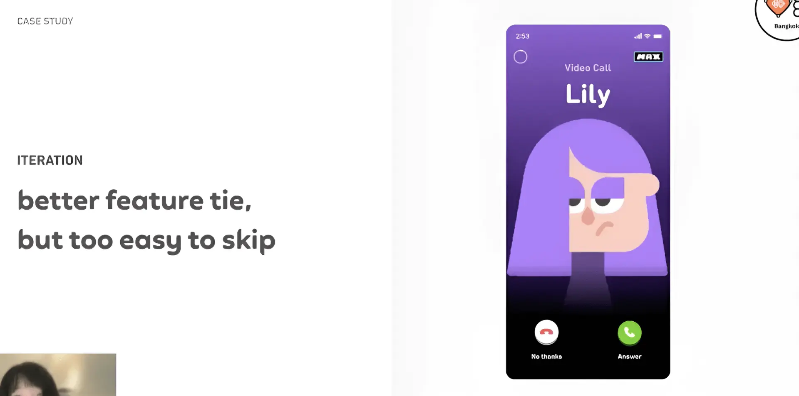
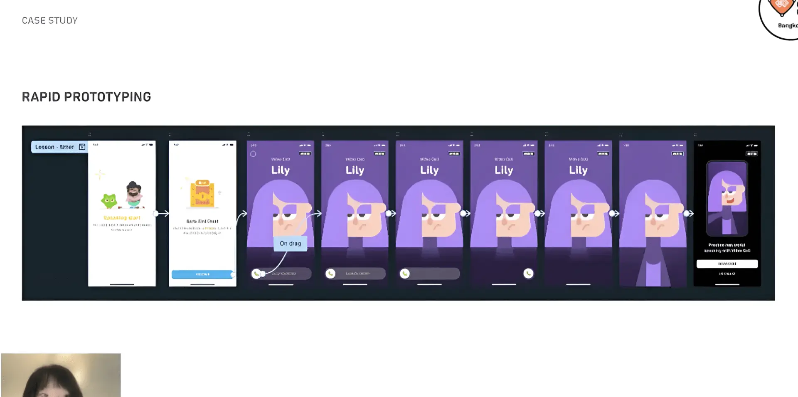

สวัสดีครับเมื่อ 3 วีคก่อนนิลได้ฟัง Live ของงาน Friends of Figma Bangkok มาครับ ละก็เพิ่งมีเวลามาเรียบเรียงเนื้อหาดี ๆ ซึ่งชื่อ Session คือ Monetizing AI Innovations โดย Speak คือคุณ Leah Lee, Product Designer จาก Duolingo ซึ่ง Leah จะมาเล่าการเดินทางของ Duolingo Max ซึ่งเป็น Feature ที่มีการเอา AI มาใช้งานด้วย จะเป็นยังไงไปดูกันครับ

## ประวัติของ Duolingo Max: AI Feature ของ Duolingo

ในอดีตทาง Duolingo ขาด Feature การฝึกพูดที่มีประสิทธิภาพ รวมทั้งการฝึกพูดยังเป็น Feature ที่ผู้เรียน Request เข้ามาเยอะมาก ในปี 2018 พวกเขาเลยสร้าง Feature ชื่อว่า "Duolingo Live" ซึ่งเป็น Feature ที่ทำให้ผู้เรียนได้คุยกับ Tutor จริง ๆ

หลังจากนั้นทีมก็เลือกจะ Discontinue เพราะว่าไปเจอ Insights ว่าคนที่เพิ่งเริ่มเรียนภาษาจะมีความกังวลที่จะคุยกับคนจริง ๆ รวมทั้งการที่ต้องใช้ Tutor เท่ากับจำนวนผู้เรียนก็ทำให้ธุรกิจนั้น ยากที่จะ Scale (ถ้ามีคนเรียน 20 ล้านคน = ต้องมี Tutor 20 ล้านคนด้วย)

ในปี 2022 Duolingo ได้ Early Access จาก GPT-4 และเริ่ม Ideate จนในปี 2023 เริ่มมีการ Role out Duolingo Max ซึ่งมี Feature Explain My Answer กับ Role Play ออกมาให้ใช้งาน ทำให้คนเรียนได้เจอบทสนทนาและได้ฝึกการพูดกับบทสนทนาจริง ๆ (แต่ยังไม่มีการตอบกลับมาจากตัวแอป)

ในช่วง Q2 ของ 2024 Duolingo เริ่มได้ Feedback มาว่า User ยังไม่สามารถตอบโจทย์การฝึกพูดคุยภาษาได้อย่างเต็มที่ ทีม Learning R&D เลยพัฒนา Feature Video Call ซึ่งถือเป็น Core Experience ของ Duolingo

และในช่วง Q2 ของ 2025 Video Call กลายเป็น Hero Feature ของ Duolingo Max เพราะมันแก้ปัญหาเรื่องการฝึกพูดที่มี User Request มาเยอะมากและสร้างรายได้ให้กับบริษัทอย่างมาก

## Design Principles for promoting AI feature

1. **AI itself isn't the value prop, the outcome is**: อย่าเน้นว่าฟีเจอร์นี้ "ใช้ AI" แต่เน้นว่าผู้ใช้จะได้อะไรจากมันจริง ๆ
2. **Design with Cost in Mind**: เพราะเบื้องหลังของ Duolingo Max มีการใช้ OpenAI ทำให้ต้องมาออกแบบว่าจะให้ผู้เรียนลองที่จะใช้ฟรีกี่ครั้งเพื่อให้คนเรียนได้รู้ว่าถ้าจ่ายเงินแล้วจะได้รับประสบการณ์แบบไหน
3. **Use relatable metaphors users instantly recognize**: ออกแบบให้ผู้ใช้เข้าใจง่าย โดยเปรียบเทียบกับสิ่งที่ผู้ใช้คุ้นเคยแล้ว เช่น ออกแบบ Feature Video Call ให้เหมือนกับการทำ Video Call ทั่วไป
4. **Brand it as a premium experience**: เน้นคุณภาพของ Artwork, สี, และ Special Effects ให้ดูดี มีความน่าดึงดูด เพื่อสร้างความรู้สึกว่าเป็นฟีเจอร์ระดับพรีเมียม
5. **Make it delightful and fun, not intimidating**: นำเสนอ Feature ในรูปแบบที่น่าสนใจ เช่นตัว Video Call ก็มีการวางอยู่ในด่านเป็นกล่องของขวัญพร้อม Animation น่ารัก ๆ ให้ลองใช้ฟรี
6. **Integrate the feature into core UX**: วาง Video Call ไว้ใน Tab ของฟีเจอร์ปกติ เพื่อให้ผู้ใช้เห็นชัดเจนว่าเมื่อจ่ายเงินแล้วจะได้อะไร

## Case Study

ในส่วน Case Study คุณ Leah จะมาเล่า Journey ของการ Promote Duolingo Max แบบ In Detail มากขึ้นครับ โดย Leah เริ่มเล่าว่า Goal ของเขาคือการทำ Promo ของ Video Call Feature เพื่อให้คนมาสมัคร Duolingo Max เยอะขึ้น โดยต้องแสดง Value ให้กับ Feature โดยไม่ใช้ Cost ด้าน AI เลย

จากโจทย์ Leah และทีมก็ได้ Brainstorm กันผ่าน FigJam และได้ Initial Design มาซึ่งได้รับ Feedback ว่ามัน Generic เกินไปและไม่ได้แสดง Value ของ Feature Video Call ขนาดนั้น

จากนั้น Leah เลยไป Research ต่อเกี่ยวกับหน้าจอเวลาที่มีคนโทรเข้ามาเพราะว่า User จะสนใจจอเมื่อเวลามีคนโทรเข้ามา นอกจากนี้ Leah ก็ยังไป Research มาต่ออีกว่าเราสามารถทำให้โฆษณาใน App สามารถคลิ๊กเล่นได้จริง (จากพวกโฆษณาเกมในมือถือ) ทำให้ Leah ออกแบบ Version ใหม่มาเป็นเหมือน Lily กำลังโทรเข้ามา

Iteration ถัดมาของ Video Call Promo

ใน Version นี้ Leah ได้รับ Feedback มาว่าทำ Feature Tie In ได้ดีขึ้น แต่ User สามารถ Skip ได้ง่าย ทำให้สุดท้าย Leah ออกแบบมาเป็นหน้าจอแบบ Slide to answer และเมื่อ Slide ไปก็จะเป็นหน้า Lily มาทักทายด้วยภาษาที่ผู้เรียนคนนั้น ๆ กำลังเรียนอยู่พร้อมบอกว่าจะได้อะไรบ้างเมื่อสมัคร Duolingo Max

Prototyping ของ Final Design ของ Video Call Promo

ซึ่ง Iteration สุดท้ายก็ผ่าน Product Review กับ CEO และเป็น Version ที่ปล่อยใช้งานใน App และ Promo อันนี้ก็ช่วย Drive ยอด Subscription ให้กับ Duolingo เป็นอย่างมาก

Leah ฝากเกี่ยวกับการใช้งาน AI ใน Product ไว้ว่า

> AI doesn't sell itself, it shines when presented the right way