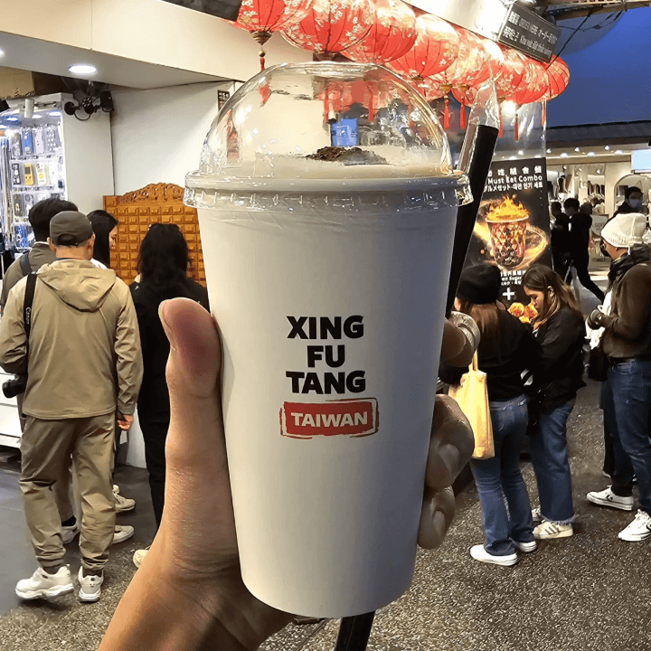
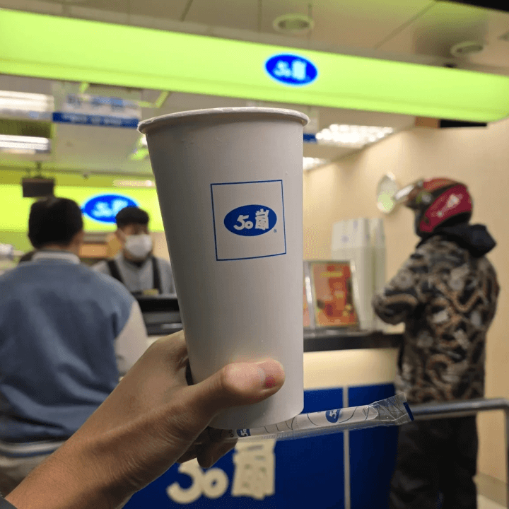
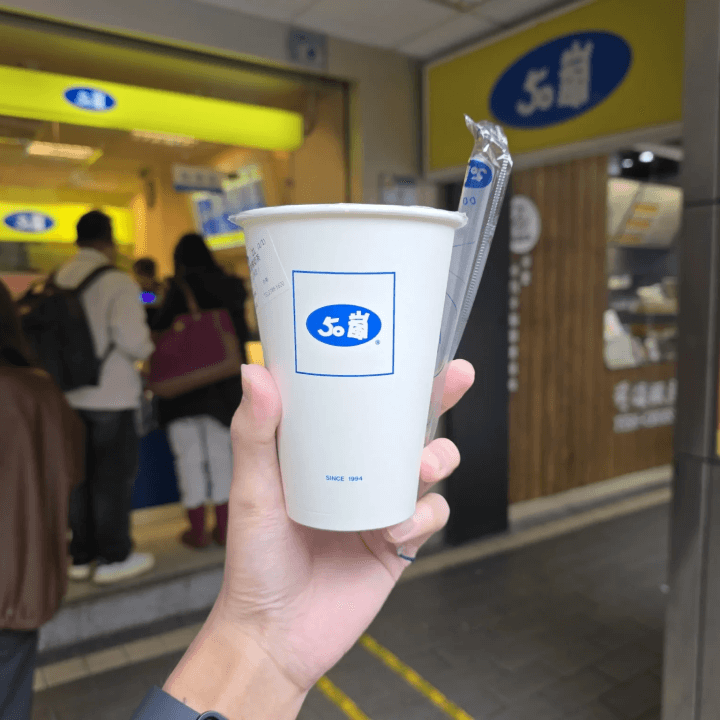
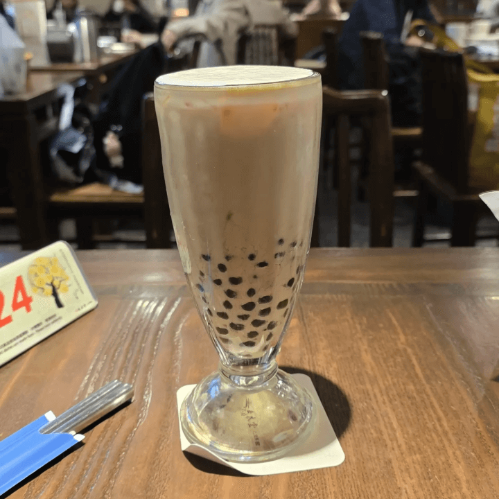

เอาล่ะ วีคที่ผ่านมานิลไปไต้หวันมาครับแล้วก็มีโอกาสได้ไปกินชานมร้านต่าง ๆ ตาม Guide หลาย ๆ ที่มา นิลเลยอยากจะเขียนร่องรอยประวัติศาสตร์เอาไว้นิดนึงครับ ในนี้จะเป็นความเห็นส่วนตัวของนิลเรื่องชานมนะครับ ส่วนตัวแล้วนิลชอบทานหวานครับ ใครเห็นต่างหรือคิดยังไง Comment บอกกันได้ครับ ส่วนการตามรอยของนิลจะเป็นยังไงไปดูกันเลยครับ

## 1. Xing Fu Tang

ร้านนี้เป็นร้านแรกที่ได้ลองเลยครับ นิลได้ไปลองที่บริเวณ Ximending Night Market ซึ่งตอนแรกที่อ่านมาดูเหมือนคิวจะยาวครับ แต่นิลน่าจะโชคดี ไปวันที่คนน้อยพอดี นิลลองตัวชานมที่เป็นตัว Best Seller ของเขาเลยครับซึ่งก็คือ “**Brown Sugar Milk Tea**” ครับ

รีวิวจากใจจริงนิลเลยคือรสชาติหวานกำลังดีแต่นิลแทบไม่ได้กลิ่นชาเลยครับ รู้สึกเหมือนนมล้วนมาก ๆ ตัดคะแนนตรงนี้แล้ว 1 ต่อไปส่วนของไข่มุก ตัวไข่มุกเป็นแบบลูกใหญ่ครับ ส่วนตัวนิลว่ามันนิ่มแปลก ๆ แต่ก็ไม่ได้นิ่มขนาดร้านถูก ๆ ในไทยนะครับ แต่ยังไงก็ดี รู้สึกว่ายังไม่โดน ผนวกกับ Layer ด้านบนที่นิลไม่มั่นใจว่ามันคืออะไร (แต่คล้าย ๆ ชีส) ซึ่งส่วนตัวแล้วนิลไม่ชอบอยู่แล้วครับ ดังนั้นการมาลองร้านนี้สำหรับนิลคือแอบผิดหวังนิดนึง แต่ยังไงก็ดี ถ้าใครชอบรสชาติหวานพอดี ไข่มุกไซส์ใหญ่และก็ Layer นัว ๆ ด้านบน ร้านนี้ก็เป็นตัวเลือกที่ดีครับ

ราคา: 120 NTD

สถานที่ตั้ง: [https://maps.app.goo.gl/eacg1f22xb497mcE9](https://maps.app.goo.gl/eacg1f22xb497mcE9)

## 2. 50 Lan

ร้านนี้เป็นร้านที่นิลเดิน ๆ อยู่แล้วก็เจอครับ นิลจำ Location ไม่ได้ละ แต่ว่าร้านนี้หาได้ตามทั่วไปเลยครับ คิวไม่ยาวด้วย นิลลองเป็นตัว OG ของเขาเลยครับ ตัว “**Milk Tea with Small & Large Bubble**” หวาน 100% Size M ครับ

สั่งครั้งแรกก็ได้ Content เลยครับ นิลสั่ง M แต่ว่าได้ L แค่นั้นยังไม่พอ สั่งใส่ไข่มุก แต่ไม่ได้ไข่มุก นี่โกรธมาก 😡 แต่โดยรวมนิลมองว่ารสและกลิ่นของชาค่อนข้างเบาครับ ทานง่ายดี แนะนำถ้ากินชาแบบไม่ใส่ไข่มุกกิน M ก็พอครับ L นี่แอบเยอะไปนิดนึง

ราคา: 50 NTD

## 3. 50 Lan (รอบ 2)

หลังจากไปทำการบ้านมา นิลเจอว่ามีร้านนี้เปิดอยู่แถว ๆ ที่พักที่นิลไปอยู่ครับ นิลเลยรีบพุ่งตัวไปกินเลยครับ รอบนี้นิลก็ซ้ำเมนูเดิมครับ “**Milk Tea with Small & Large Bubble**” หวาน 100% Size M ด้วยความคาดหวังว่ารอบนี้จะมีไข่มุกมาให้ 555555

รอบนี้ค่อนข้างกลมกล่อมมากขึ้นครับ อย่างที่บอกไปว่าตัวชาก็ค่อนข้างเบาและตัวนมก็โอเค โดยรวมแล้วก็คือทานง่ายมาก และที่ชอบอีกอย่างคือไข่มุก 2 ขนาดที่ผสมกันอยู่ มันมีความ Dynamic อยู่ข้างในอะ นิลรู้สึกว่ามันมีลูกเล่นมาก ชอบมากกก 55555

ราคา: 50 NTD

สถานที่ตั้ง: [https://maps.app.goo.gl/CRF1hwFzJVRPJRY16](https://maps.app.goo.gl/CRF1hwFzJVRPJRY16)

## 4. Chun Shui Tang

ร้านนี้เป็นร้านสุดท้ายที่ได้ลองเพราะว่านิลวันก่อนกลับนิลรู้สึกท้องไส้ไม่ค่อยดี ทำให้นิลเลือกที่จะไม่กินนมเข้าไปเร่งปฏิกิริยาเพิ่มครับ ถ้าเอาในเชิงประวัติศาสตร์นิดนึง ร้านนี้เป็นร้านต้นตำรับชานมของโลกเลยนะครับ ตัวนิลแอบมีความคาดหวังกับการกินชานมที่นี่อย่างมากครับ นิลสั่งตัว “**Pearl Milk Tea**” และแน่นอนครับ หวาน 100% ครับ

ส่วนตัวแอบผิดหวังเพราะมันไม่หวานเลย ตรง ๆ คือจืดเลยแหละครับ แต่ถ้าเอาในส่วนของชากับตัวไข่มุกนี่ดีเลยครับ ตัวชากับนมค่อนข้างเจ๋งแจ๋ว โคตรนัว ส่วนตัวไข่มุกก็มีความหนึบและไม่นิ่มเหมือนไข่มุกถูก ๆ ครับ รู้สึกว่ามีความมันความนัวที่ค่อนข้างดีเลย ยังไงใครมาไต้หวันก็แนะนำให้ลองครับ ด้วยประวัติศาสตร์เอย คุณภาพเอย นิลว่าโอเคเลยครับ

ราคา: 100 NTD (ยังไม่รวม VAT หรือ Service Charge อีก 10% นะ // นิลไม่ชัวร์ว่า VAT หรือ Service รู้แต่โดนเพิ่ม 10% ฮะ)

สถานที่ตั้ง: [https://maps.app.goo.gl/tgCaQcmgoTxyskEj7](https://maps.app.goo.gl/tgCaQcmgoTxyskEj7)

---

เย้ ๆ วันนี้มาเป็น Blogger สายท่องเที่ยวนิดนึงพอดีเพิ่งกลับจากไปเที่ยวมาครับ จริง ๆ แล้วยังขาดร้านชื่อดังอีกร้านนึงคือ Comebuy แหละ แต่พอท้องเสียไปวันนึงนิลก็ไม่กล้าไปกินเพิ่มเลยอดเลย สุดท้ายใครชอบหรือไม่ชอบอันไหนก็มาบอกกันได้นะครับ หรือใครไปตามรอยแล้วเป็นยังไงบ้างก็แชร์กันได้นะครับ นอกจาก Guide ชานมแล้วยังมี Content ท่องเที่ยวไต้หวันตามมาแน่นอน ติดตามกันได้เลยครับ

ขอให้อร่อยกับการกินชานมไข่มุก

– นิล –