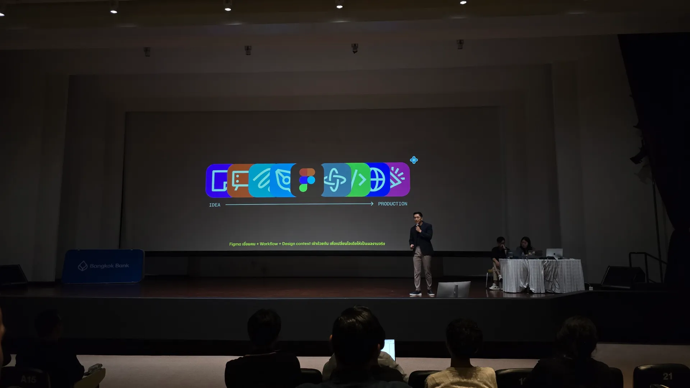
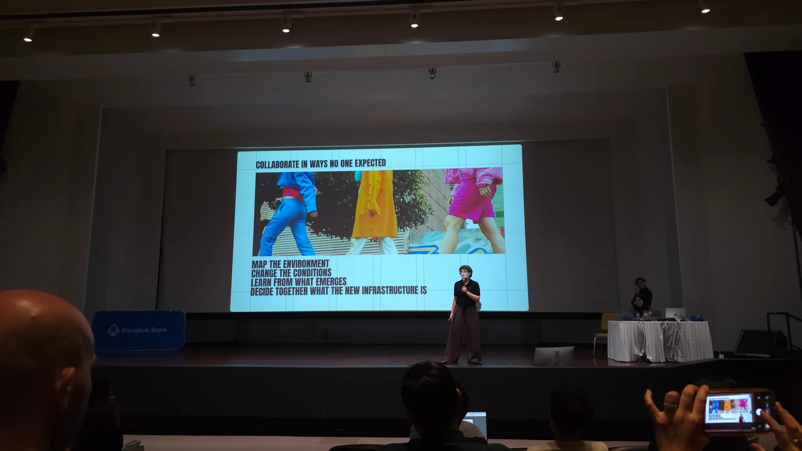
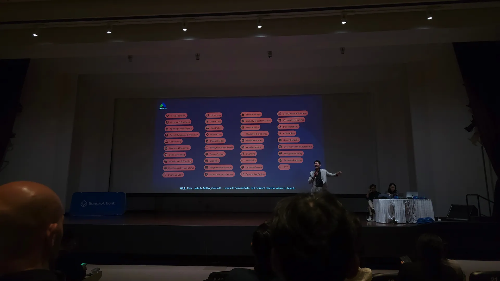
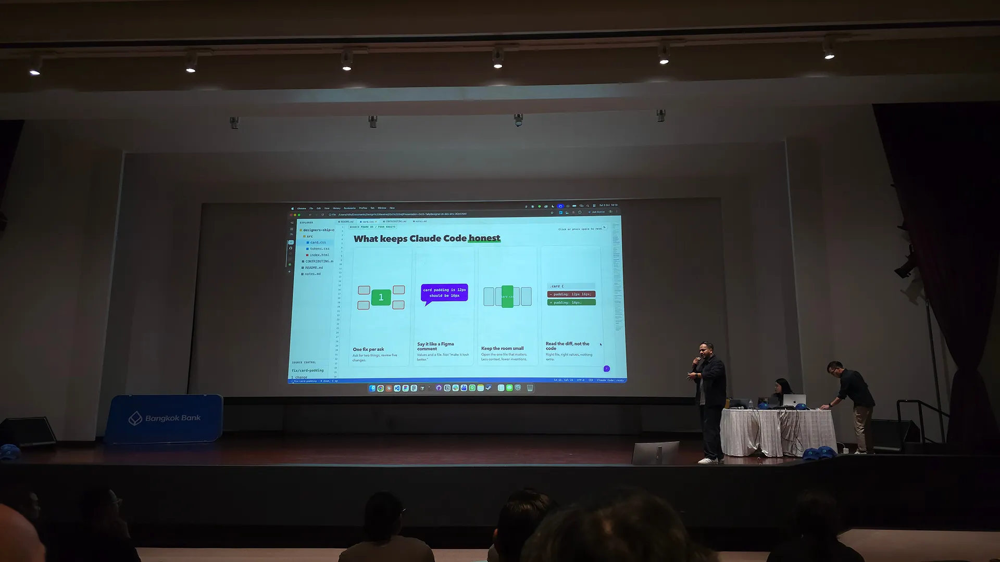
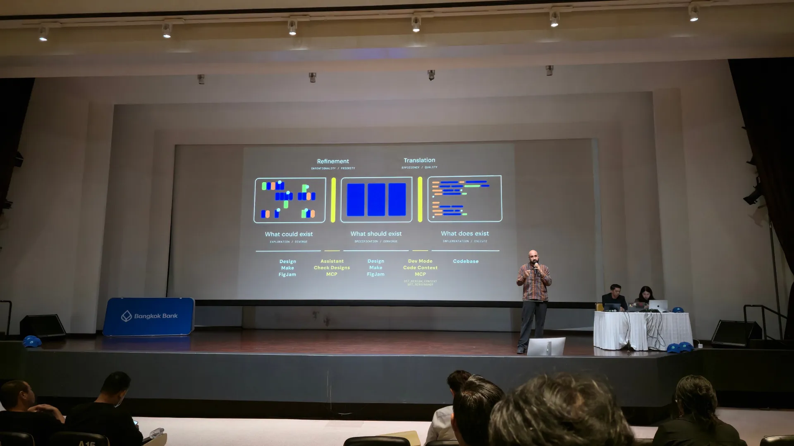

สวัสดีครับ เมื่อวันก่อน นิลไปงาน [Design to Code Bangkok 2026](https://luma.com/8a0i4q2f) มาครับ งานนี้จัดโดยธนาคารกรุงเทพร่วมกับ Figma เล่าถึงการเปลี่ยนแปลงของกระบวนการผลิตงาน design และการส่งมอบงานให้ developer รวมถึงประสบการณ์ของ designer แต่ละคนที่ลองเอา AI มาใช้ในงาน โดยแบ่งออกเป็น 5 sessions เดี๋ยวนิลพาไล่ไปทีละ session นะครับ

---
## Life Before Handoff

Session นี้ Carter Teng *Enterprise Lead Thailand, Figma (Singapore)* มาพูดถึงช่วงก่อน handoff หรือเส้นที่กั้นระหว่าง design กับ production ผ่าน 3 เรื่องครับ

**Speed: Design ไม่ใช่ preview แต่คือ spec**

ด้วยการมาของ AI ทุกคนทำงาน 80% แรกได้เร็ว แต่ไปเสียเวลาเยอะกับ 20% ที่เหลือ เพราะสิ่งที่ AI generate ออกมาเป็นแค่ preview ที่ไม่มี context เท่ากับเรา Carter บอกว่า design ไม่ใช่ preview แต่คือ spec และ spec ที่ดีคือ spec ที่ precise ซึ่งให้ทั้ง structure และ guardrail จนได้ output ที่ cohesive และมีประสิทธิภาพ

Design System ช่วยทั้งเรื่อง efficiency และ cost เพราะทำให้เราสื่อสารได้มากขึ้นโดยใช้พื้นที่น้อยลง และยิ่งเราให้ context ที่แม่นยำเท่าไหร่ agent ก็ยิ่งทำงานได้มากขึ้นและเขียน code ได้ดีขึ้นเท่านั้น

**Direction: ความเร็วที่ไร้ทิศทางอาจทำให้ทีมช้าลง**

พอเราทำงานได้มากขึ้น สิ่งที่ต้องหาให้เจอคือ direction ที่ถูก เพราะเป้าหมายจริง ๆ คือการ ship ของที่ถูก ซึ่งยากมาก ตอนนี้เราสร้างของได้เร็ว แต่มีใครถามไหมว่ามันคุ้มหรือเปล่า ความเร็วที่ไร้ทิศทางเลยอาจจะทำให้ทีมช้าลงแทนที่จะเร็วขึ้น

AI ช่วยให้เราสร้างของได้เร็วขึ้น แต่ไม่ได้ช่วยให้เราตัดสินใจได้ดีขึ้น การคิดตั้งแต่เริ่มต้นเป็นเรื่องที่เหนื่อย เพราะมันสร้าง friction ในการคิดกับเรา แต่คุ้มเหนื่อยเด้อ เพราะ friction นี่แหละที่จะช่วยเราให้หยุดแล้วคิด และสร้าง space for thought ให้เรา

**Differentiation: เราจะ stand out ในโลกที่ good enough ได้ยังไง**

AI มีแนวโน้มจะสร้างของที่มีความน่าจะเป็นสูง แปลว่าถ้าทุกคนใช้ AI ทุกคนก็จะได้ของที่อยู่กลาง ๆ bell curve เหมือน ๆ กัน เราเริ่มเปลี่ยนคำถามจาก "มีอะไรที่ดีกว่าอันนี้ไหม" เป็น "ในของที่ AI สร้างมา อันไหนดีบ้าง"

Carter เรียกสิ่งนี้ว่า **The Quiet Surrender** คือเมื่อ AI สร้างของที่ดีพอ เราก็หยุดอยู่ที่ดีพอ โดยไม่กระหายหาของที่ดีกว่าอีกต่อไป เราเองแหละที่ต้องกล้าที่จะ differentiate ด้วยการเริ่มถามว่ามีอะไรที่ดีกว่าที่ AI ให้เลือกไหม

ด้วยทั้งหมดที่กล่าวมานั้นนน ก็มาจบที่การขาย Figma นั่นเองครับ 55555555 ว่า Figma เนี่ยเป็น **"Full Stack creative canvas for software"** ที่ทำได้ตั้งแต่ ideation ถึง production และทำงานร่วมกับ AI agent ได้ด้วย 

Figma AI จะช่วยรับส่วนที่เป็น workflow ไป ส่วนเราก็โฟกัสกับ ideation และงาน craft ได้มากขึ้น แถม Figma ยังมี context งานของเราทั้งหมด ทำให้เราเห็นงานทั้งหมดของเราในที่เดียว

---
## AI Makes Us All Faster. Are We Using The Same Map?

Session นี้ Harriet Wakelam *Enterprise Design & Transformation Executive, former Head of Group Design, DBS Bank (Singapore)* เปิดด้วยคำถามว่า AI ทำให้การ execute ง่ายขึ้นจริงไหม คำตอบของเธอคือ AI ทำให้งานกลับมา fluid อีกครั้ง แต่การที่ทุกคนสร้างของได้เร็วขึ้นก็ทำให้เกิดปัญหาด้าน leadership ตามมา

ตอนนี้แต่ละคนใช้วิธีและ tool ที่หลากหลายในการส่งงาน ทำให้ไม่มี standard หรือพูดง่าย ๆ คือเราไม่มี system ร่วมกัน และถ้าเราไม่ลงไปคลุกกับทีม เราไม่มีทางรู้เลย

แล้วเราจะรู้ได้ยังไงว่าทีมมีงานที่ซ่อนอยู่ล่ะ Harriet ลองทำคล้าย ๆ กับ service blueprint ของการทำงานและการ handoff ระหว่าง designer กับ developer ดูครับ ถ้าดูผ่าน sprint card ทุกอย่างจะดูปกติ แต่พอดูผ่าน blueprint จะเห็น rework ที่ไม่เคยโผล่มาในการคุยงานปกติเลย

แทนที่จะส่ง requirement เป็นเอกสาร Harriet ใช้ prototype เป็น requirement แทน และจัด workshop 6 ชั่วโมงที่ทุกทีมเริ่มจาก prompt และ direction เดียวกัน แต่ละทีมทำสิ่งที่ตัวเองถนัดออกมา แล้วปล่อย learning ของตัวเองออกมา

พอทุกคนแชร์กัน ก็เกิด interaction ระหว่างทีมมากขึ้น และนำไปสู่ cross-team collaboration การให้ time และ space แบบนี้ไม่ใช่เพื่อให้ไปเร็วขึ้น แต่เพื่อค้นพบ capability ของทีม Harriet ชี้ให้เห็นว่าเรียนรู้คนเดียวก็ได้ แต่เรียนรู้เป็นทีมเราจะได้อะไรมากกว่าคนเดียวแน่ ๆ

ทุก product ในวันนี้คือ relationship system ทั้งระหว่างทีมที่สร้างมัน ลูกค้าที่ใช้ บริษัท และผู้ถือหุ้น และความสัมพันธ์เหล่านี้เปลี่ยนเร็วมาก ดังนั้นอย่าลืมที่จะสำรวจ relationship เหล่านี้ตลอดนะ

Harriet สรุปแนวทางทั้งหมดไว้เป็น 4 pillars ครับ 

| Pillar                              | ได้อะไร       | ความหมาย                                                                                    |
| ----------------------------------- | ------------- | ------------------------------------------------------------------------------------------- |
| Design leaders upstream             | Efficiency    | ให้ design leader เข้ามาตั้งแต่ตอนกำหนด direction ทีมจะได้ไม่เสียแรงทำของผิดแล้วต้อง rework |
| Shared requirements with prototypes | Effectiveness | ใช้ prototype เป็น requirement ทุกคนเห็นภาพเดียวกัน และสร้างของที่ถูกต้อง                   |
| Embed design end-to-end             | Validation    | designer อยู่ด้วยจนถึงตอน ship ไม่ใช่จบที่ handoff เพื่อเช็คว่าของที่ออกไปยังตรงกับ intent  |
| Build a shared toolset              | Possibility   | มี tool และ source ที่ใช้ร่วมกัน ทำให้ทีมลองทางเลือกใหม่ ๆ ได้โดยไม่หลุดจาก product intent  |

สรุปสั้น ๆ เลยคือ AI ทำให้เราเร็วขึ้นได้ ถ้าเราทุกคนใช้ map (system) เดียวกัน และเคลื่อนที่กันไปด้วย team interaction และ cross-team collaboration ที่ดีครับ

---
## Before you trust the AI

Session นี้พี่นอร์ท Narat Puhoi *Expert UX/UI Designer, AXONS (Thailand)* เกริ่นเกี่ยวกับ use case การใช้ AI ว่าตอนนี้ที่ Singapore เนี่ย AI เข้าไปแทรกซึมถึงวงการ trainer แล้วนะ โดยการเอา AI ไปต่อกับเครื่องเล่นใน fitness และเมื่อผู้ใช้ออกแรง ตัว AI ก็จะคำนวณให้ว่าเราจะต้องออกแรงเท่าไหร่เพื่อเล่นตาม program นั้น ๆ 

งานที่เราใช้ AI ช่วยบ่อย ๆ เช่น สรุป research หรือร่าง first draft ซึ่งหลักการคือ AI generates, human validates

บทบาทของ designer จึงค่อย ๆ เปลี่ยนไป จาก Pixel Perfect เป็น System Keeper และกำลังไปสู่ยุคที่ designer ต้องเป็น AI Orchestrator ที่มีหน้าที่หลักคือการตัดสินใจ พี่นอร์ทบอกว่าที่ AXONS ใช้กรอบคิดที่ชื่อว่า PACTS ไว้ ซึ่งมาจาก Principle, Architecture, Context, Tone, Standards

**P: Principle**

งาน design ที่สวยไม่ได้แปลว่าเป็นงาน design ที่ดี principle มีไว้เพื่อ support งาน design

**A: Architecture**

คือ foundation ของการประกอบกัน เรามี token และ components ให้ใช้อยู่แล้ว ก็ต้องใช้ให้เป็นและใช้ให้ถูก ซึ่งตอนนี้ Design System ไม่ได้มีไว้ให้แค่ designer กับ developer แต่ AI ก็ใช้ด้วย

**C: Context**

AI เก่งเรื่อง gen ของ แต่มันไม่รู้บริบทของเรา เช่น เรากำลังทำโปรเจคเกี่ยวกับธนาคาร แต่เจ้า AI ก็อาจจะไม่รู้ว่า project ธนาคารที่เราทำอยู่ต้องการความปลอดภัยของข้อมูลสูงแค่ไหน เราต้องเติมข้อมูลพวกนี้ให้ ทั้ง business context, regulation และ user segment ซึ่งตรงนี้ต้องใช้ wisdom เพราะการเลือกใช้คำมีผลกับความรู้สึกของผู้ใช้ AI เห็น flow ได้ แต่เราต้องเป็นคน approve

**T: Tone**

Content voice ต้องคำนึงถึง 8 ข้อ คือ brand voice, user emotion, context, clarity, consistency, empathy, inclusivity และ localization 

ตัวอย่างที่เห็นภาพชัดคือ correct grammar, wrong feeling เช่น "ธุรกรรมของคุณไม่สำเร็จ" ถูกหลักภาษา แต่เทียบกับ "การชำระเงินของคุณไม่สำเร็จ กรุณาลองใหม่อีกครั้ง" แล้ว แบบหลังไม่ทำให้ user รู้สึกตกใจมาก เมื่อเทียบกับแบบแรก

**S: Standards**

ได้แก่ accessibility (a11y), regulatory compliance, privacy, security, platform guidelines, content standards และ organization policy ซึ่งเราต้องเป็นคนกำหนด standard ไม่ใช่ AI

> key หลักของ session นี้คือสิ่งที่สำคัญที่สุดสำหรับ designer ในยุคนี้ไม่ใช่การสร้างของ หรือคอยแก้ของ pixel by pixel แล้ว แต่เป็นการตัดสินใจต่างหาก

---
## Can Designers Ship Code? An Ongoing Experiment

Session นี้ Ridin Dinesh *Product Designer, Design Systems & Design Engineering, Allianz Technology (Thailand)* มาเล่า story ของการเข้าถึง code ของ dev ให้ฟังครับ

เรื่องของเรื่องคือที่ที่ Ridin ทำงานอยู่เจอปัญหาเวลา handoff เนี่ย งาน Ridin จะหยุดที่งานฝั่ง design และ handoff ให้ dev ไป แต่พอขึ้น production จริง Ridin ดันเห็น visual bug เยอะมากซึ่ง Ridin ก็รู้สึกว่าพอเรามี AI แล้ว เราก็อยากช่วย dev จัง เลยขอสิทธิ์เข้าไปที่ code ของฝั่ง dev ครับ

ก้าวแรกคือต้องรู้จัก Git กับ GitHub ก่อน ซึ่งสองตัวนี้ไม่ใช่สิ่งเดียวกันนะครับ Git คือ tool บนเครื่องเราที่คอยเก็บ version ของ file ส่วน GitHub คือเว็บที่เก็บ project ไว้ให้ทุกคนทำงานจากที่เดียวกัน พร้อมระบบ review และ comment ส่วนที่นิลชอบคือ Ridin เทียบ workflow ของ GitHub กับสิ่งที่ designer ทำใน Figma อยู่แล้วครับ

| ใน Figma                          | ใน GitHub       |
| --------------------------------- | --------------- |
| Figma file                        | Repository      |
| Duplicate page เพื่อลองอะไรใหม่ ๆ | Branch          |
| ตั้งชื่อ version ใน history       | Commit          |
| ส่งงานให้ review พร้อม comment    | Pull request    |
| Publish ขึ้น team library         | Merge เข้า main |

หลักคิดเหมือนกันเลยคือ ทำบน copy ของเรา ให้คนอื่นช่วยดู แล้วค่อย publish แค่ canvas เปลี่ยนไปเท่านั้นเอง

โดยเพื่อนช่วยเขียน code ของ Ridin ก็คือ Claude Code นั่นเองครับ Ridin ก็ใช้ภาษาอังกฤษคุยกับ Claude ตรง ๆ เลยครับ ซึ่ง tips 4 ข้อที่ Ridin แนะนำมาคือ

1. **แก้ทีละอย่าง** (ถ้ามีบัคต้องแก้ 2 บัค ก็แยกเป็น 2 งานออกมา อย่าเอาไปรวมกัน)
2. **เขียน prompt เหมือน comment ใน Figma** บอกค่าและ file ให้ชัด เช่น "Card padding is 12px, should be 16px, in card.css" ไม่ใช่แค่ "ทำให้สวยขึ้นหน่อย"
3. **เปิดแค่ file ที่เกี่ยวข้อง** AI จะได้เอาแค่ไฟล์นั้น ๆ ไปใช้
4. **อ่าน diff ไม่ต้องอ่านทั้ง codebase** ดูแค่ว่าแก้ถูก file ถูกค่า และไม่มีอะไรเกินมา

ซึ่ง Ridin จะเข้าไปช่วยแก้ส่วนที่เป็นพวก visual bug กับพวก wording ให้ครับ ส่วนพวก logic ก็ให้ dev ทำเหมือนเดิม และ Ridin จะไม่แก้อะไรที่ตัวเองอธิบายไม่ได้ ซึ่งเป็นเหมือนการช่วยแบ่งเบางาน visual จาก dev แต่ไม่ไปทำเยอะเกินใน field ที่ตัวเองไม่ถนัดแหละ

Session ของ Ridin แจก slide ด้วยครับ แต่เป็น HTML ใน GitHub นะครับ สามารถ[ไป download กันได้ที่ GitHub นี้เลย](https://github.com/maxrid/Designers-In-Code)ครับ (slide Ridin เท่มากก แนะนำให้ลองไปส่องดูครับ)

---

## Life After Handoff

Session นี้ Aditya Muttur *Software Engineer, Figma (United States)* หนึ่งใน team พัฒนาตัว Figma MCP ซึ่งเขาก็จะมาเล่าให้ฟังว่าหลังจากที่ designer handoff ไปแล้ว ตัว design จะถูกแปลงไปเป็น production code ได้ยังไง

ก่อนจะไปต่อ เผื่อมีคนยังไม่รู้จัก MCP ครับ ขออธิบายนิดนึง MCP (Model Context Protocol) เป็นเหมือนตัวกลางที่ทำให้ AI คุยกับเครื่องมือต่าง ๆ ได้รู้เรื่องครับ เช่น MCP ของ Figma ก็จะเป็นตัวกลางที่ทำให้ AI คุยกับ Figma รู้เรื่องครับ

Aditya เชื่อว่าในยุคที่เรามี AI แล้ว การ ship ของผิดง่ายกว่าการ ship code ที่ผิดครับ และแม้แต่การเอา feature ที่ไม่ควรมีออกไปก็ยังใช้เวลาและแรงเยอะมาก สิ่งสำคัญในยุคนี้จึงเป็นการชัดเจนว่าเราจะทำอะไร และสิ่งที่ทำมันคุ้มไหม

ซึ่งใน process ปกติเนี่ย เราก็จะ draft requirement ใน FigJam board หรือไป prototype ใน Figma Make จากนั้นเราจะ refine เพื่อคัดให้เหลือของที่ควรทำลงใน Figma Design File หรืออาจจะเป็น Figma Make ก็ได้เนอะ และสุดท้ายค่อย translate สิ่งนี้ลงไปเป็น code อีกทีครับ

เพราะ session นี้เน้นการทำของใช้จริง Aditya เลยโฟกัสที่การแปลง design หรือ prototype ไปเป็น production code ซึ่งในยุคที่ AI ช่วยเขียน code สิ่งสำคัญที่สุดคือการให้ context กับ AI ให้ครบ และสิ่งที่ Figma มีมาเติมตรงนี้ก็คือ Figma MCP ครับ

Figma MCP เป็น tool ที่ทำให้เราสามารถให้พวก AI tool ต่าง ๆ เช่น Claude Code, Codex, Cursor เข้ามาอ่าน context ต่าง ๆ จาก file Figma และนำไปสร้างเป็น code จริงได้ครับ ซึ่งจะทำให้เราสามารถเปลี่ยน design context เป็น code โดยง่ายเพราะนอกจากอ่านพวก design แล้ว ตัว Figma MCP ยังอ่านพวก annotation ใน dev mode ไปด้วย

นอกจาก Figma MCP แล้ว ก็ยังมี Code Connect ที่เป็น feature ที่ใช้ connect component ใน Figma กับใน codebase ของ developer ได้เลยครับ ซึ่งหลักการก็คือเราจะบอกเลยว่า component ตัวนี้ใน Figma คือ file ไหนใน code ครับ ทำให้ AI รู้ว่าควรใช้ component ไหนที่มีอยู่แล้วใน codebase แทนที่จะเขียนขึ้นมาใหม่ และพลาดน้อยลงมาก

---
## สรุปงาน Design to Code — Bangkok 2026

สรุปสั้น ๆ รวม ๆ กันทุก session ครับ

- AI ช่วยให้เราสร้างของได้เร็วขึ้น แต่ไม่ได้ช่วยให้เราตัดสินใจได้ดีขึ้น การเลือก direction ที่ถูกยังเป็นงานของคน (designer)
- ยิ่งเราให้ context ที่แม่นยำกับ AI มากเท่าไหร่ (Design System, spec, business context) AI ก็ยิ่งทำงานได้ดีขึ้น
- พอทุกคนเร็วขึ้น ทีมต้องมี system ที่ใช้ร่วมกัน ไม่อย่างนั้นความเร็วจะกลายเป็น rework ที่ไม่มีใครเห็น
- เส้นแบ่งระหว่าง design กับ code เริ่มบางลง ทั้งจาก designer ที่เข้าไปแก้ code เองและ tool อย่าง Figma MCP แต่การรู้ขอบเขตของตัวเองยังสำคัญเสมอ

ในฐานะที่นิลเป็น Software Engineer ที่ไปฟัง นิลแอบรู้สึกตื่นเต้นที่ฝั่ง UX/UI Designer เริ่มมีการมาขอ developer เข้า repo แล้ว 555555 มิติใหม่มากก และก็ตื่นเต้นที่ตอนนี้ state ฝั่ง Designer กำลังเริ่มใช้ AI กันมากขึ้นละ เดี๋ยวอนาคตน่าจะต้องเริ่มคุยเรื่อง optimize กันจริงจังมากขึ้นละแหละะ

งานนี้ถ้าให้นิลเลือก session ที่ชอบหนึ่ง session นิลเลือกของ Ridin ครับ (คนอื่นอย่าน้อยใจน้าาา) ด้วยวิธีการเล่าเรื่องการขอเข้า code ของเขาด้วย slide ที่ทำ UI คล้าย ๆ Figma แล้วก็มาเปลี่ยนเป็น slide ที่ UI ที่คล้าย ๆ VS Code ถือว่าการเล่าเรื่องนี่ดีมาก แถมมี live demo ด้วย ละก็สำเร็จด้วย ถือว่ากล้ามาก เก่งมากครับ ปรบมืออ

ซึ่งในงานก็มีแจก lucky draw ด้วย แต่แน่นอนว่าดวงแบบนิลนั้นนนน ไม่ได้อยู่แล้วครับ 555555 ขนาดเขาแจกของ 80 ชิ้น คนมา 240 คน นิลยังไม่ได้ของเลยยย TT (ชีวิตชั้นไม่เหมาะกับ lucky draw สินะ) 

ขอบคุณธนาคารกรุงเทพและ Figma มาก ๆ ครับสำหรับกิจกรรมที่ดีและฟรีแบบนี้ รอบหน้าไม่พลาด lucky draw หรอก เจอแน่ 😎

นิล
