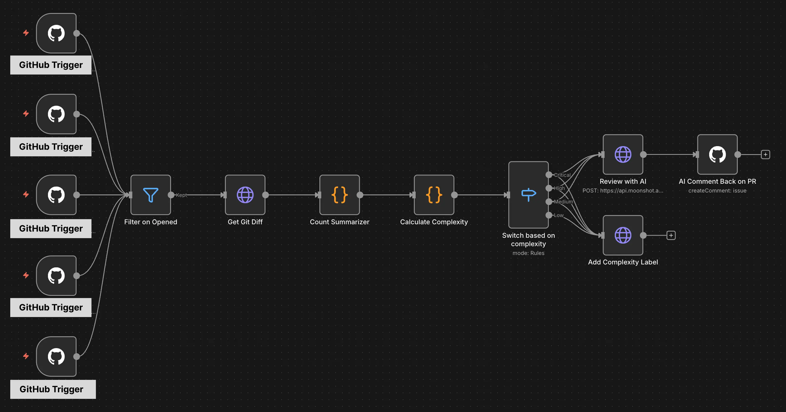

สวัสดีครับ ช่วงนี้นิลกำลังเจอปัญหาเกี่ยวกับ PR Size กลาง - ใหญ่หลาย ๆ อันเข้ามาใน Sprint ครับ และนิลยังติดอยู่ใน Loop เก่ามั้งครับ ที่ Code จำนวนมากกำลังหลั่งไหลมาให้นิล Review ซึ่งใน Sprint ที่แล้วนิลก็ Review ไปเยอะมากเลยครับ ช่วงวันอาทิตย์นิลว่าง ๆ เลยนั่งคิดดูครับว่าจะแก้ปัญหานี้ยังไงดี

## Crack ปัญหากันก่อนจะ Hack

ปัญหาของนิลตอนนี้คือ 

1. ในทีมเปิด PR ขนาดกลางกับใหญ่มาเยอะ ทำให้นิลใช้เวลา Review เยอะ แต่จริง ๆ แล้วนิลไม่ได้มีเวลาเยอะขนาดนั้นในการ Review เพราะยังต้องรับผิดชอบของใน Sprint อยู่
2. มุมมองของนิลคือ การเปิด PR ขนาดใหญ่ ทำให้เหนื่อยคนที่ต้อง Review และเพิ่ม Cognitive Load ให้กับ Reviewer โดยไม่จำเป็น

ซึ่งตัวนิลเองมี Condition เหล่านี้อยู่ครับ

1. ช่วงนี้ทีมอยู่ใน Priority mode ที่โฟกัสเรื่อง Delivery ก่อนเป็นหลัก Code Quality/Code Review อาจจะเป็นเรื่องรอง
2. แต่ทั้งนี้ทั้งนั้น นิลต้องรับรู้ว่า Code ที่น้องในทีมเพิ่มเข้ามา สร้าง Impact อะไรให้กับระบบหรือมีกระทบ Business Logic อะไรบ้าง
3. นิลไม่มีสิทธิ์ในการ Add Custom App เข้า GitHub บริษัท แปลว่านิลไม่สามารถเพิ่มพวก Claude App ในบริษัทได้

## แล้วนิลทำอะไรเพื่อแก้ปัญหาล่ะ

ในมุมนิลสิ่งนี้ดูสามารถแก้ได้ที่หลายจุดครับ นิลมองในแง่ที่ง่ายที่สุดก่อนคือการแก้ให้กับตัวเองก่อนซึ่งนิลก็คิดว่าถ้าสร้าง Workflow อันนึง ให้ AI Model ไปอ่าน git diff จาก PR แล้วก็ช่วยสรุปส่วนที่สำคัญและ Business Logic ที่มันทำ รวมถึง Impact/Possible Flaws ของ Code ที่เอาเข้าไป โดยให้มันสรุปสั้น ๆ และ Sacrifice Grammar ทิ้งไป ถ้ามันไม่มีอะไรที่น่าเป็นห่วง นิลก็สามารถที่จะ Accept PR บางอันไปด้วยความไม่ต้องไปอ่าน Code ทั้งหมดแล้ว Prompt ที่นิลเขียนไปก็ประมาณนี้ครับ

```md
You are a senior software engineer reviewing a PR for the engineering team.

The user will provide the git diff and PR complexity metadata.

Always structure your response in this exact format:

## Summary
What this PR does in 2-3 sentences.

## Files Changed
Key files and their roles. Be extremely concise.

## System Impact
Which system components are affected and how.

## Risk Areas
Potential breaking changes or side effects. If none, say "None identified."

## Suggested Focus
Where reviewers should pay most attention.

Sacrifice grammar for the sake of concision. Use bullet points, not paragraphs.
```

อีกส่วนนึง นิลยังเชื่อในมุม Engineering Practice ครับว่า Pull Request ไม่ควรใหญ่หรือซับซ้อนเกินไปเพื่อให้มนุษย์ทุกคนในทีมสามารถทำงานร่วมกันอย่างง่ายดาย นิลเลยมองว่านิลอยากเพิ่ม Label ใน Pull Request ว่า Pull Request นี้ซับช้อนแค่ไหน ซึ่งสูตรในการคำนวณเนี่ย นิลก็ขอยืมมาจากของ Atlassian ที่ใช้ในงาน Developer Productivity Engineering 2024 นะครับ ซึ่งเขาก็มีการ[คำนวณสูตรคร่าว ๆ จากใน Repository นี้แหละครับ](https://bitbucket.org/atlassian/forge-bitbucket-pr-complexity-score/src/main/src/prComplexity.ts)

ทีนี้นิลก็เอาสูตรมาดัดแปลงต่อเพื่อให้เข้ากับน้อง ๆ ในทีมมากขึ้นครับ นิลกลับไปนั่งใน Get Git Diff มาเพื่อเช็คว่าโดยเฉลี่ยแล้วทีมนิลจะเปิด Pull Request มาประมาณไหน ซึ่งนิลก็ปรึกษาเจ้า Claude เพื่อให้ได้สูตรคำนวณออกมาครับ ซึ่งเราก็จะได้สูตรตามนี้
$$\Sigma Score=0.4×Score_{LoC}​+0.6×Score_{File}$$​

หลัก ๆ แล้วในมุมของ Atlassian ค่า Complexity ของ Pull Request นั้นขึ้นอยู่กับจำนวนบรรทัด (LoC) กับจำนวนไฟล์ (File) ที่มีการแก้ไขภายใน PR นั้น ๆ ครับ (จริง ๆ ของต้นทางเขาจะเอาบรรทัด Comment ที่เพิ่มมาคิดด้วยนะ แต่นิลขอถอดความวุ่นวายนั้นออกไปก่อน) และนิลก็ได้เพิ่มส่วนการถ่วงเฉลี่ยเพราะการที่แก้ไฟล์เยอะ แปลว่า 1 PR เราอาจจะเจอ Context เยอะมาก นิลเลยถ่วงฝั่ง File เยอะกว่านิดนึง (เพื่อการทดลอง)

ซึ่ง ๆ จาก Complexity ตรงนี้นิลมองว่ามันสามารถเข้าไป Integrate เข้ากับ GitHub ได้เพื่อติด Label ไว้ว่า Pull Request นี้ขนาดเท่าไหร่ ซึ่งถ้าใครในทีม (รวมถึงนิลด้วยนะ) เปิด PR ขนาด High/Critical มาบ่อย ๆ เนี่ย นิลว่าเราน่าจะต้องคุยกันแล้วแหละ 👀 555555555555 แค่อยากให้เราทำงานกันง่ายขึ้นนะ 🥹

## เอาล่ะ Crack เสร็จแล้ว ก็เข้าสู่ช่วง Hack Weekend

อย่างแรกนิลมานั่งคิด Flow เล่น ๆ ครับ นิลคิดว่า Flow มันน่าจะเป็นแบบนี้นะ
```md
0. (Trigger): เมื่อมีคนเปิด PR มา / Rebase Branch
1. ดึงข้อมูล `git diff`
2. คำนวณความซับซ้อน (Pull Request Complexity Calculation)
3. ติด Label ใน GitHub
4. ส่งไปให้ AI สรุป
5. เอาสรุปจาก AI มา Comment กลับใน GitHub
```


ซึ่งนิลก็กลับมาคิดอีกทีว่า ถ้า PR เล็ก ๆ แล้ว นิลก็ไม่ต้องพึ่ง AI นี่นา นิลก็เลยคิดว่านิลจะส่งให้ AI ต่อเมื่อ PR นั้นขนาดกลางขึ้นไป นั่นคือ Complexity มากกว่า 300 ครับ ซึ่งน่าจะช่วยลดค่าใช้จ่ายให้นิลได้

ในส่วนต่อไปหลังจากนิล List แล้วว่ามันมีขั้นตอนอะไรบ้างนิลก็จะมาดูที่ Tools ครับว่านิลจะใช้อะไรเพื่อตอบโจทย์บ้าง

```md
0. (Trigger): เมื่อมีคนเปิด PR มา / Rebase Branch -> GitHub Webhook
1. ดึงข้อมูล `git diff` -> GitHub API
2. คำนวณความซับซ้อน (Complexity Calculation) -> Code
3. ติด Label ใน GitHub -> GitHub API
4. ส่งไปให้ AI สรุป -> ???
5. เอาสรุปจาก AI มา Comment กลับใน GitHub -> GitHub API
```

จะเห็นว่านิลยัง Question Mark กับ AI นะครับเพราะ AI ในตลาดเนี่ยก็มีหลายเจ้ามาก นิลก็ไม่รู้ว่าเจ้าไหนเนี่ย Review Code ได้ดีมั่ง ซึ่งช่วงนี้นิลเจอ Post Facebook หลายอันเกี่ยวกับเจ้า Kimi K2.5 ว่าเก่งด้าน Coding แบบเทียบ ๆ Claude ในราคาที่ถูกกว่ามาก ทำให้นิลสนใจที่จะใช้เจ้า Kimi K2.5 กับ Project นี้มาก (เพราะหนูจน หนูไม่มีตังค์ 555555555)

ส่วนตัว Platform ที่นิลจะใช้ Run workflow นี้ก็แน่นอนว่าต้องเป็น n8n คนดีคนเดิม 555555 นิลมองว่าไหน ๆ นิลมี n8n ที่เคยตั้งค่าพวก GitHub Credentials ไว้แล้ว นิลก็ทำใน n8n ไปเลยละกัน ซึ่งพอทำเสร็จแล้วนิลก็จะได้ Workflow หน้าตาประมาณนี้ครับ



ซึ่งนิลใช้เวลาประมาณ 3 ชั่วโมงกับ Flow ทั้งหมดนี้แหละ ซึ่งโดยคร่าว ๆ นิลมองว่าตอนนี้มันน่าจะช่วยนิลได้แหละ เดี๋ยวผ่านไปอีกซักพักนิลจะเอาผลลัพธ์มาเล่าให้ฟังว่ามันช่วยแก้ปัญหาให้นิลไหม 5555555

## Learning หลังลองไป 2 วัน

นิลเอา Workflow นี้ไปลอง 2 วันครับ โดยวันแรกลองใช้ Kimi K2.5 และวันที่ 2 ลองใช้ Claude Sonnet 4.6 ดูเพื่ออยากลองเปรียบเทียบผลลัพธ์ ซึ่งนิลได้ Learning แบบนี้กลับมาครับ

1. การออกแบบ Prompt ของ AI Agent `!==` การออกแบบ Prompt ของ Code Reviewer Agent: ปกติแล้ว เวลาเราเขียน Prompt คุยกับพวก AI Agent ที่อยู่ใน Code Editor หรือ Terminal เราจะก็คุยแค่สิ่งที่อยากได้ แต่เรื่อง Structure ของ Repo เนี่ย มันจะเข้ามาอ่านเองเนอะ แต่ Code Review Agent ที่นิลออกแบบมามันไม่ได้ทำงานงั้นอ่า มันเอาแค่ Git Diff ไปวิเคราะห์เลย แปลว่ามันไม่รู้ Context เลยว่า Repo นี้ทำอะไร มันก็จะสรุปกลับมาแบบที่มันเข้าใจอะคับ (ซึ่งอาจจะถูกหรือไม่ถูกก็ได้)
2. ควรตั้งสติตอนออกแบบ Workflow: จากที่เห็น Workflow จะเห็นว่าสายมันระโยงระยางเต็มไปหมดเลยครับ นั่นเป็นเพราะตอนที่ทำนิลคิดไม่รอบเองว่ามันสามารถตัดไอสายระโยงระยางฝั่งขวาได้เลย
3. ควรออกแบบ Flow ให้ดี: นิลออกแบบให้ Flow นี้ Trigger ทุกครั้งที่ Synchronize (Rebase Branch มา) แปลว่ามัน Trigger Review ทุกรอบเลย บอกเลยว่าค่า Token นี่แอบจุกสุด ๆ ยิ่งพอวันที่ 2 ลองย้ายมาใช้ของ Claude แล้วเนี่ย กิน Token สุด ๆ เลยครับ
4. ควรมี Skip Files หรือ Skip Labels: เช่นพวก `package-lock.json` `yarn.lock` หรือ `pnpm-lock.yaml` หรือถ้ามีเป็น File เกี่ยวกับ Migration ควรไม่เอาไปคิด Complexity ด้วย เพราะไม่งั้นยังไงก็ Complexity สูงทันทีครับ

## ท้ายที่สุดแล้ว นิลใช้อะไร และไม่ใช้อะไรบ้าง?

สุดท้ายตัว Workflow ที่นิลใช้เหลือแค่ส่วนที่ Apply Complexity Label ครับ อันนี้ได้รับ Feedback ที่ดีเรื่องการช่วย Set Expectation ก่อนเข้ามาอ่าน Review ว่าจะเจอ Context หนักแค่ไหน และก็ยังต้องปรับปรุงสูตรคำนวณให้เหมาะกับน้อง ๆ ในทีมมากขึ้นด้วย ส่วน AI Review เดี๋ยวขอไปวาง Flow ดี ๆ ก่อน เดี๋ยวลองมาลุยอีกครั้งครับ มาแน่ เย่!

---

ก็จบไปแล้วกับ Blog แรกของ 2026 และเป็นการทำ Weekend Hack ครั้งแรกของนิลในปีนี้ครับ ตอนแรกนิลว่าจะแก้ปัญหาเรื่องการช่วยสรุป PR แต่ก็ได้ Learning เรื่องพวก AI กับการออกแบบ Workflow มาแทน 55555 ทำสิ่งนี้เสร็จนิลก็ไปกินข้าวหมูทอดร้านโปรดฉลอง Small Win 1 ที เย้ 555555 ขอบคุณทุกคนที่อ่านมาถึงตรงนี้ด้วยนะครับ เดี๋ยวปีนี้มีอะไรสนุก ๆ อีกแน่นอน

ขอให้ทุกคนสนุกกับการลองแก้ปัญหาอะไรซักอย่าง

นิล