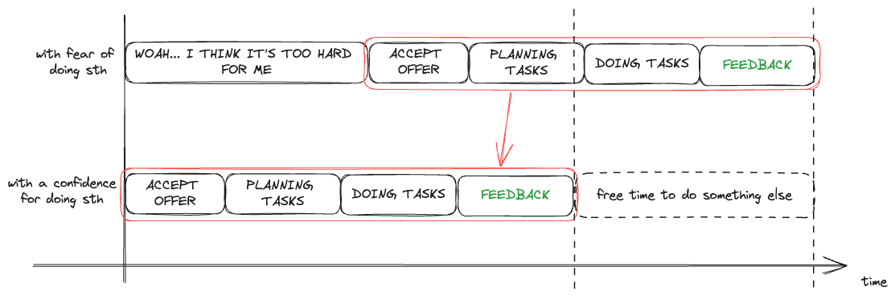

ก่อนที่เราจะทำอะไร เรามักจะกลัวถึงผลลัพธ์ที่จะตามมา กลัวความผิดพลาด กลัวหลาย ๆ อย่างจนเราพลาดโอกาสหลาย ๆ ครั้ง แล้วก็กลับมาคิดกับตัวเองว่า “_ทำไมไม่ทำอย่างงี้วะ” “รู้งี้ทำแบบนี้ไปแล้ว”_ เพื่อไม่ให้ความรู้สึกแบบนี้ค้างคาในใจเราเยอะ เรามาดูกันดีกว่าว่าเราจะสูญเสียอะไรไปเมื่อเรากลัว และถ้าเราไม่กลัว เราจะได้อะไรกลับมามั่ง

สวัสดีครับ รอบนี้อาจจะเปิดบทความงง ๆ หน่อย ตัว Inspiration ของบทความนี้นิลได้มาจากการคุยกับพี่ ๆ หลาย ๆ คนในออฟฟิศครับ ซึ่งนิลก็ไปปรึกษาเรื่อง Blog นี่แหละ แต่ว่าก็พูดความกลัว ความไม่แน่ใจหลาย ๆ อย่างไปกับพี่ ๆ ซึ่งสิ่งที่ตอบกลับมาก็ทำให้นิลรู้สึกมั่นใจขึ้นและกล้ามาแชร์มากขึ้นครับ

เวลาที่เรากลัวหรือไม่กล้าทำอะไรเนี่ย มันอาจจะเกิดขึ้นได้ในหลาย ๆ สถานการณ์นะครับ ไม่ว่าจะเป็นการที่เราได้ถูกเชิญชวนไปทำอะไรซักอย่างนึงหรือได้รับงานมาชิ้นนึง เราก็อาจจะเกิดอาการกลัวว่า เราจะทำได้หรือเปล่า เราจะทำได้ดีไหม ให้คนอื่นที่เก่งเจ๋งกว่าทำดีกว่าไหมนะ แล้วพอเรากลัวนี่แหละครับ มันก็จะทำให้เกิดการลังเลว่าจะทำดีไหมนะ ตามมาด้วยเวลาที่ต้องนั่งคิด และจบด้วยบางทีอาจจะปฏิเสธงานนั้น ๆ ไปเพียงเพราะว่าเรากลัวที่จะพลาดหรือเรากลัวที่จะทำไม่ได้

อันนี้นิลลอง visualize ออกมา (อีกแล้ว 5555) ว่าถ้าเรามัวแต่กลัวที่จะทำสิ่งใดสิ่งหนึ่งแล้ว เวลาที่เรากลัวมันจะส่งผลกับเวลาที่เราจะใช้เพื่อไปทำสิ่งใดสิ่งหนึ่ง นอกจากที่เราจะรอ จะกลัวแล้ว เรายังต้องมานั่งทำความเข้าใจ วางแผน แล้วก็ทำอีก ไหนจะรอ Feedback จากการทำ โว้ะ! หมดเวลากันพอดี สุดท้ายอาจจะส่งผลไปถึงการพลาดโอกาสหลาย ๆ อย่างที่สำคัญซึ่งบางทีอาจจะเป็นบันไดที่นำพาเราไปสู่ความสำเร็จในภายภาคหน้าก็ได้

ทีนี้ถ้าสมมติเราไม่กลัวแล้วทำสิ่งนั้นไป เราจะได้อะไรกลับมามั่ง นิลขอย้อนจากที่นิลบอกว่านิลไปปรึกษาพี่ ๆ ที่ออฟฟิศนะเรื่องความกลัวนี่แหละครับ ซึ่งในตอนนั้นสิ่งที่นิลกลัวคือกลัวว่าจะเขียนไม่รู้เรื่องกับกลัวการที่จะ Express ความคิดตัวเองออกไปทั้งหมดแล้วคนอื่นจะรู้สึกยังไงนะ เสียเวลานั่งคิด นอนคิด พินิจพิจารณา จนสุดท้ายความกลัวเหล่านี้ร่วมกับความขี้เกียจและอาการป่วยของนิลเมื่อเดือนที่แล้ว ทำให้ใช้เวลาร่วมเดือนในการปล่อยบทความที่แล้วออกมาทั้งที่จริง ๆ วางแผนเอาไว้ว่าจะใช้เวลาน้อยกว่านั้น จะสังเกตว่าจริง ๆ แล้วถ้าไม่คิดเยอะ หรือไม่กลัวโดยใช่เหตุเนี่ย จริง ๆ นิลก็อาจจะใช้เวลาน้อยกว่านี้ในการทำบทความนึงขึ้นมา แต่ด้วยปัจจัยหลาย ๆ อย่างเนี่ย มันทำให้นิลใช้เวลามากกว่าที่คิดซึ่งเวลาที่เหลือนี้จริง ๆ นิลอาจจะเอาไปทำอะไรอย่างอื่นที่มีประโยชน์มากกว่านี้ ไม่ว่าจะเป็นการออกไปออกกำลังหรือว่าพักผ่อนให้เพียงพอก็ตาม

อีกคำถามก็อาจจะตามมาว่า แล้วถ้าไม่ได้เขียน Blog ล่ะ เท่าที่ดูในย่อหน้าก่อนหน้า หลายคนอาจจะคิดว่า “เอ้า! ก็กลัวเพราะว่าเขียน Blog หนิ” หรือว่า “ถ้าไม่ทำ Blog ก็คงไม่เกิดความกลัวแล้ว” อะไรประมาณนี้ซึ่งนั่นก็จริงส่วนหนึ่งครับ แต่หนึ่งในปัจจัยที่นิลมาเขียน Blog คือการฝึกการสื่อสารกับคนในรูปแบบของตัวอักษรให้รู้เรื่องมากขึ้นครับ ดังนั้นในจุดนี้นิลคิดว่าเรื่องความกลัวการสื่อสารไม่รู้เรื่องเนี่ย เป็นสิ่งที่นิลจะต้องข้ามผ่านมันไปให้ได้ครับ

---

จบไปอีกแล้วววว บทความนี้อาจจะดูตึง ๆ นิดนึง เพราะตอนเขียนก็ตึงจริง 5555 อาจจะเพราะว่ามันมาจากประสบการณ์ตรง ๆ ที่เพิ่งเกิดและเอามาเขียน ก็เลยมีอารมณ์ร่วมค่อนข้างเยอะ ยังไงก็ขอบคุณทุกคนที่ทักมา Comment หรือให้ Feedback กันด้วยนะครับ รวมทั้งทุกคนที่ให้คำปรึกษาด้วยครับ ได้เอามาเป็นเนื้อหาบทความหลาย ๆ อันเลย 5555

ปล. มาพิมพ์ดักไว้ก่อนว่าทำไมในเมื่อถามพี่ ๆ เขาแล้วไม่เอาคำตอบมากางกันเลยล่ะ ว่าพี่ ๆ เขาตอบว่าอะไร เผื่อจะเป็นประโยชน์กับผู้อ่านมากขึ้น อันนี้ตอบแบบตรงไปตรงมาคือคำตอบของพี่ ๆ มันทำให้นิลเขียนได้เยอะมากกกกก อาจจะเอาไปแทรก ๆ ไว้ตามบทความอื่น ๆ ยังไงก็ติดตามกันในอนาคตได้ครับ

ขอให้ทุกคนกล้าออกไปลุยกับสิ่งใหม่ ๆ นะครับ

นิล