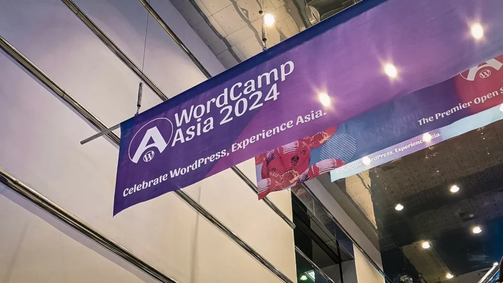
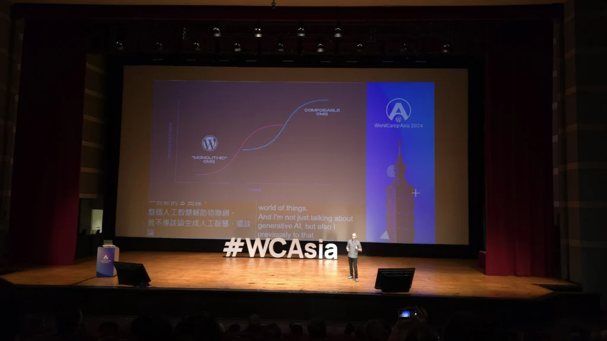
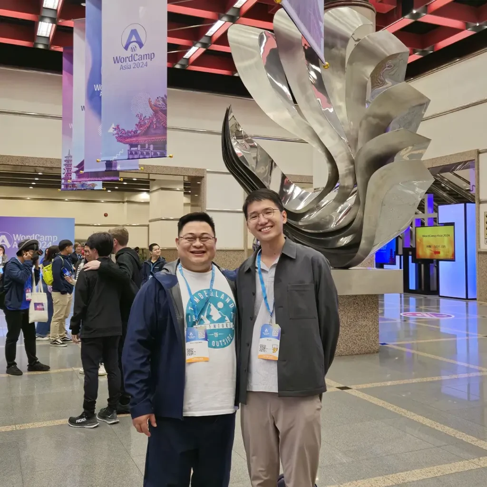
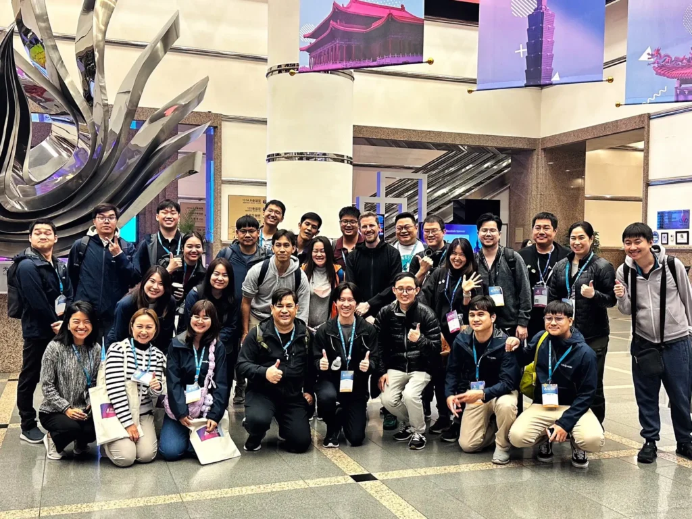
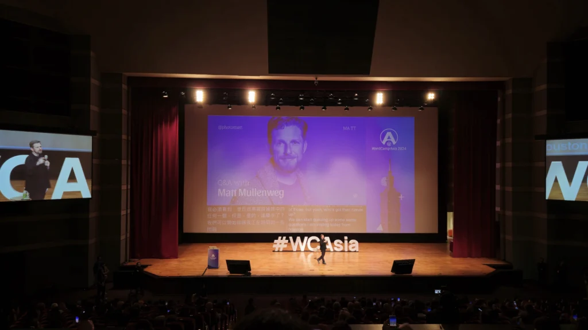
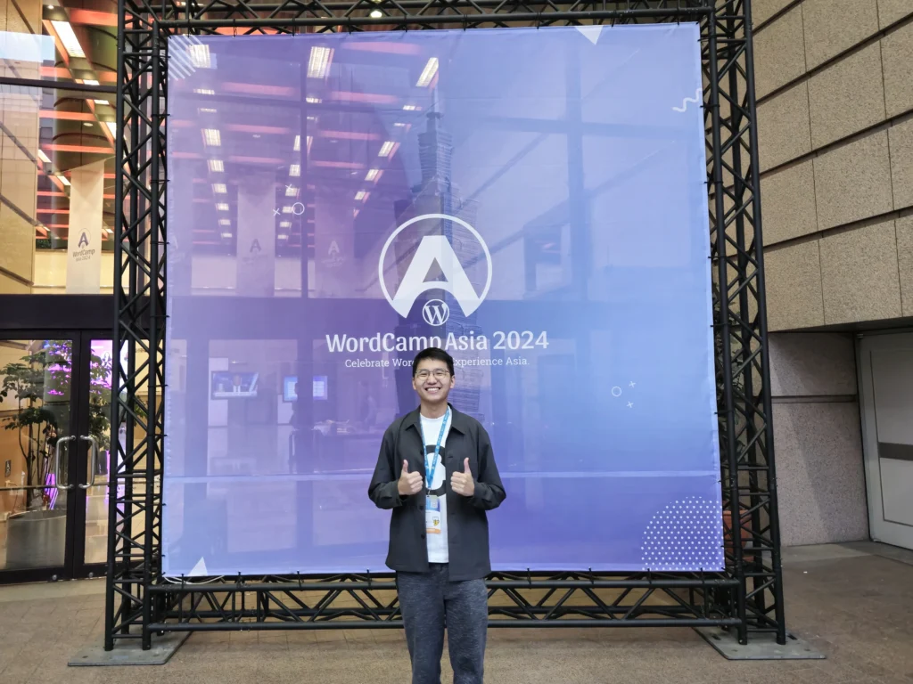

สวัสดีครับ เมื่อวีคก่อนนิลมีได้ไปงาน Conference อันนึงมีชื่อว่า WordCamp Asia 2024 ครับ เป็นงาน Conference เกี่ยวกับตัว WordPress ซึ่งนิลตัดสินใจไปด้วยปัจจัย 2 อย่าง อย่างแรกคือตัวนิลเริ่มมีการใช้ WordPress มาซักระยะ นิลเลยมองว่าอันนี้เป็นเหมือนการหาความรู้ + โอกาสและ Connection ในโลก WordPress และอย่างที่สองคือนิลเครียดกับงานโปรเจคปัจจุบันมาก ทำให้นิลอยากพักครับ โดยตัวงานถูกจัดที่ Taipei International Convention Center (TICC) ประเทศไต้หวันครับ เป็น Conference ที่ระยะเวลา 3 วันถ้วน และที่สำคัญครับ นิลไปแบบ Solo เลย ไม่ได้ชวนใครไปเลยครับ 55555 แต่ละวันนิลเจออะไรบ้าง มาดูกันดีกว่าครับ

## Day 1: Contributor Day

วันแรกของงานนะครับ จะเป็นวันที่เรียกว่า Contributor Day วันนี้จะต้องลงทะเบียนแยกจากตัว Conference ครับ ซึ่งจะเป็นวันที่ให้คนที่อยากสร้างประโยชน์/ทำอะไรซักอย่างให้กับ WordPress Team ได้มาลองลงมือทำจริงร่วมกับทีมงาน WordPress ครับ ซึ่งทำให้นิลรู้ว่า WordPress มีทั้งหมดอยู่ 14 ทีม ซึ่งประกอบไปด้วย

- Accessibility: ดูแลเรื่อง Accessibility ของ WordPress Core
- Community: ดูแลการจัด Meetup WordPress/สร้าง Community WordPress ตามที่ต่าง ๆ
- Core / Core Performance: ดูแลเรื่องของ Feature หลักและ Performance ของ WordPress
- Design: ดูแล UI ของ WordPress
- Documentation: ดูแล Documentation ทั้งในฝั่งผู้ใช้งานและผู้พัฒนา
- Marketing: ดู Marketing พวก Social Media, Digital Marketing, Analytics
- Meta: ดู Software ของ WordPress.org, APIs และเครื่องมือต่าง ๆ เช่น Theme and Plugin Directories
- Patterns: สร้าง Patterns ของ Block เพื่อให้ผู้ใช้งานสามารถ Copy/Paste ไปใช้ได้ง่าย ๆ
- Photos: ดูแลรูปที่อยู่ใน Photo Directory ของ WordPress
- Plugins: ดู Plugins ที่มีคน Submit มาว่ามีฝ่าฝืนกฎอะไรหรือเปล่า
- Polyglots: ดูแลเรื่องการแปลภาษาของ WordPress
- Support: ช่วยตอบคนที่ WordPress Support Forum
- Themes: ดู Themes ที่มีคน Submit มาว่ามีฝ่าฝืนกฎอะไรหรือเปล่า
- Training: ช่วยกันสร้าง Training Materials สำหรับงาน Event, ช่วยทำ Workshops

ในวันนั้นเขาก็ให้แต่ละทีมมาอธิบายว่าทีมตัวเองมีช่วยพัฒนา WordPress ในส่วนไหนอยู่ครับ โดยคนที่มาพูดในแต่ละทีมจะเป็น Table Leads หรือว่าคนที่ประจำโต๊ะของทีมนั้น ๆ อยู่ ซึ่งพอฟังทุกทีมขึ้นมาพูดแล้ว นิลรู้สึกว่านิลอยากไปทำทีม Documentation ครับ ซึ่งทีมนี้จะเป็นทีมที่ช่วยกันเขียน Documentation หรือ User Manual ของ WordPress นั่นเอง โดยปัจจัยตัดสินใจของนิลคือนิลชอบการ Document ของอยู่แล้วกับอยากรู้ว่าทำไม Document ของ WordPress ถึงไม่ค่อยถูกอัปเดทเท่าที่ควร

Image Taken By me

พอได้เข้าทีม นิลก็ได้เจอกับ Leo ซึ่งเป็นหนึ่งใน Table Leads ของทีม Documentation ครับ Leo ก็ได้พานิลเริ่มตั้งแต่สร้าง Account ที่หน้าเว็บ WordPress.org ซึ่งนั่นเป็นปัญหาแรกที่เจอในงานครับ หน้าเว็บส่วน Login โหลดโคตรช้า ตอนแรกนิลก็คิดว่าที่ Internet แต่ว่าพอเข้าหน้าเว็บอื่น ๆ มันก็เข้าได้ปกติ แต่หน้า Login ของ WordPress นั้นช้ามาก ทำให้เสียเวลาไปเกือบ ๆ ครึ่งชั่วโมงเลย ซึ่งพอสร้าง Account และ Login สำเร็จ Leo ก็ได้สอนวิธีที่จะ Contribute ให้กับทีม Doc ของ WordPress ครับ ซึ่งนิลก็ได้เรียนรู้วิธีและได้เริ่มสร้างประโยชน์แก่ WordPress เป็นครั้งแรก 5555

ยังไม่ทันไรก็ถึงเวลาข้าวเที่ยงแล้ว ด้วยความที่นิลมาแบบ Solo เลย นิลไม่รู้จักใครเลย Leo เลยพานิลไปนั่งด้วย บอกเลยว่าอาหารในงานโคตรอร่อย โซ้ยหมดด้วยความรวดเร็วและลืมถ่ายรูปมา 55555 ซึ่งในโต๊ะกินข้าวนั้น นิลก็เจอ Akira และ Milana ซึ่งเป็น Table Leads ของทีม Doc อีก 2 คน นิลก็ได้คุยกับ Akira เรื่องประเทศไทยเพราะปีที่แล้ว Akira มา WordCamp Asia 2023 ที่จัดที่ประเทศไทย เขาก็เล่าเกี่ยวกับการผจญภัยในกรุงเทพของเขา และเราก็เผาประเทศให้เขาฟัง 555555 อย่างมันส์ ส่วน Milana นั้นก็คอยแจกจ่ายขนมที่ตัวเองซื้อมาให้กับคนในโต๊ะกิน พอคนในโต๊ะไม่กินด้วย เขาก็เอาไปแจกโต๊ะอื่น ๆ ต่อ 555555 ซื้อมาเยอะเกิ๊นนน

หลังจากที่อิ่มจนพุงกางนิลก็ได้ขอตัวออกมาเดินเล่นซักพักและกลับไป Join งานของทีม Doc ต่อซึ่งในตอนบ่ายนิลก็ได้เจอ Michael ซึ่งเป็นคนที่เพิ่งมาจอยโต๊ะนี้ตอนบ่ายมานั่งข้าง ๆ Michael เจอปัญหาเรื่อง Internet แต่อันนี้เป็นที่ Internet จริง ๆ Michael เลยชวนนิลคุยเรื่องว่าทำไมถึงมา WordCamp Asia รอบนี้ ทำไมถึงอยากมาจอยทีม Doc อะไรแบบนี้ นิลก็ตอบเหตุผลของนิลไป หลังจากนิลเล่าเหตุผลของตัวเอง นิลก็ได้ถามกลับไปว่าทำไมเขาถึงสนใจทีม Doc ซึ่งเหตุผลของเขาก็คือเขาอยากมาเรียนรู้การทำ Doc เพราะหลังจากจบงาน WordCamp เขาต้องกลับไปช่วยทำ Doc ให้กับบริษัท

ความสนุกเริ่มต้นขึ้นเพราะว่าในโต๊ะนิลมีคนที่มาจาก GoDaddy และ Hostinger มาอยู่ซึ่งเขาเป็นคู่แข่งทางธุรกิจกัน ในระหว่างนั่งทำ Doc ก็ได้มีการเล่นมุขแบบ แซ่บ ๆ จิก ๆ กัด ๆ กันหลาย ๆ ครั้ง 55555 แต่พอตอนเล่นกันไปซักพัก Michael ก็พูดขึ้นมาและเป็นคำพูดที่นิลชอบมาก เขาพูดว่า

> I really like this kind of event. Even though we are business rivals, during these 3 days of event, we’re friends.
> 
> Michael

ซึ่งทุกคนก็เห็นด้วยกับคำพูดนี้มาก ในวันนั้นนิลถึงกับรีบเข้าแอพโน๊ตไปจดคำพูดนี้เลยนะ 5555555

หลังจากนิลเสร็จงานส่วนแรกนิลก็ได้ไปคุยเพิ่มกับ Leo ถึงการทำงานของทีม Doc ของ WordPress นิลถึงได้รู้ว่าจริง ๆ แล้วทีม Doc ของ WordPress ไม่ได้เป็นทีมงาน WordPress แบบ Full Time แต่เป็นทีมงานจากบริษัทต่าง ๆ มาจอยกัน (ซึ่ง Leo ก็มาจาก Hostinger) และช่วย ๆ กันทำ Doc แหละ ซึ่งทีมงานก็มีประมาณ 20 คนและมีเวลากันขั้นต่ำคนละ 2 ชั่วโมงต่ออาทิตย์มาทำกันและด้วยความที่ WordPress มีการปล่อย Minor Release ปีละ 3 ครั้งและ Feature ที่มีการเปลี่ยนแปลงเยอะมาก ทำให้เขาทำไม่ทันกัน บางทีก็จะต้องเพิ่มในส่วน Feature ที่มาใหม่ก่อน ของเก่า ๆ ถึงไม่ได้ถูก Update เลย ซึ่งถ้าใครอยากเข้าไปช่วยเนี่ยก็สามารถเข้าไปตามในนี้ได้เลยครับ คิดว่าเป็น Starting Point ที่ดีในการเริ่มช่วยทีม Doc ครับ

ใน Session นี้นิลได้ช่วย Proof Screenshots และ Content ของตัว Documentation เรื่อง Query Loop กับ Tag Cloud ครับ โดยหน้าเหล่านี้ถูกแก้ไขล่าสุดเมื่อมีนาปีที่แล้ว 😱😱 ซึ่งแค่ตรวจ 2 หน้าและ Capture รูปที่เป็นของใหม่ทั้งหมดก็หมดเวลาทำมาหากินอย่างไม่น่าเชื่อแล้วครับ

จริง ๆ มีอีก Session ที่เขาจัดขึ้นใน Contributor Day ครับแต่นิลไม่ได้เข้าร่วมด้วยเพราะแค่ทำงาน Team Doc ก็หมดเวลาแล้ว ซึ่ง Session นั้นมีชื่อว่า “Human Library” ครับ Session นี้เป็น Session ที่จะมีคนที่ทำหน้าที่เป็น Librarian ที่สามารถตอบคำถามของที่เข้ามาถามได้ ตัวนิลคิดว่าเป็นไอเดียที่สุดยอดมากเลย ถ้านิลทำอะไรเร็วกว่านี้อีกนิดนึงนะ นิลอาจจะได้ไปลอง Session นี้เพิ่มเติมก็ได้ แต่ไม่ทันซะก่อน งานทับตัว 555555

จบวันไปนิลก็มีคุยกับ Leo เพิ่มขอ Connect เขาไว้ใน LinkedIn ด้วย Leo บอกว่าพรุ่งนี้เขาจะมาเป็นตากล้องให้กับงานนี้ เขาบอกว่าจริง ๆ ใครที่มีกล้องก็สามารถมาช่วยเป็น Staff ได้เลย แอบเสียดายที่ไม่ได้เอากล้องมาเลย 5555 และนิลก็ขอไป Contact Akira ด้วย ได้นามบัตรเขามาด้วยแหละ ส่วนนิลทัก Milana ไม่ทัน Milana ขยับตัวออกไปไวมากและก็นิลก็ไม่ได้คุยกับเขาเยอะด้วย เลยอดคุย อดขอ Contact เลย

สิ่งที่นิลได้จาก Contributor Day คือนิลได้รู้จักคนเพิ่มเยอะมาก ซึ่งก็คือคนที่มาร่วม Contribute ในทีม Documentation แหละ ซึ่งมาจากหลาย ๆ บริษัทที่นิลเคยเห็นผ่านตา ไม่ว่าจะเป็น GoDaddy, Hostinger, Yoast, และ WPML รวมถึงได้รู้ว่า Process ในการจะ Contribute ให้กับ WordPress จริง ๆ แล้วไม่ยากเลย แค่เข้ามา Join ทางทีมก็พร้อมต้อนรับ นอกจากนี้ยังได้เข้าใจ Process การทำงานของทีมทีมนึงใน WordPress Team และเข้าใจว่าทำไม Doc มันถึงไม่ค่อยอัพเดท (ไม่ได้รู้สึกว่าโลกสวยนะ แต่เข้าใจเขามากขึ้นละกัน)

– จบ WordCamp Day 1 –

---

## Day 2: Conference Day 1

วันนี้เป็นวัน Conference วันแรก ด้วยความที่นิลได้บัตรเข้างานตั้งแต่เมื่อวานแล้ว ทำให้วันนี้นิลไม่ต้องไปต่อคิวลงทะเบียนแบบคนอื่นเขาด้วย นิลเลยดิ่งไปซิบกาแฟในยามเช้าที่ร้าน Louisa Coffee ในตึกจัดงานครับ ในนั้นนิลก็นั่งทำงานอย่างอื่นไปเรื่อย ๆ และพบกับแก๊งค์ชาวไทยในร้าน ซึ่งหนึ่งในนั้นคือพี่จาบอนซึ่งเคยเป็น Consult ให้กับบริษัทนิลใน Project นึง นิลเลยได้คุยกับพี่จาบอนและพี่เขาเลยชวนนิลไปเข้ากลุ่ม Facebook ของชาวไทยและไปกินข้าวกับแก๊งค์ชาวไทยหลังจากจบงานวันนี้ นิลก็ตอบตกลงไปแบบไม่ได้คิดอะไรเพราะตัวนิลก็อยากมาหา Connection อยู่แล้วด้วย อันนี้ก็อาจจะเป็นโอกาสอันดีที่จะได้รู้จักคนเพิ่มแหละ หลังจากแยกกับชาวไทยที่ร้านกาแฟมา นิลก็ได้เข้า Hall เพื่อฟัง Opening Keynotes ตามตารางเลยครับ โดยนิลสรุปมาได้เป็นประเด็นประมาณนี้ครับ

- ตอนนี้ WordPress เป็น 43% ของ Website ทั่วโลก
- ยอดการใช้งาน WordPress เพิ่มทุกปี
- คน Supply เพิ่ม แต่ Demand ไม่โตตาม แปลว่าตอนนี้ Supply (WordPress Developer) ในท้องตลาดกำลังแย่งงานกันอยู่
- WordPress เมื่อก่อนเคยโดนตราหน้าว่าเป็น Monolith CMS แต่ก็สามารถสร้าง S-Curve และเติบโตมาได้จนถึงทุกวันนี้ และตอนนี้ WordPress กำลังเปลี่ยนตัวเป็น Composable CMS และกำลังหา S-Curve ใหม่
- ตอนนี้ตลาดยังไม่รู้ Capabilities ทั้งหมดของ WordPress ในฐานะของ WordPress Developer ควรจะทำให้ท้องตลาดเข้าใจและอยากใช้ Solution ที่เป็น WordPress มากขึ้น
- Guideline ตัวอื่น ๆ ในท้องตลาดดูง่ายกว่า Doc ของ WordPress
- อยากทำ Integration Directory สำหรับ WordPress เพื่อให้สามารถเริ่ม Project ได้ง่าย ๆ เหมือนพวก Frontend Framework สมัยใหม่
- ใน Service ยุคใหม่ ๆ อาจจะต้องเอา WordPress ไป Plug กับ Service อื่น ๆ เพื่อทำให้ WordPress กลับมาเป็นผู้นำตลาดอีกครั้ง

พอจบ Session Keynote ทุกคนก็ปรบมือกันลั่น Hall เลย ส่วนตัวนิลก็แบบ อะไรวะเนี่ย ข้อมูลเป็นล้าน 5555555 พอฟัง Keynotes เสร็จนิลก็ได้เข้าไปฟัง Session ต่าง ๆ (ส่วนสรุป Session ต่าง ๆ นิลขอเอาไว้เขียนแยกเป็นอีก Blog นะไม่งั้นเยอะเกิน) พอถึงพักเที่ยงนิลก็ได้เจอกับพี่ไทแห่ง BKK.JS หลังจากนั้นนิลก็ทำเสมือนเล่นเกมและเปิด Bot เลย นิลก็เป็น Bot เดินตามพี่ไทเลยเพราะนิลไม่รู้เลยว่าถ้ามางาน Networking แบบนี้ นิลจะต้องทำตัวยังไง พี่ไทก็พานิลไปนู่นนี่นั่น พาไปกินข้าว เปิดบทสนทนาในโต๊ะกินข้าว จนสุดท้ายนิลก็ผ่านมื้อเที่ยงที่ต้องคุยกับคนแปลกหน้าหลายคนได้ (p.s. ข้าวเที่ยงวันนี้ไม่ค่อยอร่อยอะ ฮืออออ)

นอกจากนั้นพี่ไทยังพานิลไปเจอกับชุนซึ่งชุนเป็นคนที่ร่วมทำ Commu ฝั่ง JavaScript กับพี่ไทมา พี่ไทบอกว่าชุนเป็น Indie Hacker และกำลังทำโปรเจค [https://learnalgorithm.com/](https://learnalgorithm.com/) นิลก็ตกใจมากแบบ เชี่ยย นี่แม่งบุคคลที่แบบโคตรตึง โคตรโหด โคตรอันตราย ก็ได้ทำความรู้จักกับชุนที่ตรงนั้นครับ แต่ก็ได้คุยแปปเดียวเพราะว่า Session บ่ายกำลังจะเริ่มแล้ว

หลังจากนั้นนิลก็เข้า Session บ่ายปกติไป ซักพักนึงพี่ไทก็เดินมาบอกว่าเดี๋ยวบ่าย 3 คนไทยมีรวมตัวกันถ่ายรูปรวม ตอนแรกนิลก็สองจิตสองใจเพราะว่าในตอนแรกนิลก็ไม่อยากพลาดซัก Session เลย แต่ยังไงก็ตาม นิลก็เลือกที่จะมารวมตัวกับคนไทยคนอื่น ๆ เพราะอยากรู้ว่าคนไทยมากันเยอะไหม พอรวมตัวกันครบ ก็ได้รู้ว่าคนไทยมากันเยอะมาก เกือบ 30 คนแหนะ แต่แค่ทีมงาน Seed Webs ก็ล่อไป 10 คนแล้ว ยังมีทีมงานจากมหาวิทยาลัยเชียงใหม่อีก รู้สึกว่าเปิดโลกมากเลย ได้คุยกับพี่เม่นกับทีมงาน Seed Webs ด้วย ทุกคน Friendly มากเลยแหละ ปลาบปลื้มใจมาก ตอนแรกคิดว่าจะ Connect กับคนอื่น ๆ ยากกว่านี้

<em>Image of Nin and P'Men by Junior from Seed Webs Team</em>

<em>Image by <a href="https://www.facebook.com/WordPress" data-type="link" data-id="https://www.facebook.com/WordPress" target="_blank" rel="noreferrer noopener">WordPress Facebook Page</a></em>

พอถ่ายรูปรวมชาวไทยที่ WordCamp Asia กับเม้ามอยเสร็จ นิลก็จะกลับไปฟัง Session อื่น ๆ พี่ไทยก็มาบอกนิลว่า Session พวกนี้มีปล่อยฟรีบน YouTube ถ้ามาแค่ฟังอย่างเดียว โดยไม่ได้มีคำถามไปถามคนพูดหรืออยากไป Connect คนพูดแล้ว ก็เหมือนเสียค่าบัตรฟรี เอาเวลาไปคุยกับคนในงานหรือ Sponsor Booth ที่ตั้งอยู่ในงานดีกว่า นิลก็มานั่งคิดไปคิดมาละเห็นด้วย แต่ด้วยความที่นิลเข้าหาคนไม่เก่ง นิลจึงเลือกที่จะไปลองคุยกับ Booth Sponsor และ Booth แรกที่นิลเข้าไปคุยคือ Booth ของ Elementor ซึ่งเป็น Page Builder Plugin ที่นิลใช้กับ Project ล่าสุด นิลได้คุยกับ Rami ซึ่งเป็นหนึ่งในทีมพัฒนา Elementor เขาก็ให้คำแนะนำเกี่ยวกับการใช้มาและเขาก็พูดปัญหาที่ตอนนี้ Elementor กำลังเจอ นั่นคือการ Backward Compatability ของต่าง ๆ ไม่ว่าจะเป็น Icon Pack หรือ php version เพื่อ Support ผู้ใช้งาน 16 ล้านคนทั่วโลก (เยอะมากกกก) นอกจากนี้นิลยังถามเรื่องการพัฒนา Feature ว่าเขามี Strategy ยังไง Rami เลยตอบนิลว่า 1 ใน Strategy คือดูใน Github Issues ว่ามีคน Feature Request อะไรและมีคนเข้าไป Like หรือ +1 กันเยอะไหม ซึ่งก็แอบตกใจเหมือนกันว่าทำไมถึงไม่ได้เป็นการ Drive Feature จากทีมมาด้วย แต่นิลก็ไม่ได้ถามเหตุผลเพิ่มเติมไป จบ Booth นี้นิลก็ได้หมวก Elementor มาใบนึง 555555

จริง ๆ หลังจากจบ Booth Elementor นิลมีแวะ Booth ของ Woo, Google, ละก็ GoDaddy แต่ก็ไม่ได้มีอะไรเยอะมากจนนิลจะเขียนได้ 555555 หลังจากจบงานนิลก็มีไปรวมกับพี่ไทอีกครั้งเพื่อรอกินข้าวชาวไทย แต่ว่าพอรู้ว่าจะไปรวมตัวแบบคนเยอะนิลแอบกลัวนิดนึง (ไม่ค่อย Comfort กับการอยู่ในวงสนทนาที่มีคนเยอะ รู้สึกทำตัวไม่ถูก) พี่ไทก็มาถามนิลว่าสนใจไปกินแยกอีกกลุ่มนึงไหม นิลก็ตอบตกลงไปและไปกับพี่ไทกับชุนไปเดินตลาดกลางคืนแห่งหนึ่ง เดินไปกินไป เงินอย่างไหลเลย ละนิลก็เดินไปเจอชานม 50 Lan ที่อยู่ใน List ชานม นิลก็รีบโดดไปสั่งไปกินทันที แต่กลับเศร้ามากเพราะสั่งชานมไข่มุก Size M แต่ได้ชานม Size L ที่ไม่มีไข่มุก 🥺 พอเดินกันเสร็จก็มีไปเดินคุยกันในสวน ZhongShan ต่อฮะ รู้สึกวงสนทนาใกล้ชิดดีครับ เสร็จแล้วก็แยกย้ายกันไปพักผ่อน

– จบ WordCamp Day 2 –

---

## Day 3: Conference Day 2

วันนี้นิลตื่นสายย แต่ตื่นก็ 9 โมงแล้วไอบ้าเอ้ย สุดท้ายนิลก็มาถึงงานประมาณ 9 โมงครึ่งและพุ่งตรงไปที่ Session ที่นิลสนใจ นั่นคือ “Fighting the JavaScript Fatigue: Picking the right framework for Headless WordPress” ซึ่งเป็น Session ของภูมิ ซึ่งเป็นชาวไทยที่นิลติดตามเพจเขามาซักพักใหญ่ละ พอนิลไปถึงที่ห้องจัด Session นิลก็ได้เจอกับภูมิที่ยืนอยู่หน้าห้อง นิลก็เข้าไปคุยกับภูมิ ซึ่งภูมิ Friendly มากกก พอคุยกันซักพักก็ถึง Session ของภูมิ ภูมิขึ้นไปพูด นิลไปนั่งฟัง ฟังแล้วแบบ โอ้โหหห โคตรเก่ง พูดโคตรดี ภาษาอังกฤษอย่าง Flow เลย พอจบ Session ภูมิ นิลก็ได้คุยกับคณะอาจารย์จากมหาวิทยาลัยเชียงใหม่ เขาเหมือนสนใจเกี่ยวกับการ Training/Course Online ของ Skooldio เลยมาขอ Contact นิลไว้ แอบทำตัวไม่ถูกนิดนึง 55555 พอจบ Session ของภูมิก็ได้ไปฟัง Session ของพี่เพิร์ธต่อ เป็นหัวข้อเรื่อง “Multiply your income streams with WordPress development skills” ซึ่งบอกเลยว่าดีมากก เป็น 10 นาทีที่มีประโยชน์กับชีวิตมากเลย ซึ่งพอจบ Session พี่เพิร์ธนิลก็ออกไปเดินเล่น Sponsor Booth ต่อ

พอเดิน Sponsor Booth ตอนเช้าเสร็จก็ถึงเวลาข้าวเที่ยงแล้ว วันนี้นิลกับพี่ไทยแยกตัวกันไป ทำให้นิลต้องฝึกการเข้าสังคมเอง 55555 แต่นิลก็กลับไปนั่งโต๊ะเดียวกับเมื่อวานและเจอคนเดิมที่นั่งอยู่ รอบนี้นิลก็ได้คุยกับเขามากขึ้น ซึ่งด้วยเขาเป็นคนไต้หวัน ตอนแรกก็ได้คุยเกี่ยวกับการทำ Personal Blog, งานประจำของแต่ละคน แต่พอซักพักนึงนิลก็คุยเรื่องที่พัก เขาก็คุยเรื่องเกี่ยวกับไต้หวันมากขึ้น เขาแชร์ว่าตอนนี้ค่าที่พักในไต้หวันสูงขึ้นมาก ตัวเขาเลยไปอยู่แถวชานเมืองและเดินทางเข้ามาเพราะค่าเดินทางนั้นรวม ๆ แล้วถูกกว่าค่าที่พัก นิลก็ช็อค ๆ ไปแปปนึง หลังจากนั้นเขาก็แนะนำนิลไปกินร้าน Din Tai Fung เขาบอกนิลว่ามันเป็น Foreigner’s Must Eat เลย (แต่สรุปแล้วนิลไม่ได้กิน คนแม่งเยอะไม่ไหวว)

พอแยกย้ายหลังข้าวเที่ยง นิลก็เดินสาย Sponsor Booth ต่อ นิลไปเดิน Booth ของ Hostinger ซึ่งมี Leo ที่เป็น Table Leads ที่ทีม Doc อยู่ นิลก็เข้าไปคุยกับคนใน Booth และคุยเรื่อง Hosting ของ Hostinger ด้วยหลัก ๆ คือนิลอยากรู้ว่า Hosting ของ Hostinger มันดีกว่าเจ้าอื่นยังไง โดยสรุปแล้วคือนิลมองว่าตัว Infra ก็อาจจะคือ ๆ กับเจ้าอื่นแต่ Hostinger นั้นมีการทำ UI ของ Backoffice ที่ใช้ Manage การ Hosting สวยมากและมีการพัฒนา AI มาช่วยเขียน Blog ซึ่งแค่ใส่หัวข้อมันก็จะ Generate เนื้อหามาให้ ฟังละแบบ โคตรโกงเลย 55555 ตัวนิลซึ่งกำลังมองหา Hosting WordPress อยู่ก็ได้ถามซอกแซกเขาไปเรื่อยจนเขาให้ Hosting Free มาปีนึง ให้เมล็ดกาแฟมาถุงนึง ให้ผ้าเช็ดจอคอมแล้วก็ให้ถุงผ้ามาอีก พูดเลยว่าให้มาอย่างคุ้มเลยครับ นิลก็น้อมรับด้วยความยินดีมาทุกอย่างเลย อิอิ

และแล้วก็มาถึง Session Q&A with Matt, Co-Founder ของ WordPress ซึ่งนิลรู้สึกชอบ Session อะไรแบบนี้มาก จริงใจสุด ก็มีคนมีคำถามจะถาม Matt เยอะมาก และ Matt ก็ตอบอย่างดีทุกอันด้วย ตัวนิลก็เสียดายนิดนึงเพราะจริง ๆ ก็มีคำถามที่อยากถามเหมือนกัน แต่คนถามเยอะเกิน แย่งไม่ไหว TT นอกจากนี้ Matt ยังประกาศอีกว่าจะมีงาน State of The Word ซึ่งจะเป็นงานที่เกี่ยวกับการอัพเดท WordPress ที่กรุงโตเกียว ประเทศญี่ปุ่นแหละ 🤩 พอ Matt พูดเสร็จก็มีประมวลภาพจบ WordCamp Asia 2024 และก็ประกาศว่าปีหน้า [WordCamp Asia 2025](https://asia.wordcamp.org/2025/) จะจัดที่ประเทศฟิลิปปินส์ 🥳🎉 นอกจากนี้ก่อนจบงานเขาก็ประกาศว่าจะมี After Party ที่ MAJI Square ด้วยซึ่ง Party จะเริ่มตอนทุ่มนึงครับ โดยมีอาหารฟรี เครื่องดื่มฟรี (หูผึ่งตรงนี้ 5555)

<em>Image of Matt on stage, taken by me</em>

<em>Image of me by Chun Rapeepat</em>

หลังจากจบ Session ก็จะเหลือเวลาประมาณ 2 ชั่วโมงก่อนจะเริ่ม Party ครับ นิลก็เลยไปเดินเล่นกับชุน เดินจากงาน WordCamp ไปที่ National Theatre and Concert Hall (ระยะทาง 4.6 กิโล) ระยะทางแบบบ้าบอมาก ระหว่างทางก็ได้คุยสัพเพเหระไปเรื่อย เดินไปประมาณชั่วโมงกว่าก็ถึงที่หมาย นิลก็แยกกับชุนและเดินไปที่พักนิลต่อ (อีก 2 โล) เดินให้ขาพังไปเลย 5555555 พอถึงที่พักนิลก็ทุ่มกว่าแล้ว นิลเลยเข้าไปอ่านข้อความชาวไทยที่ถึงที่งานแล้วว่าบรรยากาศงานเป็นไงบ้าง ก็เห็น Feedback เหมือนงานค่อนข้างเสียงดัง + คนเยอะ + เน้นแอลกอฮอล์ซึ่งตัวนิลไม่ค่อยชอบปัจจัยเหล่านี้ ตอนแรกนิลจะไม่ไปละ แต่พี่ไททักมาบอกว่ามาก่อนละถ้า Social Energy หมดค่อยไปเดินสวนเล่นกัน นิลเลยไป (โดนล่อด้วยการเดินสวน 555555)

พอไปถึงที่งานนิลก็ได้เจอกับพี่ไท ชุน และภูมิอีกครั้งนึง โดยพอนั่งในงานไปซักพักพี่ไทก็ชวนชุน ภูมิ นิลไปเดินสวนใกล้ ๆ งาน ก็ได้เดินไปคุยไปกินไป เป็น Session การคุยที่ยาวนานมากถึง 4 ชั่วโมงและเต็มไปด้วยการเรียนภาษาที่สุดมันส์ โคตรโหด โคตรอันตราย ไม่เกิน 3 ชั่วโมงพวกเราก็สามารถพูดภาษาจีนได้อย่างไม่น่าเชื่อ 555555 ประมาณตี 1 ครึ่งก็เดินไปส่งชุนที่โรงแรมและก็นั่ง Uber กลับโรงแรม จบวันเดินไป 20 โล บ้าพลังขั้นสุดยอด 55555

– จบ WordCamp Day 3 –

---

โดยรวมนิลมองว่าการมาจอย WordCamp Asia ของนิลรอบนี้เป็นการเปิดโลกนิลมาก ตั้งแต่การมาต่างประเทศคนเดียวครั้งแรก การเข้าร่วม Contributor Day การไป Connect กับชาวไทย ชาวต่างชาติในงาน การเดินคุยกับ Sponsor หลาย ๆ อย่างมันดูใหม่สำหรับ Software Engineer คนนึงที่นั่งทำงานหงก ๆ ในออฟฟิศแล้วไม่ได้ออกไปงานไหนเลยแหละ ถ้าใครรู้สึกว่าอยากออกมาหาประสบการณ์ใหม่ ๆ การมางาน Conference อะไรแบบนี้ก็น่าสนใจดีนะครับ แต่อาจจะต้องมากับเพื่อนนิดนึง กันเหงา กันเคว้ง โดยรวมนิลว่ามันสนุกดีนะครับ นอกจากนี้ใครอยากดูไลฟ์ย้อนหลังของงานก็สามารถเข้าไปดูได้ที่ [Youtube: WordPress](https://www.youtube.com/@WordPress/streams) ได้เลยครับ มี Conference ย้อนหลังทุก Session เลยครับ

หวังว่าการแชร์ประสบการณ์ครั้งนี้จะเป็นประโยชน์กับคนอ่านนะครับ ให้สมกับเป็น Content ราคาแพงที่ต่างแดนนะครับ ถ้าชอบก็สามารถมาพิมพ์ Comment ทิ้งไว้ที่เพจได้นะะ [เพจ:ตากล้องที่เขียนโค้ดได้นิดหน่อย](https://www.facebook.com/profile.php?id=61555700437640) สำหรับวันนี้ลาไปก่อน สวัสดีครับ

ขอให้สนุกกับการไป Conference เย่ะ ๆ

– นิล –