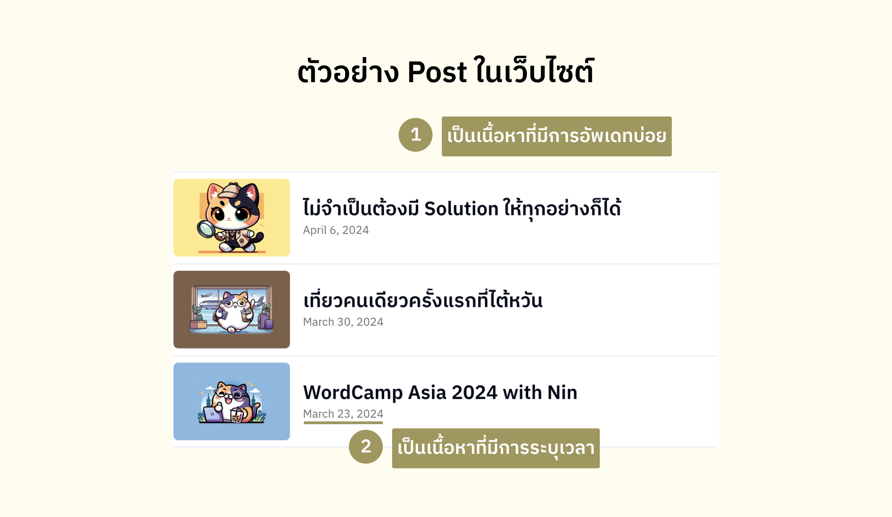
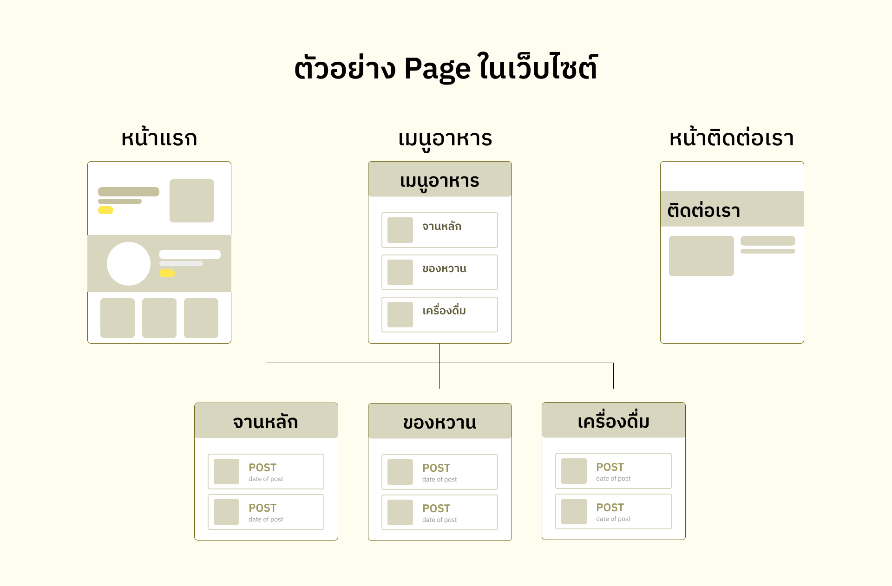
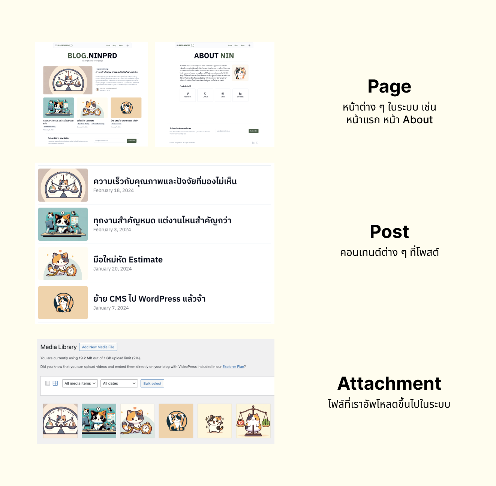
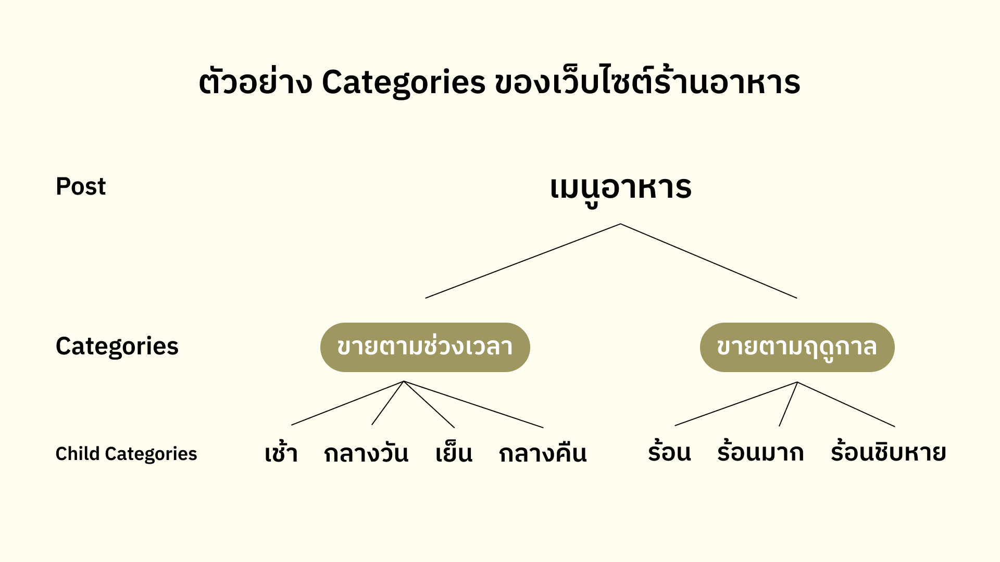
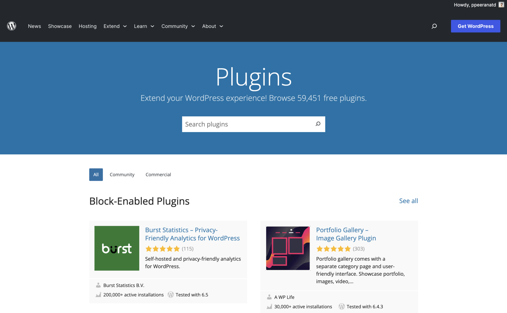
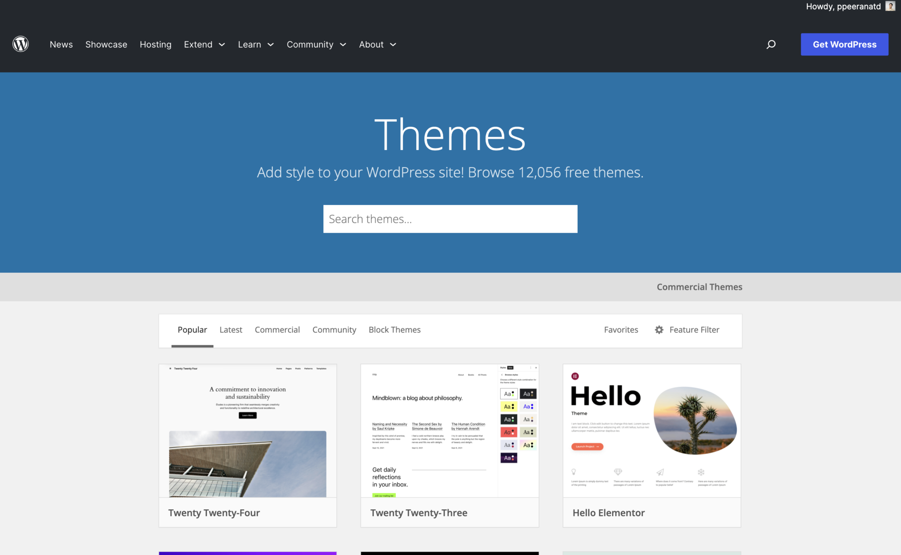

ใน Part Basic 1 นี้นิลจะเล่าภาพรวมและทฤษฎีคร่าว ๆ เกี่ยวกับ WordPress ซึ่งเป็น WordPress สำหรับผู้เริ่มต้นโดยแท้เลยแหละ โดยมีหัวข้อประมาณนี้ครับ

## WordPress คืออะไร? ทำไมถึงเป็นที่นิยม? {#what-is-wordpress-and-why-it-is-famous}

WordPress เป็นเครื่องมือสร้างเว็บไซต์และจัดการคอนเทนต์ (Content Management System: CMS) โดยที่เราไม่จำเป็นต้องมีความรู้เกี่ยวกับ Programming เลยครับ โดยเบื้องต้นแล้วเราสามารถสร้างเว็บไซต์พวก Landing Page, Blog Website ได้ไม่ยากโดยไม่จำเป็นต้อง Code ซักแอะเลยครับ

เนื่องด้วยความง่ายในการติดตั้งและระบบบริหารจัดการเนื้อหาที่ค่อนข้างใช้งานง่าย การทำหน้าตาให้สวยตามพิมพ์นิยมนั้นง่ายมาก รวมถึงในฝั่งของนักพัฒนาก็สามารถแก้ไข Code ได้อย่างไม่ยากนัก อีกอย่างนึงคือมันเป็น Open Source ครับ ใครอยากมาทำอะไรเพิ่มเติมให้กับ WordPress ก็สามารถทำได้ เช่น สร้าง Plugins/Extensions ที่จัดการของต่าง ๆ ไม่ว่าจะเป็นทำ Online Shop, จัดการ Membership, จัดการสิทธิ์ของผู้ใช้งาน โดยส่วนใหญ่แล้วจะฟรี ยังไม่หมดอีก ตัว WordPress ยังสามารถติดตั้ง Themes เพื่อเปลี่ยนหน้าตาการแสดงผลอีก Themes ก็มีตั้งแต่ฟรียันเสียตัง สามารถเลือก Themes ที่ถูกใจมาใช้กับเว็บของเราได้อย่างไม่ยากเลยครับ ด้วยความง่ายและถือเป็น Business Solution ราคาถูกแล้ว ทำให้ WordPress เป็นที่นิยมครับ โดยตอนนี้ในส่วนของ Tech Stack ในการพัฒนาหน้าเว็บไซต์นั้น WordPress กินส่วนแบ่งไปถึง 43% ของเว็บไซต์ทั่วโลกเลยแหละครับ (อ้างอิงจากที่นิลไป[ฟังงาน WordCamp Asia 2024 ที่ Noel Tock พูดตอน Opening Keynotes](https://youtu.be/UK7FnaEeTrU?t=4018) นะครับ)

## WordPress เหมาะกับการสร้าง Website อะไร? แล้วไม่เหมาะกับ Website แบบไหน? {#what-type-of-website-should-be-build-with-wordpress}

อย่างที่นิลบอกไปครับว่า WordPress นั้นเป็นเครื่องมือที่ใช้สร้างเว็บไซต์และมีความสามารถเป็น CMS ดังนั้นแล้ว WordPress จะเหมาะกับการสร้างเว็บไซต์ดังนี้ครับ

- เว็บไซต์ Blog ส่วนตัว
- เว็บไซต์ Portfolio
- เว็บไซต์ e-Commerce
- เว็บไซต์ข่าว

แล้วเว็บไซต์แบบไหนจะไม่เหมาะกับการใช้ WordPress ล่ะ?

- เว็บไซต์ที่ต้องมีการ Interact เยอะ ๆ หรือมี Interaction เยอะ ๆ เช่น พวก Website ที่สร้างเป็น 3D ด้วย Library [Three.js](https://threejs.org/) หรือเว็บไซต์ที่เราต้องการ Custom เยอะ ๆ WordPress ก็อาจจะไม่เหมาะครับ
- เว็บไซต์ที่ต้องการความปลอดภัยระดับสูงมาก เนื่องจาก WordPress เป็นสิ่งที่คนใช้กันจำนวนมาก ดังนั้นแน่นอนล่ะ มันจะเป็นเป้าโจมตีของ Hacker แน่ ๆ ดังนั้นหากไม่มีทีม Security เจ๋ง ๆ หรือไม่มีคนที่มีความรู้เรื่อง Security ของ WordPress ก็เลือกใช้ CMS เจ้าอื่น ๆ ดีกว่าครับ

## WordPress ใช้จัดการ Content ประเภทไหนอยู่? {#what-type-of-wordpress-management}

WordPress นั้นจะจัดการ Content หลัก ๆ ที่มีชื่อว่า "Post" ครับ โดยหลัก ๆ แล้ว WordPress ก็จะแบ่ง Post เป็นประเภทดังนี้ครับ

### 1. Posts {#posts}

Post จะใช้สร้างเนื้อหาในเว็บไซต์ซึ่งเป็นเนื้อหาที่มีการระบุเวลาและมีการเพิ่มบ่อย นิลยกตัวอย่าง Blog ของนิล ตัว Blog แต่ละตัวเนี่ยก็นับเป็น Post ครับ อย่างเช่นตัว Content นิลเล่า WordPress Basic I ที่ทุกคนกำลังอ่านนี้ก็นับเป็น 1 Post ครับ โดยตัว Post ก็สามารถถูกแบ่งหมวดหมู่ด้วย Categories กับ Tags ได้ (ซึ่งจะอธิบายไว้ที่เรื่อง Taxonomies นะครับ)

### 2. Pages {#pages}

Page จะใช้สร้างเนื้อหาในเว็บไซต์ที่ข้อมูลไม่ค่อยเปลี่ยน หรือบางอันก็อยู่ยงคงกระพันเลย ยกตัวอย่าง เช่น หน้าแรก หน้าเกี่ยวกับเรา หน้าติดต่อเรา ซึ่งเราก็จะไม่ได้สร้างหรือแก้ไขหน้าพวกนี้บ่อย อีกอย่างนึงคือ Page สามารถที่จะสร้างหน้าแบบมีระดับชั้น (Hierarchical) ได้อีก คือสามารถสร้างหน้าลูกภายใต้หน้าหลักได้อีก ยกตัวอย่างเช่น เรามีเว็บไซต์ร้านอาหาร เราต้องการสร้างหน้า “เมนูอาหาร” เราก็อาจจะมีหน้า “จานหลัก” “ของหวาน” และ “เครื่องดื่ม” อยู่ภายใต้เพื่อแสดงรายการอาหารแต่ละประเภทในแต่ละหน้าครับ ซึ่งสิ่งนี้เป็นความสามารถของ Page ตัว Post จะทำสิ่งนี้ไม่ได้

### 3. Attachments (Media) {#attachments}

Attachements หรือ Media คือ File ต่าง ๆ ที่เรา Upload ขึ้นไปในระบบ ไม่ว่าจะเป็นรูปภาพ ไฟล์ docx, pdf, xlsx อะไรก็แล้วแต่ที่เรา Upload ขึ้นไป

### 4. Revisions {#revisions}

อันนี้เป็นการเก็บ Version ของ Post เราครับ สมมติว่าเรายังเขียน Post ไม่เสร็จแล้วเรา Save ไว้ จากนั้นเรามาเขียนต่อและกด Save อีกครั้งนึง ไอเจ้า Version ที่เราเขียนไม่เสร็จตอนแรกเนี่ยจะกลายเป็น Revision และตัวใหม่ที่เรา Save ไว้จะกลายเป็น Version ปัจจุบันทันที

## ทีนี้อาจจะมีคำถามว่า Post กับ Page ต่างกันยังไง? {#how-pages-differ-from-posts}

เป็นคำถามที่เจอเยอะมากและต้องอธิบายอยู่บ่อยครั้ง บางคนก็บอกว่ามันก็เป็น Content เหมือนกันและเราต้องเลือกใช้ Post เมื่อไหร่ หรือใช้เพจเมื่อไหร่ นิลขอตอบว่า Post จะใช้กับ Content ที่เปลี่ยนไปตามกาลเวลา เช่น สมมตินิลเขียนตัว Content ใน Blog ของนิล นิลก็แค่สร้าง Post ใหม่ขึ้นมา ในอีกทาง Page จะใช้กับ Content ที่เราไม่ค่อยเปลี่ยนมันหรือไม่เปลี่ยนมันเลย เช่น หน้าแรก, หน้าเกี่ยวกับเรา, หน้าแสดง Post ทั้งหมดในระบบ, หน้าติดต่อเรา ดังนั้นลองนึกในจุดนี้ดูครับเพื่อที่จะเลือกให้ถูกว่าในจุดนั้น ๆ เราจะสร้าง Post หรือว่า Page ใหม่

## Taxonomies คืออะไร? {#what-is-taxonomies}

Taxonomy คือวิธีการจัดหมวดหมู่ Content ของเรา หรือก็คือตัว Post นั่นเอง โดยพื้นฐาน WordPress จะมี 3 Taxonomies คือ Categories, Tags, และ Post Formats (ใน Basic I นี้จะยังไม่พูดถึง Post Formats นะฮะ)

### Categories {#categories}

Category เป็นการแบ่งหมวดหมู่ของ Post ครับ ซึ่งจะเป็นการแบ่งกว้าง ๆ เช่น สมมติว่าเราจะทำ Website ส่วนตัว นิลอาจจะอยากมีเนื้อหา Blog กับ Tutorial ในหน้าเว็บ นิลก็จะแบ่ง Category ออกเป็น Blogging กับ Tutorial อะไรประมาณนั้นครับ

นอกจากการแบ่งหมวดหมู่กว้าง ๆ แล้วอีกอย่างนึงที่ Category สามารถทำได้คือการมีลูกหลานของตัวเอง หรือความมีระดับชั้น (Hierarchical) นั่นเองครับ ยกตัวอย่างเช่น นิลอาจจะมีเว็บร้านอาหารที่ขายในประเทศไทย ซึ่งนิลแบ่งเมนูขายตาม 2 อย่างครับ คือตามช่วงเวลาของวันและตามฤดูกาล นิลก็ต้องสร้าง Category หลักเป็น “ช่วงเวลาของวัน” กับ “ฤดูกาลที่วางขาย” ทีนี้ข้างใต้ 2 Categories นี้นิลก็ต้องสร้าง”ลูก”ภายใต้มัน เช่น ช่วงเวลาของวันก็ต้องมี “เช้า” “กลางวัน” “เย็น” “กลางคืน” และ ฤดูกาลที่วางขายก็ต้องมี “หน้าร้อน” “หน้าร้อนมาก” “หน้าร้อนชิบหาย” อะไรแบบนี้ครับ

### Tags {#tags}

Tag จะเป็นเหมือน Keyword ที่เกี่ยวกับหัวข้อนั้น ๆ ครับ ซึ่งจะเฉพาะเจาะจงกับ Post กับหัวข้อนั้น ๆ ได้ เช่น Blog นี้เป็นเกี่ยวกับ WordPress นิลก็อาจจะมีการติด Tags WordPress, Knowledge Sharing เพื่อเป็นเหมือนการแบ่งหมวดหมู่ให้กับ Post นั้น ๆ ได้

## Plugins คืออะไร? {#what-is-plugins}

Plugin เปรียบเสมือนการลง Application เพิ่มเติมใน WordPress ของเรา โดยตัว Plugin นี้จะเพิ่มความสามารถต่าง ๆ ในเว็บไซต์เราได้ เช่น สามารถสร้าง Forms ใหม่ ๆ, จัดการ SEO, จัดการผู้ใช้งานและสิทธิ์, ทำระบบ e-Commerce ได้ โดยอย่างที่เกริ่นไปในตอนแรกว่า Plugin นี้ส่วนใหญ่ก็จะเป็นแบบ Freemium ครับ หลัก ๆ การใช้งาน Free ก็ค่อนข้างจะตอบโจทย์เราได้เกือบหมดแล้วครับ ซึ่งถ้าอยากได้ Feature เพิ่มเติมเราก็อาจจะต้องจ่ายเงินเพิ่มเติมครับ

> ⚠️ อันนี้เป็นข้อควรระวังนะครับ Plugin เนี่ย บางตัวคนสร้างเขาอาจจะลืมปิดช่องโหว่เรื่องความปลอดภัยไว้ครับ ก่อนจะ Install Plugin ตัวไหนก็อย่าลืมเอาไปเช็คความปลอดภัยด้วยครับ เบื้องต้นสามารถดูที่ปริมาณ Active Installation ได้ว่าอันไหน Install เยอะ ก็ดูจะน่าหายห่วงครับ (คำว่าเยอะในที่นี้ นิลหมายถึง 10,000++นะ)

## Themes คืออะไร? {#what-is-themes}

Themes เป็นเสมือนหน้ากากของเว็บไซต์ เป็นตัวควบคุมการแสดงผลของหน้าเว็บไซต์เราครับ นอกจากการแสดงผลแล้ว หากเราเขียน Theme เองหรือจะไป Custom บางส่วนของ Theme เนี่ย เรายังสามารถเขียนฟังก์ชันภาษา php หรือเขียน javascript ไปเพื่อแก้ไขการทำงานบางอย่างในหน้าเว็บไซต์ได้ด้วยครับ โดยเราสามารถหา Themes ได้จากตัว [Themes Directory ของ WordPress](https://wordpress.org/themes/) ได้เลยครับและใน Part Advance นิลจะพาทุกคนมาหัวระเบิดกับการแก้ไข Themes กัน 555555

## ถ้าจะลองเล่น WordPress ต้องไปลองที่ไหน 🤔? {#where-can-i-try-wordpress}

อันนี้อาจจะเป็นคำถามที่ค่อนข้างยากนิดนึงนะครับ เพราะแต่ละคนก็จะมีที่ที่ต่างกันออกไป แต่นิลมีลิสต์คร่าว ๆ ไว้แบบนี้ครับ

1. WordPress Playground: [https://wordpress.org/playground/](https://wordpress.org/playground/)
2. LocalWP: [https://localwp.com/](https://localwp.com/)
3. XAMPP with WordPress (อันนี้เป็นลิงก์เข้าไปดูวิธีการติดตั้งครับ): [https://elementor.com/academy/install-wordpress-xampp/](https://elementor.com/academy/install-wordpress-xampp/)
4. InstaWP: [https://instawp.com/](https://instawp.com/)
5. WordPress Studio: [https://developer.wordpress.com/studio/](https://developer.wordpress.com/studio/)

## Wrap up กันซักเล็กน้อย {#wrap-up}

คิดว่าตอนนี้ทุกคนน่าจะไอเดียฟุ้ง ๆ กันอยู่ว่าคำศัพท์ที่อยู่ในนี้มันคืออะไรกันเนี่ย แต่เดี๋ยวนิลจะสรุปไว ๆ หลังจากที่ทุกคนอ่านอีกทีฮะ

- WordPress เป็นเครื่องมือสร้างเว็บไซต์และ Content Management System ที่ Manage Content หลัก ๆ คือ Post กับ Page ครับ
- Post จะเป็น Content ที่เปลี่ยนไปตามกาลเวลาและมีการระบุเวลา เช่น Blog, บทความ, ข่าว
- Page จะเป็น Content ที่ไม่ค่อยมีการเปลี่ยนแปลงหรือไม่มีการเปลี่ยนแปลงเลย เช่น หน้าแรก, หน้าเกี่ยวกับเรา, หน้าติดต่อเรา
- Taxonomies คือวิธีการแบ่งหมวดหมู่ Post หลัก ๆ มี 2 ตัวคือ Category และ Tag
    - Category เอาไว้แบ่งหมวดหมู่กว้าง
    - Tag เหมือน Keyword เอาไว้ติดเฉพาะหัวข้อ
- Plugin เหมือนแอปที่มาเพิ่มความสามารถของ WordPress
- Themes เหมือน Skin หรือหน้ากากของเว็บไซต์ Themes สามารถแก้ไขหน้าตา รวมถึงสามารถแก้ไขการทำงานบางอย่างของเว็บไซต์ได้

---

เท่านี้ทุกคนก็จะเห็นแล้วว่า WordPress คืออะไร? ทำงานยังไง? จัดการ Content ประเภทไหนอยู่และก็น่าจะพอรู้คำศัพท์ที่ใช้ใน WordPress และเข้าใจ Basic คร่าว ๆ แล้ว เดี๋ยวใน Part ต่อไป นิลจะพาไปดูว่าไอที่นิลเล่าไปใน Basic 1 จะไปแสดงผลที่หน้าเว็บยังไง แล้วไอของพวกนี้มันถูก Manage ที่หลังบ้านยังไงกันฮะ จะพาทุกคนไปลุยหลังบ้าน WordPress ครับ