เดินทางมาถึง Part ที่ 2 หลังจากที่เราเหมือนกับนั่งเรียนทฤษฎีและคำศัพท์ต่าง ๆ กันไปใน Part Basic I แล้วใน Part Basic 2 นี้นิลจะพาทุกคนมาลงลึกกับ WordPress มากขึ้นครับ โดยจะเริ่มเป็น WordPress สำหรับผู้เริ่มต้นชุบแป้งทอดละ 555555 ถ้าใครยังไม่ได้อ่าน Part 1 สามารถกลับไปอ่านได้ที่นี่เลยครับ 

ก่อนที่เราจะเข้าไปลุยกัน นิลอยากให้ทุกคนเปิด [WordPress Playground](https://wordpress.org/playground/) ขึ้นมาครับ และกด "Try WordPress Playground" เราจะได้หน้าตาเว็บไซต์ WordPress ขึ้นมา จากนั้นกดที่คำว่า My WordPress Website ที่อยู่ที่แถบสีดำตามรูปครับ

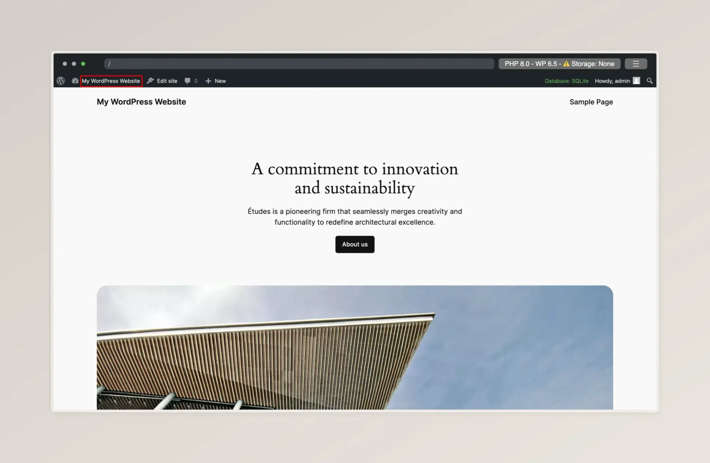

จากนั้นทุกคนจะเจอกับหน้าตาของ WordPress Admin Dashboard ครับ เท่านี้เราก็จะถือว่าเสร็จสิ้นขั้นตอนเตรียมการและพร้อมลุยกันแล้ว!

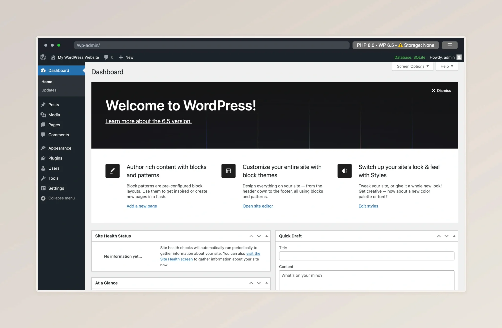

> ⚠️ อีกอย่างนึงที่จะเตือนวันนี้คือเราใช้ WordPress Playground เพื่อความง่ายในการทำตามและไม่ต้องติดตั้งอะไรนะครับ แต่ตัว WordPress Playground จะมีข้อเสียนิดนึงคือ ถ้าเรา Refresh ข้อมูลจะหายครับ ถ้าใครกลัวตรงนี้สามารถทำได้ 2 อย่างครับ อย่างแรกคือกดตรง **“PHP 8.0 – WP 6.5”** ที่มุมบนขวาและเลือก Storage เป็น **Device: stored locally in your device (beta)”** และเลือกว่าจะ Save ที่ Directory ไหนนะครับ ส่วนนี้เลือกได้ตามสบายเลยครับ อย่างที่สองคือการติดตั้ง WordPress ผ่านวิธีการอื่น ๆ ครับซึ่ง[สามารถดูได้ที่ตรงนี้เลยครับ](https://blog.ninprd.com/blog/wordpress-basic-i#where-can-we-try-wordpress)

> ℹ️ และก่อนที่เราจะเริ่มกัน วันนี้นิลขอ Set Convention ไว้นิดนึง ถ้านิลเขียนว่า **Menu 1 > Menu 2** แปลว่าให้เอาเม้าส์ไปชี้ไว้ที่ Menu 1 จากนั้นมันจะมี Menu หลาย ๆ อันงอกขึ้นมาและให้กด Menu 2 ที่มันงอกออกมานะครับ ตัวอย่างคือ สมมตินิลบอกว่าให้ทุกคนไปที่ **Posts > Add New Post** ก็จะเป็นตามภาพนี้ครับ (นิลจะพยายามทำเป็นตัวหนาไว้ให้เพื่อเน้นอีกทีนะครับ)

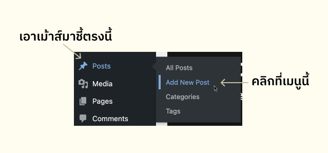

## มาทำความรู้จักหลังบ้าน WordPress (WordPress Admin Dashboard) กันเถอะ

เอาล่ะ นิลอาจจะไม่ได้พาทุกคนเปิดมันทุกเมนูนะ แต่ว่านิลจะพาทุกคนไป Overview ก่อนว่าแต่ละเมนูทำอะไรได้บ้าง ซึ่งจะไปลงลึกอีกทีตอนที่สอนแต่ละ Flow นะครับ โดยแต่ละเมนูมีรายละเอียดดังนี้ครับ

### Posts

เมนูนี้ใช้สำหรับการจัดการ Post ในระบบ เมื่อเราต้องการสร้าง/ลบ/แก้ไข Post ให้มาที่เมนูนี้ครับ นอกจากนี้เรายังสามารถจัดการ Category กับ Tag ได้อีกด้วย โดยหน้าตาจะเป็นแบบนี้

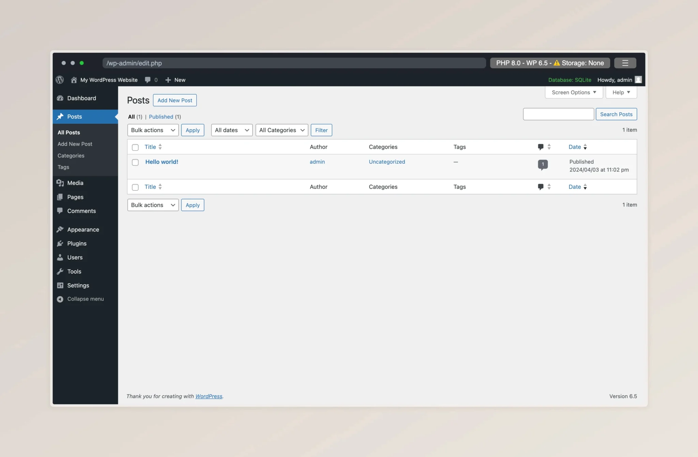

### Media

เมนูนี้จะเป็นเมนูที่เอาไว้จัดการไฟล์ทั้งหมดที่อยู่ในระบบที่เราอัพโหลดขึ้นไปครับ ไม่ว่าจะเป็นรูป วิดีโอ .pdf .xlsx .docx ทั้งหมดเลย พอเข้าไปจะเห็นหน้าตาแบบนี้

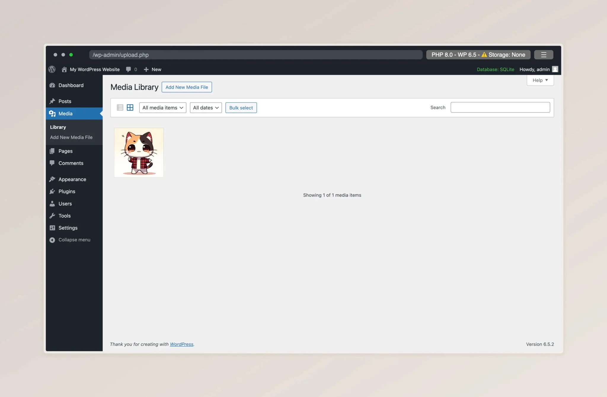

### Pages

เมนูนี้จะใช้สำหรับการสร้าง/แก้ไข/ลบ Page ในระบบครับ เข้ามาเจอหน้าตาแบบนี้เลย

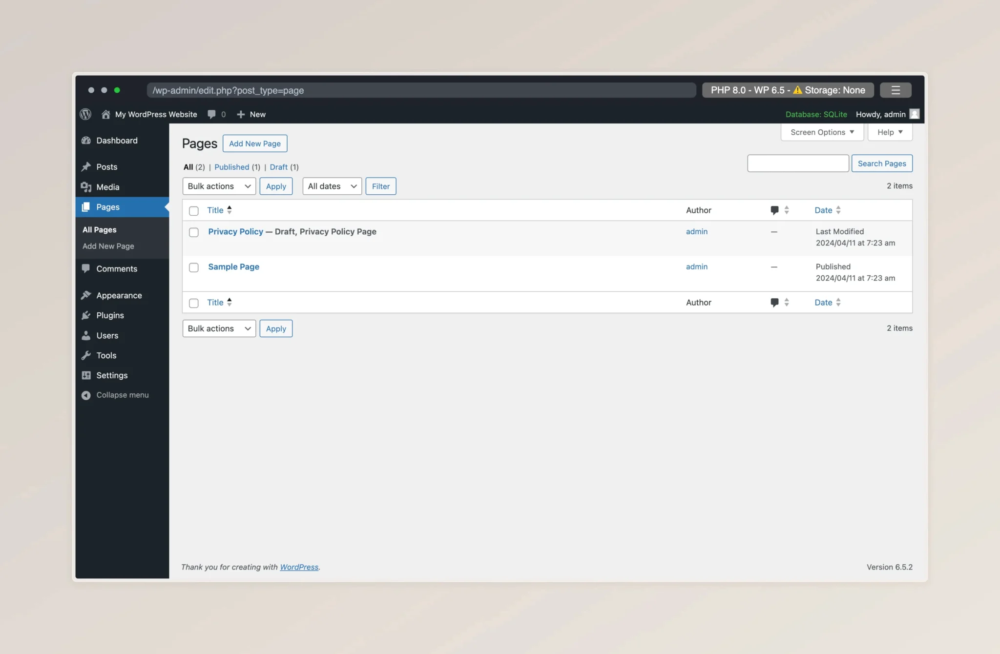

### Appearance

เข้าไปแล้วจะเจอหน้า Themes ที่เรามีในระบบ ซึ่งในเมนูนี้เราจะสามารถมาเลือก Themes ที่จะใช้และก็สามารถแก้ไขการแสดงผลและการตั้งค่าของ Themes ได้อีกด้วยครับ นอกจากนี้เรายังสามารถหา Themes ใหม่และติดตั้งได้อีก ใน Playground หน้านี้จะแสดงผลแบบนี้ครับ

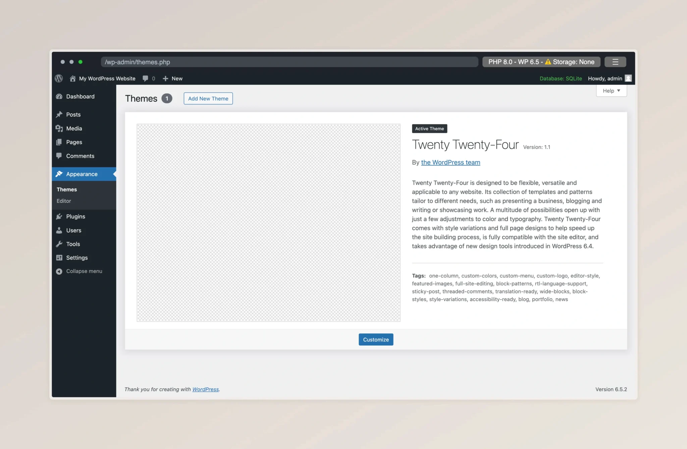

### Plugins

เมนูนี้จะเป็นเมนูที่จะแสดงรายการ Plugin และสามารถเพิ่มเติมหรือลบ Plugin ได้ครับ นอกจากนี้เรายังสามารถแก้ไข File Plugin ในเมนูนี้ได้ด้วยครับ คร่าว ๆ หน้าตาจะเป็นประมาณนี้

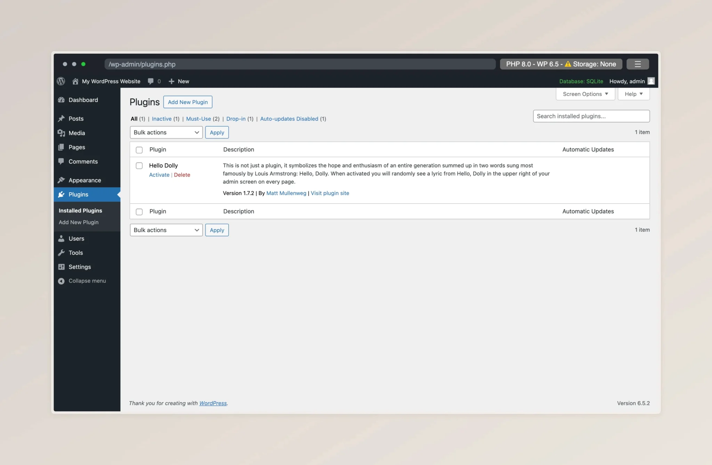

### Users

ในเมนูนี้เราจะสามารถสร้าง User ใหม่ แก้ไขข้อมูลผู้ใช้งาน หรือลบ User ออกไปได้ครับ

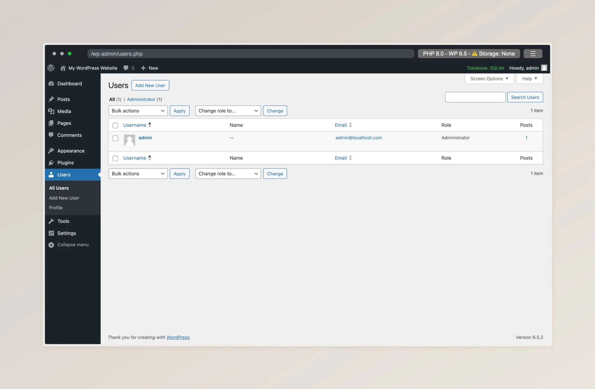

### Tools

อันนี้ในเว็บปกติก็จะเป็น Tools ต่าง ๆ ที่ WordPress เตรียมมาให้ครับ พวกช่วยในการ Import/Export ข้อมูลออกจาก WordPress หรือพวก Convert tags/categories อะไรแบบนี้ รวมทั้ง Site Health ก็อยู่ในนี้ด้วยครับ Site Health จะเป็นตัวที่บอกว่าตอนนี้ Website เราสภาพเป็นยังไง ช้าตรงไหนไหม ต้องอัพเดท Plugins/Themes หรือ Version ของ WordPress ไหม อะไรพวกนั้นครับ

### Settings

อันนี้แน่นอนแหละ เป็นเมนูที่รวมการตั้งค่าของ Website ครับ งานปวดหัว ๆ ส่วนใหญ่อยู่ในนี้แหละ 555555555555

เอาล่ะ หลังจากจุดนี้น่าจะพอเห็น Capabilities ของ WordPress แล้วว่าทำอะไรได้บ้าง เมนูไหนอยู่ตรงไหน ทีนี้นิลจะพาทุกคนไปรู้จักกับอีกส่วนนึงที่สำคัญของ WordPress นั่นคือ WordPress Block Editor ครับ

## มารู้จักเจ้า WordPress Block Editor กันดีกว่า

ในขั้นตอนนี้นิลจะพาทุกคนมารู้จักเจ้า WordPress Block Editor ครับ ตัว Editor ตัวนี้จะเป็นตัวที่ใช้สร้าง Content ประเภท Post และ Page ครับ ตัวชื่อของมันก็บอกเป็นกลาย ๆ นะครับว่ามันคือการเอา Block มาวางต่อกันเรื่อย ๆ จนได้ Content ออกมานะครับ ซึ่งเดี๋ยวนิลจะพาไปดูเป็นส่วน ๆ ครับ

### เริ่มจากวิธีการเข้าไปใช้ตัว WordPress Block Editor

การที่จะเข้าไปใช้เจ้า WordPress Block Editor เนี่ย เราจะต้องเข้าผ่านเมนู Posts หรือ Pages นะครับ ให้ลองเข้าจากเมนู **Posts > Add New Post** หรือ **Pages > Add New Page** ดูครับ ในตัวอย่างของนิลจะเข้าผ่านเมนู Posts นะครับ พอเข้ามาแล้วจะเห็นเมนูแบบนี้ครับ

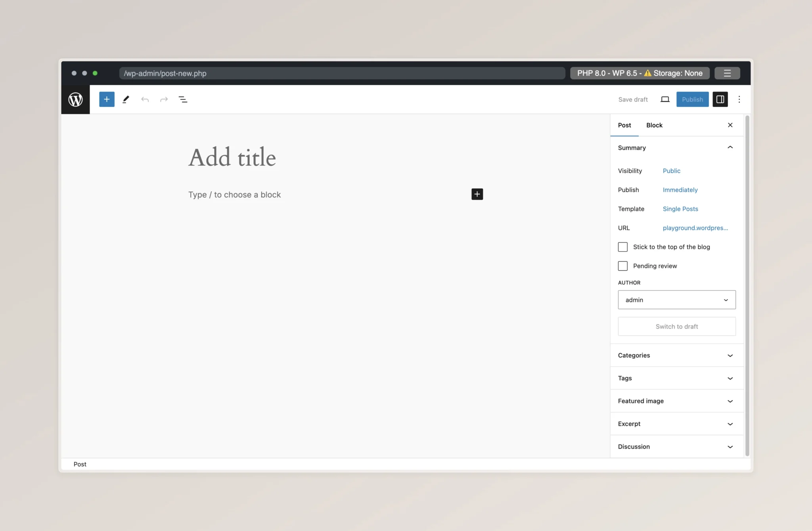

### ส่วนประกอบของ Block Editor

จากที่เราเห็นหน้าตาของเจ้า WordPress Block Editor ไปแล้ว เราจะมาดูแต่ละส่วนของ WordPress Block Editor กัน ซึ่งตัว WordPress Block Editor เนี่ยก็จะถูกแบ่งเป็น 3 ส่วนคือ Top Toolbar, Content Area, และ Sidebar ครับ

#### Top Toolbar

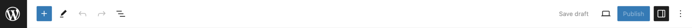

#### Content Area

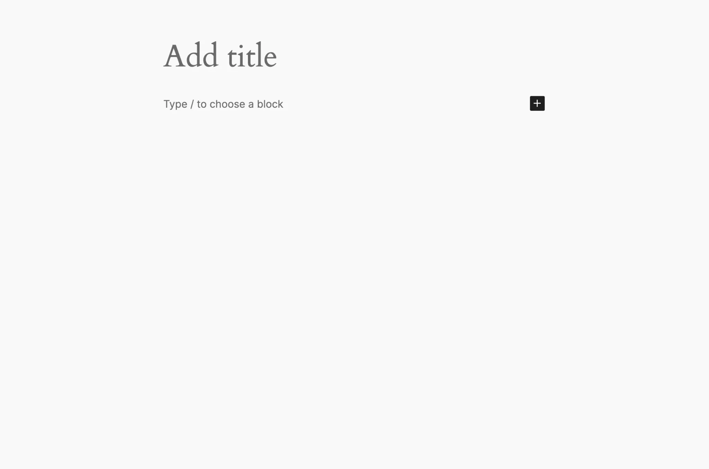

อันนี้เป็นจุดที่เราจะเขียน Content เลยครับ เราจะใส่หัวข้อของ Post/Page ที่ตรงที่มีคำว่า _“Add title”_ และในส่วนข้างล่างจะเป็นเนื้อหาของ Post/Page ครับ

#### Sidebar

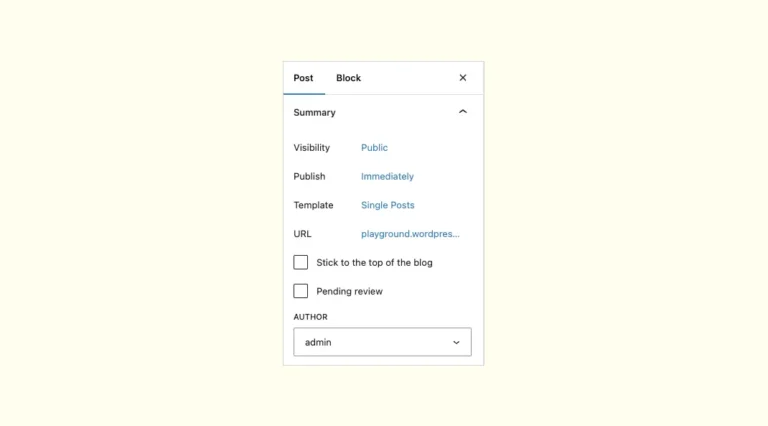

อันนี้จะเป็นส่วนที่เป็นการตั้งค่าของ Post/Page นั้น ๆ นะครับ

โดยรายละเอียดของแต่ละเมนูนิลจะแอบแนะนำว่าให้ไปอ่านใน [Documentation ตัว WordPress Block Editor ของ WordPress](https://wordpress.org/documentation/article/wordpress-block-editor/) ดีกว่าครับ มีการอธิบายแต่ละจุดแบบละเอียดเลยครับ ถ้าแบบไม่อยากอ่านตัวอักษรเยอะเกิน จริง ๆ ลองกด ๆ ใช้ ๆ ของไปเรื่อยก็ได้ครับ มันอาจจะดูเยอะ แต่เดี๋ยวเราใช้ไปเรื่อย ๆ ละเราก็จะชินเองครับ

## ทำความเข้าใจวิธีการสร้าง Post และ Page

จริง ๆ วิธีการสร้าง Post กับ Page จะคล้าย ๆ กันเลยครับ นิลขอเริ่มที่ Post ก่อนแล้วกัน

### มาลองสร้าง Post กันเถอะ

ในขั้นตอนแรกเลยนะครับ ให้ทุกคนไปที่เมนู **Posts > Add New Post** นะครับ เราจะเจอหน้าตัว WordPress Block Editor ครับ โดยเบื้องต้นเราจะกรอกข้อมูล 2 อย่างคือ “Title” และ “Content” ลงใน **[Content Area](#content-area)** ครับ 2 ข้อมูลนี้จะเป็นข้อมูลหลักที่เราจะแสดงในหน้าเว็บไซต์และช่วยทำให้คนอื่นสามารถค้นหาเว็บเราผ่าน Search Engine หรือก็คือเป็นการปรับปรุง SEO ให้กับเว็บไซต์ครับ อาจจะลองใส่หัวข้อกับเนื้อหาของตัวเองเป็นอะไรก็ได้ไปเลยครับ ส่วนนิลจะลองกรอกอะไรแบบนี้ลงไปครับ

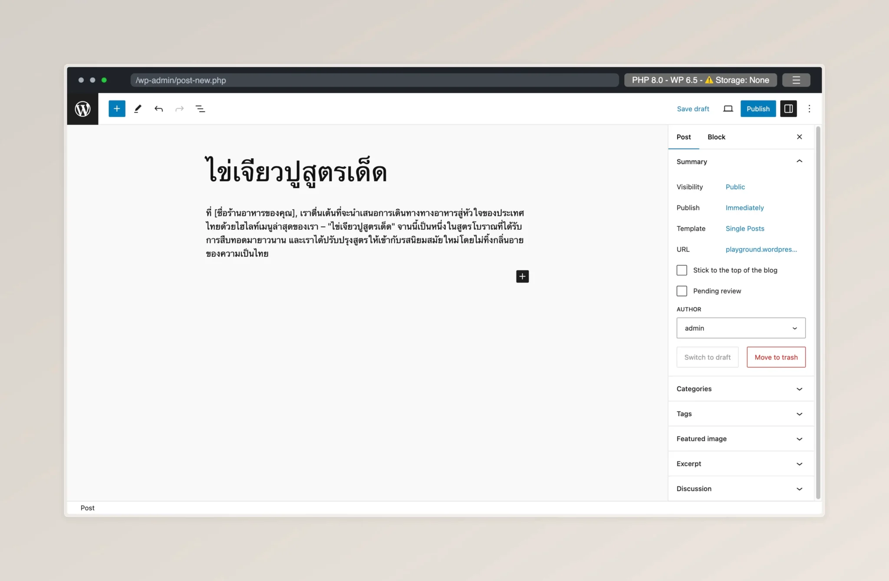

ทีนี้นอกจากใส่แค่ตัวอักษรแล้ว เราก็ยังสามารถใส่ Block ที่เป็นรูปแบบอื่น ๆ ได้อีกครับ ซึ่งเราจะสามารถกดดู Block ที่สามารถเพิ่มทั้งหมดได้ด้วยการกดปุ่ม + ที่มุมบนซ้ายครับ

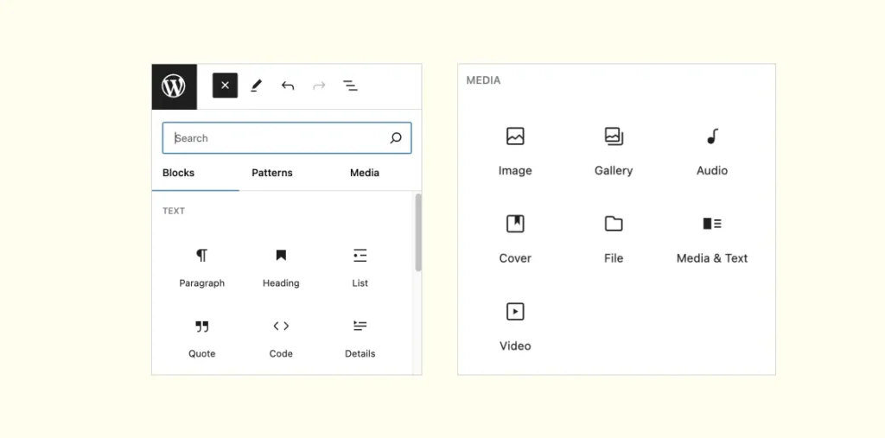

เอาล่ะ นอกจากการใส่เนื้อหาแล้ว เรายังสามารถใส่ข้อมูลที่ติดไปกับ Post ได้อีก 4 อย่าง นั่นคือ Categories, Tags, Featured Image และ Excerpt ซึ่งเราจะสามารถหาการกรอกข้อมูลเหล่านี้ได้ที่บริเวณ **[Sidebar](#sidebar)** ของเจ้า WordPress Block Editor ครับ

#### Categories & Tags

ถ้าใครจำ Categories กับ Tags ไม่ได้ ก็สามารถกลับไปอ่านหัวข้อ [Taxonomies ใน WordPress Basic I](https://blog.ninprd.com/blog/wordpress-basic-i#what-are-taxonomies) ได้ครับ แต่อธิบายในมุมของการสร้าง Post นิดนึงคือเราสามารถที่จะติด Categories กับ Tags ให้กับ Post ผ่าน Sidebar ได้ครับ ซึ่งเดี๋ยว[วิธีการจัดการ Category และ Tag](https://blog-ninprd.vercel.app/blog/wordpress-basic-ii#how-to-manage-category-and-tag) เนี่ย นิลจะ Cover ไว้ด้านล่างนะครับ

#### Featured Image

อันนี้อาจจะเป็นศัพท์ใหม่นิดนึง ซึ่งเจ้า Featured Image เนี่ย มันคือรูปที่จะเป็นหน้าปก Post ในหน้าเว็บไซต์กับเวลาที่เราแชร์ลิงก์ Post ของเราตามช่องทาง Social Media ต่าง ๆ ครับ เจ้ารูปนี้ก็เป็นปัจจัยนึงที่ดึงดูดให้คนเข้ามาอ่าน Post ของเรานะครับ

#### Excerpt

อันนี้ก็เป็นศัพท์ใหม่อีกคำนึงครับ Excerpt นั้นเปรียบเสมือนคำเปรยของบทความ เป็นส่วนย่อของบทความที่อธิบาย Post นั้น ๆ แบบย่อ ดังนั้นการเขียน Excerpt ที่ดีเหมือนเป็นการเชื้อเชิญผู้คนให้เข้ามาอ่านบทความของเรามากขึ้นครับ

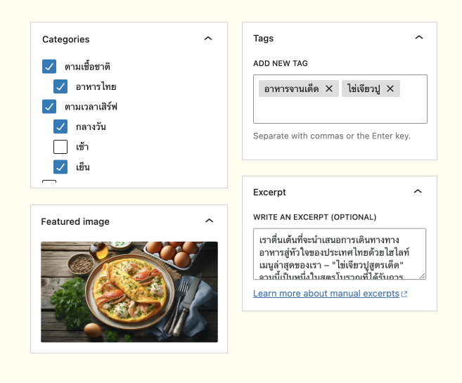

ซึ่งเมื่อเราใส่ข้อมูลพวกนี้หมดแล้วครับ เราสามารถที่จะกด _“Publish”_ ที่มุมบนขวาได้เลยครับ เท่านี้เราก็จะได้ Post แรกกันแล้ว เราสามารถกด _“View Post”_ ที่ขึ้นมาที่มุมล่างซ้ายได้ครับ เท่านี้ก็เราก็จะเห็นแล้วว่าในเว็บเรา หน้า Post จะเป็นยังไง

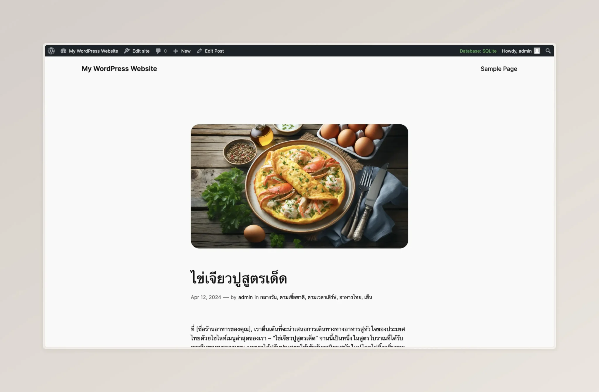

### แล้วการสร้าง Page ขั้นตอนเป็นยังไงบ้างนะ

ให้ทุกคนไปที่เมนู **Pages > Add New Page** ครับ แล้วก็จะเจอ Modal อันนึงที่จะให้เราเลือก Template ต่าง ๆ ที่จะเอามาใช้กับ Page เราได้ครับ เหมือนเป็นแบบรูปแบบต่าง ๆ ที่จะทำให้เราสร้างหน้าสวย ๆ ได้เร็วขึ้นครับ โดย Template พวกนี้ก็จะมากับ Theme นั่นแหละ แต่ในวันนี้เราจะยังไม่ใช้สิ่งนี้ก่อนครับ ขอให้ทุกคนกดปิดที่มุมขวาบนของ Modal ครับ

เมื่อปิด Modal แล้ว เราจะเจอสิ่งที่เราคุ้นเคยครับ เจ้า WordPress Block Editor นั่นเอง 55555 เราก็สามารถใส่ข้อมูล Title และ Content ได้เหมือนใน Post เลยครับ และก็ยังสามารถใส่ Featured Image ที่ Sidebar ได้เหมือน Post เลยครับ แต่จะแตกต่างกันที่ว่าเราจะไม่สามารถแบ่ง Category กับ Tag ของ Page ได้ครับ

อีกอย่างนึงที่ Page ทำได้มากกว่า Post คือการสร้างหน้าที่เป็นระดับชั้น (Hierarchical) ครับ นิลยกตัวอย่างเช่นนิลมีหน้าเกี่ยวกับเราของบริษัทซึ่งหน้าหลักนิลก็อาจจะแนะนำบริษัทไปครับ และในหน้าเกี่ยวกับเรานิลก็จะสร้างหน้าภายใต้หน้านี้เป็นหน้าแนะนำทีมครับ เดี๋ยวนิลลองทำให้ทุกคนเห็นภาพมากขึ้นนะครับ

ก่อนอื่นเลย นิลสร้างหน้า “เกี่ยวกับเรา” ก่อนครับ

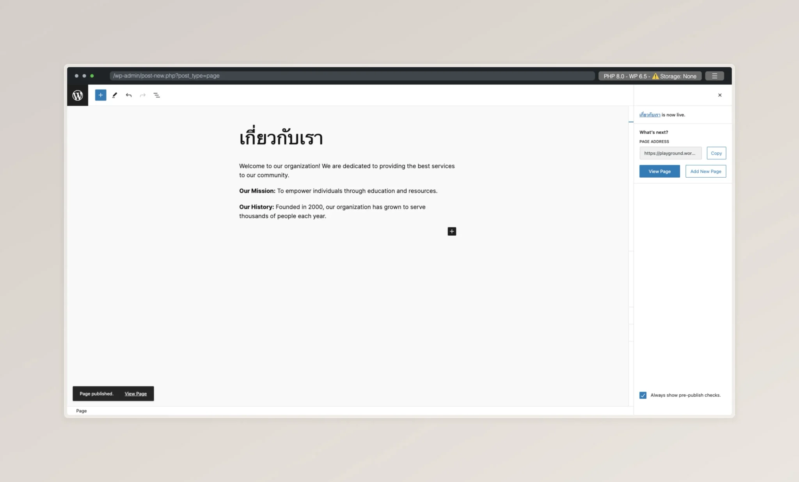

พอนิลสร้างแล้ว Publish เสร็จ นิลก็ไปสร้างอีก Page นึงที่ชื่อว่า “ทีมของเรา” ครับ ซึ่งในขั้นตอนที่เราจะสร้างหน้ารองนั้น ให้เราไปที่เมนูด้านขวา กดที่เมนู Page Attributes ครับ

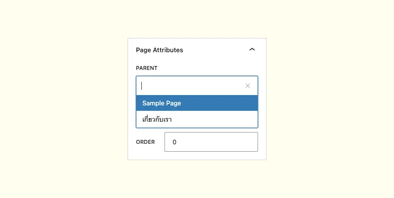

เมื่อกดและกางออก เราก็จะเห็นว่าเราสามารถกรอก Parent หรือหน้าหลักได้ ซึ่งให้เราลองกรอกเป็นหน้าเกี่ยวกับเราก็ได้ครับ เท่านี้ก็เป็นอันเรียบร้อยในการสร้างหน้าย่อยหรือในศัพท์ฝั่ง WordPress เรียกว่า Child Page แล้วครับ โดยเราจะเข้าหน้าทีมของเราจากที่เราเข้าหน้าเว็บแล้วเอาเม้าส์ไปชี้ไปที่คำว่า “เกี่ยวกับเรา” นะครับ

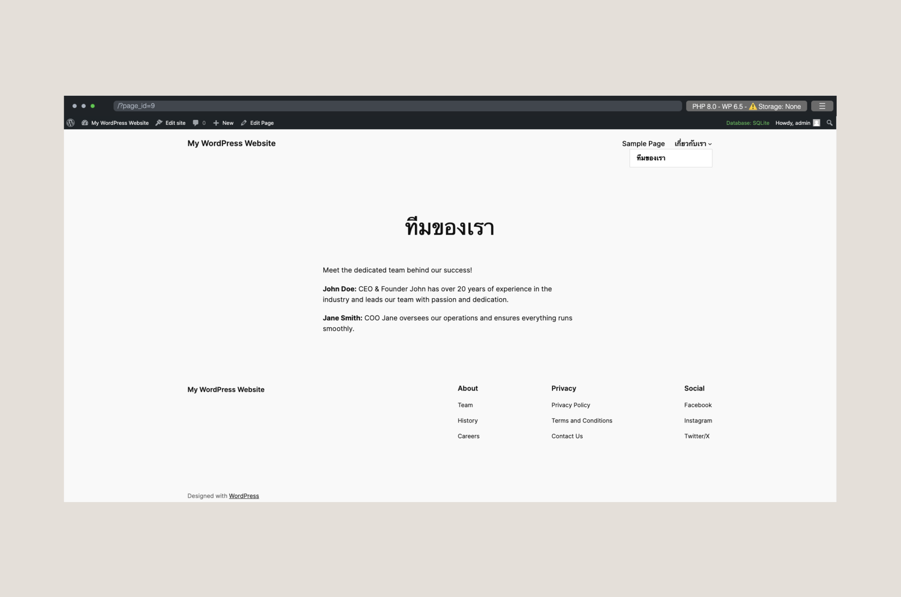

## ทำความเข้าใจวิธีการจัดการ Category

เราสามารถจัดการกับ Category ได้ 2 ที่คือที่หน้าเมนู Categories กับภายในการสร้าง Post นะครับ เดี๋ยวนิลจะพาไปดูในแต่ละจุดกัน

### การจัดการ Category ในเมนู Categories

เริ่มแรกให้เราเข้ามาที่เมนู **Posts > Categories** เลยครับ เราจะเจอหน้าตาแบบนี้ครับ

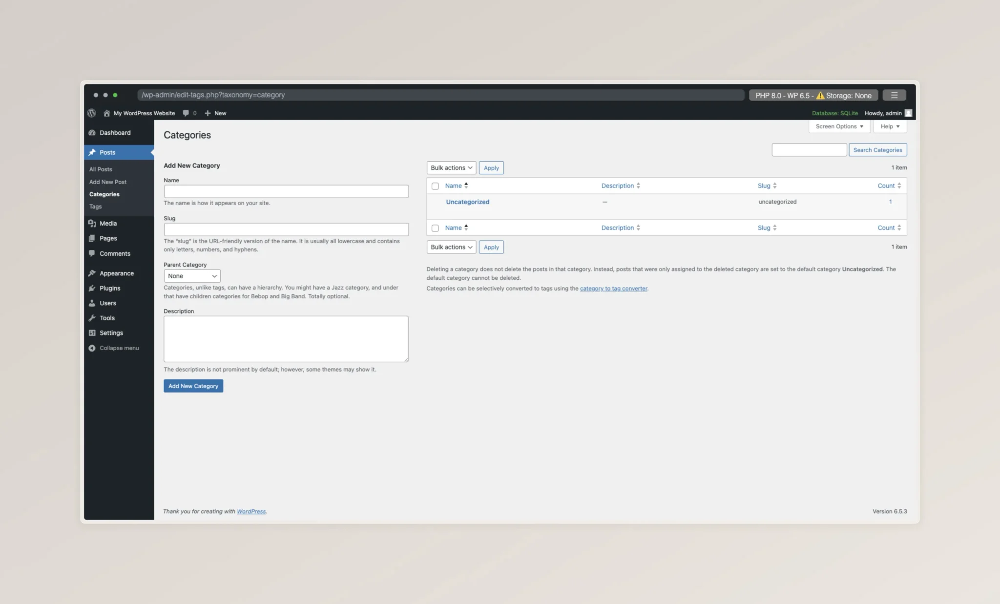

ในหน้านี้นอกจากดู Categories ทั้งหมดแล้ว เราสามารถทำได้ 3 อย่าง ดังนี้

#### สร้าง Category ใหม่

ในหน้า Categories ใน Section ฝั่งซ้ายมือ เราจะสามารถกรอกข้อมูลเหล่านี้เพื่อสร้าง Category ได้

- **Name**: ชื่อของหมวดหมู่นั้น ๆ
- **Slug** **(Optional)**: เป็น URL-friendly Version ของชื่อครับ ซึ่งถ้าเราไม่ตั้งมันจะ Auto-Generate จากชื่อ ตอนแรกปล่อยไปก่อนได้ครับ
- **Parent Category (Optional)**: อย่างที่นิลเคยบอกไปว่าเราสามารถสร้าง Category แบบมีระดับชั้นได้นะครับ ดังนั้นอันนี้คือเหมือนเราสามารถเลือกได้ว่า Category ที่เราจะสร้างจะไปอยู่ใต้ Category ไหนครับ
- **Description (Optional)**: เป็นที่ที่แสดงรายละเอียดของ Category ครับ ซึ่งปกติแล้วก็แค่เหมือนเอาไว้ Remark เวลาทำงานร่วมกันว่าหมวดหมู่นี้ไว้ใช้ทำอะไร อะไรประมาณนั้นครับ

พอกรอกข้อมูลเหล่านี้เสร็จแล้ว ก็กดปุ่ม _“Add New Category”_ ครับ เราก็จะได้ Category ใหม่แล้ว

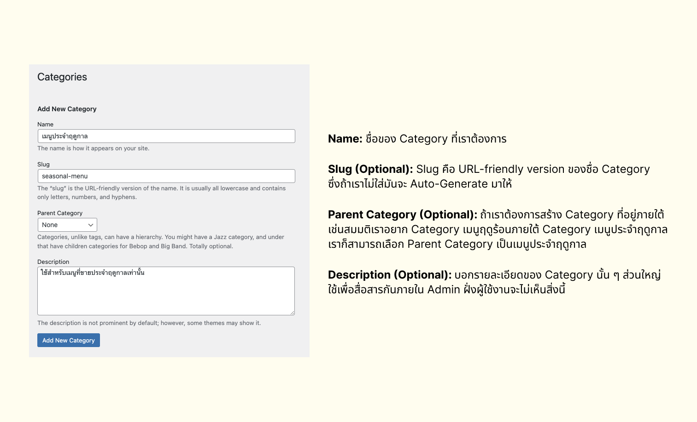

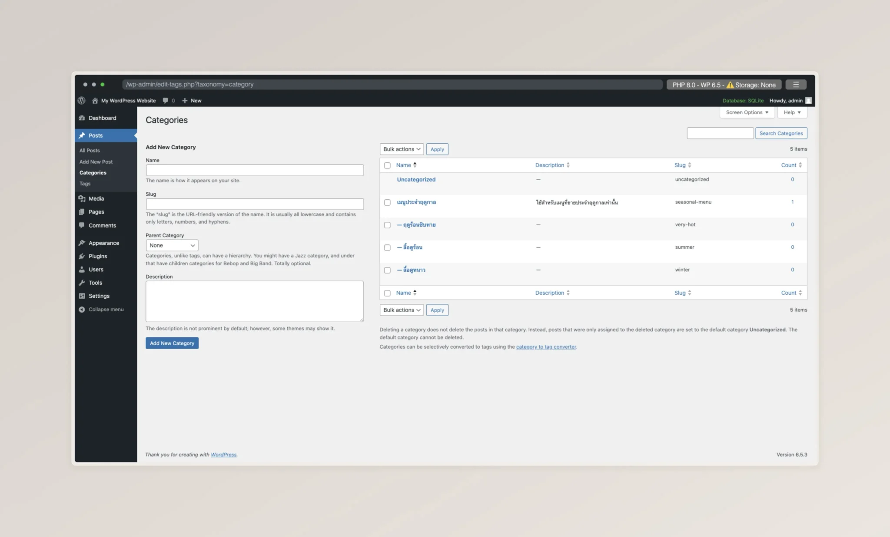

#### แก้ไข Category

หากต้องการจะแก้ไข Category ให้เราเอาเม้าส์ไปวางไว้ที่ Category นั้น ๆ ครับ แล้วมันจะมีปุ่ม Edit ให้กดครับ ซึ่งมันจะเอาข้อมูลของ Category ครับ ซึ่งเมื่อกดไปเราจะเจอหน้าที่ให้แก้ไขรายละเอียดต่าง ๆ ที่เราเคยกรอกไปตอนสร้างครับ

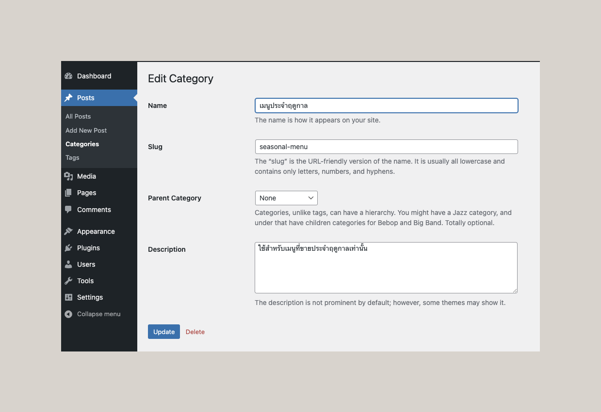

#### ลบ Category

การลบ Category นั้น ทำคล้ายกับการแก้ไขเลยครับ เอาเม้าส์ไปชี้ที่ Category ที่ต้องการลบแล้วปุ่ม Delete จะแสดงออกมา ให้เรากดปุ่มนั้น และกดยืนยันอีกครั้งครับ

นอกจากการลบทีละ Category แล้ว เรายังสามารถ Bulk Delete หรือลบหลาย ๆ ตัวพร้อมกันได้ด้วยนะ ซึ่งวิธีการคือติ๊กที่ Checkbox ของ Category ที่ต้องการลบทุกตัวครับ จากนั้นกดเมนู **Bulk actions** ที่อยู่เหนือตารางแล้วเปลี่ยนเป็นคำว่า Delete ครับ สุดท้ายคือกดปุ่ม Apply เท่านี้เราก็สามารถลบ Category หลาย ๆ อันได้แล้วครับ

> ⚠️ ข้อควรระวัง 1: การลบ Category เป็น Action ที่ไม่สามารถย้อนคืนได้ หมายความว่าลบแล้วลบเลย ควรมีสติก่อนที่จะทำทุกครั้ง

> ⚠️ ข้อควรระวัง 2: เมื่อเราสร้าง Category ที่มี Child Category แล้ว เมื่อเราลบตัวพ่อออก มันจะไม่ได้ลบตัวลูกทั้งหมด แต่ตัวลูกจะขยับ Level ขึ้นมาเป็น Parent แทนนะครับ หากต้องการลบหลาย ๆ อันให้ใช้ Feature Bulk Delete ที่พูดถึงไปในเมนูลบหลาย ๆ อันแทนนะครับ

### การสร้าง Category ในหน้าการสร้าง Post

อันนี้ให้เราลองกลับไปที่เมนู Posts และคลิกไปที่ชื่อของ Post ที่เราเพิ่งสร้างเพื่อเข้าไปดูหน้า WordPress Block Editor ครับ ในเมนู Categories เราจะเห็นว่าในตอนแรกนั้น มันจะมีแค่ Uncategorized ให้เลือก ซึ่งเราก็จะเห็นปุ่มคำว่า _“Add New Category”_ ครับ เราสามารถคลิกเพื่อเพิ่ม Category ภายใน Post ได้เลยครับ ซึ่งข้างในนี้เราก็สามารถสร้างหมวดหมู่กับหมวดหมู่ย่อยได้อย่างเดียว หากต้องการลบหรือแก้ไขต้องไป[ทำผ่านเมนู Categories](#how-to-manage-category-in-categories-menu) นะครับ แค่นี้เราก็สามารถสร้าง Category ภายในหน้า Post ได้แล้วครับ

## ทำความเข้าใจวิธีจัดการ Tag

สำหรับ Tag ก็จะคล้าย ๆ Category เลยครับ สามารถจัดการได้ 2 ที่คือที่เมนู Tags และภายในหน้า Block Editor ระหว่างสร้าง Post นะครับ เหมือนเดิมเลย เดี๋ยวนิลพาไปดูในแต่ละรายละเอียดกันครับ

### การจัดการ Tag ผ่านเมนู Tags

เราสามารถเข้าถึงเมนู Tags จาก **Posts > Tags** ซึ่งเมื่อเราเข้ามาเราก็เห็นหน้าตาที่คุ้นเคยอีกแล้ว ใช่ครับ หน้าตามันเหมือนกับของ Categories เลยครับ ต่างกันอย่างเดียวคือเราไม่สามารถ Assign Parent Category ได้ครับ

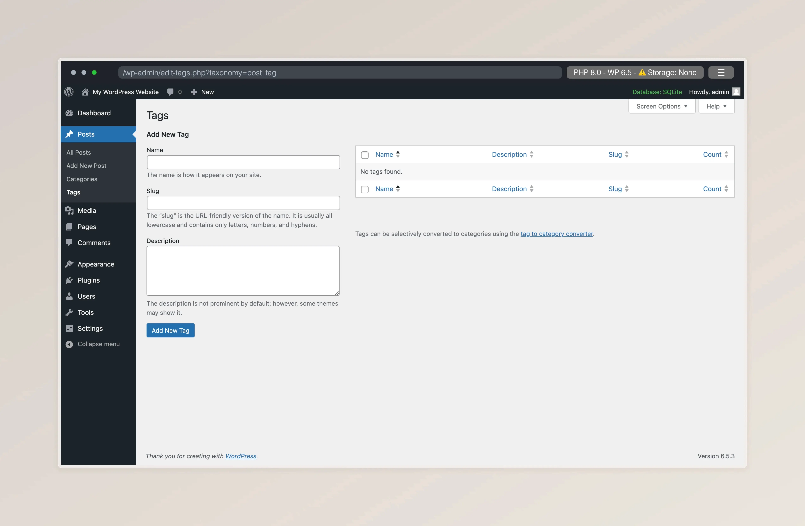

### การสร้าง Tag ในหน้าการสร้าง Post

อันนี้ก็จะให้ทุกคนกลับไปที่เมนู Posts และคลิกไปที่ชื่อของ Post ที่เราสร้างไปก่อนหน้านี้ครับ จากนั้นเราจะเห็นเมนู Tags ซึ่งในหน้านี้เราจะสามารถพิมพ์ชื่อ Tag และกด Enter เสียงดังเปรี้ยง เพื่อสร้าง Tag ใหม่ในหน้า Block Editor ได้เลย ซึ่งในหน้านี้เราก็จะสามารถเพิ่ม Tag ได้อย่างเดียว ไม่สามารถลบหรือแก้ไขได้ฮะ เหมือน Categories เลยครับ เราต้องไป[ทำผ่านเมนู Tags](#how-to-manage-tag-in-tags-menu) ครับ

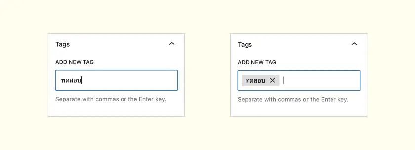

## มาเข้าใจการจัดการ Media กันต่อ

เอาล่ะ อีกส่วนนึงที่เราใช้กันบ่อยคือเจ้า Media ครับ ไม่ว่าเราจะเอารูปไปใส่ไว้ในหน้าต่าง ๆ ใส่ข้อมูล Featured Image หรือเอาพวก File PDF หรือ XLSX อัพโหลดขึ้นระบบเราเนี่ย ก็จะอยู่ใน Media หมดเลยครับ ใน Section นี้นิลก็จะพาไปดูการจัดการ Media ผ่านเมนูต่าง ๆ ครับ

### การดู Media ทั้งหมดที่อยู่ในระบบเรา

ในการที่เราจะทำได้ เราจะต้องเข้าผ่านเมนู **Media > Library** ครับ ซึ่งเมื่อเราเข้ามาเราจะเห็น Media ที่อยู่ในระบบของเราทั้งหมดครับ

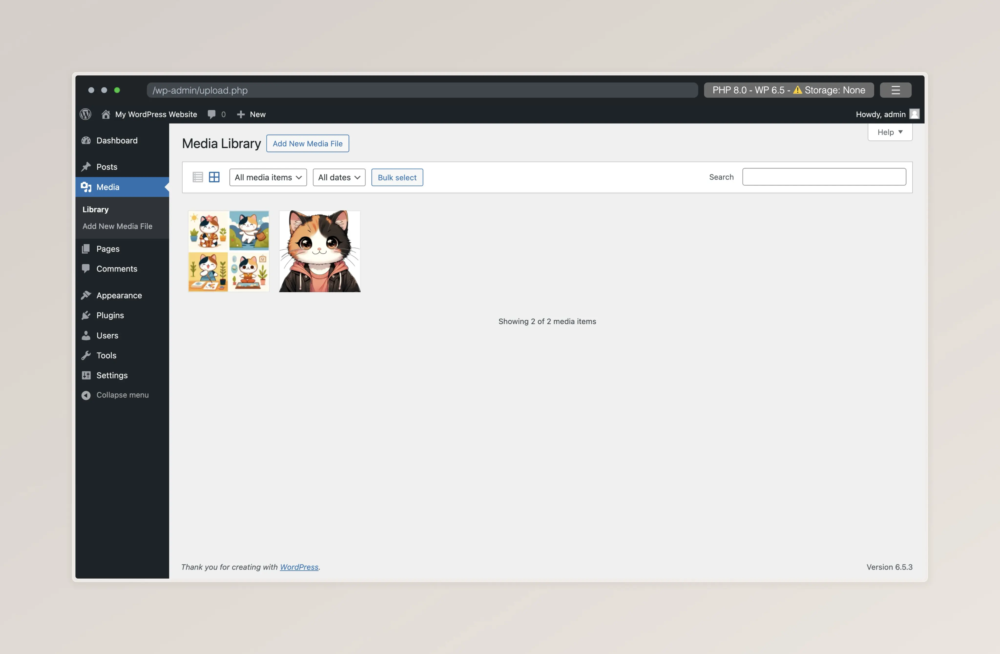

### การอัพโหลด Media ผ่านเมนู Media

เราสามารถอัพโหลดผ่านการเข้าเมนู **Media > Library** ครับ จากนั้นให้เรากดปุ่ม _“Add New Media File”_ ที่ด้านบนข้าง ๆ คำว่า Media Library ครับ เมื่อกดแล้วมันจะขึ้นเป็นเหมือน Dropzone ให้เราสามารถโยนไฟล์เข้าไปได้นะครับ เราสามารถลากไฟล์ที่เราอยากอัพโหลดไปวาง หรือว่าเราสามารถกดที่ปุ่ม _“Select Files”_ ได้ครับ

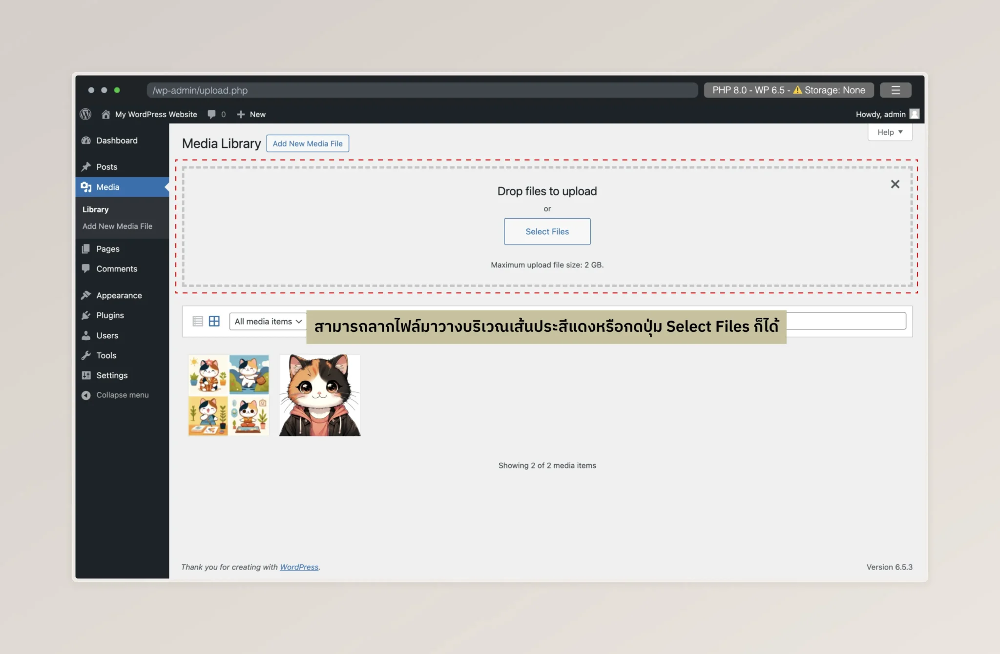

### การอัพโหลด Media ผ่านการสร้าง Post/Page

ในการอัพโหลด Media ผ่านการสร้าง Post/Page หรือตอนที่เรากำลังใช้เจ้า WordPress Block Editor นั้น ให้เราเข้าไปที่ Post ที่เราต้องการแทรกรูปครับ จากนั้นเข้าไป Edit Post นั้น ๆ ครับ เมื่อเข้าไปแล้วกดที่บรรทัดก่อนที่เราจะแทรกรูปแล้วกดปุ่ม + ที่ขึ้นมาหรือว่ากดปุ่ม + ที่อยู่มุมบนซ้ายได้ครับ แล้วให้เราเลือก Block ที่เกี่ยวกับ Media เช่น ใช้ Block ชื่อ Image เพื่อแสดงรูป หรือใช้ Block ชื่อ Video เพื่อแสดง Video เมื่อเราเพิ่ม Block พวกนี้มา มันจะมีปุ่มให้เราเลือกว่าเราจะอัพโหลดรูปใหม่หรือใช้รูปในระบบนะครับ ซึ่งแน่นอนกว่าหัวข้อนี้ต้องการจะพาทุกคนอัพโหลดเพราะงั้นก็กดอัพโหลดแล้วก็เลือกไฟล์ที่ต้องการได้เลยครับ เท่านี้ก็เป็นอันเรียบร้อยกับการเพิ่มไฟล์ Media ผ่านการสร้าง Post/Page แล้วครับ

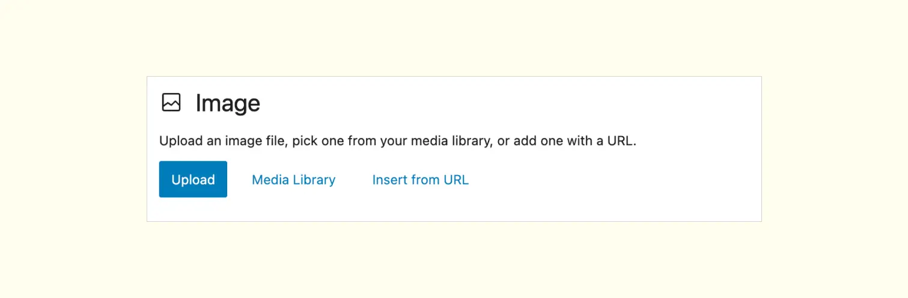

### การลบ Media ภายในเว็บไซต์เรา

หากเราอยากจะลบของชิ้นไหนใน Media Library เราแค่กดที่ของชิ้นนั้น ๆ ครับและสังเกตที่มุมล่างขวา เราจะเจอปุ่มเขียนว่า _“Delete Permanently”_ ให้เรากดที่ปุ่มนั้นครับ เรียบร้อย จบละ 5555555 เห็นมะ ง่ายนิดเดียวเอง

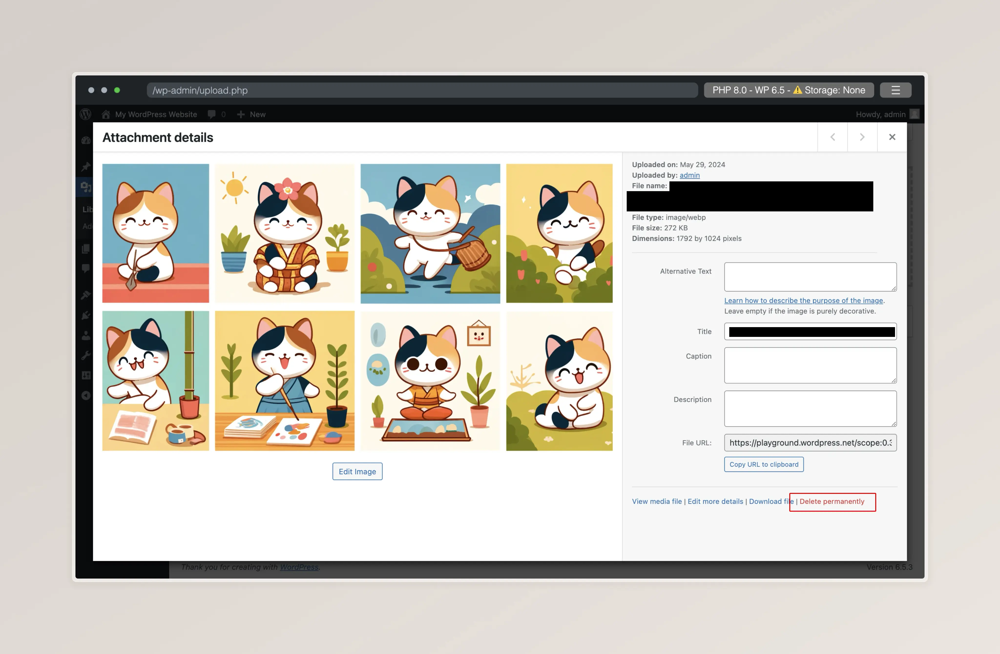

## เอาล่ะ เนื้อหาวันนี้จบแล้วฮะ Recap กันซักเล็กน้อยว่าใน Blog นี้เราได้รู้อะไรไปเพิ่มบ้าง

- เราได้รู้ว่าใน WordPress Admin มีเมนูอะไรบ้าง
- WordPress Block Editor ใช้เพื่อใส่ Content สำหรับ Post/Page มีส่วนประกอบหลัก ๆ คือ Top Toolbar, Content Area, และ Sidebar สามารถดูวิธีการใช้ที่ Docs ของ WordPress แต่ถ้าขี้เกียจอ่าน ลองก๊อก ๆ แก๊ก ๆ เล่นดูครับ สุดท้ายเดี๋ยวชินเอง
- เราได้รู้ว่าสร้าง Post และใส่ข้อมูลต่าง ๆ ให้กับ Post ยังไง
- เราได้รู้วิธีการสร้าง Page และการสร้าง Child Page นั้นทำยังไง
- เราได้รู้ว่าจัดการ Category กับ Tag ยังไง
- เราได้รู้ว่าจัดการ Media ในระบบเรานั้น ทำยังไง

---

จบไปแล้วกับ Blog ตัว WordPress Basic II วันนี้อาจจะดูเหมือนเนื้อหาเยอะ แต่จริง ๆ ยังเป็นแค่ Basic อย่างที่เราเห็นเลยครับ เรายังไม่ได้เลยว่ามันจะกลายเป็นเว็บไซต์จริง ๆ ได้ยังไง แต่อย่าเพิ่งท้อครับ Basic ของ WordPress จริง ๆ จะค่อนข้างเยอะ แต่พอเราทำไปเรื่อย ๆ เรื่องพวกนี้มันจะซึมเข้าไปเองครับ ยังไงก็สู้ไปด้วยกันครับ ถ้าคนเสพคอนเทนต์ไม่ท้อ คนทำก็ไม่ท้อครับ ในตอนต่อไป เราจะพาไปดูเรื่องของวิธีการแสดงผลของ Post และ Page พาทุกคนไปรู้จัก Archive Page การจัดการ User และสิทธิ์ของ User ในระบบ รวมถึงเรื่อง Security เบื้องต้นครับ รอติดตามกันได้เล้ย

– นิล –