เอาล่ะ วันนี้มาใน Part Basic 3 กันต่อ ใน Part ที่แล้วเราเรียนเรื่องการใช้งาน WordPress Admin Dashboard ไปเกือบครบละ ใน Part นี้เราจะเอาเรื่อง WordPress Admin Dashboard มาเล่าให้ครบครับ ใน Part นี้จะมีหัวข้อหลัก ๆ ประมาณนี้

ps. ใครที่ยังไม่ได้อ่าน Part I หรือ Part II นิลแนะนำให้กลับไปอ่านก่อนน้า สามารถกดกลับไปอ่านได้ที่นี่เลย

ส่วนใครที่พร้อมแล้ว ใครมาจาก Part II และยังเปิด Playground อยู่ ใช้อันนั้นต่อได้เลยครับ ส่วนใครยังไม่เปิด เปิด [WordPress Playground](https://playground.wordpress.net/) ละไปลุยกันเลยครับ ✊🏻

## Archive Page คืออะไร

Archive Page คือหน้าที่แสดงรายการ Post ที่ถูก Group ด้วย Criteria หนึ่ง ๆ ยก อะ นิลว่างงแน่ งั้นนิลยกตัวอย่างเช่น Archive Page ของหมวดหมู่ “นิลเล่า” ก็จะเป็นรายการ Post ทั้งหมดที่อยู่ภายใต้หมวดหมู่ “นิลเล่า” หรือ Archive Page ของ User คนหนึ่งก็จะเป็นรายการ Post ทั้งหมดที่เผยแพร่โดย User คนนั้น โดยปกติแล้ว WordPress จะมี Archive Page สำหรับการ Grouping เหล่านี้

- **Author Archive:** เห็น Post ทั้งหมดของ **ผู้เขียน** คนนี้
- **Date Archive:**
    - **Year Archive:** เห็น Post ทั้งหมดที่ Post ใน **ปี** นั้น ๆ
    - **Month Archive:** เห็น Post ทั้งหมดที่ Post ใน **เดือน** นั้น ๆ
    - **Day Archive:** เห็น Post ทั้งหมดที่ Post ใน **วัน** นั้น ๆ
- **Category Archive:** เห็น Post ทั้งหมดใน **หมวดหมู่** นั้น ๆ
- **Tag Archive:** เห็น Post ทั้งหมดใน **Tag** นั้น ๆ

สิ่งนี้สำคัญยังไง ทำไมนิลถึงมาอธิบายตรงนี้ จริง ๆ นิลอยากจะอธิบายใน Part ที่แล้วแหละ แต่รู้สึกว่าเนื้อหามันเยอะแล้ว นิลเลยแยกออกมาไว้ในบทนี้แหะ 5555 แต่ ๆๆๆ นอกเหนือจากนั้น ตัว Archive Page ยังเป็นสิ่งที่เราใช้กันบ่อย ๆ ด้วย ยกตัวอย่าง เช่น เวลาที่นิล Post บทความต่าง ๆ และติด Tag “นิลเล่า” ถ้าใครอ่านไปซักพักนึงอาจจะรู้สึกอยากอ่าน Blog ใน Tag “นิลเล่า” อันอื่น ๆ เราก็สามารถวางลิงก์ที่พาทุกคนไปที่หน้า Archive Page ของ Tag “นิลเล่า” ได้เพื่อให้เขาไปเจอหน้าที่มีรายการ Post ที่เขาต้องการอ่าน รวมถึงเรายังสามารถเอา Archive Page วางอยู่ใน Header หรือ Footer ของเว็บไซต์เพื่อพาผู้ใช้งานไปยังหน้ารวม Post ที่เราต้องการได้อีกด้วยครับ

อันนี้นิลลองเอาตัวอย่างของการวาง Archive Page ตามจุดต่าง ๆ ของเว็บไซต์มาให้ดูครับ

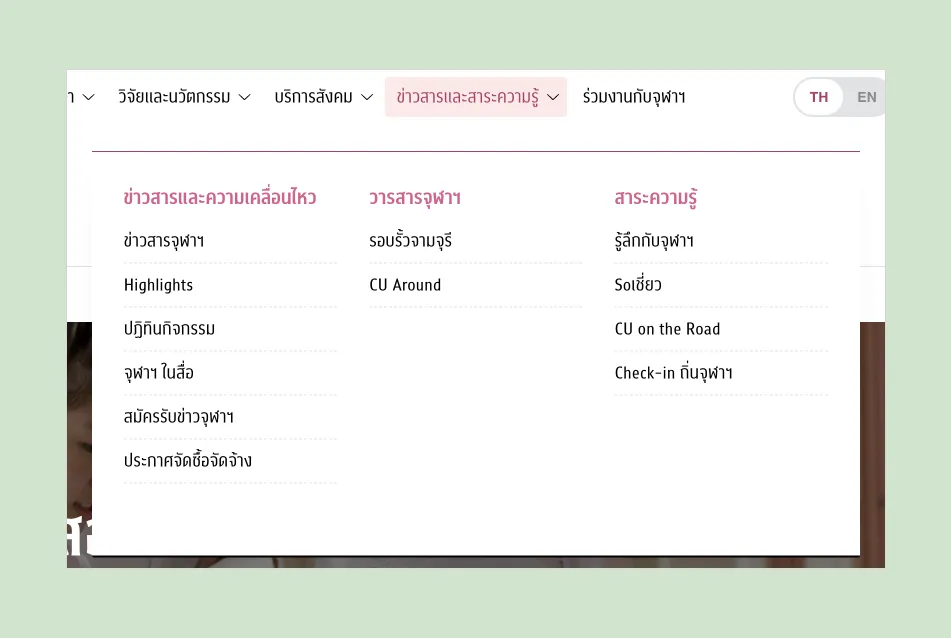

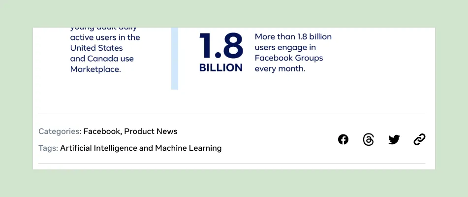

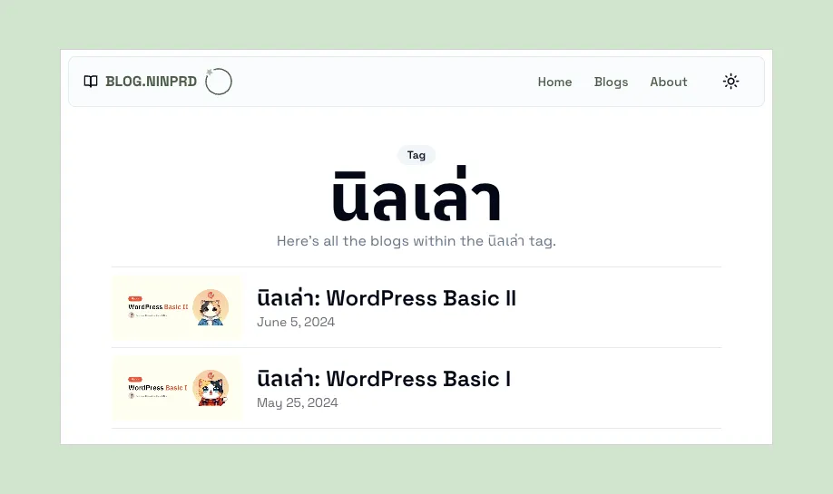

## การติดตั้งและจัดการ Plugin

อย่างที่นิลพูดไว้ใน Basic 1 ครับ Plugin เปรียบเสมือนการติดตั้ง Application หรือ Extension เพิ่มเติมเพื่อเพิ่มความสามารถเพิ่มเติมให้กับเว็บไซต์ของเราได้ครับ ซึ่งเราสามารถติดตั้ง Plugin ต่าง ๆ ได้ภายในเว็บไซต์ WordPress ของเราเลยครับ ซึ่งการที่เราจะติดตั้ง Plugin นั้น ให้ทุกคนไปที่เมนู **Plugins > Installed Plugins** ก่อนครับ เมื่อเข้ามาแล้ว เราจะเห็น Plugin ที่เราติดตั้งทั้งหมดในเว็บไซต์เราครับ ซึ่งเอาล่ะ ขั้นตอนในการติดตั้งและใช้งาน Plugin ในระบบคือ **เข้าเมนู Plugins → Add New Plugin → ค้นหา Plugin ที่ต้องการใน Plugin Directory → กด Install → กด Activate** ซึ่งเนื่องจากตัว Playground จะไม่ได้อนุญาตให้ใช้ Plugin Directory ได้ ดังนั้นนิลขอสรุปไว้ตามภาพด้านล่างเลยครับ

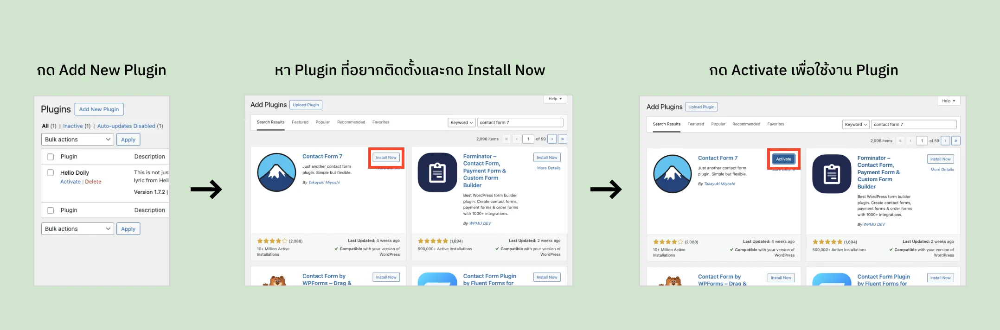

อธิบายง่าย ๆ การ Install เหมือนเป็นแค่การลงแอปแต่ยังไม่เคยเปิดใช้งานครับ ถ้าเราอยากได้ความสามารถของตัว Plugin เราก็ต้อง Activate มันก่อนครับ และเช่นกัน ถ้าเราไม่อยากใช้งาน Plugin แล้วเราก็สามารถ Deactivate Plugin ได้จากเมนู **Plugins > Installed Plugins** ตามหาชื่อ Plugin ที่เราต้องการปิด และกด Deactivate ทิ้งครับ นอกจากนี้เมื่อ Deactivate ทิ้งแล้ว เรายังสามารถลบ Plugin ได้อีกด้วย เท่านี้เราก็จะสามารถ Manage Plugin ต่าง ๆ ผ่าน WordPress ได้แล้วครับ

ฟังดูแล้วเหมือนง่ายใช่ไหมครับ แต่ในความเป็นจริง ถ้าเรายังเพิ่งเริ่มต้นทำเว็บไซต์ WordPress เนี่ย การหา Plugin ที่ต้องการนี่เหมือนงมเข็มในมหาสมุทรเลยครับ เพราะ Plugin ในท้องตลาดนั้นมีเยอะมาก และการจะเลือกตัวที่ใช้งานได้นั้นเป็นเรื่องที่ใช้เวลาครับ เราต้องลอง Plugin หลายตัวมากเลย และดูว่าตัวไหนตอบโจทย์เราได้มากที่สุด ยังไม่พอนอกจากจะดูว่า Plugin อันไหนตอบโจทย์เราแล้ว ยังต้องมาดูอีกว่า Plugin ที่ Install แต่ละตัวมี Conflict กันไหมอีก ซึ่งเป็นเรื่องที่น่าเศร้าที่ WordPress ไม่ได้ระบุของเหล่านี้ให้พวกเราครับ เราต้องลองเล่นเองเจ็บเอง TT

> ขอย้ำไว้อย่างนึงก่อนไปต่อครับ ตัว Plugin เนี่ยเมื่อเราไม่ได้ใช้ Plugin ตัวนั้น ๆ และไม่มีแผนจะกลับมาใช้มันอีกในอนาคตอันใกล้ควรจะ Deactivate และ Delete ออกไปจากเว็บไซต์นะครับ เพราะว่าเบื้องหลังของ Plugin เนี่ยจริง ๆ ก็คือ Code (HTML, CSS, JavaScript, PHP, etc.) ที่ผู้พัฒนาต่าง ๆ เขียนมาเพื่อทำให้เว็บไซต์เรามีความสามารถมากขึ้น ซึ่งผู้พัฒนาบางคนก็อาจจะทิ้งช่องโหว่ไว้ก็ได้ครับ และถ้าเราไม่ได้ใช้ แต่เราติดตั้งไว้ก็เหมือนเป็นการเพิ่มช่องโหว่ในระบบของเราครับ ดังนั้นอย่าลืมลบ Plugin ทุกครั้งที่ไม่ได้ใช้แล้วนะครับ

### Note: ข้อควรระวังเมื่ออัปเดต Plugin

ถ้าไปอ่านตาม Blog หรือบทความต่าง ๆ เนี่ย ส่วนใหญ่เขาจะแนะนำให้อัปเดต Plugin ให้ล่าสุดตลอดเพื่อให้เราได้ Feature ที่ใหม่ที่สุดของ Plugin และให้ Plugin Update ความปลอดภัยตลอดเวลา แต่ ๆๆๆ ก่อนที่จะอัปเดตทุกครั้งแนะนำให้ Backup เว็บไซต์หรือสำรองข้อมูลเอาไว้ก่อนครับ เพราะว่าจะมีบางครั้งที่การอัปเดตนั้นจะทำให้การทำงานของ Plugin ไม่เหมือนเดิม ซึ่งเมื่อเราอัปเดต Plugin ไปแล้ว ก็อาจจะทำให้เว็บไซต์เราทำงานไม่เหมือนกับตอนก่อนอัปเดตได้ ดังนั้นอย่าลืม Backup ข้อมูลเอาไว้นะครับ

## การติดตั้งและจัดการ Theme

มาสู่ในอีกเรื่องที่ปวดหัวของ WordPress ครับ หลัก ๆ แล้ว Theme เป็นเหมือน Skin ของเว็บไซต์ครับ แต่นอกจากนั้นแล้ว เรายังสามารถเขียน Code เพิ่มเติมเพื่อเพิ่มความสามารถให้กับเว็บไซต์ได้เหมือนกัน Plugin อีกด้วย ซึ่งเราจะสามารถจัดการ Theme ที่ติดตั้งแล้ว รวมถึงติดตั้ง Theme ได้จากเมนู **Appearance > Themes** ครับ ซึ่งใน Playground นั้น Theme จะเหมือนกับ Plugin เลยครับ คือเราไม่สามารถใช้เมนูนี้ได้ ดังนั้นอันนี้นิลเลยไปแคปมาจากเว็บ WordPress อีกอันของนิลครับ

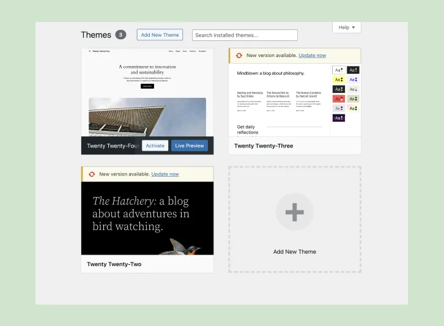

เอาล่ะในหน้านี้เราก็จะสามารถกด Add New Theme ได้และเมื่อกดไปเราก็จะไปเจอกับ Theme Directory ของ WordPress โดย Theme ที่จะมาอยู่ในนี้ได้จะต้องผ่านการตรวจสอบโดยทีมงาน WordPress มาแล้ว ดังนั้นเชื่อถือได้ครับ ซึ่งมี Theme Directory ภายใน WordPress Admin Dashboard หน้าตาแบบนี้ครับ

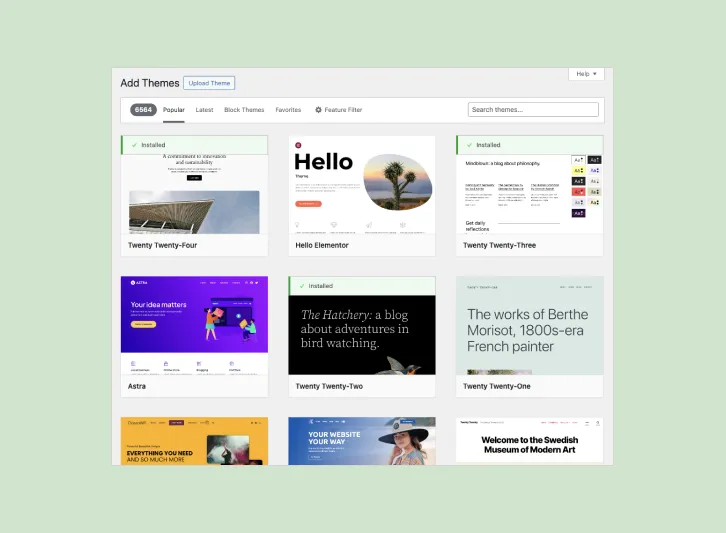

ซึ่งในหน้านี้เราก็สามารถที่จะติดตั้ง Theme ได้เลยครับ จากการเอาเม้าส์ไป Hover ไว้ที่ Theme นั้น ๆ หรือเราสามารถกดเข้าไปเพื่อดูรายละเอียดของ Theme นั้น ๆ ได้ครับ นิลขอลองยกตัวอย่างครับ อันนี้นิลลองค้นหา Theme ที่มีชื่อว่า “Astra” ครับ นิลจะลองกดเข้าไปเพื่ออ่านรายละเอียดและดูหน้าตาได้ว่า Theme นั้น ๆ เป็นยังไงครับ

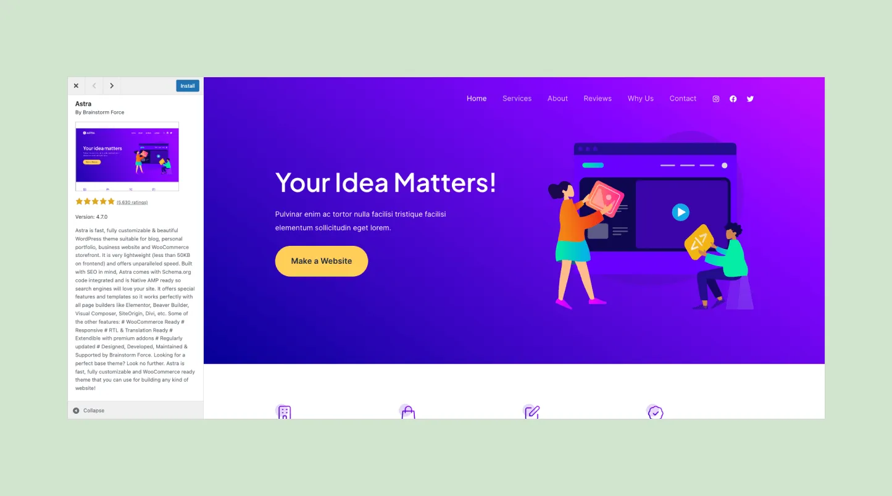

ถ้านิลรู้สึกถูกใจนิลก็สามารถกด Install ได้ครับ และขั้นตอนเหมือน Plugin เลยครับ เราต้องกด Activate Theme เพื่อให้ Theme นั้น Apply หน้าตาสู่เว็บไซต์ของเราครับ

### นอกจาก Theme Directory แล้ว เรายัง Install Theme ได้จากที่อื่นด้วย??

ใช่ครับ นอกจาก Theme Directory ของ WordPress แล้ว จริง ๆ เวลาเราค้นหา WordPress Theme เนี่ย ยังสามารถไปค้นหาได้จากเว็บไซต์ Theme Marketplace ต่าง ๆ ได้เลยครับ ไม่ว่าจะเป็น [ThemeForest](https://themeforest.net/), [WP Ocean](https://wpocean.com/), [aThemes](https://athemes.com/) ซึ่งในพวกนี้ก็จะมีตั้งแต่ Theme ที่ฟรี จนถึงเสียเงินครับ ซึ่งเมื่อ Download Theme จากแหล่งพวกนี้แล้วเนี่ย เราก็สามารถติดตั้งที่ WordPress ของเราได้ด้วยนะครับ ก่อนไปถึงขั้นตอน นิลขอเตือนก่อนว่า Theme พวกนี้อาจจะมีช่องโหว่อยู่ ทำให้เวลาเราใช้แล้วมีคนสามารถเจาะเข้าระบบเราได้ (ไม่ใช่ทุก Theme แต่อันนี้ต้อง Take Risk เองครับ) ดังนั้นจริง ๆ นิลจะแอบแนะนำ Theme ที่อยู่ใน Theme Directory ดีกว่าครับ อย่างที่นิลบอกไปว่า Theme จาก Theme Directory นี่จะมีการตรวจสอบมากกว่าครับ

เอาล่ะ ขั้นตอนการเตือนผ่านไป ขั้นตอนการติดตั้งดีกว่าครับ เราสามารถติดตั้ง Theme จากข้างนอก ไม่ว่าจะจากพวก WordPress Theme Marketplace หรือแม้แต่ Theme ที่เราเขียนเองได้ด้วยการเข้าไปที่เมนู **Appearance > Themes** แล้วเราก็กด Add New Theme ตาม[ขั้นตอนที่เราเข้าตัว Theme Directory เลย](https://blog-ninprd.vercel.app/blog/wordpress-basic-iii#enter-theme-directory-in-wordpress)ครับ เมื่อเราเจอตัว Theme Directory แล้วเนี่ย เราจะสามารถกด Upload Theme และโยนไฟล์ .zip ที่ได้จากพวก Marketplace หรือที่ Develop เองเข้าไปได้ครับ จากนั้นก็กด Okay ไปเรื่อย ๆ เลย เท่านี้เราก็สามารถลง Theme จากแหล่งอื่นที่ไม่ใช่ WordPress Theme Directory ได้แล้วครับ

### Note: ข้อควรระวังเมื่อเปลี่ยน Theme

ในแต่ละ Theme ที่ใช้งาน ผู้พัฒนา Theme อาจจะเขียนฟังก์ชันการทำงานพิเศษไว้ซึ่งทำให้เมื่อเปลี่ยน Theme ไปแล้ว จะไม่สามารถใช้งานได้ ดังนั้นก่อนที่จะเปลี่ยน Theme เราควรจะมั่นใจว่าเว็บไซต์เรายังทำงานปกติอยู่ครับ ซึ่งเราอาจจะ Backup ระบบเราเพื่อให้เวลาที่ระบบพังเราจะได้ Restore ได้ หรืออาจจะลอง Clone ระบบเราไปลองเล่นในอีกที่และลองเปลี่ยน Theme ในระบบนั้นเพื่อดูว่าของทั้งหมดทำงานถูกต้องเหมือนก่อนเปลี่ยน Theme หรือเปล่าz

ก่อนจะไปหัวข้อเรื่อง User อันนี้มาบอกชาว Dev หรือคนที่อยากแก้ไข Code ภายใน WordPress นิดนึงว่า เราสามารถแก้ไข Code ของ Plugin และ Theme ภายใน WordPress ได้เลยครับ ของ Plugin จะอยู่ที่ **Plugins > Plugin File Editor** และของ Theme จะอยู่ที่ **Themes > Theme File Editor** ซึ่งเมื่อเข้ามาเราก็จะเจอกับหน้าที่ทำให้เราสามารถแก้ไข Code ภายใน WordPress ได้เลยครับ แต่ ๆๆๆ นิลขอ Remark ไว้อย่างนึงครับว่า การแก้ไข Code ในนี้ ไม่มี Version Control แปลว่าถ้าแก้ปุ๊ปแล้วเว็บพังแล้วไม่สามารถเข้าสู่ WordPress Admin Dashboard ได้ เราต้อง Accesss เครื่องไปแก้เองนะครับ กับอีกอย่างคือการแก้ไข Theme เราควรทำที่ [Child Themes](https://developer.wordpress.org/themes/advanced-topics/child-themes/) ซึ่งนิลจะพูดอีกครั้งในหัวข้อที่นิลจะเล่าเกี่ยวกับการสร้างและแก้ไข Theme นะครับ อันนี้นิลมาแปะภาพว่าหน้าตาของ File Editor ใน WordPress หน้าตาเป็นยังไงนะครับ

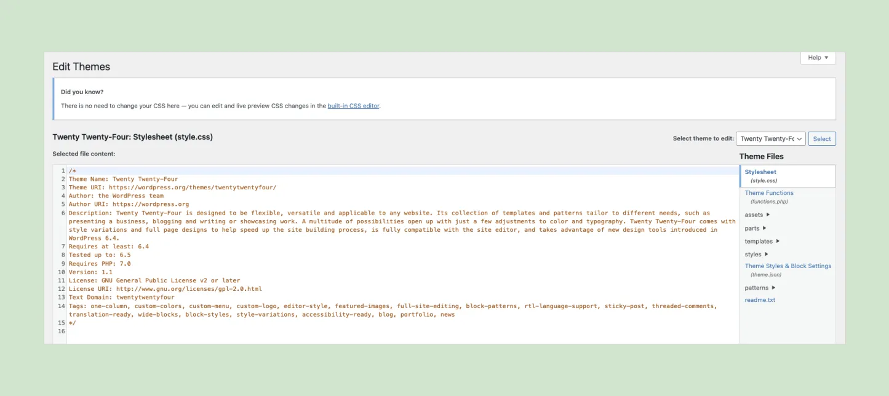

## User คืออะไร แล้วเราจะจัดการ Users ในระบบยังไง

ปกติเวลาเรามี WordPress Website อันนึงเนี่ย เราก็จะมีผู้ใช้ในระบบหรือว่า User ครับ User ใน WordPress คือคนที่สามารถเข้าสู่ระบบเพื่อทำสิ่งต่าง ๆ ในเว็บไซต์ไม่ว่าจะเป็นการสร้าง Page หรือ Post ได้ หรือจัดการ Taxonomy ได้ ซึ่งโดยปกติเมื่อเราพูดถึง User แล้ว จะมีอีก 2 คำที่นิลจะไม่พูดไม่ได้คือ Roles และ Capabilities ครับ ซึ่งเดี๋ยวนิลจะพาทุกคนไปเข้าใจแต่ละส่วนเองครับ ไปลุยกันเลย

### การเพิ่ม/ลด/แก้ไข User

เพื่อที่จะจัดการ User แล้วให้เราเข้าไปที่เมนู **Users > All Users** ครับ เมื่อเข้ามาเราจะเห็นผู้ใช้งานทั้งหมดในระบบเราครับ จะสังเกตได้ว่าตัว WordPress Playground จะสร้าง User ที่ชื่อว่า admin เอาไว้นะครับ หมายความว่าที่เราสามารถใช้ WordPress อยู่ได้ตอนนี้เป็นเพราะว่าตัว Playground เนี่ยมันสร้าง User Account มาให้เรา Login นะครับ

#### การสร้าง User ใหม่

จากเมนู **Users > All Users** ที่เข้ามาในขั้นตอนก่อนหน้านี้ให้ทุกคนกดปุ่ม Add New User ที่อยู่ด้านบนครับ เราจะมาเจอหน้าการสร้าง User ใหม่ในระบบครับ

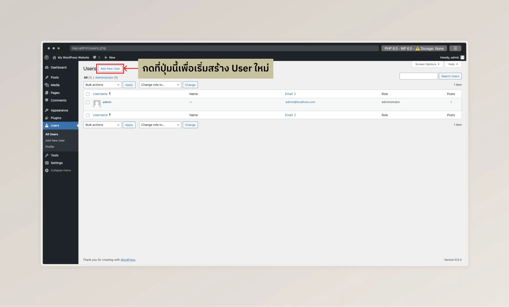

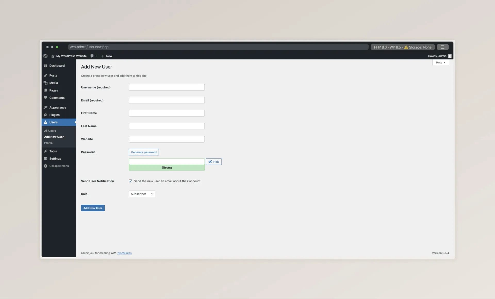

พอเจอหน้านี้แล้วให้กรอกข้อมูลตาม Field ที่เขาเขียนมาเลยแบบพวก Username, Email, Password ฯลฯ และเราจะมาสะดุดที่ 2 ช่องคือให้ส่ง Email กับ Role นะครับ เรื่อง Email เนี่ย ปกติ WordPress จะไม่ได้สามารถส่งเมลออกไปได้ครับ ต้องมีการเชื่อมกับ Email Server ก่อน ดังนั้นตรงนี้ติ๊กอะไรไปก็ยังไม่มีประโยชน์ครับ ส่วน Role เนี่ย เดี๋ยวนิลจะไป[อธิบายเพิ่มเติมในส่วนของ Roles & Permissions](https://blog-ninprd.vercel.app/blog/wordpress-basic-iii#what-are-roles-and-permissions) อีกทีนะครับ ตอนนี้ใช้เป็น Subscriber ตามที่ WordPress ตั้งมาก่อนได้ครับ ก่อนที่จะไป Step ต่อไปนิลขอให้ทุกคน Copy Username กับ Password ที่ตั้งมาออกมาก่อนนะครับ เดี๋ยวนิลจะให้ทุกคนลองไป Login ด้วย Username และ Password ที่ตั้งมาดูครับ

#### การแก้ไข User

การแก้ไข User จะทำคล้าย ๆ กับแก้ไข Post/Page หรือ Taxonomy เลยครับ คือเอาเม้าส์ไปวางไว้ที่รายการที่ต้องการแก้ไขแล้วมันจะขึ้นเมนูให้แก้ไขครับ ซึ่งเมื่อเข้าไปหน้าแก้ไขก็จะสามารถแก้ไขรายละเอียดต่าง ๆ เกี่ยวกับ User ได้ ยกเว้น Username ของ User ครับ

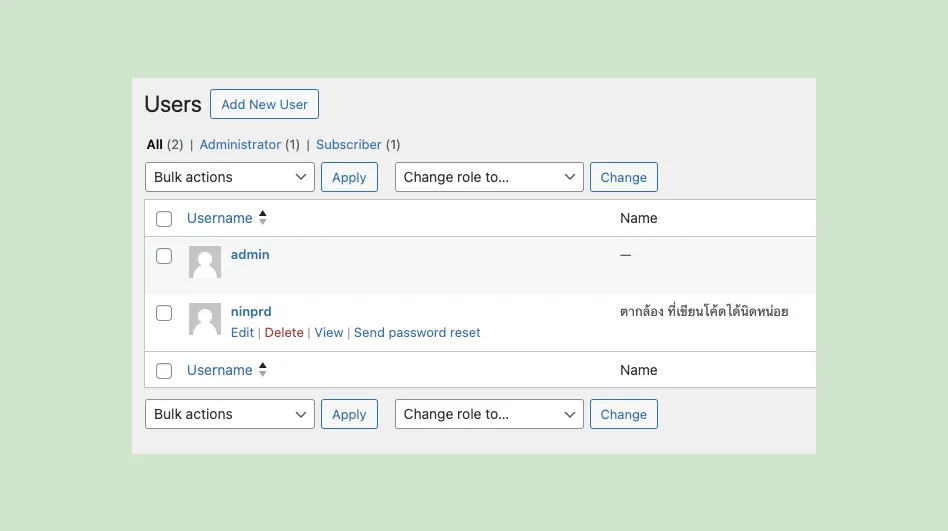

#### การลบ User

การลบ User ก็เหมือนกันครับ เอาเม้าส์ไปวางไว้ที่ User ที่ต้องการลบและเมนูลบก็จะแสดงขึ้นมาครับ ทีนี้ในการลบของ User จะมีความพิเศษนิดนึงครับ เมื่อลบไปแล้ว และ User คนนั้นเคยสร้าง Post/Page ไว้ ตัว WordPress จะขึ้นหน้าต่างมาว่าจะให้โอนความเป็นเจ้าของของ Post/Page นั้น ๆ ไปที่ User คนไหนได้ครับ เรียกได้ว่าต่อให้ลบ User ที่มี Post ไป เราก็สามารถส่งต่อความเป็นเจ้าของของ User ได้อยู่ดีครับ

> หลังจากที่เราลองเล่น WordPress มาซักพักจะเห็น Pattern อันนึงนะครับ คือเมื่อเราอยู่ที่หน้าแสดงรายการทั้งหมดใน WordPress Admin Dashboard แล้ว เราจะสามารถกด Add New ได้ที่ข้าง ๆ หัวข้อของหน้านั้น ๆ และเราจะสามารถเอาเม้าส์ไปชี้ที่ Record แต่ละอันเพื่อแก้ไขหรือลบได้ครับ

### ทดลองเข้าสู่ระบบด้วย Username และ Password ที่เราตั้งเมื่อกี้ดีกว่า

ก่อนอื่นเลย ให้เรากด Log Out ด้วยการเอาเม้าส์ไป Hover ที่มุมบนขวาและจะมีเมนูงอกออกมาให้เรากด Log Out ได้ครับ

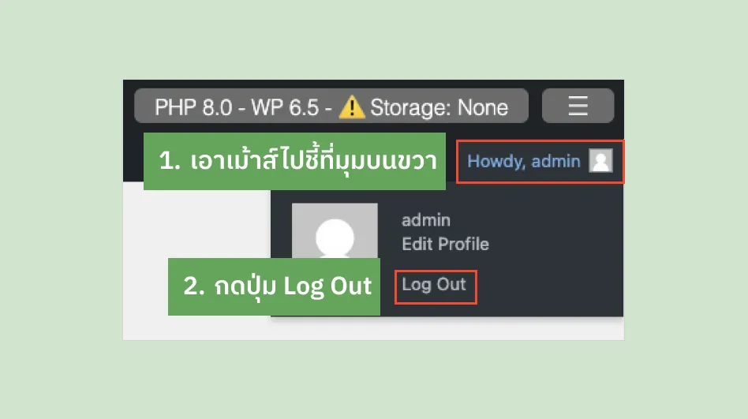

เมื่อเรา Log Out ออกมาแล้ว เราจะเจอหน้า Login ของ WordPress ครับ ซึ่งจะสังเกตได้ว่าเราจะอยู่ที่หน้า `/wp-login.php` ครับ จากนั้นให้เราใส่ Username และ Password ที่เราเก็บไว้ในขั้นตอนที่เราสร้าง User แล้วกด Log In ครับ เราก็จะเข้าระบบมาในชื่อของ User ที่เราสร้างมาใหม่แล้วครับ โดยให้สังเกตจากมุมขวาบนว่าจะเป็น Username ที่ไม่ใช่ admin แล้ว

### Roles & Permissions

Role คือสิ่งที่ใช้กำหนดบทบาทของ User และบอกว่าเราอนุญาตให้ User ทำอะไรครับ เช่น User คนนี้เป็น Admin และ Admin สามารถสร้าง Post และลบ Post ได้ User คนนี้เป็น Subscriber และ Subscriber สามารถได้แค่อ่าน Content และได้รับการแจ้งเตือนเมื่อมี Content ใหม่ ๆ มาในหน้าเว็บได้ ซึ่ง WordPress ได้มี Role ที่กำหนดเอาไว้อยู่แล้วครับ เบื้องต้น WordPress กำหนด Role ไว้ตามนี้

- **Administrator หรือ Admin:** สามารถทำได้ทุกอย่างที่ WordPress Admin Dashboard
- **Editor:** สามารถจัดการ Post ทั้งหมดในระบบ
- **Author:** สามารถจัดการ Post ที่ตัวเองเขียนในระบบ
- **Contributor:** สามารถแก้ไข Post ที่ตัวเองเขียน แต่ไม่สามารถเผยแพร่ Post ได้ ต้องให้ Editor หรือ Admin มาเผยแพร่
- **Subscriber:** สามารถอ่าน Post ในระบบ แต่ไม่สามารถแก้ไขอะไรระบบได้เลย

### Capabilities

จริง ๆ แล้วการที่แต่ละ Role สามารถทำอะไรได้นั้น เป็นการที่แต่ละ Role มี Capability ที่ไม่เท่ากันครับ Capability คือหน่วยเล็กที่สุดที่เป็นการกำหนดได้ว่า User แต่ละ Role/แต่ละคน สามารถทำอะไรในระบบได้บ้าง นิลขอลองยกตัวอย่าง Capability ที่ใช้บ่อย ๆ นะครับ

- edit_posts: เมื่อ User มี Capability นี้ User จะสามารถแก้ไข Post ได้
- publish_posts: เมื่อ User มี Capability นี้ User จะสามารถเผยแพร่ Post ได้
- delete_posts: เมื่อ User มี Capability นี้ User จะสามารถลบ Post ได้

โอเค แล้ว Capability มันจะได้ใช้ตอนไหนนะ มันจะได้ใช้ตอนที่ถ้านิลอยากทำให้ User คนนึงสามารถแก้ไข Post ได้ แต่ลบ Post ไม่ได้ นิลก็ต้องให้ Capability edit_posts กับ User คนนั้นครับ แต่ในส่วนของการให้ Capability แต่ละอันกับ User ได้ยังไงเนี่ย นิลขอติดไว้ก่อนนะครับ อันนี้เราอาจจะต้องใช้ Plugin ช่วย หรืออาจจะต้อง Code เพื่อแก้ไขครับ เดี๋ยวนิลจะมาพูดถึงในตอนต่อ ๆ ไปครับ อันนี้นิลมาเกริ่นไว้ก่อน

## มี Security อะไรบ้างที่เราต้อง Concern กับ WordPress

แน่นอนครับ WordPress เป็น CMS ที่ใช้งานกันอย่างแพร่หลาย ยังไงก็มีคนพยายามจะโจมตีเว็บที่เป็น WordPress อยู่แล้ว (รวมทั้ง blog ของนิลด้วย 555555) ใน Part นี้นิลจะลิสต์ปัญหาคร่าว ๆ ที่อาจจะเจอกันนะครับ

- **ไม่ได้อัปเดต Version ของ WordPress, Plugin, Theme ต่าง ๆ:**
	- อันนี้หลาย ๆ คนที่ไม่ได้อยู่ในวงการเทคโนโลยีอาจจะงงนะครับ ว่าแค่ไม่อัปเดตถือว่ามีความเสี่ยงเลยหรอ จริง ๆ มีนะครับ เพราะว่าบางทีแล้ว ใน Version เก่า ๆ ของของพวกนี้ อาจจะมีช่องโหว่อยู่ ซึ่งเขาก็จะออก Version ใหม่มาเพื่อปิดช่องโหว่เหล่านี้ ถ้าเราไม่อัปเดตแล้ว แน่นอนครับ เว็บไซต์ของเราโดนเจาะแน่นอน
	- วิธีแก้: ถ้ามีการอัปเดท Version ของ WordPress, Plugin หรือ Theme ก็ควรจะอัปเดทตามอย่างสม่ำเสมอครับ

- **การใช้ User หรือ Password ที่คาดเดาง่าย:**
	- อันนี้ไม่ว่าจะระบบ WordPress หรือระบบไหน ถ้าใช้ User หรือ Password ที่คาดเดาง่าย แบบ “admin” “12345678” อะไรแบบนี้ โดนเจาะง่ายแน่นอนครับ
	- วิธีแก้: ตั้ง User กับ Password ให้คาดเดายากนิดนึงครับ และ User แต่ละคนก็ควรจะมี Password ไม่เหมือนกันด้วยครับ ถ้ารู้สึกว่าการจำ Password เป็นเรื่องยาก อาจจะใช้ Password Manager เพื่อช่วยในการจดนะครับ ****อย่าจดใส่ Post-it แล้วแปะไว้ที่คอมหรือโต๊ะทำงานนะครับ****

- **การใช้ Theme หรือ Plugin ที่มีช่องโหว่:**
    - อย่างที่นิลบอกไปในข้อแรกนะครับ การที่ใช้ Theme หรือ Plugin ที่มีช่องโหว่เนี่ย ยังไงก็เหมือนพาโจรขึ้นบ้านเลยครับ
    - วิธีแก้: ก่อนจะใช้งาน Plugin หรือ Theme อะไร อาจจะเอาชื่อของนั้น ๆ ไปหาใน Google และตามด้วยคำว่า “Vulnerabilities” ก็ได้ครับ เราจะได้รู้ว่า Plugin หรือ Theme นั้น ๆ มีช่องโหว่อะไรหรือเปล่า นอกจากนี้เราควรจะติดตั้ง Plugin จากที่ Plugin Directory ของ WordPress เท่านั้น

- **การไม่ Backup ข้อมูล:**
    - หากไม่ Backup ข้อมูลแล้ว เวลาเว็บไซต์เราเจ๊งเนี่ย เราจะกู้คืนได้ยากมาก
    - วิธีแก้: อันนี้ขึ้นกับเราเอาเว็บไซต์ไปขึ้นกับ Hosting Provider เจ้าไหนครับ เช่น Hostatom, Bluehost, Hostinger ก็เป็น Hosting Provider ที่มี Daily Backup ให้ อะไรแบบนั้นครับ หรือถ้าเราต้องไปติดตั้งใน Server เองก็อาจจะต้องหาวิธีสำรองข้อมูลอื่น ๆ ครับ

- **Brute Force Attacks:**
    - โดยปกติแล้ว หน้า Login ของ WordPress เนี่ย จะไม่ได้มีการจำกัดไว้ว่า Login ได้กี่ครั้ง และ WordPress ก็จะใช้หน้า /wp-login.php ในการ Login อยู่แล้วด้วย ดังนั้นก็อาจจะมีคนมายิงสุ่มรหัสเราไปเรื่อย ๆ ได้ครับ
    - วิธีแก้: ติดตั้ง Plugin ที่ Limit จำนวนครั้ง Login เช่น [WPS Limit Login](https://wordpress.org/plugins/wps-limit-login/) เป็นต้น หรือทำ 2-Factor Authentication ครับ

- **ใช้ Default Login และ Admin URL ของ WordPress:**
    - โดยปกติแล้ว ถ้าเราเข้าเว็บที่ทำด้วย WordPress สมมติว่าเป็น www.example.com และเราลองเข้า www.example.com/wp-admin มันจะ Redirect เราไปที่ www.example.com/wp-login.php ครับ ซึ่ง /wp-admin กับ /wp-login.php เป็น URL ที่ WordPress ตั้งขึ้นมาครับ ถ้าเราไม่เปลี่ยน แค่คนเข้า Path พวกนี้ก็จะสามารถ Brute Force ตามข้อที่นิลเขียนไปด้านบนได้ครับ
    - วิธีแก้: ติดตั้ง Plugin ที่เปลี่ยน URL หน้า Login และ Admin เช่น [WPS Hide Login](https://wordpress.org/plugins/wps-hide-login/) หรือทำ 2-Factor Authentication ครับ

- **Cross-Site Scripting (XSS):**
    - อันนี้เป็นการโจมตีในเชิงความปลอดภัยนะครับ นิลขอลิงก์ไปบทความด้านนอกนะครับ เพราะว่าเรื่องนี้อธิบายยาวมาก ซึ่งบทความนี้ก็มีการอธิบายเรื่องวิธีการแก้ไขเบื้องต้นไว้แล้วด้วย สามารถไป[อ่านได้ที่บทความของ Hostatom](https://www.hostatom.com/content/54007/) ครับ

- **SQL Injection:**
    - อันนี้ก็เป็นการโจมตีทาง Cyber Security อีกอันครับ ซึ่งจะเกิดขึ้นเมื่อ Plugin หรือ Theme ที่เราเลือกใช้มีการเขียนที่ไม่ได้ป้องกันในส่วนนี้ครับ
    - วิธีแก้: ติดตั้ง Plugin ทาง Security เช่น [WordFence](https://www.wordfence.com/) และหมั่นอัปเดท Plugin, Theme, และ WordPress อยู่เสมอ ๆ ครับ

- **การโดนฝัง Malware ให้ Redirect ไปเว็บพนันหรือเว็บที่มีเนื้อหาไม่เหมาะสม:**
    - บางทีเมื่อเราติดตั้ง Plugin หรือ Theme ที่ไม่ปลอดภัย อาจจะมีคนพยายามโจมตีด้วยวิธีต่าง ๆ จนสุดท้ายกลายเป็นเว็บไซต์เรามีการสั่ง Redirect ไปยังหน้าเว็บต่าง ๆ ที่ไม่พึงประสงค์ฮะ
    - วิธีแก้: เบื้องต้นอาจจะติดตั้ง Plugin เกี่ยวกับ Security ก่อนครับ เช่น [WordFence](https://www.wordfence.com/) เป็นต้น แต่ทั้งนี้เราสามารถจัดการ Security ได้ที่หลายระดับครับ อาจจะไปจัดการที่ Hosting Provider ของเราหรือไปนั่งตามหา File Malware ในเครื่องเราแล้วลบทิ้งก็ได้ครับ

## เอาล่ะ ก่อนจบ Part นี้ ตามธรรมเนียมครับ มา Recap กันดีกว่า

- เราได้รู้จัก Archive Page ใน WordPress และรู้ว่ามันมีหน้าที่อะไรบ้าง
- เราได้รู้จักวิธีการ Install และ Manage Plugins และ Themes ในระบบของเรา
- เราได้รู้วิธีการติดตั้ง Theme จากแหล่งอื่น ๆ และข้อควรระวังเมื่อติดตั้ง Theme จากแหล่งอื่นที่ไม่ใช่ Theme Directory
- เราได้รู้วิธีการจัดการ Users ในระบบและเรื่องของ Roles & Permissions และ Capabilities
- เราได้รู้ว่า WordPress มี Security Concern อะไรบ้าง

---

วันนี้จบลงไปแบบเนื้อหาแน่น ๆ จุก ๆ เลยครับ อันนี้เป็น Part สุดท้ายของ Basic นะครับ ใน Part ต่อไปจะเป็น Tutorial ที่พาทุกคนสร้าง Website ด้วย WordPress จริง ๆ นะครับ เดี๋ยวนิลขอไปตีลังกาคิดมาก่อนว่าจะใช้ Tools ไหนดีในการทำให้ทุกคนเห็นภาพการขึ้น Website มากขึ้นนะครับ ขอบคุณทุกคนที่อ่านมาถึงจุดนี้ด้วย ขอบคุณมากจริง ๆ ครับ 🥹

– นิล –