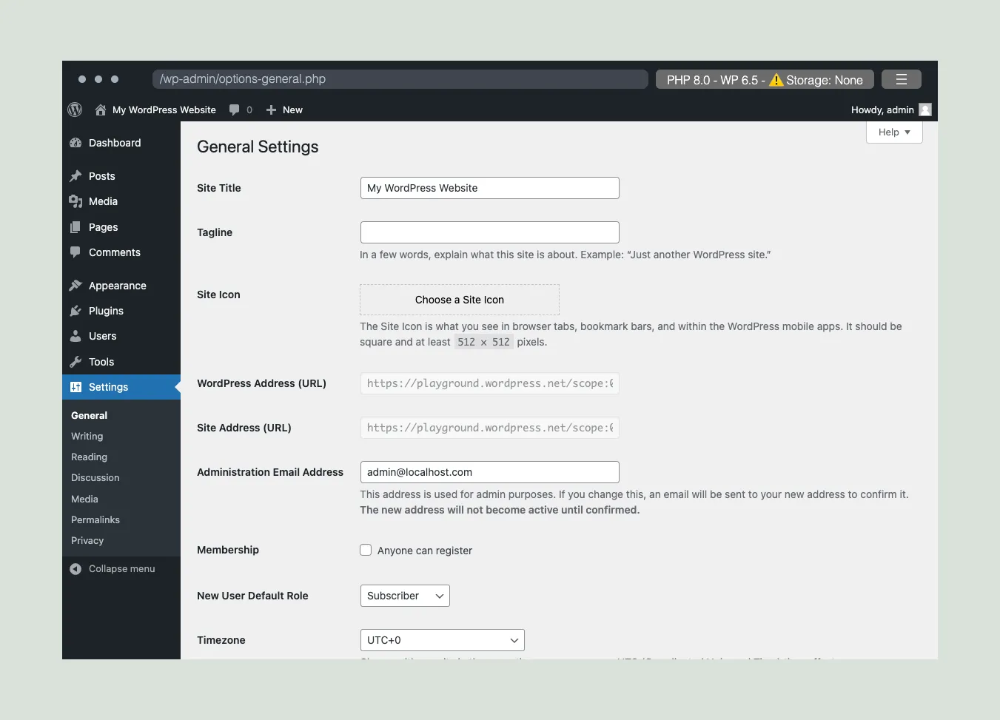
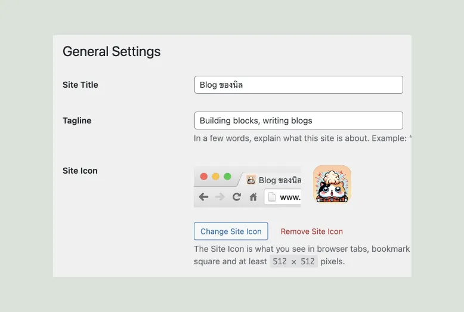
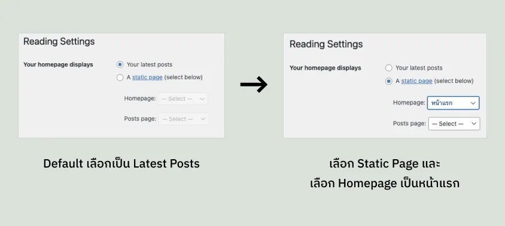
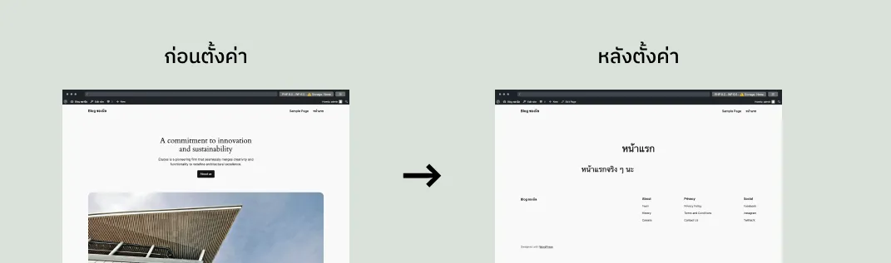
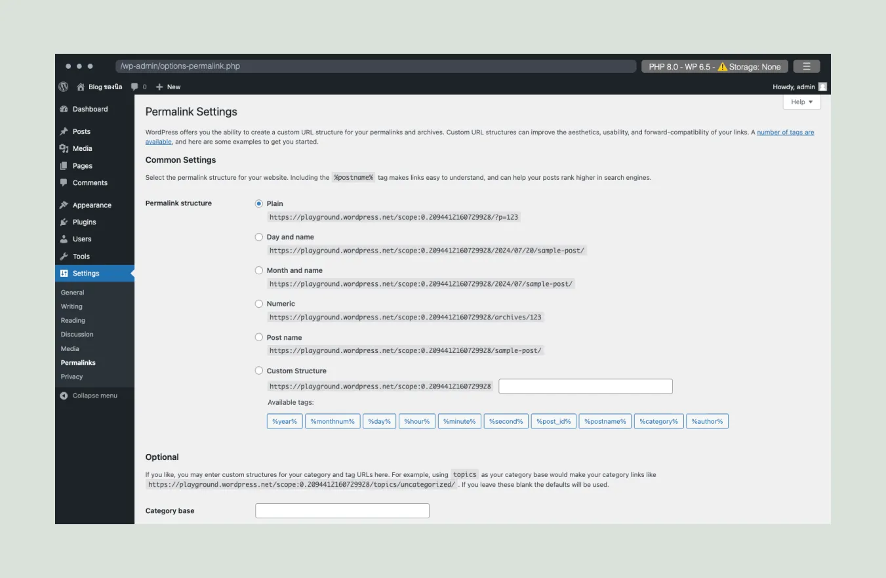
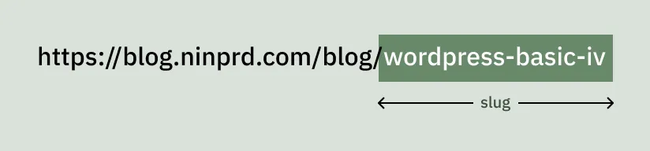
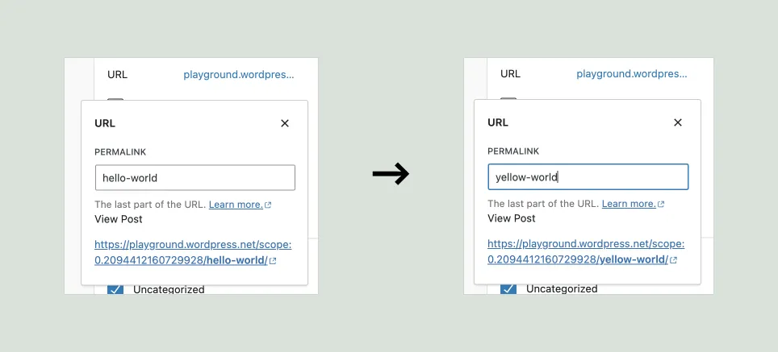
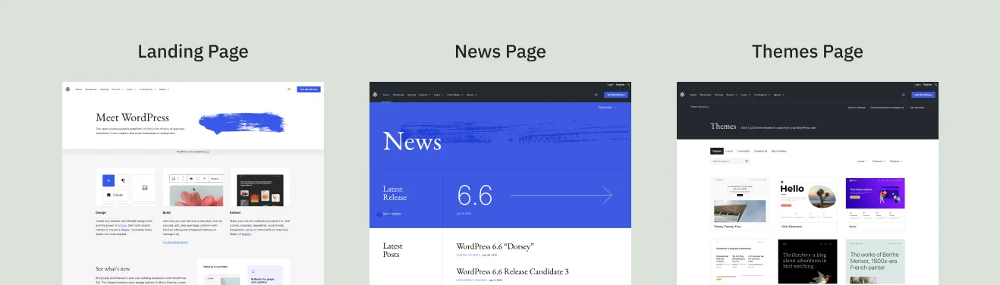
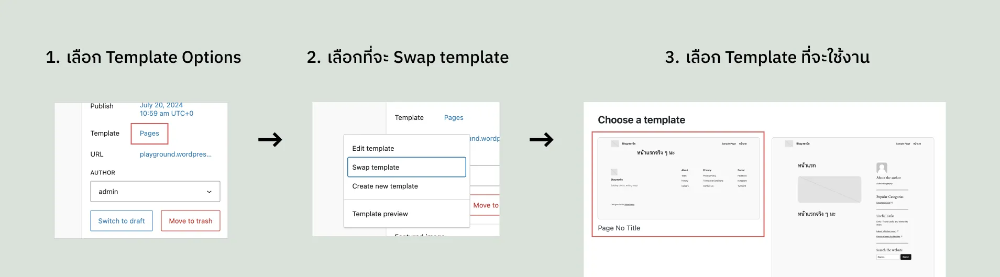
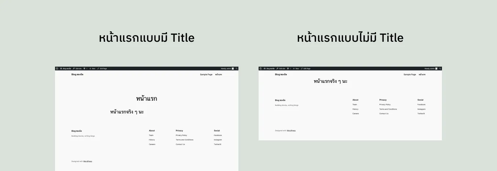

## การตั้งค่าทั่วไปของเว็บไซต์ (ชื่อ, Tagline, Icon)

ในส่วนแรกนิลจะพูดถึงพวกการตั้งค่าทั่วไป นึกถึงเวลาที่เราเข้าเว็บไซต์แล้วจะเห็น Icon/Logo ของเว็บไซต์ และก็ชื่อในแถบของ Browser ใช่ไหมล่ะครับ ของพวกนั้นสามารถตั้งค่าได้ในเมนู **Settings > General** ครับ พอทุกคนเข้ามาแล้วก็จะเจอหน้าตาตั้งค่าแบบนี้ นิลจะขออธิบายตั้งค่าที่สำคัญ ๆ นะครับ

- **Site Title:** ชื่อของเว็บไซต์ ใช้เพื่อแสดงที่ Header กับที่ Tab ของ Browser
- **Tagline:** คำเปรยเกี่ยวกับเว็บไซต์ครับ เช่น ของนิลก็จะเป็นแบบ Building blocks, writing blogs อะไรแบบนี้
- **Site Icon:** Icon/Logo ของเว็บไซต์ ใช้แสดงที่ Tab ของ Browser
- **Administration Email:** Email ของ Admin ของเว็บไซต์ เวลาที่ Website มีปัญหาหรือมีคน Register ใหม่เข้ามา ตัว WordPress จะส่ง Email หา Email ที่ตั้งไว้ในช่องนี้
- **Membership:** โดยปกติ WordPress จะให้ User Login อย่างเดียวเราสามารถทำให้มี User มาลงทะเบียนที่ Website ของเราได้ครับ

WordPress ที่เพิ่งติดตั้งเองมา จะไม่ได้มีการติดตั้ง Mail Server มา ทำให้เวลาเราตั้งค่า Admin Email กับ Membership ไปก็จะไม่ได้มี Email ไปให้ User สามารถลงทะเบียนได้ หรือเวลาระบบพังก็จะไม่ได้มีการส่ง Email มาให้เรา ซึ่งในส่วนนี้เราต้องไปตั้งค่าเพิ่มเติมที่เมนู **Settings > Writing** ต่อครับ ซึ่งนิลขออนุญาตไม่รวมใน Basic ด้วยนะครับ อันนี้มันออก Advance ไปนิดนึง

อันนี้คือตัวอย่างที่นิลใส่ไปใน Site Title, Tagline และ Site Icon นะครับ เป็นประมาณนี้ครับ

## การตั้งค่าหน้าแรกของเว็บไซต์

ถ้าเราต้องการเปลี่ยนหน้าแรกนะครับ เดี๋ยวนิลจะพาทุกคนไปสร้างหน้าแรกอันใหม่แบบไว ๆ ก่อน ขอให้ทุกคนไปที่เมนู **Pages > Add New Page** นะครับ จากนั้นนิลก็ใส่ Page Title ว่าหน้าแรกและลองลาก ๆ อะไรมาวางก็ได้ ส่วนนิลจะขอลาก Heading มาวางและแปะคำว่า “หน้าแรกจริง ๆ นะ” ให้มันสมกับความเป็นหน้าแรกนะครับ 🤣🤣 เมื่อทำเสร็จ นิลก็จะ Publish ครับ แล้วก็ไปที่เมนู **Settings > Reading** ต่อ เมื่อเข้ามาในเมนูนี้ให้เราเปลี่ยน Option ของ Your homepage displays ตามนี้ครับ

จาก Step นี้เสร็จให้กด Save Changes ครับ ทีนี้ให้ทุกคนลองกดชื่อ Website ที่มุมบนซ้ายเพื่อกลับไปที่หน้าหลักของ Website อีกทีหน่อยครับ เสร็จแล้วทุกคนก็จะเห็นหน้าแรกที่เปลี่ยนไปครับ

ซึ่งในจุดนี้ใครกำหมัดกับหน้าแรกใหม่ที่นิลทำขึ้นมาก็สามารถไปเปลี่ยน Settings กลับไปได้นะครับ 555555 หรือว่าถ้าใครไม่ได้เก็บอะไรไว้ในเว็บไซต์ตัว Playground เยอะเนี่ยก็สามารถ Refresh เพื่อโหลด Playground ใหม่ก็ได้นะครับ 55555555

## การตั้งค่า Permalink ใน WordPress

ก่อนที่จะรู้ว่า Permalink ตั้งยังไง คงต้องเข้าใจก่อนว่า Permalink คืออะไร Permalink ก็คือลิงก์ที่เป็น Unique Link ที่ใช้เพื่อเข้าไปถึง Content ซักอันนึง ซึ่งใน WordPress แล้วเราสามารถใช้ตั้งแต่ Post ID, วันเดือนปีที่ Post + ชื่อ Post หรือชื่อ Post เป็น Permalink ก็ได้ ซึ่ง Permalink ที่ตั้งได้ของ WordPress มีได้แบบนี้ครับ

1. **Plain**: ใช้ Post ID เช่น https://example.com/?p=123
2. **Day and name**: ใช้วันที่และชื่อบทความ เช่น https://example.com/2024/07/19/sample-post/
3. **Month and name**: ใช้เดือนและชื่อบทความ เช่น https://example.com/2024/07/sample-post/
4. **Numeric**: ใช้ Post ID ในรูปแบบ Slash เข้าไป เช่น https://example.com/archives/123
5. **Post name**: ใช้ชื่อบทความอย่างเดียว เช่น https://example.com/sample-post/
6. **Custom Structure**: ตั้ง Structure ได้ตามต้องการ เช่น https://example.com/%category%/%postname%/

โดยเราสามารถไปตั้งค่า Permalink ได้ที่เมนู **Settings > Permalinks** ครับ เมื่อเข้าไปก็จะเจอหน้าตาแบบนี้ครับ

ซึ่งส่วนตัวนิลจะแนะนำในรูปแบบที่เป็น Post name ครับ เพราะว่าการตั้ง Permalink นี่สามารถช่วยในเรื่องของ SEO ด้วยครับ เนื่องจากถ้าเราตั้ง Permalink เป็น Post name แล้ว พวก Search Engine ต่าง ๆ มันจะเอาตัว URL ไปคิดในเรื่องของการจัดอันดับ Website ในหน้า Search ด้วย รวมถึงการที่ตั้ง Post name ยังทำให้เวลาที่คนอ่านมาเห็น URL ของเราแล้วจะเข้าใจมากขึ้นว่า Post ของเราเป็นเรื่องอะไรมากกว่าการเห็น ID หรือวันที่ครับ แต่ทั้งนี้ทั้งนั้นก็แล้วแต่ Requirement ด้วยว่าทางลูกค้าอยากได้ URL ในรูปแบบไหน

## การตั้งค่า Slug เพื่อเข้าถึง Post

เอาล่ะ ย้อนกลับไปอีกทีนึงว่า Slug หมายถึงอะไร Slug คือชื่อของ Content นั้น ๆ ที่ใช้แสดงเป็นส่วนหนึ่งของ URL ซึ่งการตั้ง Slug นั้นจะใช้ร่วมกับการตั้งค่า Permalink ในรูปแบบที่มีการแสดง Post name นิลขอ Visualize ไว้ประมาณนี้ครับ

ซึ่งโดยปกติแล้ว เวลาเราตั้งค่า Permalink ให้ใช้พวกที่แสดงค่า Post name เนี่ย ตัว Slug มันก็จะเป็นชื่อของ Post ทันที นิลยกตัวอย่างเช่น เราตั้งชื่อ Post ว่า “หน้าแรก” เราก็จะได้ Slug เป็น /หน้าแรก หรือถ้าเราตั้งชื่อ Post ว่า “Post ทั้งหมด” เราก็จะได้ Slug เป็น /post-ทั้งหมด แหละ แปลว่าจริง ๆ แล้วระบบก็ Auto สร้าง Slug ให้เราอยู่แล้ว แต่ๆๆๆ เวลาเราเอา URL ที่มีภาษาไทยไปส่งในหลาย ๆ ที่เนี่ย เราจะเจอความที่มันแปลง URL ของเราเป็น % อะไรก็ไม่รู้เต็มไปหมดเลยใช่ไหมล่ะครับ สิ่งนั้นมันเกิดขึ้นเพราะว่าตัว Browser มันอ่านภาษาไทยไม่ออกครับ มันเลยเอาภาษาไทยไปผ่านขั้นตอนต่าง ๆ (เผื่อชาว Dev ผ่านมา มันคือเอา Text ไป Encode แหละครับ) เพื่อให้แสดงในช่อง URL ได้ในรูปแบบภาษาที่มันรู้จัก

แล้วเราจะสามารถตั้ง Slug เองได้ยังไง? เราจะตั้งเองได้เมื่อเรา[ตั้ง Settings Permalink](http://permalinks-settings/) เป็นรูปแบบที่มี Post name อยู่ใน URL ครับ (ซึ่งง่ายที่สุดคือตั้งให้เป็นในรูปแบบ Post name ไปเลย) จากนั้นให้เราไป Edit ที่ Post/Page ที่เราต้องการแก้ไข Slug ครับ ซึ่งเข้าไปเราก็จะเจอเจ้า Block Editor เจ้าเก่าเจ้าเดิมครับ เมื่อเข้ามาที่ Block Editor แล้ว ให้กดไปที่ลิงก์สีฟ้า ๆ ข้างคำว่า URL ครับ มันจะขึ้นช่องให้กรอกตัว Slug ซึ่งเราสามารถกรอกอะไรก็ได้ตรงนี้เลยครับ ข้างล่างนี้เป็นตัวอย่างของนิลนะครับ

การตั้ง Slug ที่ดีควรจะเป็นภาษาอังกฤษและเกี่ยวข้องกับหัวข้อของ Post เพื่อให้ User สามารถเข้าถึง Content ได้อย่างง่ายดาย และช่วยเพิ่มคะแนน SEO ของตัว Post อีกด้วย

## การเลือก Template เพื่อใช้แสดงผล Post/Page ต่าง ๆ

ส่วนสุดท้ายที่นิลจะพูดถึงคือเรื่องของการแสดงผลของ Post/Page ด้วย Layout ที่ต่างกันครับ ลองนึกภาพตามนะครับเรามีหน้าที่เป็นหน้าแรกกับหน้าที่เป็นหน้าแสดง Post ทั้งหมดในระบบดูครับว่ามี Layout เหมือนกันไหม? คำตอบคืออาจจะเหมือนหรือไม่เหมือนก็ได้ ซึ่งในเคสส่วนใหญ่จะไม่เหมือนกันแหละครับ เดี๋ยวนิลจะยกตัวอย่างให้ดูแบบไว ๆ นะครับ ขอยกตัวอย่างหน้าต่าง ๆ ของเว็บ [WordPress.org](https://wordpress.org/) นะครับ

จะเห็นได้ว่าหน้าต่าง ๆ จะมี Layout ที่ไม่เหมือนกันครับ ซึ่งที่หน้าต่าง ๆ มี Layout ที่ไม่เหมือนกัน สิ่งนี้เกิดขึ้นได้จากการโหลดผ่าน Themes นะครับ แปลว่าถ้าเราจะตั้งค่า Templates ได้เนี่ย ใน Themes จะต้องมีการตั้งค่าไว้ ซึ่งเจ้า Theme หลักของ WordPress ก็มี Templates ให้เราเล่นได้ประมาณนึงครับ นิลจะพามาดูในขั้นตอนของการสลับ Template ราย Post/Page นะครับ

ในขั้นตอนนี้ให้เราเข้ามา Edit ที่ Post/Page ที่เราจะแก้ครับจนเข้ามาเจอหน้า WordPress Block Editor จากนั้นทางขวามือจะมีช่อง ๆ นึงที่เขียนว่า Templates อยู่ ให้เราคลิ๊กตัวอักษรสีฟ้า ๆ ที่อยู่ข้าง ๆ คำว่า Templates ครับ มันจะถามเราว่าเราจะแก้/เปลี่ยน Template หรือสร้าง Template ใหม่ ซึ่งในวันนี้นิลจะสลับ Template ของ Page ให้ดูก่อนนะครับ นิลเข้ามาที่เมนู Pages และเข้ามาหาเจ้าหน้าแรกที่นิลสร้างไว้และนิลก็กด Edit ครับ เมื่อเข้าสู่ Block Editor นิลก็กดตัวอักษรสีฟ้าข้าง ๆ คำว่า Templates เลย และนิลก็เลือก Swap Templates ครับ นิลก็จะเจอ Templates ที่ Theme เรามีให้นะครับ ในวันนี้นิลจะเลือก Page No Title ครับ เสร็จแล้วกด Update ที่มุมบนขวาของหน้าและออกไป Preview กันเลยครับ

ซึ่งนอกจากนี้จริง ๆ เราสามารถแก้ Template หรือแม้แต่สร้าง Template ใหม่ได้ด้วย แต่กลัวมันเกิน Basic ไป เดี๋ยวขอไปไว้หลัง Tutorial 1 ครับ (ถ้าใครอยากลงลึกเรื่องนี้ก่อนเดี๋ยวนิลแปะไว้ท้ายบทความครับ)

## เอาล่ะ ก่อนจบ เหมือนเดิมครับ เรามา Recap กันหน่อยดีกว่า

วันนี้เราได้เข้าใจเกี่ยวกับอะไรบ้างมาทวนกันดีกว่า

- วิธีการตั้งค่าเบื้องต้นของ WordPress
- วิธีการเลือกหน้าแรกของ WordPress
- วิธีการตั้งค่า Permalink และ Permalink ที่ดีสำหรับ SEO
- วิธีการตั้งค่า Slug สำหรับ Post/Page
- การเปลี่ยน Template เพื่อเปลี่ยน Layout สำหรับ Post/Page

---

วันนี้ตัวเนื้อหาหลัก ๆ ก็จบไปละนะครับ Blog หน้าจะเป็น Tutorial จริง ๆ ละ ไม่หลอกละ 55555555 มาสปอยก่อนว่า Tools ที่นิลเลือกใช้คือ [WordPress Studio](https://developer.wordpress.com/studio/) ครับ เป็น Tools ใหม่แกะกล่องเลย ขอบคุณทุกคนที่ติดตามตัว Blog WordPress Basic ของนิลครับ คิดเห็นยังไง Comment กันได้ที่ Page Facebook กันเลยนะครับ วันนี้ม้าที่ว่าเร็วยังแพ้ลา เพราะลาไปก่อน สวัสดีครับ

– นิล –

## แปะ Additional Resources

- [WordPress Template Hierarchy](https://developer.wordpress.org/themes/basics/template-hierarchy/)