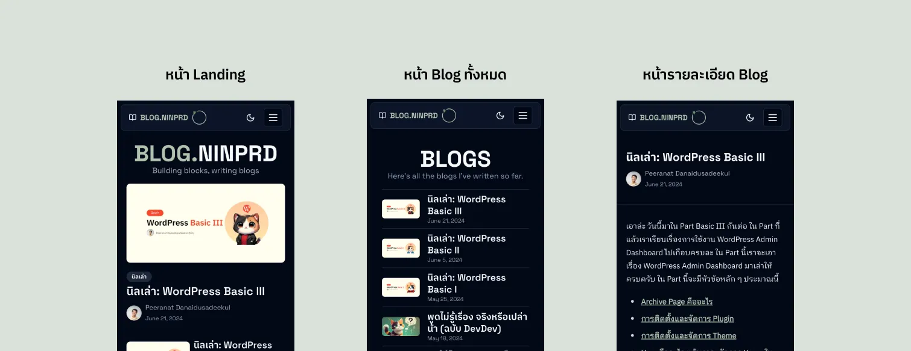
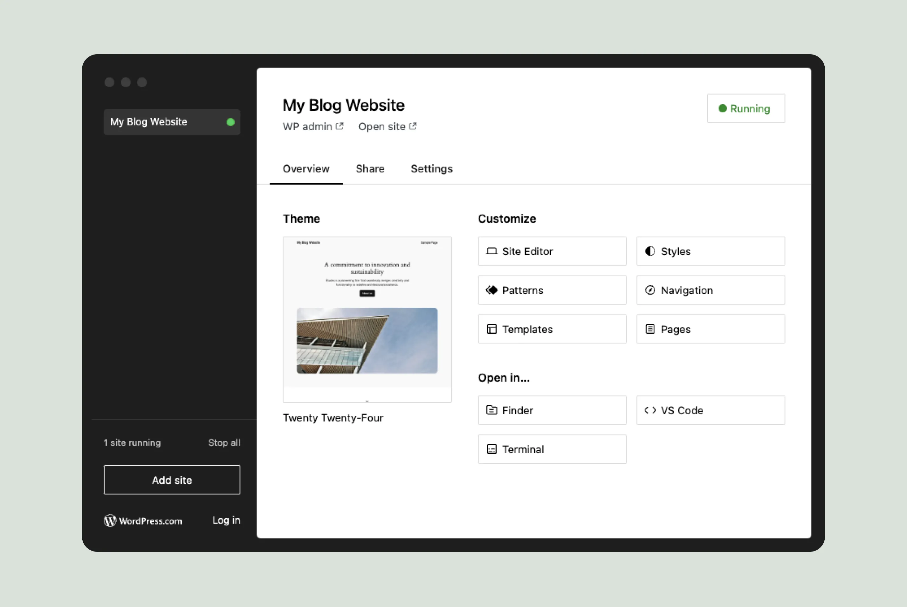
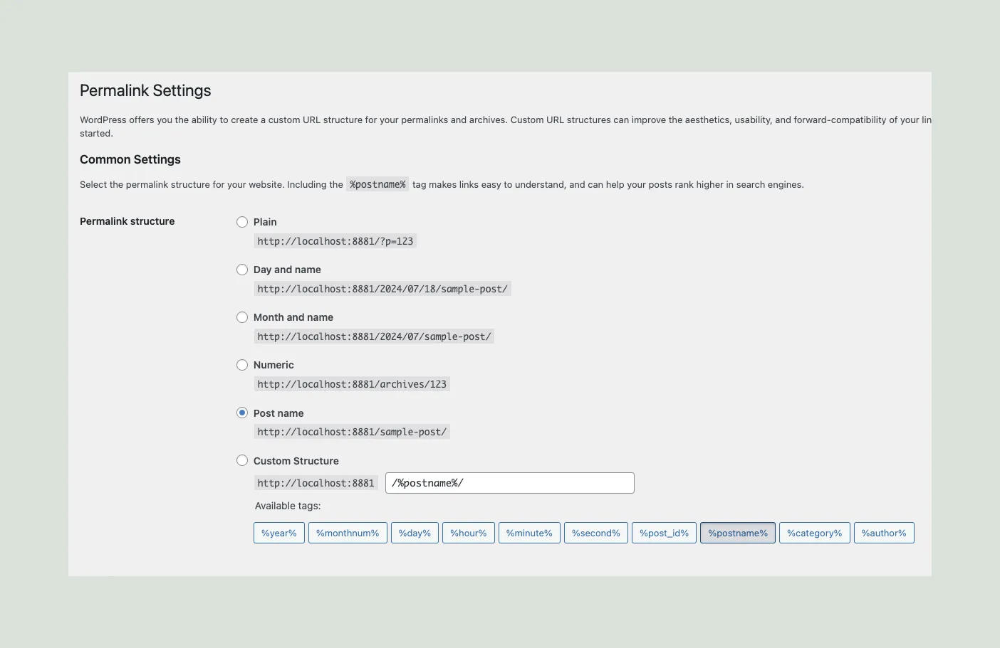
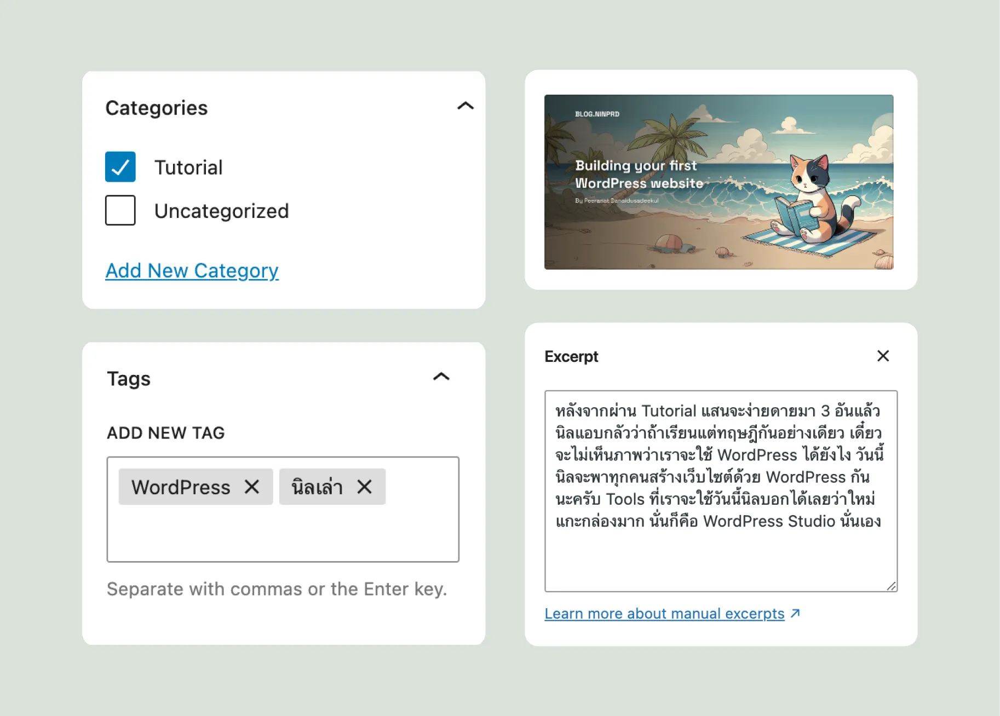
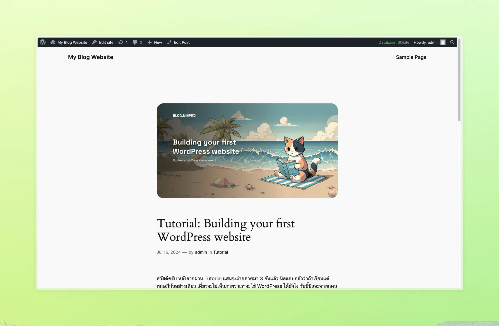
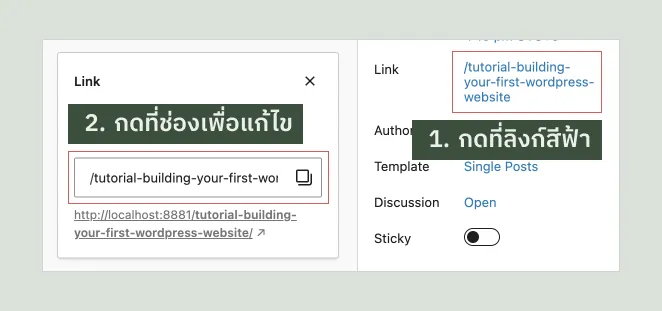
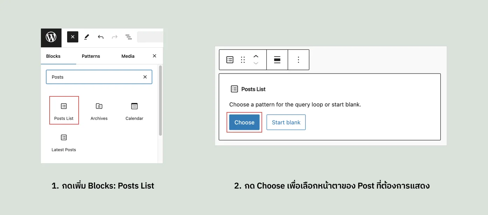
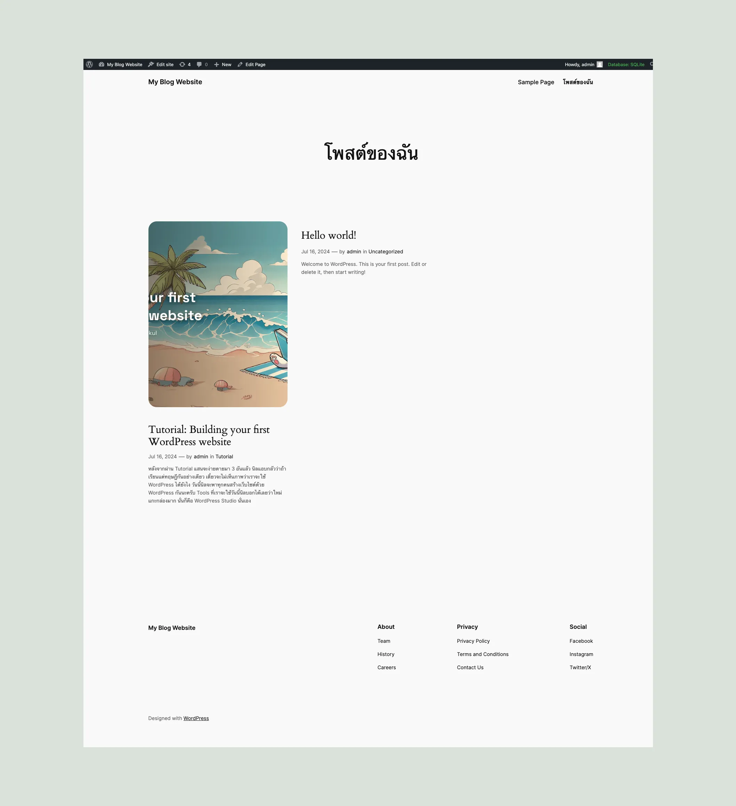
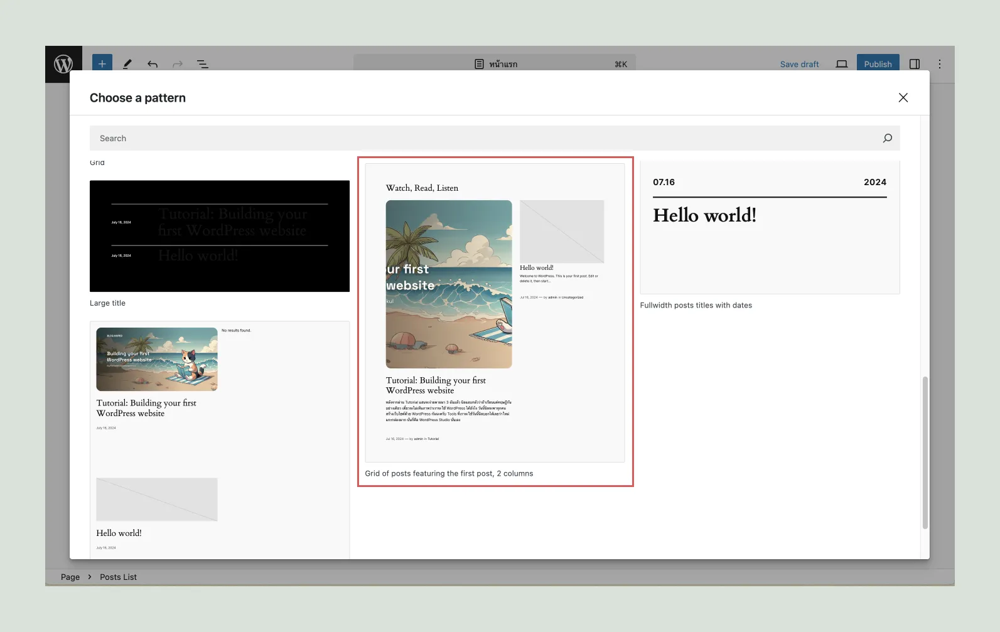
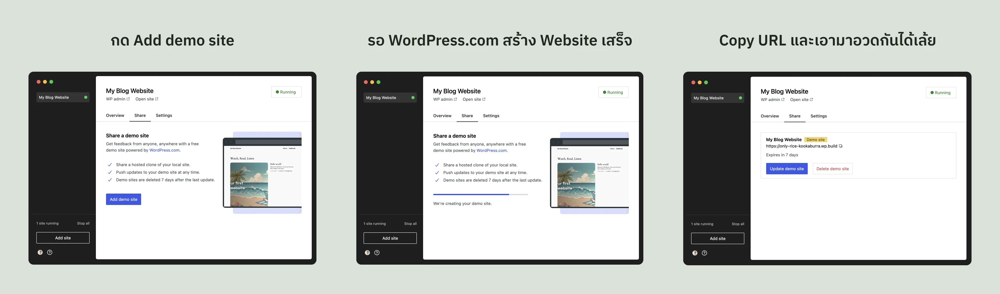

import BlogCheckpoint from '../../../../components/BlogCheckpoint.astro'
import ProgressTracker from '../../../../components/ProgressTracker.astro'

<ProgressTracker />

สวัสดีครับ หลังจากผ่าน Tutorial แสนจะง่ายดายมา 4 อันแล้ว นิลแอบกลัวว่าถ้าอ่านแต่ทฤษฎีกันอย่างเดียว เดี๋ยวจะไม่เห็นภาพว่าเราจะใช้ WordPress ได้ยังไง วันนี้นิลจะพาทุกคนสร้างเว็บไซต์ด้วย WordPress กันนะครับ Tools ที่เราจะใช้วันนี้นิลบอกได้เลยว่าใหม่แกะกล่องมาก นั่นก็คือ WordPress Studio นั่นเอง โดยนิลขอบอก Pre-Requisites กับ Set Expectation กันเอาไว้นิดนึงครับ

**Pre-Requisites**

- แนะนำให้ทำตามใน Computer ครับ ไม่แนะนำให้เปิดในมือถือ
- Download [WordPress Studio](https://developer.wordpress.com/studio/)
- สร้าง Account ฟรีที่ [WordPress.com](https://wordpress.com/)
- นิลเขียนบทความนี้โดยการใช้ UI ของ WordPress 6.6 ถ้าใช้ WordPress Version ไม่เหมือนกันอาจจะแสดงผลไม่เหมือนกันก็ได้ครับ
- อ่าน Blog นิล ตอน WordPress Basic I, WordPress Basic II, WordPress Basic III, WordPress Basic IV มาก่อนจะดีมาก จะได้เข้าใจส่วนต่าง ๆ ของ WordPress ฮะ แต่ถ้ายังไม่อ่าน กดลิงก์ข้างล่างตามได้เลยครับ

**สิ่งที่จะได้หลังจบ Tutorial นี้**

- ได้เข้าใจการสร้างเว็บไซต์ด้วย WordPress
- ได้เว็บไซต์ WordPress ที่อยู่ในเครื่องตัวเอง และสามารถนำขึ้นไปอยู่ที่ WordPress.com ได้นาน 7 วัน

ด้วยความเป็น Tutorial นะครับ รอบนี้นิลมีตัว Checkpoint ขึ้นมาให้ทุกคนดูกันได้ว่าตอนนี้ตัวเอง Complete Tutorial อันนี้ไปแล้วกี่ % ด้วยการกดที่ Checkbox นะครับ (Inspire มาจากการไปเรียนของ Google มาแหละ) ซึ่งใครเข้าใจแล้วก็กดที่ Checkbox ข้างล่างได้เลยครับ

<BlogCheckpoint content="พร้อมแล้ววว เข้าไปลุยกัน 🔥" />

---

## เริ่มจากคิดก่อนว่าเราจะทำอะไรกันดี

แน่นอน ก่อนที่เราจะสร้าง Website 1 เว็บ เราต้องคิดกันก่อนว่าเราจะทำอะไร และ Technology ที่เราเลือกใช้มันตอบโจทย์หรือเปล่า ยกตัวอย่างเช่น ถ้าเราอยากที่จะสร้าง Web Application ที่มีพวก Interaction สวย ๆ หรือเว็บพวก 3D Effect เยอะ ๆ WordPress อาจจะไม่ตอบโจทย์ เราอาจจะต้องไปใช้ Tools อื่น ๆ (สำหรับฝั่ง Dev ก็จะเป็น [Three.js](https://threejs.org/) แหละ) ซึ่งใด ๆ ก็แล้วแต่ สามารถย้อนกลับไป[อ่านว่า WordPress เหมาะกับ Website แบบไหนได้ที่นี่](https://blog.ninprd.com/blog/wordpress-basic-i#what-should-we-build-with-wordpress)เลยครับ

แต่วันนี้ที่นิลจะพาทุกคนทำกันคือ Blog Website ครับ นิลคิดว่าเป็นตัวอย่างที่ง่ายที่สุดและทุกคนน่าจะได้ได้ประโยชน์จากการทำตามนิลไม่มากก็น้อยครับ รวมทั้ง Blog Website นี่เป็นสิ่งที่เราสามารถสร้างด้วย WordPress ได้ไม่ยากเย็นอยู่แล้วครับ ซึ่งตัว Blog Website เนี่ยส่วนใหญ่จะประกอบด้วยหน้าดังนี้ครับ

- Landing (Site Front Page)
- Blog ทั้งหมด (Blog Posts Index Page)
- รายละเอียด Blog (Single Post Page)

ซึ่งวันนี้นิลจะพาทุกคนสร้างหน้าพวกนี้โดยใช้ข้อมูลและสิ่งที่เราผ่านมาจากนิลเล่าทั้ง 4 ตอนก่อนนะครับ ถ้าทุกคนพร้อมแล้ว ไปสร้างเว็บไซต์กันใน WordPress Studio กันครับ

## ขั้นตอนต่อไป มาเริ่มสร้าง Website ด้วย WordPress Studio กัน

เริ่มต้นพอเปิดแอป WordPress Studio มาแล้วเราจะเจอหน้าให้กรอกชื่อเว็บไซต์ครับ ให้ตั้งชื่อได้ตามใจได้เลยครับ อย่างนิลจะตั้งชื่อว่า “My Blog Website” ครับ จากนั้นให้เลือกว่าจะให้ไป Save Folder ของ Project เราที่ไหน นิลใช้ Path ที่เขากำหนดให้เลยครับ จากนั้นให้กด **Add Site** ครับ รอซักพักนึง เราจะก็เจอหน้าตาแบบนี้ครับ

พอเราเจอหน้านี้แล้วให้เรากด Login ที่มุมล่างซ้ายครับ มันจะพาเราไป Login ที่ WordPress.com ครับ เราก็กด Login ไปครับ และมันจะพาเรากลับมาที่ตัวแอป WordPress Studio เท่านี้ขั้นตอนการสร้างเว็บไซต์ที่ WordPress Studio ก็เรียบร้อยแล้วครับ ให้เรากดปุ่ม **WP admin** ที่อยู่ใต้ชื่อ Project ที่เราตั้งไปนะครับ จากนั้นเราก็เจอเจอหน้าตาที่คุ้นเคยครับ นั่นคือเจ้า WordPress Admin Dashboard นั่นเอง

<BlogCheckpoint content="สร้าง Website ด้วย WordPress Studio เรียบร้อยแล้ว" />

## ก่อนจะเริ่มต้น ขอให้ตั้งค่า Permalink กันก่อน

เริ่มต้นเราก็จะไปที่เมนู **Settings > Permalinks** ครับ จากนั้นเราก็จะเลือก Post name และจากนั้นเลื่อนลงมากด Save Changes ครับ เท่านี้ก็เป็นอันเรียบร้อยใน Step แรกละ (ง่ายใช่ไหมล่ะ)

<BlogCheckpoint content="ตั้งค่า Permalink Structure เป็น Post name แล้ว" />

## เอาล่ะ งั้นเรามาเริ่มสร้าง Post แรกกันดีกว่า

เวลาเราจะสร้าง Post ให้ทุกคนมาที่เมนู **Posts > Add New Post** ในขั้นตอนนี้นิลให้อิสระกับทุกคนเลยนะครับว่าอยากใส่ Post Title ว่าอะไร อยากใส่ Content อะไรเข้าไป ส่วนตัวนิลแล้วนิลเลือกใส่เป็น “Tutorial: Building your first WordPress website” ครับ และก็ใส่ Categories, Tags, Featured Image, และ Excerpt ตามที่ต้องการได้เลยครับ นิลแนะนำให้กรอกครบทุกอันเลยนะครับ เพื่อความเห็นภาพมากขึ้นตอนที่ทำจะเอา Post ไปแสดง พอกรอกข้อมูลเสร็จแล้วก็ Publish Post ได้เลยนะครับ อันนี้เป็นตัวอย่างข้อมูลที่นิลกรอกครับ

เมื่อเรา Publish ไปครับ อาจจะให้ทุกคนกด View Post ที่อยู่ทางขวาได้เลยครับ เราจะเห็น Post ที่เราเขียนไปอยู่บนหน้าเว็บแล้ว แบบนี้ได้เลยครับ

เราควรตั้ง Slug ของ Post เป็นภาษาอังกฤษนะครับ เพราะไม่งั้นเราจะเจอ URL ที่เป็น /%e0%b9%82%e0%b8%9e แหละ ซึ่งเราสามารถตั้งได้ที่ตรงคำว่า Link ได้เลยครับ

<BlogCheckpoint content="สร้าง Post แรกเสร็จแล้ว" />

## เรามี Post แล้ว ทีนี้เราจะไปสร้างหน้าที่แสดง Post ทั้งหมดกัน

ในส่วนต่อไปให้ไปที่เมนู **Pages > Create New Page** ครับ เราจะเจอกับหน้า Modal/Dialog ที่มีหัวข้อว่า Choose Your Pattern ขึ้นมา ให้เราปิดไปก่อนครับ วันนี้เรายังไม่ได้ใช้ Pattern พวกนี้ ให้เราตั้งชื่อหน้าเพื่อบอกว่าหน้านี้จะเป็น Post ทั้งหมดของเรา นิลจะตั้งว่า “โพสต์ของฉัน” นะครับ เสร็จแล้วนิลจะไปที่ปุ่ม + ที่อยู่มุมบนซ้ายครับ และนิลจะเลือก Block ที่มีชื่อว่า Posts List เลยครับ ตัว Block นี้จะเป็นตัวดึงข้อมูล Post ทั้งหมดที่เรามีในระบบมาแสดงนะครับ ซึ่งเราสามารถกด Choose เพื่อเลือกได้นะครับว่าจะให้ Post ที่เราดึงมาแสดงมีหน้าตาแบบไหน

จะเลือกรูปแบบไหนมาแสดงนี่ให้ทุกคนเลือกกันเองได้เลยนะครับ นิลก็ลองเลือกแบบนึง จากนั้นเราก็จะไปตั้ง Slug กันนะครับ ([ถ้าใครจำวิธีตั้ง Slug ไม่ได้ สามารถดูตรงนี้ได้ครับ](#add-slug-to-post)) ซึ่งนิลจะตั้งเป็น /posts ครับ ซึ่งเมื่อเสร็จแล้วนิลก็กด Publish ครับ และพอกด Preview Page เราก็จะเจอหน้าแบบนี้

ซึ่งแปลว่าตอนนี้เราได้หน้า Post ทั้งหมดไปแล้ว นิลจะขยับไปสู่ส่วนสำคัญเลย นั่นคือ Landing Page หรือหน้าแรกกันครับ

<BlogCheckpoint content="สร้างหน้าแสดง Post ทั้งหมดแล้ว" />
## สร้างหน้า Landing กัน

หน้า Landing หรือหน้าแรกเนี่ย ถ้ามีคนให้นิลคิดไว ๆ ว่าจะวางอะไรตรงไหนดีนิลก็จะไปหาตามเว็บไซต์ที่โชว์งาน Design หรือลองเข้าหน้าเว็บในหมวดหมู่ที่เป็น Blog เหมือนกันครับเพื่อดูว่าส่วนใหญ่แล้วเขาวางของกันยังไงครับ เอาล่ะ แต่วันนี้นิลมี Layout ในใจแล้ว ถ้าใครอยากทำตามก็ตามนิลได้เลยนะครับ แต่ถ้าใครทำไปแล้วรู้สึกขัดใจอยากทำ Landing เอง สามารถขึ้นเองได้เหมือนกันนะคร้าบ (จบ Tutorial แล้วเอามาแชร์กันได้ครับ ^^)

ขั้นตอนต่อไปเราจะไปที่เมนู **Pages > Add New Page** ครับ และจากนั้นเราก็สร้างหน้าใหม่มา นิลขอตั้งชื่อว่าหน้าแรกแหละครับ ซึ่งนิลก็จะให้ทุกคนกด + เพื่อดึง Block ที่มีชื่อว่า Posts List มาอีกครั้งครับ รอบนี้นิลขอให้ทุกคนดึง Pattern อันนี้เลยครับ

ทีนี้ขั้นตอนต่อไปคือตั้ง Slug ครับ ซึ่งหน้านี้นิลจะขอตั้งเป็น /home ไปก่อนครับ หลาย ๆ คนอาจจะคิดว่า หน้านี้ต้องเป็นหน้า Home อยู่แล้ว ตามหลักมันก็ควรจะไม่ต้องตั้ง Slug ก็ได้ เดี๋ยว WordPress น่าจะมีวิธีตั้งให้มันเป็น URL หลักเองแหละ แต่บางเว็บไซต์อาจจะมีบางช่วงที่เอาหน้าอื่นมาเป็นหน้าหลักและ Redirect มาที่หน้านี้ ยกตัวอย่าง เวลาที่เราเข้าเว็บไซต์แล้วไปเจอหน้าเว็บที่เราสามารถลงนามถวายพระพรครับ

เมื่อทำแบบนั้นแล้ว หน้านั้นจะกลายเป็น URL หลักและ URL ของหน้านี้จะถูกแสดงครับ แปลว่าถ้าเราไม่ตั้ง Slug แล้ว เมื่อวันใดวันนึงที่หน้านี้ไม่ใช่หน้าหลัก ตัว Slug ของหน้าจะดูไม่ดีครับ ดังนั้นควรที่จะตั้ง Slug ไว้ดีกว่า

สุดท้ายของหน้านี้ละคือการเปลี่ยน Template ครับ เนื่องจากหน้านี้เป็นหน้า Home เราจะทำการเปลี่ยน Template ให้เป็นแบบ No Title ครับ ซึ่งขั้นตอนนั้นคือการกดที่ Templates เลือก Swap Templates จากนั้นเลือก Page No Title ครับ

พอเลือกอะไรทุกอย่างเสร็จแล้ว Publish ได้เลยครับ จากนั้นเราจะไปเลือกให้หน้านี้เป็นหน้าแรกผ่านเมนู **Settings > Reading** ครับ จากนั้นให้เลือกหน้า Homepage ตามนี้ครับ

จากนั้นกด Save Changes และไปดูที่หน้าแรกกันจริง ๆ เลยครับ กดที่ชื่อเว็บไซต์ที่มุมบนซ้ายและเราก็จะเจอกับหน้าแรกที่เราสร้างมาก่อนหน้านี้ครับ แบบในที่สุดก็ได้หน้าแรกแบบหล่อเหลาเอาการมาแล้ว เท่านี้ในฝั่งหน้าบ้านเนี่ยก็มีหน้าครบแล้วทั้ง Landing, หน้าแสดง Post ทั้งหมดและก็หน้ารายละเอียด Blog ครับ ซึ่งเราจะไปต่อที่การแก้ไข Template ของหน้ารายละเอียด Blog กัน

สร้างหน้าแรก เปลี่ยน Template และเลือก Homepage เสร็จแล้ว

## หน้า Archive อยู่ตรงไหนนะ?

หลาย ๆ คนทำมาถึงตรงนี้อาจจะสงสัยว่าที่ทำ ๆ มาแล้ว หน้า Archive ที่นิลเคยเล่าไปตอน WordPress Basic III มันอยู่ไหนนะ? (หรือไม่ได้สงสัยกันนะ 55555) ให้ทุกคนย้อนกลับไปที่หน้ารายละเอียด Blog อีกครั้งนึงครับ ใต้ชื่อ Post เราจะเจอคำว่า “by **admin** in **ชื่อ Category ที่เราตั้ง**” ซึ่งถ้าเรากดไปที่คำว่า admin หรือชื่อ Category ที่เราตั้งไว้ก็แล้วแต่เราจะเข้าไปเจอที่แสดง Post ที่ Post โดย admin หรือ Post ที่อยู่ใต้ Category นั้น ๆ ครับ ซึ่ง ๆๆๆ ให้สังเกตที่ URL ของเว็บไซต์นะครับ ถ้าเข้าไป Archive ของผู้เขียน (Author Archives) เนี่ย เราจะเจอว่า URL เนี่ยจะเป็น **/author/slug-ของ-user-ที่-post** ในทางเดียวกัน Archive ของ Category เนี่ย เราจะเข้าไปเจอหน้าที่ URL เป็น **/category/slug-ของ-category** ครับ แปลว่าจริง ๆ แล้ว WordPress มันสร้างหน้าเหล่านี้ไว้ให้เราอยู่แล้วครับโดยเราสามารถเข้าได้จาก **/ประเภทของ-archive/slug** ได้ครับ

## ถ้าไม่ชอบหน้าตาแบบนี้ทำไงดี?

ทำได้หลายวิธีมากครับ หนึ่งในวิธีที่ง่ายที่สุดคือเปลี่ยน Theme ครับ แนะนำให้ลองหาจาก Theme Directory หรือพวก Platform ในการหา Theme ต่าง ๆ เช่น [ThemeForest](https://themeforest.net/), [WPOcean](https://wpocean.com/), [aThemes](https://athemes.com/) หรือของคนไทยที่ Theme สวย ๆ ก็จะมี [Theme ของ Seed Webs](https://th.seedwebs.com/theme/) ครับ ลองไปดูและอุดหนุนกันได้ครับ Theme ก็จะมีตั้งแต่ Free ยันเสียตังนะครับ ขึ้นอยู่กับว่าแต่ละ Theme จะให้อะไรกับเราบ้าง

อีกหนึ่งวิธีที่ทำได้คือการแต่ง Theme ปัจจุบันของตัวเองครับ ซึ่ง Theme ปัจจุบันเราก็คือเจ้า Twenty Twenty-Four (Version 1.2) เราสามารถเข้าไปที่เมนู **Apperance > Themes** และกดที่ Theme ปัจจุบันครับ จากนั้นก็กด Customize ครับจากนั้นเราสามารถลองแก้ ๆ ของในนี้ได้ครับ นิลน่าจะไม่ได้ Cover ทั้งหมดนะครับ เดี๋ยวมันจะยาวเกิน

เวลาแก้ Theme แก้กันด้วยความระวังนิดนึงน้า ถ้าเผลอทำอะไรพัง เช่น ทำ Layout/Templates พัง อย่ากด Save และให้ Exit ออกมาเลยครับ

## Clean up กันนิดนึง

ใน WordPress เนี่ย ตอนที่เริ่มทำมันจะมี Post กับ Page ที่เป็น Sample อย่างละ 1 ครับ ซึ่ง Post ที่ควรลบคือเจ้า Hello World ครับ และ Page ที่ควรต้องไปลบคือ Sample Page ครับ

## ได้เวลาเอาเว็บไซต์ขึ้น WordPress.com

ในขั้นตอนนี้นี้นะครับ ให้ทุกคนกลับไปที่ WordPress Studio ครับ และกดที่ Tab Share ครับ เราจะเห็นปุ่ม Add demo site นะครับ ให้เราคลิ๊กไปที่ปุ่มนั้นและรอซักพักครับ มันจะเอาเว็บไซต์ขึ้นไปที่ WordPress.com ให้เราแหละ ซึ่งพอเสร็จแล้วเราก็จะได้ URL ที่สามารถนำไปแชร์ให้กับคนอื่น ๆ ได้ครับ (ย้ำอีกครั้งว่าเว็บไซต์นี้อยู่ได้แค่ 7 วันนะครับ เป้าประสงค์ของการเอาเว็บขึ้นมันคือแค่เอาไว้โชว์แบบชั่วคราวเลยครับ) ใครทำเสร็จแล้ว เอามาแปะใน Comment ใน [Page](https://www.facebook.com/profile.php?id=61555700437640) กันได้นะครับ นิลรอดู Website ของทุกคนอยู่นะครับ

<BlogCheckpoint content="เอาเว็บไซต์ขึ้น WordPress.com แล้ว 🚀" />

## คำแนะนำเพิ่มเติม

### SEO

แน่นอนครับ เวลาเราทำ Content ที่เป็น Blog ลงแล้ว สิ่งนึงที่เราต้องทำคือการทำตัว SEO หรือ Search Engine Optimization ครับ ซึ่งก็จะมี Blog ของเจ้าอื่น ๆ ให้อ่านนะครับ (ตัวอย่างเช่น [Blog ของ Yoast SEO](https://yoast.com/tag/seo-basics/)) หรือว่าเราสามารถติดตั้ง Plugin ที่ช่วยเรื่อง SEO เช่น [Yoast SEO](https://wordpress.org/plugins/wordpress-seo/), [All In One SEO](https://wordpress.org/plugins/all-in-one-seo-pack/) เป็นต้นครับ

### Format และขนาดของรูปที่ใช้งาน

จะสังเกตว่าบางครั้งเราจะเห็นเว็บบางเว็บที่รูปเนี่ยโหลดช้าถึงช้ามากเลยแหละครับ นั่นเป็นเพราะว่า Format หรือสกุลไฟล์และขนาดของรูปนั้นไม่เหมาะสมครับ ข้อแนะนำคือเราควรใช้รูปใน Format WEPB ครับ และให้ผ่านการ Optimize รูปมาก่อน ซึ่งเราก็สามารถ Optimize รูปได้จากหลาย Plugin ใน WordPress เลยครับ ไม่ว่าจะเป็น [Smush](https://wordpress.org/plugins/wp-smushit/), [Imagify](https://wordpress.org/plugins/imagify/), [ShortPixel](https://wordpress.org/plugins/shortpixel-image-optimiser/) เป็นต้น (ส่วนตัวนิลใช้ Tools ส่วนตัวของตัวเองครับ)

### Backup Website อย่างสม่ำเสมอครับ

ไม่ว่ายังไงก็ตาม เราควรที่จะ Backup ข้อมูลอย่างสม่ำเสมอครับ เพื่อให้เวลาที่ Website มันพังหรืออาจจะโดน Hack เข้ามา เราสามารถ Restore Website ก่อนที่จะโดน Hack กลับมาได้ง่ายครับ เราสามารถ Backup Website เราได้หลายวิธีเลย ไม่ว่าจะเป็นการที่เราซื้อ WordPress Hosting ที่เขามีบริการนี้อยู่แล้ว หรือติดตั้ง Plugin เช่น [UpdraftPlus](https://wordpress.org/plugins/updraftplus/) เป็นต้น

### ศึกษาเกี่ยวกับ WordPress เพิ่มเติม

สิ่งนี่นิลเล่าไปนี่ถือว่าค่อนข้าง Basic มาก ๆ เลยครับ อยากให้ทุกคนลองไปเล่นตัว Block ใน WordPress Block Editor เพิ่ม และถ้าใครอยากได้แหล่งการเรียนรู้ WordPress มากกว่านี้นะครับ สามารถ Join Group Facebook [WordPress Bangkok](https://www.facebook.com/groups/wpbkk/), [Guide ต่าง ๆ ของ Seedwebs](https://docs.seedwebs.com/th/tips/wp/basic/), หรือถ้าอยากได้เป็น Version ภาษาอังกฤษสามารถหาได้ที่ [wpbeginner](https://www.wpbeginner.com/), [Hostinger](https://www.hostinger.com/blog/wordpress) ได้เลยนะครับ หรือถ้ามีแหล่งอื่น ๆ ก็เอามาแชร์กันได้นะครับ

### คำแนะนำเรื่อง Security อื่น ๆ

[ขอแปะ Blog ตอน 3 ไว้นิดนึง สามารถย้อนกลับไปอ่านกันได้คร้าบ](https://blog.ninprd.com/blog/wordpress-basic-iii#wordpress-security-issues-and-concerns)

หวังว่า Content นี้จะช่วยทุกคนเข้าใจการทำงานของ WordPress และเข้าใจวิธีการสร้าง Website ด้วย WordPress มากขึ้นนะครับ ใครสงสัยหรือติดอะไร (หรืออยากให้กำลังใจ Blogger มือใหม่คนนี้) สามารถทักทายกันได้ที่ [Page: ตากล้องที่เขียนโค้ดได้นิดหน่อยครับ](https://www.facebook.com/profile.php?id=61555700437640) ถ้ามีคน Request เยอะนิลอาจจะทำ Tutorial นี้ในรูปแบบ Video นะครับ

ขอให้สนุกกับการสร้าง Website ด้วย WordPress

– นิล –